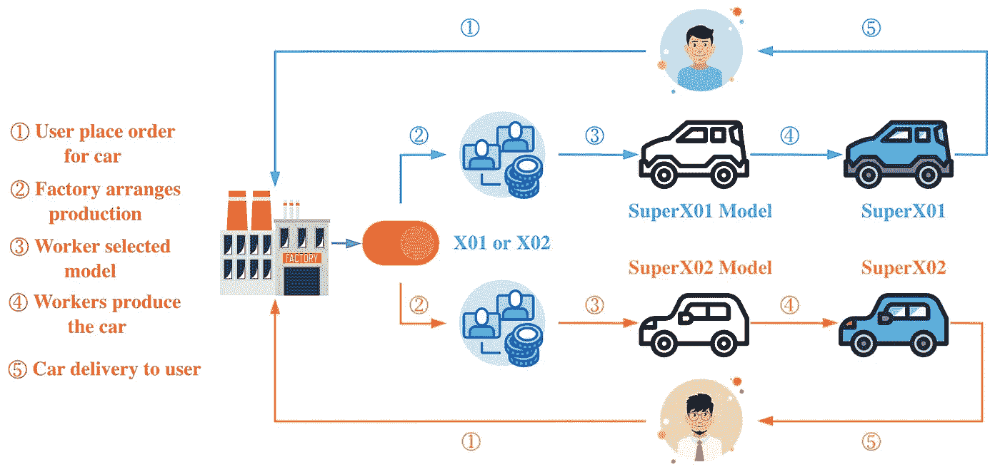
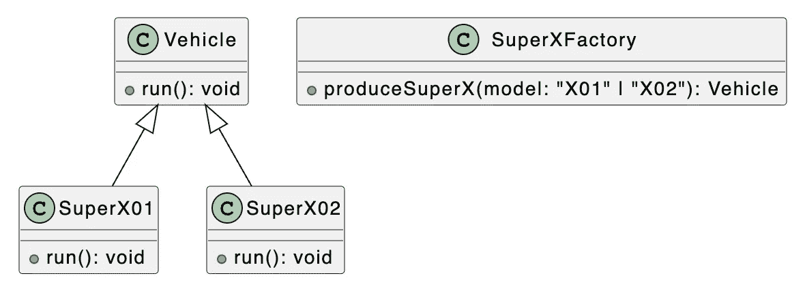

# 设计模式:TypeScript 中的简单工厂模式

> 原文：<https://javascript.plainenglish.io/design-patterns-simple-factory-pattern-in-typescript-ddb74e9d54eb?source=collection_archive---------4----------------------->

## 掌握简单工厂模式，轻松处理对象的创建。


Photo by [amin khorsand](https://unsplash.com/@hero92?utm_source=medium&utm_medium=referral) on [Unsplash](https://unsplash.com?utm_source=medium&utm_medium=referral)

欢迎来到 TypeScript 系列的**设计模式，该系列介绍了一些使用 TypeScript 进行 web 开发时有用的设计模式。**

以前的文章如下:

*   [打字稿中的策略模式](/design-patterns-strategy-pattern-in-typescript-54eda9b40f09)
*   [打字稿中的责任链模式](/design-patterns-chain-of-responsibility-pattern-in-typescript-dba6bdffe456)
*   [打字稿中的观察者模式](/design-patterns-observer-pattern-in-typescript-f6589f1ce4fc)
*   [TypeScript 中的模板方法模式](/design-patterns-template-method-pattern-in-typescript-ce0c8b158985)
*   [类型脚本中的适配器模式](/design-patterns-adapter-pattern-in-typescript-4b7ad3c1c234)
*   [TypeScript 中的工厂方法模式](/design-patterns-factory-method-pattern-in-typescript-c4c3047a6289)
*   [在 TypeScript 中抽象工厂模式](/design-patterns-abstract-factory-pattern-in-typescript-84cd7b002964)

设计模式对于 web 开发人员来说非常重要，通过掌握它们我们可以写出更好的代码。在本文中，我将使用**类型脚本**来介绍**简单的** **工厂模式。**

简单工厂模式也被称为**静态方法模式**，因为在工厂类中定义了一个静态方法来创建一个对象。简单工厂允许用户在不知道具体参数的情况下创建想要的“产品”类，即用户可以在不知道产品具体生产细节的情况下直接消费产品。



上图中，我模拟了用户的购车流程。Bytefer 和 Chris1993 年分别从 SuperX 工厂订购了 SuperX01 和 SuperX02 车型，然后工厂确定用户选择的车型，生产完成后生产并向用户交付汽车。

我们来看看如何用**简单工厂**来描述一个整车厂生产给定车型汽车的过程。

为了更好地理解下面的代码，我们先来看看相应的 UML 图:



简单工厂模式包括以下角色:

*   **产品(车辆)**:抽象产品
*   **混凝土制品(SuperX01)** :混凝土制品
*   **工厂(** SuperXFactory **)** :负责实现创建所有实例的内部逻辑

接下来，我们定义一个抽象类`Vehicle`及其两个子类`SuperX01`和`SuperX02`来表示不同类型的车辆。

```
abstract class Vehicle {
  abstract run(): void;
}class SuperX01 extends Vehicle {
  run(): void {
    console.log("SuperX01 start");
  }
}class SuperX02 extends Vehicle {
  run(): void {
    console.log("SuperX02 start");
  }
}
```

然后，我们定义`SuperXFactory`类来表示车辆工厂。

```
class SuperXFactory {
  public static produceSuperX(model: "X01" | "X02"): Vehicle {
    if (model === "X01") {
      return new SuperX01();
    } else {
      return new SuperX02();
    }
  }
}
```

在`SuperXFactory`类中，我们定义了一个**静态**方法`produceSuperX`来产生实际的车辆。然后我们可以开始生产汽车:

```
const superX01 = SuperXFactory.produceSuperX("X01");
const superX02 = SuperXFactory.produceSuperX("X02");superX01.run();
superX02.run();
```

当您成功运行上述代码时，终端将输出以下结果:

```
SuperX01 start
SuperX02 start
```

最后，让我们总结一下简单工厂模式的使用场景:

*   工厂类负责创建较少的对象:由于创建的对象较少，所以工厂方法中的业务逻辑不会太复杂。
*   客户端只需要知道传递给工厂类静态方法的参数，不需要关心创建对象的细节。

除了简单工厂模式，还有[工厂方法](/design-patterns-factory-method-pattern-in-typescript-c4c3047a6289)和[抽象工厂](/design-patterns-abstract-factory-pattern-in-typescript-84cd7b002964)设计模式。如果你对它们感兴趣，可以看看下面的文章:

[](/design-patterns-factory-method-pattern-in-typescript-c4c3047a6289) [## 设计模式:TypeScript 中的工厂方法模式

### 掌握工厂方法模式，轻松处理对象的创建。

javascript.plainenglish.io](/design-patterns-factory-method-pattern-in-typescript-c4c3047a6289) [](/design-patterns-abstract-factory-pattern-in-typescript-84cd7b002964) [## 设计模式:TypeScript 中的抽象工厂模式

### 掌握抽象工厂模式，轻松处理对象的创建。

javascript.plainenglish.io](/design-patterns-abstract-factory-pattern-in-typescript-84cd7b002964) 

如果你有任何问题，请随时给我留言。稍后我会继续介绍其他模式，如果你有兴趣，可以在 [Medium](https://medium.com/@bytefer) 或者 [Twitter](https://twitter.com/Tbytefer) 上关注我。

如果你想学习打字，那么不要错过**掌握打字**系列。

*   [**TypeScript 泛型中的 K、T、V 是什么？**](https://medium.com/frontend-canteen/what-are-k-t-and-v-in-typescript-generics-9fabe1d0f0f3)
*   [**使用 TypeScript 像 Pro 一样映射类型**](/using-typescript-mapped-types-like-a-pro-be10aef5511a)
*   [**使用 TypeScript 条件类型像亲**](/use-typescript-conditional-types-like-a-pro-7baea0ad05c5)
*   [**使用 TypeScript 交集类型像亲**](/using-typescript-intersection-types-like-a-pro-a55da6a6a5f7)
*   [**使用 TypeScript 推断像亲**](https://levelup.gitconnected.com/using-typescript-infer-like-a-pro-f30ab8ab41c7)
*   [**使用 TypeScript 模板字面类型像亲**](https://medium.com/javascript-in-plain-english/how-to-use-typescript-template-literal-types-like-a-pro-2e02a7db0bac)
*   [**可视化打字稿:15 种最常用的实用类型**](/15-utility-types-that-every-typescript-developer-should-know-6cf121d4047c)
*   [**关于打字班你需要知道的 10 件事**](https://levelup.gitconnected.com/10-things-you-need-to-know-about-typescript-classes-f58c57869266)
*   [](/purpose-of-declare-keyword-in-typescript-8431d9db2b10)**中‘declare’关键字的用途**
*   **[](/no-more-confusion-about-typescripts-any-and-unknown-98c4b53f8924)**不再混淆打字稿的“任何”和“未知”****

****

[Bytefer](https://medium.com/@bytefer?source=post_page-----ddb74e9d54eb--------------------------------)**** 

## ****掌握打字稿系列****

****[View list](https://medium.com/@bytefer/list/mastering-typescript-series-688ee7c12807?source=post_page-----ddb74e9d54eb--------------------------------)********47 stories****************************

*****更多内容请看*[***plain English . io***](https://plainenglish.io/)*。报名参加我们的* [***免费周报***](http://newsletter.plainenglish.io/) *。关注我们关于*[***Twitter***](https://twitter.com/inPlainEngHQ)[***LinkedIn***](https://www.linkedin.com/company/inplainenglish/)*[***YouTube***](https://www.youtube.com/channel/UCtipWUghju290NWcn8jhyAw)*[***不和***](https://discord.gg/GtDtUAvyhW) *。对增长黑客感兴趣？检查* [***电路***](https://circuit.ooo/) *。*******