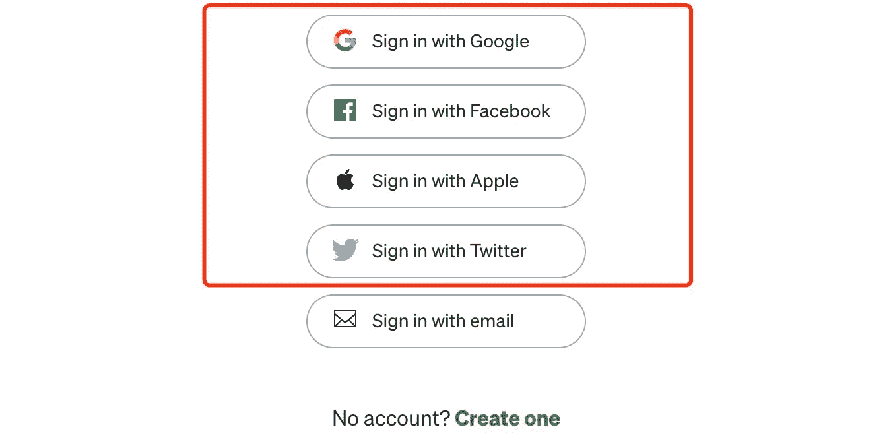
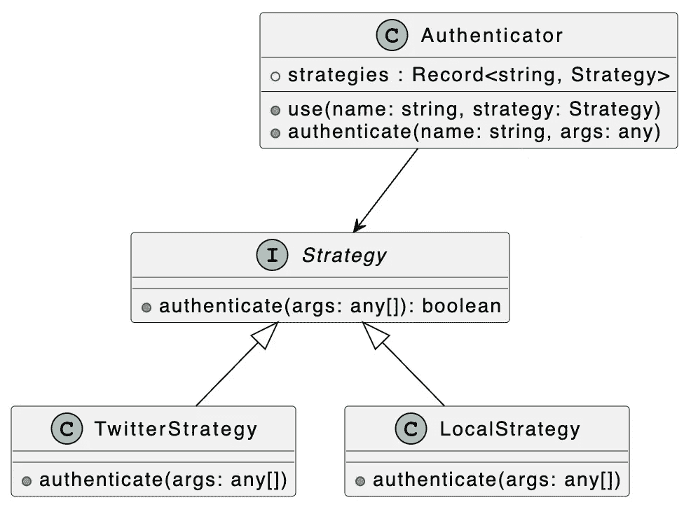
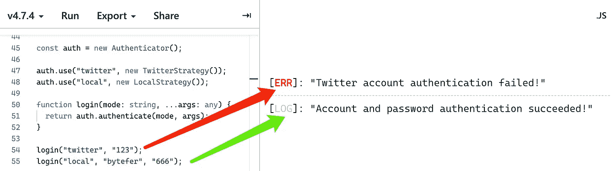
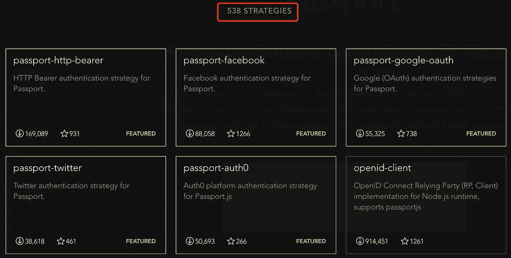

# 设计模式:TypeScript 中的策略模式

> 原文：<https://javascript.plainenglish.io/design-patterns-strategy-pattern-in-typescript-54eda9b40f09?source=collection_archive---------1----------------------->

## 如何使用和实现 TypeScript 中的策略模式来解决 web 项目中的实际问题。


Photo by [Arjan de Jong](https://unsplash.com/@aristocratie?utm_source=medium&utm_medium=referral) on [Unsplash](https://unsplash.com?utm_source=medium&utm_medium=referral)

欢迎来到 TypeScript 系列的**设计模式，它介绍了一些在使用 TypeScript 进行 web 开发时有用的设计模式。**

以前的文章如下:

*   [打字稿中的策略模式](/design-patterns-strategy-pattern-in-typescript-54eda9b40f09)
*   [TypeScript 中的单例模式](https://medium.com/p/e98ec08a9c14)
*   [TypeScript 中的构建器模式](https://levelup.gitconnected.com/design-patterns-builder-pattern-in-typescript-2defc304954a)
*   [TypeScript 中的模板方法模式](/design-patterns-template-method-pattern-in-typescript-ce0c8b158985)
*   [打字稿中的责任链模式](/design-patterns-chain-of-responsibility-pattern-in-typescript-dba6bdffe456)

[](https://medium.com/frontend-canteen/9-design-patterns-every-engineer-should-know-f2423d36d468) [## 每个工程师都应该知道的 9 种设计模式

### 掌握这 9 种设计模式，写出更好的代码

medium.com](https://medium.com/frontend-canteen/9-design-patterns-every-engineer-should-know-f2423d36d468) 

设计模式对于 web 开发人员来说非常重要，通过掌握它们我们可以写出更好的代码。在本文中，我将使用**类型脚本**来介绍**策略模式**。

注册和登录是 web 应用程序中的重要功能。注册 web 应用程序时，更常见的注册方式是使用帐户/密码、电子邮件或手机。注册成功后，您可以使用相应的方法登录。

```
function login(mode) {
  if (mode === "account") {
    loginWithPassword();
  } else if (mode === "email") {
    loginWithEmail();
  } else if (mode === "mobile") {
    loginWithMobile();
  }
}
```

当 web 应用程序需要支持其他登录方法时，例如，除了电子邮件登录方法之外，介质登录页面还支持第三方平台的登录方法，如谷歌、脸书、苹果和 Twitter。



（Photo via [https://medium.com/](https://medium.com/)）

那么为了支持多种第三方登录方式，我们需要修改前面的`login`函数:

```
function login(mode) {
  if (mode === "account") {
    loginWithPassword();
  } else if (mode === "email") {
    loginWithEmail();
  } else if (mode === "mobile") {
    loginWithMobile();
  } else if (mode === "google") {
    loginWithGoogle();
  } else if (mode === "facebook") {
    loginWithFacebook();
  } else if (mode === "apple") {
    loginWithApple();
  } else if (mode === "twitter") {
    loginWithTwitter();
  }
}
```

如果我们以后继续添加或者修改登录方式，会发现`login`功能越来越难维护。对于这个问题，我们可以使用策略模式将不同的登录方式封装成不同的登录策略。

为了更好地理解下面的代码，我们先来看看相应的 UML 图:



在上图中，我们定义了一个`Strategy`接口，然后基于这个接口实现了 **Twitter** 和**账号/密码**两种登录策略。

**策略界面**

```
interface Strategy {
  authenticate(args: any[]): boolean;
}
```

**Twitter 策略类**

```
class TwitterStrategy implements Strategy {
  authenticate(args: any[]) {
    const [token] = args;
    if (token !== "tw123") {
      console.error("Twitter account authentication failed!");
      return false;
    }
    console.log("Twitter account authentication succeeded!");
    return true;
  }
}
```

**本地策略类**

```
class LocalStrategy implements Strategy {
  authenticate(args: any[]) {
    const [username, password] = args;
    if (username !== "bytefer" || password !== "666") {
      console.log("Incorrect username or password!");
      return false;
    }
    console.log("Account and password authentication succeeded!");
    return true;
  }
}
```

有了不同的登录策略后，我们定义一个 Authenticator 类，在不同的登录策略之间切换，执行相应的认证操作。

**认证器类**

```
class Authenticator {
  strategies: Record<string, Strategy> = {}; use(name: string, strategy: Strategy) {
    this.strategies[name] = strategy;
  } authenticate(name: string, ...args: any) {
    if (!this.strategies[name]) {
      console.error("Authentication policy has not been set!");
      return false;
    }
    return this.strategies[name].authenticate.apply(null, args);
  }
}
```

之后，我们可以使用不同的登录方式，通过以下方式实现用户认证:

```
const auth = new Authenticator();auth.use("twitter", new TwitterStrategy());
auth.use("local", new LocalStrategy());function login(mode: string, ...args: any) {
  return auth.authenticate(mode, args);
}login("twitter", "123");
login("local", "bytefer", "666");
```

当您成功运行上述代码时，相应的输出如下图所示:



除了登录身份验证场景，策略模式也可以用于表单字段验证场景。也可以用来优化太多 if else 分支的问题。

如果使用 Node.js 开发认证服务，可以看一下 [passport.js](https://www.passportjs.org/) 模块:

[](https://www.passportjs.org/) [## Passport.js

### Passport 是 Node.js 的认证中间件。极其灵活和模块化，Passport 可以不引人注目地…

www.passportjs.org](https://www.passportjs.org/) 

这个模块非常强大，目前支持多达 **538** 个策略:



(photo via [https://www.passportjs.org/packages/](https://www.passportjs.org/packages/))

最后，让我们总结一下策略模式的使用场景:

*   当一个系统需要动态地从几个算法中选择一个时，每个算法都可以封装成一个策略类。
*   多个类只是在行为上有所不同，您可以使用策略模式来动态选择要在运行时执行的特定行为。

如果你有任何问题，请随时给我留言。后面我会继续介绍其他模式，如果有兴趣可以关注我的[中](https://medium.com/@bytefer)或者[推特](https://twitter.com/Tbytefer)。

如果你想学习 TypeScript，那么就不要错过**掌握 TypeScript** 系列。

*   [**TypeScript 泛型中的 K、T、V 是什么？**](https://medium.com/frontend-canteen/what-are-k-t-and-v-in-typescript-generics-9fabe1d0f0f3)
*   [**使用 TypeScript 像 Pro 一样映射类型**](/using-typescript-mapped-types-like-a-pro-be10aef5511a)
*   [**使用 TypeScript 条件类型像亲**](/use-typescript-conditional-types-like-a-pro-7baea0ad05c5)
*   [**使用 TypeScript 交集类型像亲**](/using-typescript-intersection-types-like-a-pro-a55da6a6a5f7)
*   [**使用打字稿推断像亲**](https://levelup.gitconnected.com/using-typescript-infer-like-a-pro-f30ab8ab41c7)
*   [**使用 TypeScript 模板字面类型像亲**](https://medium.com/javascript-in-plain-english/how-to-use-typescript-template-literal-types-like-a-pro-2e02a7db0bac)
*   [**打字稿可视化:15 种最常用的实用类型**](/15-utility-types-that-every-typescript-developer-should-know-6cf121d4047c)
*   [**关于类型脚本类你需要知道的 10 件事**](https://levelup.gitconnected.com/10-things-you-need-to-know-about-typescript-classes-f58c57869266)
*   [](/purpose-of-declare-keyword-in-typescript-8431d9db2b10)**中‘declare’关键字的用途**
*   **[**不再混淆打字稿的“任何”和“未知”**](/no-more-confusion-about-typescripts-any-and-unknown-98c4b53f8924)**

**

拜特弗** 

## **掌握打字稿系列**

**[View list](https://medium.com/@bytefer/list/mastering-typescript-series-688ee7c12807?source=post_page-----54eda9b40f09--------------------------------)****47 stories**************

***更多内容看* [***说白了就是***](https://plainenglish.io/) *。报名参加我们的* [***免费每周简讯***](http://newsletter.plainenglish.io/) *。关注我们关于* [***推特***](https://twitter.com/inPlainEngHQ) ，[***LinkedIn***](https://www.linkedin.com/company/inplainenglish/)*，*[***YouTube***](https://www.youtube.com/channel/UCtipWUghju290NWcn8jhyAw)*[***不和***](https://discord.gg/GtDtUAvyhW) *。****