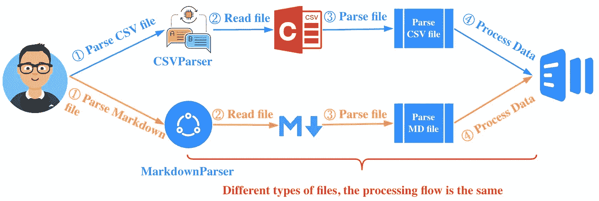
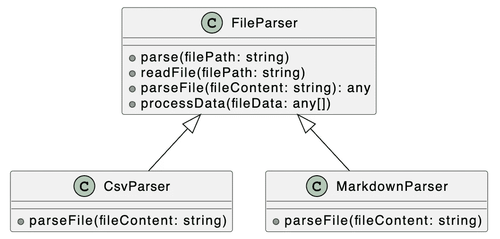
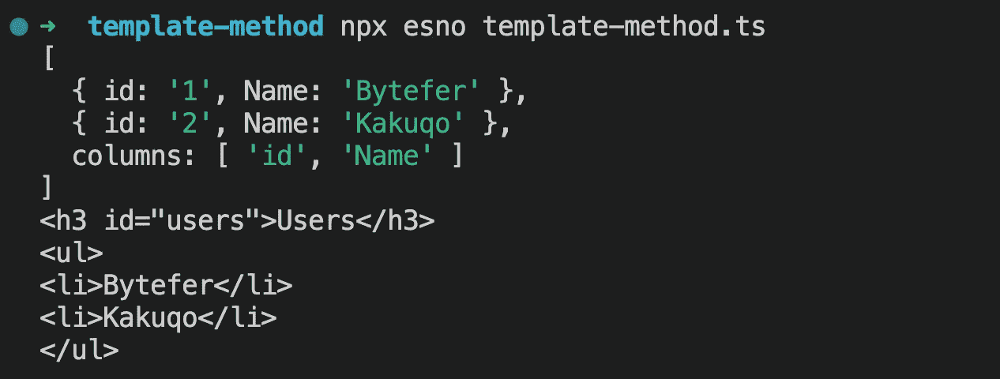

# 设计模式:类型脚本中的模板方法模式

> 原文：<https://javascript.plainenglish.io/design-patterns-template-method-pattern-in-typescript-ce0c8b158985?source=collection_archive---------1----------------------->


Photo by [fabio](https://unsplash.com/@fabioha?utm_source=medium&utm_medium=referral) on [Unsplash](https://unsplash.com?utm_source=medium&utm_medium=referral)

欢迎来到 TypeScript 系列的**设计模式，该系列介绍了一些使用 TypeScript 进行 web 开发时有用的设计模式。**

以前的文章如下:

*   [打字稿中的策略模式](/design-patterns-strategy-pattern-in-typescript-54eda9b40f09)
*   [打字稿中的责任链模式](/design-patterns-chain-of-responsibility-pattern-in-typescript-dba6bdffe456)
*   [打字稿中的观察者模式](/design-patterns-observer-pattern-in-typescript-f6589f1ce4fc)
*   [TypeScript 中的模板方法模式](/design-patterns-template-method-pattern-in-typescript-ce0c8b158985)
*   [类型脚本中的适配器模式](/design-patterns-adapter-pattern-in-typescript-4b7ad3c1c234)
*   [TypeScript 中的工厂方法模式](/design-patterns-factory-method-pattern-in-typescript-c4c3047a6289)
*   [在 TypeScript 中抽象工厂模式](/design-patterns-abstract-factory-pattern-in-typescript-84cd7b002964)

设计模式对于 web 开发人员来说非常重要，通过掌握它们我们可以写出更好的代码。在本文中，我将使用**类型脚本**来介绍**模板方法模式。**

CSV(逗号分隔值)是一种通用的、相对简单的文件格式。CSV 文件以纯文本格式存储表格数据(数字和文本)。当需要处理 CSV 数据时，对应的处理流程如下图所示:


了解了上面的处理流程后，我们再用 Node.js 来实现解析 csv 文件的功能。

**users.csv**

```
id,Name
1,Bytefer
2,Kakuqo
```

**parse-csv.ts**

```
import fs from "fs";
import path from "path";
import * as url from "url";
import { csvParse } from "d3-dsv";const __dirname = url.fileURLToPath(new URL(".", import.meta.url));const processData = (fileData: any[]) => console.dir(fileData);
const content = fs.readFileSync(path.join(__dirname, "users.csv"), "utf8");
const fileData = csvParse(content);
processData(fileData);
```

在上面的代码中，我们导入了 [d3-dsv](https://github.com/d3/d3-dsv) 模块来实现 csv 的解析功能。之后，我们使用 [esno](https://github.com/esbuild-kit/esno) 来执行 **parse-cvs.ts** 文件:

```
$ npx esno parse-csv.ts
```

当上述代码成功运行时，终端将输出以下结果:

```
[
  { id: '1', Name: 'Bytefer' },
  { id: '2', Name: 'Kakuqo' },
  columns: [ 'id', 'Name' ]
]
```

Markdown 是一种轻量级标记语言，它允许人们以易于读写的纯文本格式编写文档。为了在网页上显示降价文档，我们必须将降价文档转换成 HTML 文档。

为实现上述功能，我们的处理流程如下:


了解了上面的处理流程后，我们再用 Node.js 来实现解析 Markdown 文件的功能。

**Users.md**

```
### Users
- Bytefer
- Kakuqo
```

**parse-md.ts**

```
import fs from "fs";
import path from "path";
import * as url from "url";import { marked } from 'marked';const __dirname = url.fileURLToPath(new URL(".", import.meta.url));const processData = (fileData: any[]) => console.dir(fileData);
const content = fs.readFileSync(path.join(__dirname, "Users.md"), "utf8");
const fileData = marked.parse(content);
processData(fileData);
```

在上面的代码中，我们导入了标记为[的](https://github.com/markedjs/marked)模块来实现 Markdown 文件的解析功能。之后，我们使用 [esno](https://github.com/esbuild-kit/esno) 来执行 **parse-md.ts** 文件:

```
$ npx esno parse-md.ts
```

当上述代码成功运行时，终端将输出以下结果:

```
'<h3 id="users">Users</h3>\n<ul>\n<li>Bytefer</li>\n<li>Kakuqo</li>\n</ul>\n'
```

对于前面两个例子，虽然解析的是不同类型的文件，但是你会发现它们的解析过程是相似的。



整个过程主要包括三个步骤:**读取文件，解析文件，处理数据**。对于这个场景，我们可以引入模板方法模式来封装上述三个步骤的处理顺序。

模板方法模式由两部分组成:**一个抽象父类和一个具体实现子类**。通常子类的算法框架封装在抽象的父类中，还包括一些公共方法的实现以及封装的子类中所有方法的执行顺序。通过继承这个抽象类，子类也继承了整个算法结构，并且可以选择覆盖父类的方法。

接下来，让我们看看如何使用模板方法模式实现 CSV 解析器和 Markdown 解析器。

为了更好地理解下面的代码，我们先来看看相应的 UML 类图:



在上图中，我们定义了一个抽象类`FileParser`，然后分别定义了两个子类`CsvParser`和`MarkdownParser`。

**文件解析器类**

```
abstract class FileParser {
  // Template Method
  parse(filePath: string) {
    let content = this.readFile(filePath);
    let fileData = this.parseFile(content);
    this.processData(fileData);
  } readFile(filePath: string) {
    if (fs.existsSync(filePath)) {
      return fs.readFileSync(filePath, "utf8");
    }
  } abstract parseFile(fileContent: string): any; processData(fileData: any[]) {
    console.log(fileData);
  }
}
```

抽象类`FileParser`中的`parse`方法就是所谓的模板方法，我们在其中封装了文件处理的过程。

**CsvParser 类**

```
class CsvParser extends FileParser {
  parseFile(fileContent: string) {
    return csvParse(fileContent);
  }
}
```

**MarkdownParser 类**

```
class MarkdownParser extends FileParser {
  parseFile(fileContent: string) {
    return marked.parse(fileContent);
  }
}
```

有了这两个类`CsvParser`和`MarkdownParser`，我们可以用以下方式解析 CSV 和 Markdown 文件:

```
const csvParser = new CsvParser();
csvParser.parse(path.join(__dirname, "Users.csv"));const mdParser = new MarkdownParser();
mdParser.parse(path.join(__dirname, "Users.md"));
```

当您成功运行上述代码时，相应的输出如下图所示:



使用模板方法模式，我们重新实现了 CSV 和 Markdown 文件的解析。事实上，有了抽象类`FileParser`，我们可以很容易地开发不同的文件解析器。

最后，让我们总结一下模板方法模式的使用场景:

*   算法的整体步骤是非常固定的，但是当个别部分是可变的时候，这个时候就可以使用模板方法模式，把容易变化的部分抽象出来，让子类来实现。

如果你有任何问题，请随时给我留言。稍后我会继续介绍其他模式，如果你有兴趣，可以在 [Medium](https://medium.com/@bytefer) 或者 [Twitter](https://twitter.com/Tbytefer) 上关注我。

如果你想学习打字，那么不要错过**掌握打字**系列。

*   [**TypeScript 泛型中的 K、T、V 是什么？**](https://medium.com/frontend-canteen/what-are-k-t-and-v-in-typescript-generics-9fabe1d0f0f3)
*   [**使用 TypeScript 像 Pro 一样映射类型**](/using-typescript-mapped-types-like-a-pro-be10aef5511a)
*   [**使用 TypeScript 条件类型像亲**](/use-typescript-conditional-types-like-a-pro-7baea0ad05c5)
*   [**使用 TypeScript 交集类型像亲**](/using-typescript-intersection-types-like-a-pro-a55da6a6a5f7)
*   [**使用打字稿推断像亲**](https://levelup.gitconnected.com/using-typescript-infer-like-a-pro-f30ab8ab41c7)
*   [**使用 TypeScript 模板字面类型像亲**](https://medium.com/javascript-in-plain-english/how-to-use-typescript-template-literal-types-like-a-pro-2e02a7db0bac)
*   [**可视化打字稿:15 种最常用的实用类型**](/15-utility-types-that-every-typescript-developer-should-know-6cf121d4047c)
*   [**关于类型脚本类你需要知道的 10 件事**](https://levelup.gitconnected.com/10-things-you-need-to-know-about-typescript-classes-f58c57869266)
*   [](/purpose-of-declare-keyword-in-typescript-8431d9db2b10)**中‘declare’关键字的用途**
*   **[**不再混淆打字稿的‘任何’和‘未知’**](/no-more-confusion-about-typescripts-any-and-unknown-98c4b53f8924)**

**

[Bytefer](https://medium.com/@bytefer?source=post_page-----ce0c8b158985--------------------------------)** 

## **掌握打字稿系列**

**[View list](https://medium.com/@bytefer/list/mastering-typescript-series-688ee7c12807?source=post_page-----ce0c8b158985--------------------------------)****47 stories**************

***更多内容看* [***说白了。报名参加我们的***](https://plainenglish.io/) **[***免费周报***](http://newsletter.plainenglish.io/) *。关注我们关于*[***Twitter***](https://twitter.com/inPlainEngHQ)[***LinkedIn***](https://www.linkedin.com/company/inplainenglish/)*[***YouTube***](https://www.youtube.com/channel/UCtipWUghju290NWcn8jhyAw)***，以及****[***不和***](https://discord.gg/GtDtUAvyhW)**** ***对成长黑客感兴趣？检查出* [***电路***](https://circuit.ooo/) ***。*******