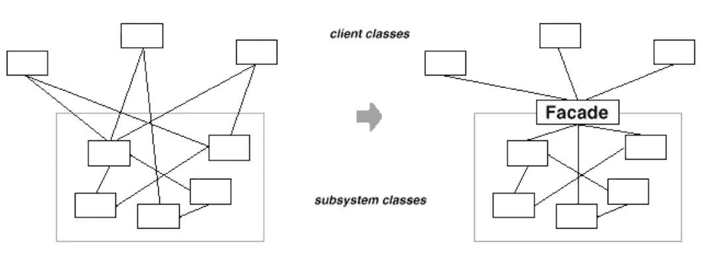
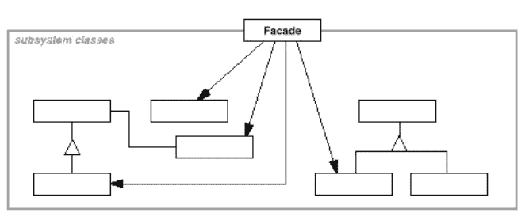

# 带有类型脚本示例的设计模式:外观

> 原文：<https://javascript.plainenglish.io/design-patterns-with-typescript-examples-facade-878e59097ac?source=collection_archive---------3----------------------->

## Facade 模式定义了一个更高级的接口，使子系统更容易使用。

Photo by Scott Webb from [Pexels](https://www.pexels.com/de-de/foto/gebaude-mit-weissen-holzrahmen-bauen-305823/)

**结构化**外观模式是一种强大的、最常用的软件设计模式，并且符合基本的软件设计原则。

在本文中，我们将详细阐述该模式的目的和结构，并通过一个实际的例子解释如何使用它。此外，我们将使用高级的**类型脚本**创建一个代码示例。

# 什么是设计模式？

设计模式是针对不同环境中反复出现的问题的通用的、可重用的解决方案。在软件工程中，他们帮助你**更快地写出更好的代码**。使用这些通用解决方案可以节省我们的时间和工作，因为我们重用了许多其他开发人员积累的知识和经验。

> “[……]对我来说，遇到没有听说过模式运动的开发人员是不常见的”“ *Grady Booch 在* [设计模式:可重用面向对象软件的元素](https://amzn.to/3i6iIIk)

也许你做了多年的程序员，却没有应用甚至不知道任何一种模式。我敢打赌，许多开发人员正是这样做的。如果是这样，我强烈推荐你先阅读这篇文章，让你的大脑相信软件设计模式是必不可少的。

 [## 为什么你必须学习软件设计模式

### 设计模式让你更快地写出更好的代码。

javascript.plainenglish.io](/why-you-must-learn-software-design-patterns-befd77f88713) 

## 模式的类别

1994 年,《设计模式:可重用面向对象软件的元素》一书由四位作者出版:Erich Gamma、Richard Helm、Ralph Johnson 和 John Vlissides，也称为“四人组”

尽管这本书是在 25 年前出版的，但它仍然是与软件工程最相关的书籍之一。阅读它可能是丰富您的开发工具包的一笔可观的投资。如前所述，**四人帮(GoF)** 定义了 23 种设计模式。为了组织他们，他们把他们分成三类:**创造型**、**结构型**和**行为型**。

> 创造模式关注的是对象创造的过程。结构模式处理类或对象的组成。行为模式描述了类或对象交互和分配责任的方式。— [设计模式:可重用面向对象软件的元素](https://amzn.to/3i6iIIk)

这里是由 GoF 定义的所有模式的概述。另外，看看我的其他文章，在表格中有链接。

如果你喜欢通过视频课程学习，我推荐你在 Skillshare 上看看这个 [**打字稿设计模式课程**](https://skillshare.eqcm.net/vnLkyj) 。它涵盖了所有 23 种 GoF(四人帮)设计模式，并教你如何使用 TypeScript 实现它们。作为代销商，如果你通过这个链接注册，我会收到一小笔佣金。你的支持帮助我为你创造更多有价值的内容。

 [## TypeScript 中的设计模式

### 解锁无限制访问此技能共享课程以及由来自世界各地的创作者讲授的数千门课程…

skillshare.eqcm.net](https://skillshare.eqcm.net/vnLkyj) 

# 立面图案

从表中可以看出，立面模式被归类为**结构**模式。考虑到这一点，它的目的必须在于描述类或对象如何交互和分配责任。

## 目的🎯

假设您正在使用一个外部库。您不知道它的内部功能，也不需要按照正确的顺序初始化对象或执行方法。了解所有这些会让大多数库很难使用。这就是为什么通常情况下，库为子系统的更复杂的功能提供一个单一的、简化的接口。

> 不用担心；如果您需要复杂子系统的功能，它仍然可供您使用，但是如果您需要的只是一个简单的界面，那么 Facade 就是为您准备的。—头部优先设计模式

这就是 Facade 模式的目的:**定义一个更高级的接口，使子系统更容易使用。**

Image from book: [Design Patterns: Elements of Reusable Object-Oriented Software](https://amzn.to/3i6iIIk)

## 适应性💡

Facade 模式在许多用例中被广泛使用和应用。只要您想，就使用外观模式:

*   **为复杂的子系统提供一个简单的接口:**一个 facade 为子系统提供了一个有限的接口，这个接口对大多数客户端来说已经足够好了。
*   **减少客户端和实现类之间的依赖**:使用 facade 将子系统从客户端和其他子系统中分离出来
*   **将一个子系统组织成多层**:每个子系统都有一个 facade 作为入口点。当子系统相互依赖时，它们可以仅仅通过它们的外观相互通信。

## 结构📐

立面结构简单。它包含我们的 **Facade** 和许多**子系统类**。

Structure of the Facade pattern (Image by: [Elements of Reusable Object-Oriented Software](https://amzn.to/3i6iIIk))

## 参与者🚻

从结构中，您可以派生出以下参与者:

*   **Facade:** 知道如何与子系统类交互，并将客户端请求委托给子系统功能的特定部分。
*   **子系统类**:由许多具有复杂功能的对象组成。要使它们正常工作，您必须深入研究子系统的功能。子系统不知道**门面**。

## 真实世界的例子🗺

当将 Facade 模式应用到现实世界的例子中时，它们的好处是最容易理解的。开发人员和非开发人员在他们的生活中都与一些**门面**有过互动。

你可能正在你的电脑或手机上阅读这篇文章。有没有和 **CPU** 、**内存**、**硬盘**等交互过？启动手机或电脑时？你没有，因为你所要做的就是按下某个按钮。你不关心你的机器中的硬件和软件。这是**外观模式的一个例子。**你是使用**外观**(某个按钮)与**子系统** (CPU、硬件、软件等)交互的**客户端**。).

Image Source: [https://i.ytimg.com/vi/BGkAvuZwo8Q/maxresdefault.jpg](https://i.ytimg.com/vi/BGkAvuZwo8Q/maxresdefault.jpg)

这里有另一个例子:你很可能需要打电话给一些客户服务热线。想象一下，你下了一些网上购物订单，但出现了一些问题。您(**客户**)想知道订单的当前状态。显然，你不能直接访问网店的内部订单系统(**子系统**)。但是，您可以调用客户服务( **Facade** )从相应的内部系统获取所有需要的信息。

## 代码示例💻

让我们以按下按钮启动电脑为例。让我们用一个简单的 **Facade** 和 Typescript **将它放到一些示例代码中。**

你可以看到`PowerButton`类充当了我们的**门面**。这个类负责与许多对客户端隐藏的子系统类进行交互。在我们的例子中，子系统类是:`CPU`、`Memory`和`HardDrive`。 **Facade** 的公共`press`方法充当用户的一个简单访问点。用户只需要调用这个方法，`PowerButton`类负责检查计算机是否已经在运行，从而相应地启动/停止 CPU、硬盘和内存

看一下代码。你也可以在 [TypeScript 游乐场](https://www.typescriptlang.org/play?#code/PQKhCgAIUgVALAppACgewO6IE4CECuALoWgHaQDGANgIYDOdkAlo2vtpAGI0U0AmiKCGDhq9Ruix4iJcgG9wUSAAdsTAG41CyCmgC2yojgCSdAEr5SpJqQDmkALyQAZjSp1EAbkWRKZOoTY+BQk2AAUSr6qGlo6hgBckADCKACqjpCkiBjJaWEAlAA0kSpqmtqQeoh6aNgAnokAstW1dRlZOc019QXFvlFlsZDwNNh8ACJliIkAEqMTU+3ZkHNjkxqIBUr5kHKQAL4+pTEVAaOESfqG2uE7Cv2QhPAsAHQUhi9n2IQF3g9Pryq3Tqn0I51+JQBdBeIzWU1B4Pyf36ulIdDQVEQLyoaFsYQAREkAPKNNKwACiZkSAGUwd9EHwAIT4-JKQ4DE7IAJoZSXAxGW67SHPaHvfCgnkQ-4il5A1oS5RS-pQmHzdbqLHcxVIkqo9GY7G4gnE0mpClUyC0nnKBnM1m+Q5KUAQfowBDIQwAIyoTAokAABqpEAx-ZVEE80HxHjQANbByijZBoZyPJDMUg3UhuSA42y+l6RGAAdSQ5CeOiuAuYjDc2EQ-DaQSsNlshUgbiokDo+E9dDqAWqjAwTConc9XJIyhtfALrsgJcQZbTun5N2rmTQhEgTesdjbHa7Pb7A70Q5HY4n5wZs98buXPsXW74aHjpE3mUQDMeaEgMbfORoUg6gBOx209d8oTbJBgDoNMyCoNosgZRgSFKYMa0gT0ZDIG9oBEKIex9P0gwYApEnUNAmCje5+iYFMwhVFdrhMcxLF3Ww7hKXwVS1PlmNuZEHRKOjIDCRlGMrG5TAsZs7E4h5uJlL4LkknAlSE6VXiYgVpLYlsMnEmVtKk1jZNsZFDkdZ0hDgNMUnSMQGHXMgkxTNgOG7Xt+20U8hBERzGHsoUCO9X0uzpH58nIyjqN1fwMSxXMwgAcnsxIzHrPg6kZAAdUhkp1DSVEIsKtTIyAKKo4KUXig0ktStIaUnadcvywqDnAKywBs91IC6VpKFoJyWEgFzRrc9hDy8k86D80QhsYfr6mqr0iPCxFoqqmjfD1BLDTxZKloaSAMobVqCospRVtKydysq2KHl2uqjUOlp6ia61bTyi62U6xRrOgWzkFWBYNkG8RnKycbRsmzzjx82a8PmiGQfVZAaOuv1lLumLqp22rEpe1GpnSzLsu+9r2WK0KsduqKKtx7a-DRPb6uJjYPqnL62sux1wGcSwQiYMhBqYR9LgEMJlEwHACGIMhEkkWXsNIeSVBl6R5dIF4SLoJVpakOXZB1utSJ1R09S3A3la1pYciVzXZAhagxYzCXNmtx2yCRIA)里拿着它到处玩。

## 相关设计模式🔗

软件设计模式通常显示不同模式之间的关系。以下是一些与外观模式相关的设计模式:

*   [**适配器**](https://medium.com/@mariusbongarts/design-patterns-with-real-life-typescript-examples-adapter-d183af1f1462) :适配器模式使我们可以使用现有的接口，而 Facade 为现有的对象定义了一个新的接口。
*   **抽象工厂**:可以和 Facade 一起使用，为以独立于子系统的方式创建子系统对象提供接口。抽象工厂也可以作为 Facade 的替代来隐藏特定于平台的类。
*   **Mediator** :类似于 Facade，它抽象了现有类的功能。然而，Mediator 的目的是在同事对象之间进行任意的抽象通信，通常集中不属于任何一个对象的功能。
*   [**Singleton**](/design-patterns-with-typescript-examples-singleton-8add6b26d4da) :通常只需要一个 Facade 对象。因此，门面对象通常是单件的。

# 最后的想法

我希望你喜欢阅读这篇文章。我总是乐于回答问题，并乐于接受批评。随时欢迎联系我！通过**[**LinkedIn**](https://www.linkedin.com/in/marius-bongarts-6b3638171/)**，**关注我**[**Twitter**](https://twitter.com/MariusBongarts)或 [**订阅**](https://medium.com/subscribe/@mariusbongarts) 通过电子邮件获取我的故事。****

****[**这里是无限制访问**](https://medium.com/@mariusbongarts/membership) 媒体上每一个内容的链接。如果你注册使用这个链接，我会赚一小笔钱，不需要你额外付费。****

**** [## 通过我的推荐链接加入 Medium-Marius bong arts

### 作为一个媒体会员，你的会员费的一部分会给你阅读的作家，你可以完全接触到每一个故事…

medium.com](https://medium.com/@mariusbongarts/membership) 

此外，如果你还没有，看看我的在线荧光笔铬扩展。使用 [Web Highlights](https://web-highlights.com/) ，您可以在任何网页或 PDF 上高亮显示，创建标签并做笔记。

 [## Web 亮点— PDF 和 Web 荧光笔

### 最佳网络荧光笔。就像你在书上做的那样，在任何网页或 PDF 上高亮显示，并做笔记。组织…

web-highlights.com](https://web-highlights.com/) 

***披露*** *:本文包含附属链接。如果你通过这些链接之一购买，我可能会收到佣金。我只推荐我认为质量高、对你有益的产品。我感谢你的支持。*

## 进一步阅读

 [## 带有类型脚本示例的设计模式:工厂方法

### 工厂方法有助于编程接口，而不是实现。

javascript.plainenglish.io](/design-patterns-with-typescript-examples-factory-method-4d145887b141)  [## 用 Web 组件构建自己的博客组合:基础

### 第 1 部分—定制元素、阴影 DOM 和 HTML 模板

medium.com](https://medium.com/@mariusbongarts11/showcase-your-medium-articles-with-web-components-part-1-basics-d2c6618e9482)  [## 三原则——三振出局，你就重构

### 在删除重复的代码之前，请三思

javascript.plainenglish.io](/rule-of-three-three-strikes-and-you-refactor-942d13e7d5cd)  [## Web 组件会取代前端框架吗？

### 它们是为解决不同的问题而构建的。

medium.com](https://medium.com/@mariusbongarts11/will-web-components-replace-frontend-frameworks-535891d779ba) 

*更多内容请看*[***plain English . io***](https://plainenglish.io/)*。报名参加我们的* [***免费周报***](http://newsletter.plainenglish.io/) *。关注我们关于*[***Twitter***](https://twitter.com/inPlainEngHQ)*和*[***LinkedIn***](https://www.linkedin.com/company/inplainenglish/)*。查看我们的* [***社区不和谐***](https://discord.gg/GtDtUAvyhW) *加入我们的* [***人才集体***](https://inplainenglish.pallet.com/talent/welcome) *。*****