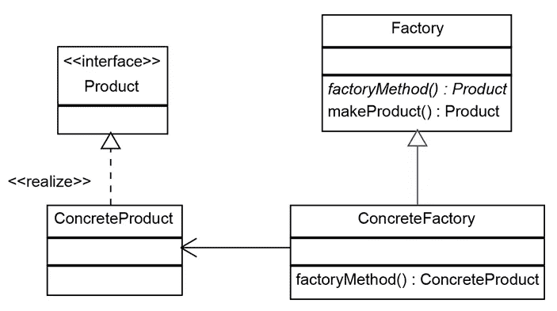

# 使用 TypeScript 设计模式:工厂方法

> 原文：<https://javascript.plainenglish.io/design-patterns-with-typescript-factory-method-cb190d7ce275?source=collection_archive---------10----------------------->

Photo by [Alexander Tsang](https://unsplash.com/@alexander_tsang?utm_source=medium&utm_medium=referral) on [Unsplash](https://unsplash.com?utm_source=medium&utm_medium=referral)

工厂方法是一种创造性的设计模式，其目标是允许我们将类的创建委托给方法。这样做可以让我们在将来这个类改变的时候只有一个地方可以改变，并且在我们有大量类定义的情况下，它会让我们的代码看起来更好。

这里的想法是有一个单独的方法，将为我们生成一个特定类的实例，在这个方法中，我们还可以添加一些检查，以查看我们将创建哪个类并将其返回给客户端。

## 结构

根据《设计模式:可重用面向对象软件的元素》一书，这种设计模式的结构是:

*   **创建者:**这是*工厂*的界面
*   **ConcreteCreator:** 这个类负责拥有将返回产品对象的*工厂方法*。在某些情况下，创建者可以返回类实例，而不是 *ConcreteProduct* 的对象(这取决于您正在处理的用例)。
*   **产品:**返回*工厂方法*的接口
*   **具体产品:***产品*接口的实现

我个人倾向于做一些不同的事情。对于 *ConcreteCreator* ，我没有将其创建为一个类，而是将其定义为一个函数，该函数将返回给我与本书相同的内容，但这样我就不需要在使用它之前实例化该类，并将*工厂方法*设置为该类的方法。

## 我们来编码吧！

好的，让我们先实现一个简单的用例。我们有一个 routes 文件，它将实例化并运行一个控制器类:

假设将来我们需要在代码库的其他路径或其他文件中实例化同一个控制器。最后，我们将在代码库中重复定义这个控制器。因此，我们可以轻松地为此添加一个工厂:

太棒了。很简单，对吧？

这里还有一个场景，我们可以使用工厂方法让我们的生活更轻松。假设我们有一个类 *Transport* ，我们有多种运输方式(*卡车*、*船*、*飞机*等)，我们需要基于我们收到的一些属性来创建这个 Transport。一种方法应该是创建一个工厂方法，该方法将根据它接收到的属性创建这个类，比如:

这个例子还添加了一个`transportMap`，它允许我们不使用`if/else if`或`switch/case`，并且 TypeScript 允许我们动态地键入它！

这是我使用的大多数用例`Factory Methods`希望这对你有所帮助！

干杯！

*更多内容请看*[***plain English . io***](http://plainenglish.io/)*。报名参加我们的* [***免费周报***](http://newsletter.plainenglish.io/) *。在我们的* [***社区***](https://discord.gg/GtDtUAvyhW) *获得独家获得写作机会和建议。*