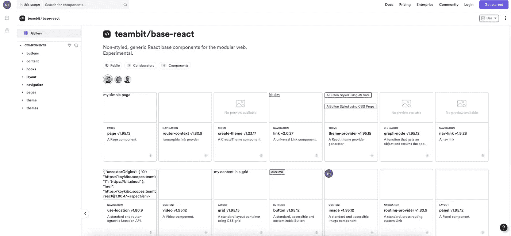

# React 设计系统中的设计标志——正确的方法

> 原文：<https://javascript.plainenglish.io/design-tokens-in-a-react-component-design-system-the-right-way-f55d392fb540?source=collection_archive---------1----------------------->

## 如何在跨页面和应用程序的 React 组件中最好地使用设计令牌

A composable theming component with design tokens; Share and reuse

设计令牌有助于解决当今设计系统和应用程序开发中的两个最大问题。

首先是[设计师和开发者协作](https://blog.bitsrc.io/15-designer-and-developer-collaboration-tools-for-2021-8fae54ac2298)。这是一个巨大的问题，因为这两种语言完全不同；一个说 Figma，一个说 code。重要的是要记住，最终用户得到的是代码，而不是图形，因此 React 是真理的来源。设计令牌帮助设计者成为开发过程中的积极参与者。

第二是确保页面和产品之间的一致性。令牌可以简化使用设计系统构建、维护和扩展产品的工作。这对于那些努力采用他们的设计系统和协作/采用的大型组织来说是一个关键点。

在这篇文章中，我们将介绍设计令牌的基础知识，以及如何将它们与[可组合组件](https://bit.dev)相结合，以解锁 React 中的最终设计系统工作流——在 React 中，您可以创建模块化和灵活的主题组件，可以插入和拔出任何应用程序。

# 组件设计系统的关键

出于这些原因，大多数现代设计系统都采用了设计标志。[这里有一个来自 Material UI 的例子](https://m3.material.io/foundations/design-tokens/overview)，Material UI 是世界上最流行的开源组件库，它在 React 中实现了材质设计。

 [## 设计标志-材料设计 3

### 令牌存储颜色和字体等样式值，因此相同的值可以跨设计、代码、工具和平台使用。

m3.material.io](https://m3.material.io/foundations/design-tokens/overview) 

当构建一个设计系统时，我们使用符号在代码中象征一个可互换的设计值——这样它就可以被切换和改变，而不必重构代码。每个组件都有一个名称和一个代表特定设计决策的值。

这样，代码直接将设计决策从设计者传递给用户——这几乎是历史上的第一次。很整洁，不是吗？

当与可组合组件一起使用时(例如，与像 [**Bit**](https://bit.dev) 这样的工具一起使用)，这是一种在全球企业中快速增长的新兴实践，设计令牌被用在可组合主题组件[中，就像这个](https://bit.cloud/teambit/design/themes/base-theme)作为设计系统的一部分。这个组件可以像 Lego 一样安装并用于组织中的其他组件、页面和应用程序的主题化。

由于主题组件可以跨项目重用，设计人员可以很容易地对设计值进行更改，并且该更改将传播到组织中的每个产品和应用程序…令人惊叹。

这意味着设计系统中的共享 UI 组件现在可以是从设计决策中剥离出来的原始元素，这也将为开发人员提供全新的自由度来构建和改进这些组件。看看 Team Bit 自己创建和分享的官方组件:

 [## teambit / base-react:用于模块化 web 的非风格化 react 基础组件。

### 用于模块化 web 的无样式、通用的 React 基础组件。实验性的。组件:主题提供者，图像，网格…

比特云](https://bit.cloud/teambit/base-react) 

# 可组合性允许轻松的一致性

当构建许多应用程序时，确保视觉和体验的一致性，同时给产品构建者足够高的自由度来控制他们的应用程序的开发是绝对关键的。

确保一致性意味着用户可以在每个接触点感受到品牌的用户界面，并成功地在您的应用程序中导航，这反过来会带来更好的业务成果和用户的幸福感和满意度。

然而，每个产品都是不同的，即使在 UI/UX 方面，其构建者也会有略微不同的需求。

这就是[可组合性](https://bit.dev)发挥作用的地方。

模块化系统在设计上更容易修改和定制。具有模块化主题组件的组件驱动系统意味着您可以跨多个产品和应用程序轻松地更改或更新您的设计。

当您创建一个包含多个设计符号、可组合、可“插入”并用于设计任何组件、页面或应用程序的主题组件时，您将使产品构建者能够自主构建，同时确保与品牌的设计指南和视觉语言保持一致。

# 在设计系统中传播跨应用程序 UI 控件的更新

当构建[可组合设计系统](https://bit.dev/docs/quick-start/design)时，所有组件都是单独分布的，然而它们通过依赖图连接在一起。每个组件，包括主题，都是独立的版本。

这意味着，每个使用带有设计标记的主题组件的应用程序都可以接收到组件的更新，以引入新的设计标记或更改现有的标记，甚至更新到一个全新的主题。

对于设计系统团队来说，这意味着一个新发现的超级能力:他们现在可以通过更新主题组件轻松地更新组织中每个页面和应用程序的 UI 主题和视觉语言！

产品构建者将获得更新，并可以控制他们是否将更新版本，冻结以前的版本，或者创建他们自己的新版本；所有这些都符合该组织制定的准则和标准。

# 设计师和开发者之间更好的沟通

设计符号为设计师和开发人员创造了一种共同的语言，因为他们都在同一个真实的来源上进行交互——也许是历史上第一次(真的……)——这就是用户获得的同一个…代码。

通过在游戏中引入可组合的组件，设计者和开发者现在可以在主题组件上合作了！

设计者不必担心每个 UI 元素的逻辑代码实现，也不必担心他们的设计和代码之间出现的差异。

相反，React 中的 UI 元素只是剥离了乐高积木，这些积木将从可组合的主题块中获得外观和体验，这些设计师可以控制并合作建立视觉品牌。

一个简单的事实是，组织中的每个应用程序、页面和组件都将使用这个主题进行样式设计，这将毫不费力地确保设计的一致性，而设计师不必努力工作来监控每个接触点的实现，开发人员也不会因为工作上的限制而感到沮丧。

很酷，对吧？

# 如何在可组合的 react 设计系统中开始设计令牌

所以启动一个可组合设计系统的最好方法是创建一些没有样式的组件，比如这些组件(T0)和主题组件(T2，T3)，你可以从其他组件中拔出来。

在您的组件范围内，您可以共享 React 中的无风格 UI 元素和您的可组合主题组件，供您组织中的所有团队和开发人员使用和构建。可组合性使得采用组件、将它们组合在一起或扩展它们变得更加容易。

你可以马上开始构建一个成熟的设计系统，或者只是在两个或更多的应用程序中构建一些你需要的组件，然后添加一个带有设计符号的主题组件来设计它们。一旦你感受到以可组合和模块化的方式工作的力量，剩下的可能就会随之而来。

干杯！

*更多内容请看*[***plain English . io***](https://plainenglish.io/)*。报名参加我们的* [***免费周报***](http://newsletter.plainenglish.io/) *。关注我们关于*[***Twitter***](https://twitter.com/inPlainEngHQ)*和*[***LinkedIn***](https://www.linkedin.com/company/inplainenglish/)*。加入我们的* [***社区不和谐***](https://discord.gg/GtDtUAvyhW) *。*