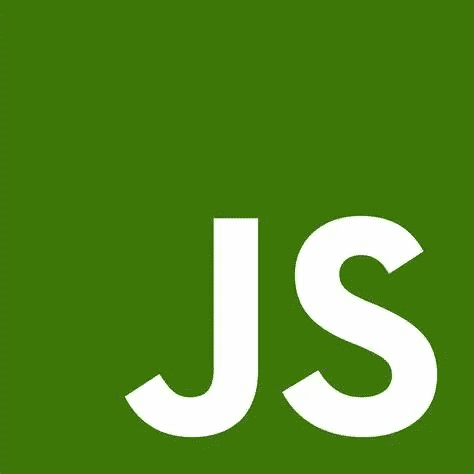
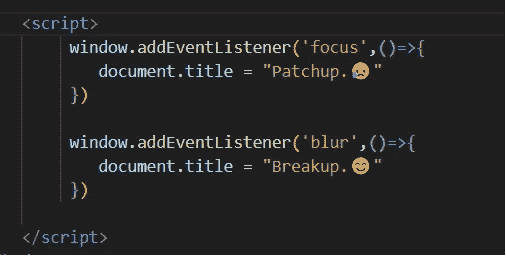
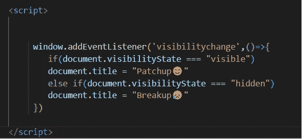

# 检测用户何时使用 JavaScript 切换标签😎

> 原文：<https://javascript.plainenglish.io/detect-when-a-user-switches-tabs-using-javascript-711a6c883c99?source=collection_archive---------10----------------------->

## 检测用户何时切换浏览器标签的两种方法:**使用聚焦和模糊事件监听器&使用‘visibility change’事件监听器**

JavaScript

如果你是一个在线考试的学生，尤其是在 Covid 的日子里，那么你一定记得当你试图改变你的考试标签时被通知的痛苦。

是的，我知道 ALT + C 也是作弊的一个选项，或者是考试时一个相当聪明的搜索选项😜但是你难道不好奇这是怎么发生的吗？我的意思是，当我们改变标签或点击考试窗口外的某个地方时，它们是如何检测到的？🤔

那么，现在准备好，我将向您介绍一些事件监听器，它们将帮助您检测您的客户或用户何时将您的网站更改为另一个网站或在您的网站/标签区域之外点击。

有两种方法:

**方法 1:使用聚焦和模糊事件监听器**

在这个方法中，我们使用两个事件监听器**【聚焦】**和**【模糊】。**

Method 1

当您切换到另一个标签或在窗口中点击标签外的其他地方时，**【模糊】**被激活。

 [## video1.mp4

### 编辑描述

drive.google.com](https://drive.google.com/file/d/1eGWeO9Pi_fPgUm0apyp5mCc7qC6uVMHu/view?usp=sharing) 

然后再次返回选项卡或点击选项卡区域，然后**“聚焦”**被激活。

**方法 2:使用“visibilitychange”事件监听器**

在此方法中，我们将仅使用“visibilitychange”事件侦听器，该事件侦听器具有一个名为“vsisibilityState”的属性，当您切换选项卡时，该属性返回值“hidden ”,当您再次返回时，该属性返回值“visible”。

Method 2.

 [## video2.mp4

### 编辑描述

drive.google.com](https://drive.google.com/file/d/1tZNqqrz0_BT4w9qwKVmetihtrf6AVNaY/view?usp=sharing) 

方法 1 和方法 2 的区别在于，前者即使在选项卡区域之外单击也能检测到，而后者仅在切换选项卡时检测到。

我希望你学到了新东西。

请在评论中告诉我你觉得哪种方法简单。😉

订阅每周技术文章。

*更多内容请看*[***plain English . io***](https://plainenglish.io/)*。报名参加我们的* [***免费周报***](http://newsletter.plainenglish.io/) *。关注我们关于*[***Twitter***](https://twitter.com/inPlainEngHQ)[***LinkedIn***](https://www.linkedin.com/company/inplainenglish/)*[***YouTube***](https://www.youtube.com/channel/UCtipWUghju290NWcn8jhyAw)*[***不和***](https://discord.gg/GtDtUAvyhW) *。对增长黑客感兴趣？检查* [***电路***](https://circuit.ooo/) *。***