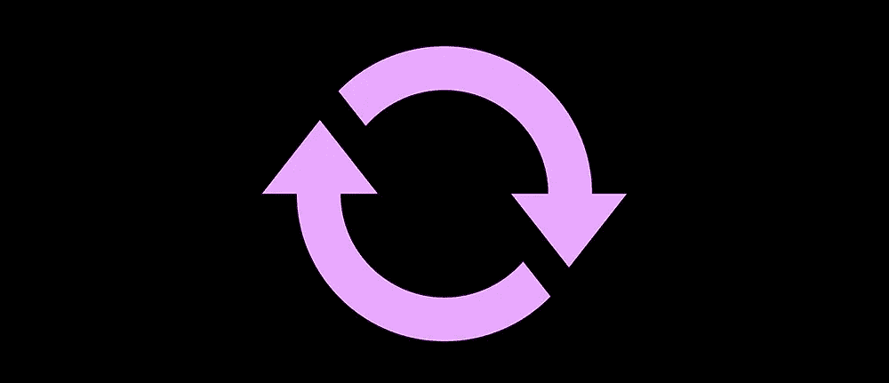
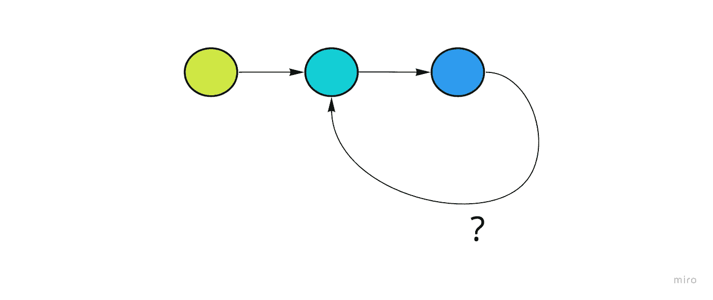

# 如何检测链表中的循环

> 原文：<https://javascript.plainenglish.io/detecting-a-cycle-in-a-linked-list-b862b19bbbc7?source=collection_archive---------16----------------------->

## 弗洛伊德循环寻找算法

最后，另一个 [LeetCode 问题](https://leetcode.com/problems/linked-list-cycle/)。已经太久了，用一个更简单的重新回到这些感觉很好。

所以，事不宜迟，我要做的是检查一个链表是否包含一个循环(或者，换句话说，是否没有真正的尾部)。

## **最初的想法**

我马上想到了一个简单的遍历，在这个遍历中，我可能会标记出沿途访问过的节点，然后两件事情中的任何一件都会终止我的努力

1.  我会重新遇到以前访问过的节点，或者
2.  我将到达 node.next === null

虽然这种方法是实用的，但是让我们将问题进一步发展，使它变得更有趣。

假设我不能以任何方式改变节点，我还需要一个实现恒定空间复杂度的解决方案。

## **二心**

现在，简单地对过去访问过的对象进行编目(也许通过对象 id)不是一个选项，因为这将表示线性空间。

所以我不能标记我的踪迹来检查我是否正在重新遍历它，我也不能保存对每个被访问节点的引用的外部集合。

## **一个有用的类比**

比方说，我们有一个跟踪，我们不知道它是一个循环还是一个死胡同。

**场景#1**

如果我们让一个跑步者沿着这条跑道跑，我们可以预期两种结果中的一种:

1.  要么他们不会返回，因为轨道有一个死胡同，然后我们会*知道*这不是一个循环。所以在这种情况下，单独的跑步者会告诉我们所有我们需要知道的。
2.  *或…* 跑步者在循环中，遍历永不结束。跑步者永远不会给出跑道确实是一个环的真实指示。

**场景#2**

考虑到这个问题，现在我们给*两名*跑步者，我们确保其中一名跑得比另一名快。潜在的结果是什么？

1.  这条赛道是一个死胡同，跑得快的人最先到达那里，我们有了答案——这条赛道不是一个环。
2.  跑得快的人会跑得慢的人一圈。除非轨道是一个环，否则这不可能发生。所以我们也有了明确的答案——赛道*是*的一个环。

让我们把它编码出来。

首先，我们将为空输入设置我们的边界情况，然后我们将在他们的起点创建我们的两个跑步者，慢的和快的。

现在我们将使用 while 循环让它们上路…

现在，从第 10 行开始描述它:

*   只要慢速和快速不在同一个节点上，就检查快速是否到达了尾节点。如果有，返回 false(这不是一个循环)
*   如果 fast 还没有到达尾节点，则 slow 走一步，fast 走两步。

所以最终，跑得快的人要么到达尾节点，要么跑得慢的人，我会得到我的答案。

这被称为弗洛伊德的周期寻找算法，它很容易成为我的最爱。它对交错计时的简单使用非常强大，概念化起来也很有趣。

*更多内容请看*[***plain English . io***](https://plainenglish.io/)*。报名参加我们的* [***免费周报***](http://newsletter.plainenglish.io/) *。关注我们关于*[***Twitter***](https://twitter.com/inPlainEngHQ)*和*[***LinkedIn***](https://www.linkedin.com/company/inplainenglish/)*。加入我们的* [***社区不和谐***](https://discord.gg/GtDtUAvyhW) *。*