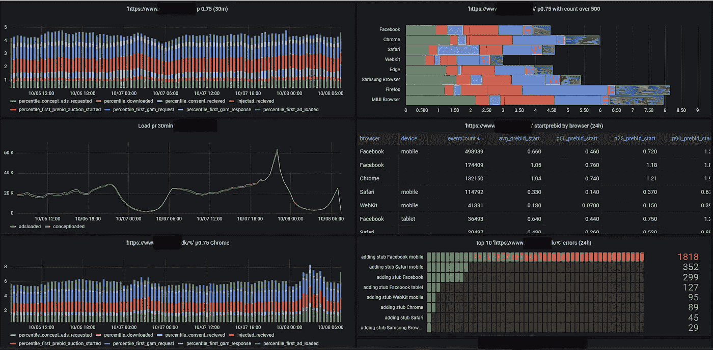

# 为什么你的 JavaScript 在客户端浏览器上运行缓慢？

> 原文：<https://javascript.plainenglish.io/determine-and-solve-javascript-speed-in-the-browser-3a5bde2f579b?source=collection_archive---------3----------------------->

## 我最近去了回答题目所需的兔子洞。我将在本文中尝试分享我的一些发现，这可能会帮助您节省一些时间。

在[的另一篇文章](https://betterprogramming.pub/increasing-the-lowest-common-denominator-for-web-performance-2f0f782955c4)中，我描述了如果每个涉众都更好地理解一个系统的一些更技术性的方面是多么有帮助。
一些系统的性能很容易衡量，而另一些则复杂得多。

Loading animation

# 介绍

如果您必须测量您的 web 服务器的性能，那么应该已经有了可以用来确定平均响应时间等的指标。
通过这种方法，您可以跟踪您对 web 服务器代码所做的任何改进，并监控它对平均响应时间的影响。

酷，所以现在 web 服务器正在被监控，如果我们认为响应时间太慢，我们可以做一些改进。太好了！

如果我们想象我们向一个网站交付一个第三方脚本，那应该在他们的网站上显示一些东西(广告)。突然，客户(网站所有者)抱怨我们的脚本太慢，广告显示太慢！

> 你的脚本很慢，请修改它！

好吧，我认为这是任何其他问题或“错误”的报告。我快速浏览了一下网站，发现它运行得很快，正如我所料。

# 问题是

在意识到它在我的设置(台式机、笔记本电脑和移动设备)上运行良好后，我决定排除在没有量化数据(实数)的情况下讨论事情的基本问题，也排除任何个人在他们自己的系统(客户端)上可能存在的任何异常。

尤其是 UI 性能可能是高度“宗教性的”和非常主观的。因此，要解决的第一个问题是收集一些数据，这样我们就可以采取一些明智的行动，而不是试图解决一个人又旧又慢的手机的问题。

调试客户端问题时，我们必须处理各种各样的浏览器、计算机、操作系统、网络连接、屏幕分辨率、防火墙、广告拦截器、设备设置等…

所以问题的核心是确定是否真的有一个普遍的问题，如果有，确定到底是什么问题。

# 解决方案

数字！还有很多。如果我们要分析主观体验，如果我们有一些实际的数据来谈论，我们会好很多。

因此，对于提出的问题，我认为解决问题的最简单方法是将整个“加载”过程分解成逻辑步骤，并测量每个步骤对总“加载时间”的贡献。

下面是最终“产品”,它应该有助于量化前面提到的问题。事实上，它很少需要如此复杂。甚至谷歌工作表中的快速图表也可以做到这一点。

Timing point for loading of ads

以上图表是由 AWS Timestream 和 Grafana(以及与本文无关的其他部分)混合而成的。

上面的图表给你的是

1.  讨论速度(或任何你感兴趣的指标)的起点
2.  非开发人员了解有助于整体性能的技术步骤的一种方式，这样他们就可以对未来的开发领域做出决定。
3.  创建一个基线，以便与其他站点和/或在进行优化时进行比较。

# 如何提高总体绩效

当分析上面的数字时，有几件事我认为是对这一组问题的更通用的解决方案，类似于所描述的(慢速广告)。

# 做实际的改进

在某些情况下，有实际的技术问题可以改进，这将直接提高性能。在上述情况下，通常可以将它们进一步分成两组

## 1.实际问题/错误

这些都是可以改进的 bug 或实现技术，以提高系统的整体性能。例如，如果您使用`setTimeout`函数，延迟为 500 毫秒，但您实际上可以使用`MutationObserver`解决问题，因此不必总是等待 500 毫秒

## 2.权衡

就广告而言，你可以做很多权衡，但是在大多数系统中，如果你牺牲了其他东西，也有一些权衡可以让你调整系统的性能。广告技术领域中一个常见权衡的简单例子是 prebid 的使用。

Prebid 通常是一种提高广告收入的方式，但它会固有地增加任何广告的加载时间。
所以如果表现是衡量成功的唯一标准，你就不应该使用 prebid(或者展示广告)。

总会有权衡，如果你能为利益相关者概述它们，你就能做出他们的决定，而不是你的决定:)

# 假装

就浏览器中的东西而言，它通常必须转换成在屏幕上显示给最终用户的东西。
制造速度幻觉的一种常见方式是简单地展示其他东西，直到你的东西准备好展示。这可以是一个加载图标或虚拟图片或其他东西。

但是展示一些东西(尽管不那么相关)通常比等待一些缓慢加载的东西要好。

> 记住这都是相对的！

*更多内容请看*[***plain English . io***](https://plainenglish.io/)*。报名参加我们的* [***免费周报***](http://newsletter.plainenglish.io/) *。关注我们关于*[***Twitter***](https://twitter.com/inPlainEngHQ)[***LinkedIn***](https://www.linkedin.com/company/inplainenglish/)*[***YouTube***](https://www.youtube.com/channel/UCtipWUghju290NWcn8jhyAw)*[***不和***](https://discord.gg/GtDtUAvyhW) *。对增长黑客感兴趣？检查* [***电路***](https://circuit.ooo/) *。***