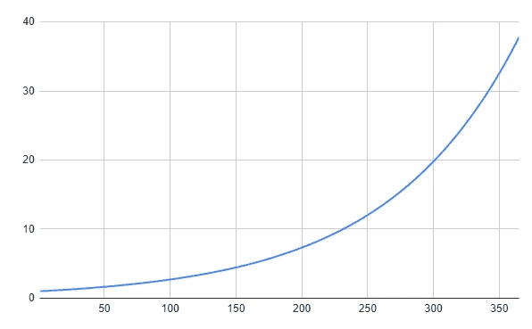

# 每天发展 1%——收获回报！

> 原文：<https://javascript.plainenglish.io/develop-1-a-day-and-things-get-done-f911c1cfc30c?source=collection_archive---------17----------------------->

## 这也被称为 1%规则。但是如何在软件开发中使用呢？让我给你举几个例子。

The interest of interest will end up becoming a lot!

有许多或多或少的哲学规则和咒语，用于改善你的工作环境或你的个人成长。这些会告诉你如何变得更有效率，或者更好版本的自己。我最近发现在开发时考虑“1%规则”很有用。

看下面的图表:

1% every day for a year

它绘制了相当于 1.01⁶⁵= 37.78 的数字。这是你一年内每天工作 1%的设想。

在绘制这些图表时，我注意到的第一件事是图表的倾斜度。获得 10 个“工作点”大约需要 230 天。接下来的 10 个“工作点”只需要 70 多天😁。
这 10 个“点”代表什么其实并不重要。可能是你优化了一项任务，使其速度提高了 5%,或者你增加了 x %的工作量。

这个想法是，你在头 230 天完成的工作量和接下来的 70 天是一样的。理论上，这意味着如果你只是不断改进小事情，你会慢慢地但稳步地变得越来越有效率。

当然，我们不应该把这些规则看得太重，也不应该把上面的数字看得太重。当然不是那 1%的部分。百分之一的工作是什么意思？
百分之百的工作会是什么样子？

然而，这条规则可以用来创造一个通用的想法，可以激励你，改变你对工作某些部分的想法。

> 1%法则基本上是说，如果你做了很多小事，很多次，最终会变成大事。

所以事实上，这不是 1%的问题。这只是为了量化这个想法，让它更容易记住。

# 软件开发环境

软件开发人员会从 Scrum 循环中了解到同样的想法，在 Scrum 循环中，许多小任务最终会组成一个“大”功能。

软件开发是一个比其他许多工作领域更能从这个想法中受益的工作领域。你可能会问，这是为什么？

*复制粘贴*

嗯，我希望不要太多，但是考虑一下。当我与开发人员(或我自己开发)交谈时，我发现大多数开发人员复制粘贴得相当多。有些比其他人多。有些是好的(不要重新发明轮子)，有些是坏的(不要有重复的代码)。

我确实相信复制粘贴是一件好事，那就是思想、架构和解决问题的常用方法(模式)。

那么这在现实生活中会是什么样子呢？

假设您的老板要求您创建一个简单的网站来显示数据库中的项目列表。

通常我会做一点思考，并尝试勾画出我们需要的不同组件。在这种情况下，我认为我们需要以下内容

1.  某种前端项目(React、Vue、raw HTML 等。)🖼️
2.  某种 API(服务器、无服务器 API、GraphQL 等。)🖥️
3.  可能一些认证(Auth0，Firebase，脸书等。)🔐
4.  一些测试(快照测试、单元测试、集成测试等。)🧪
5.  很可能是一些域设置(Cloudfront，AWS 等。)🌐
6.  一些 CI/CD (Github，Gitlab 等。)🔁
7.  🧾文献

根据具体情况，上面的一些元素可以省略，和/或可以削减，交付速度更快。假设我们想把事情做对，我们做了所有的 7 个要素。

为了便于讨论，让我们假设这个项目最终花费了 2 个月的时间。你将在 2 个月内交付一个好的产品，但是你必须从头开始构建/整合所有 7 个元素。你可能会在网上寻找一些解决方案来获得灵感，但总而言之，你必须去创造。

如果你在这两个月里努力工作，可以说你已经完成了超过 1%的工作。但是如果你一天只做了 1%的工作，同样的逻辑也适用。
那么让我们看看你被要求创建的下一个项目会发生什么:)

现在你的老板让你创建一个 CMS 系统，公司的员工可以在这里为内部博客写文章。

乍一看，这是一个比第一个更大的项目。经过一些研究和思考，你确实看到这个项目比第一个大得多。

但是你很幸运。你只是构建了另一个项目，在那里你获得了一些经验，你构建了 7 个元素，它们可能是可重用的。

如果您可以重用(复制-粘贴)项目 1 中的一些解决方案，您可能会在创建该项目时节省一些时间。这种方法当然不能应用于所有的项目，但是通常，大多数项目都有一些相同的特征。通常，CI/CD 初始设置可能是相同的。也许前端和后端的文件夹结构可以重用。也许可以应用相同的认证逻辑。
也许测试设置可以被复制并用于你所有的项目。

## 减去

最后，这意味着您构建的元素越多，您就越有可能在下一个项目中重用其中的一些元素，并更快地交付它们。
大多数大公司已经将小的增量改进的想法更进了一步，并创建了完整的项目，唯一的目的是作为未来项目的模板。即使你不觉得自己一天能做很多事，你仍然可以想象 1.01⁶⁵= 37.78。

所以继续努力，要知道光靠统计数据就能确保即使是很小的进步也能迟早完成你的项目。

*更多内容请看*[***plain English . io***](https://plainenglish.io/)*。报名参加我们的* [***免费周报***](http://newsletter.plainenglish.io/) *。关注我们关于*[***Twitter***](https://twitter.com/inPlainEngHQ)*和*[***LinkedIn***](https://www.linkedin.com/company/inplainenglish/)*。查看我们的* [***社区不和谐***](https://discord.gg/GtDtUAvyhW) *加入我们的* [***人才集体***](https://inplainenglish.pallet.com/talent/welcome) *。*