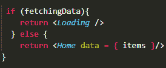

# 使用 React Native 开发移动应用程序

> 原文：<https://javascript.plainenglish.io/develop-a-mobile-app-with-react-native-85d7228e6d2b?source=collection_archive---------0----------------------->

## **使用 React Native 从头开始开发移动应用**


全球范围内快速变化的场景促使企业考虑将其业务模式从传统平台迁移到数字平台。企业开始构建一个高效的企业应用程序，无缝运行在 iOS 和 Android 上。但其不断增加的应用程序开发成本限制了他们对移动应用程序开发的投资。

然而，随着移动应用程序在从通信到购物、医疗保健到娱乐的所有领域占据了中心舞台，因此企业已经认识到这样一个事实，即如果没有数字存在，未来几十年在市场上生存将变得具有挑战性。

虽然几乎所有东西都有一个应用程序，并提供无缝的用户体验，确保简单的用户导航，因此企业在应该使用哪种技术来构建蓬勃发展的解决方案方面进退两难…

凭借多年来为桌面和移动设备开发应用程序的经验，我发现了许多东西，但毫无疑问，React Native 为应用程序开发行业带来了范式转变。

当然，如果你看到了这篇博文，你一定会很兴奋地想知道更多关于 React Native 的信息，以及如何用 React Native 构建一个成功的移动应用。但是在深入挖掘博客之前，这里有一些重要的亮点:

*   *引入 React Native 作为领先的跨平台框架*
*   *你为什么要选择 React Native 进行移动应用开发？*
*   *2022 年打造成功移动应用的技巧*
*   *如何入门使用 React Native 进行移动 App 开发？*
*   *创建 React 原生移动应用的分步指南*
*   *使用 React Native 构建一个成功的移动应用需要多少成本？*

为了更好的理解，让我们深入挖掘这些要点…

## **引入 React Native 作为领先的跨平台框架**

React Native 是一个基于 JavaScript 的跨平台框架，已被广泛用于为 iOS 和 Android 平台创建类似本机的移动应用程序。尽管 React Native 是由脸书在 2015 年推出的，但它已经迅速成为开源框架的中心舞台。最终，在为包括 Skype、Instagram、脸书等在内的许多应用提供支持后，它作为最佳应用开发解决方案而广受欢迎。

凭借代码可重用性的优势，在 iOS 和 Android 平台上运行应用程序的快速测试能力，使其成为应用程序开发的完美平台。

你可以不听我们的话，下面是解释 React Native 受欢迎程度的调查报告。


[Image Source](https://www.statista.com/statistics/869224/worldwide-software-developer-working-hours/)

## **为什么要选择 React Native 进行移动 App 开发？**

毫无疑问，React Native 拥有全球 42%的开发人员，但在投资应用开发项目时，许多企业都在想“为什么 React Native 是应用开发的首选？

以下是让 React Native 成为应用程序开发的成功选择的几个原因。

*   **节省时间和金钱**

选择 React Native 进行应用程序开发的最大原因是它可以节省您的时间、精力和成本。为不同平台创建两个原生应用的成本比使用单一代码库开发一个 React Native 应用的成本更高。因此，与 [**雇佣移动应用程序开发人员**](https://www.xicom.biz/offerings/hire-mobile-developers/) 来创建两个原生应用程序不同，使用 React Native，开发人员可以为 iOS 和 Android 平台部署相同的更新，而无需使用不同的代码库。

*   **高性能**

应用程序的性能一直是企业关注的焦点。而且 React 原生应用和 Android、iOS 原生应用一样好。虽然其他跨平台框架使用 CPU，但 React Native 使用 GPU 来完成计算任务。这也是 React 原生 app 性能优越的一个主要原因。

*   **空中更新**

OTA 更新是 React Native 的一项创新功能，允许开发人员在用户在应用程序上活动时在后端进行更改。一旦完成，更新将立即反映在应用程序上。换句话说，用户经常可以自动更新应用，而无需通过应用商店。React Native 的这一功能使更新应用程序的整个过程变得快速而轻松。

*   **开源是最大的优势**

React Native 提供了一个自由的选择，可以自由地使用类似本机的 UI 工具来定制漂亮的应用程序。由于 React Native 允许开发人员无缝地将代码从 Android Studio 导出到 Xcode，因此开发人员将 React Native 应用程序从一个平台迁移到另一个平台并不困难。

这些是 React Native 的几个突出特性，使其有别于其他跨平台框架。但问题是如何在 2022 年创造一个成功的 app。

# **2022 年打造成功移动应用的技巧**

在您进入移动应用程序开发过程之前，值得收集一些提示，使您能够构建一个成功的应用程序，并在 2022 年为您的业务增添优势。

*   **永远不要直接进入应用程序开发流程**

从经验来说，我们直接马上开始编码，两年后，用多种选择的功能来编码一个应用程序，这个应用程序最终会失败。原因是，当该产品上市时，市场并不需要它。雇佣一个本地应用程序开发公司 的成本通常在每小时 20 到 50 美元之间，因此与其将所有这些努力付诸东流，进行市场调查是一个合理的考虑。

从中吸取的最大教训是，在花费数千美元开发应用程序之前，要做一些功课。

*   **先投资 MVP 开发**

应用程序开发的另一个基本技巧是从 MVP-最小可行产品开始。通过这种方法，您可以在 3 到 4 个月内将具有基本功能的产品推向市场。创建 MVP 解决方案的主要逻辑是了解客户的真实需求，并评估用户的反馈。这种类型的应用程序版本可以让你省去很多构建没有市场的成熟应用程序的麻烦。

这是构建成功的移动应用程序的两个主要技巧，但核心问题仍然是一样的:如何从头开始使用 React Native 构建移动应用程序？

以下是使用 React Native 创建成功的移动应用程序的分步指南。

# **如何入门使用 React Native 进行移动 App 开发？**

现在，您已经对 React Native 及其开发移动应用程序的优势有了基本的了解，您一定很想知道如何开始使用 React Native 开发移动应用程序。

下面是使用 React Native 构建移动应用程序的示例。在本 React 原生移动应用程序开发教程中，您将获得一个分步指南，以构建一个从第三方 REST API 获取并显示新闻文章的报纸应用程序。

## **使用 React Native 开始应用开发流程**

> **步骤 1:入门的先决条件**

由于我们正在使用 JavaScript 和 React Native 从头开始开发移动应用程序，因此要开始开发，您需要一些先决条件来继续应用程序开发流程:

*   在你的系统上下载 [NPM](https://github.com/nvm-sh/nvm) 和 Node.js。对于安装说明，您可以遵循以下命令:

```
sudo apt install curlcurl -o- [https://raw.githubusercontent.com/nvm-sh/nvm/v0.35.3/install.sh](https://raw.githubusercontent.com/nvm-sh/nvm/v0.35.3/install.sh) | bashsource ~/.bashrcnvm install vxx.x.x
```

由于我们正在用 React Native 创建一个新闻应用程序，因此你需要向[NewsAPI.org](https://newsapi.org/)注册一个免费账户，并记录标题和文章的 API 密钥。

如果您的系统具备这些先决条件，那么您就可以继续下一步了。

> **第二步:安装 Expo CLI**

要使用 Expo 工具，您需要下载 Expo CLI。因此，要安装 Expo CLI，您需要在系统上打开一个新的终端，并运行以下命令:

```
$ npm install -g expo-cli
```

注意:如果您使用 Linux 或 macOS 安装 npm 软件包，请使用 SUDO。如果你面临任何问题，你可以[点击这里](https://docs.npmjs.com/resolving-eacces-permissions-errors-when-installing-packages-globally)。

> **步骤 3:创建一个 React 本地项目**

一旦您安装了 Expo CLI，现在就该开始您的 React 本地项目了。要开始，您可以使用下面的命令:

```
$ expo init react-native-example
```

接下来，您将被要求为您的项目选择一个模板。因此，使用一个空白模板，键入项目的名称，然后等待 CLI 生成文件并从 NPM 安装软件包。

现在，导航您的项目文件夹，并使用下面的命令运行本地开发服务器:

```
$ cd react-native-example$ expo start
```

运行此命令后，您将在终端中获得以下详细信息。根据您的开发环境，您可以使用 iOS 模拟器或 Android 模拟器，或者移动设备来测试您的应用程序。如果您没有任何 Java 开发环境，或者安装了 Android Studio 或带有 Xcode 的 macOS，那么您可以通过扫描下面的二维码，聘请一家 [**移动应用开发公司**](https://www.xicom.biz/services/mobile-app-development/) 来帮助您在移动设备上安装 Expo app。虽然这很简单，但为了避免任何风险，你可以在这里咨询专家。


[Image Source](https://buddy.works/tutorials/building-mobile-apps-with-react-native)

在移动设备上扫描二维码后，您可以轻松安装 Expo 应用程序。现在，您的应用程序屏幕很可能如下所示:


现在打开 App.js 文件，按照下面的代码在应用程序中呈现 UI 组件。


[Code source](https://buddy.works/tutorials/building-mobile-apps-with-react-native)

> **步骤 4:向 React 原生应用添加多个屏幕**

要创建多个屏幕和视图，您需要使用条件渲染。此外，在复杂的情况下，您将需要使用高级导航系统，如 React Native library。因为在我们的例子中，我们的应用程序将有两个视图，因此使用条件渲染来实现多个屏幕是值得的。下面是您需要在 **App.js** 中遵循的命令，并定义一个 **Home()** 组件:


接下来是**装载**组件的时间，如下图所示:


之后，按照以下命令更改 **App()** 组件:


现在，您的最终屏幕将如下图所示:

这将是你的主屏幕:


现在，您已经准备好了没有内容可显示的主屏幕。由于我们正在演示开发新闻应用程序的教程，因此，让我们了解如何在 React Native 中获取数据。

> **第五步:在 React Native 中获取数据**

到目前为止，您已经学习了如何在两个屏幕之间切换，让我们看看如何从 REST API 获取数据。一旦您完成了数据获取，那么您需要渲染主屏幕。当你在 [**雇佣一个 React native 应用开发者**](https://www.xicom.biz/offerings/hire-react-native-developers/) 的时候，他们可以很容易的调平 React Native 的 [Fetch API](https://developer.mozilla.org/en-US/docs/Web/API/Fetch_API) ，让你可以毫不费力的消费 REST APIs 或者从服务器获取数据。

**让我们开始这个过程。**

**5.1:** 对于**加载**组件，我们需要**使用效果**钩子来执行一个副作用。在我们的例子中，我们从 REST API 服务器获取数据。现在恢复你的 **App.js** 文件，使用下面的命令添加 **API_KEY** 和 **apiurl** 变量:


**5.2:** 添加存储新闻的项目状态变量，最好使用 useState()钩子从空数组开始。否则，您也可以使用下面的命令。


**5.3:** 调用 **useEffect()** 钩子中的 **fetch()** 方法，按照下面的命令从**新闻 API** 中获取数据:


[Code Source](https://buddy.works/tutorials/building-mobile-apps-with-react-native)

5.4:使用下面的命令，使用数据属性允许那些提取的文章到 **< home >** 组件:



**5.5:** 现在，数据已经从 **REST API** s 中取出，并传递给 home 组件。现在，您可以雇佣一名应用程序开发人员来修改组件，使其能够呈现从**数据**属性传递的数据。虽然这是一个复杂的过程，但专家可以让你毫不费力地完成这项任务。为了便于参考，我们附加了下面的命令，您需要做的就是如下改变**原点**功能:


[Code source](https://buddy.works/tutorials/building-mobile-apps-with-react-native)

**5.6:** 现在，我们不使用包含的 **<视图>** 了，而是调用 **JS map()** 方法来迭代数据数组并使用文本组件显示每篇新闻文章。

**5.7:** 终于你的 app 屏幕可以闪现所有新闻数据了。您的应用程序屏幕很可能如下图所示。


**5.8:** 如果你注意到了，这篇新闻看起来更像是需要一些风格、图片或列表的随机单词。

因此，为了改进应用程序屏幕的用户界面设计，您需要更改主页()组件，并使用下面的命令导入**平面列表**。


[Code source](https://buddy.works/tutorials/building-mobile-apps-with-react-native)

**5.9:** 为了让您的应用程序屏幕更吸引人，您需要添加图像。但是你可以雇佣一个 [**应用开发公司**](https://www.xicom.biz/services/mobile-app-development/) 来显示其他信息，比如描述、网址和图像，而不是渲染新闻文章的标题。但是要进行更改，您需要返回 App.js 文件，并使用下面的命令添加以下函数:


[Code Source](https://buddy.works/tutorials/building-mobile-apps-with-react-native)

**5.10:** 要为应用程序添加样式，您可以使用以下命令添加以下样式。


**5.11:** 最后，您使用 React Native 制作了一个新闻文章屏幕。希望你的屏幕一定和下面的屏幕一样。


希望你喜欢这个使用 React Native 框架开发移动应用的教程。但是您最关心的是使用 React Native 创建一个应用程序需要花费多少钱。如果是这样，那么您可以进一步阅读以获得估计。

## **使用 React Native 构建一个成功的移动应用需要多少成本？**

如果您想知道构建一个移动应用需要多少成本，却不知道应用中包含什么以及需要开发什么类型的应用，那么我想您问的是一个无效的问题。

在您四处寻找平均应用程序开发成本之前，您需要了解哪些参数会影响应用程序开发成本。主要因素包括应用程序的复杂性、特性和功能、测试的复杂性、UI/UX 设计、操作平台的选择等等。

尽管如此，如果您计划构建一个包含基本功能的基本移动应用，那么每个平台的平均成本可能在 2 万到 2.5 万美元之间。如果您想构建一个包含所有这些高级功能的成熟应用，那么每个平台的应用开发成本可能在 25，000 到 35，000 美元之间。

但是在这里，通过考虑使用 React Native 开发应用程序，您可以带来的主要区别在于节省了大约 40%的开发成本。利用热重载、编码的可重用性、跨平台兼容性等优势，可以提高开发效率，节省精力和时间。总之，用 React Native 开发应用程序是一个完美的决定，可以节约成本，让您的应用程序为未来做好准备。

在您做出任何结论之前，有必要了解每个企业都有自己独特的需求，因此需要不同的解决方案。因此，为了对你的项目做出公正的评估，预定一个免费的专家咨询时段是一个合理的决定。

## **结论:准备用 React Native 构建一个移动应用**

不可否认的事实是，世界正在快速向数字平台发展，用 React Native 构建应用程序对于企业和初创公司来说是一个非常有利可图的选择。利用 React Native 的功能，企业可以推出一款在多个平台上无缝运行的移动应用。通过雇佣一个移动 [**应用程序开发公司**](https://www.xicom.biz/services/mobile-app-development/) ，你可以将任何应用程序的想法转化为一个功能齐全的应用程序。

从规划、设计到开发，专家将在所有开发阶段采用最佳方法，为您提供潜在的解决方案。总而言之，如果你真的想在未来的市场上占有一席之地，用 React Native 开发一个应用是一个完美的方法。

=======================================

*更多内容看* [***说白了就是 io***](http://plainenglish.io/) *。报名参加我们的* [***免费周报***](http://newsletter.plainenglish.io/) *。在我们的* [***社区获得独家访问写作机会和建议***](https://discord.gg/GtDtUAvyhW) *。*