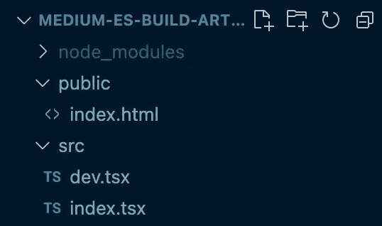
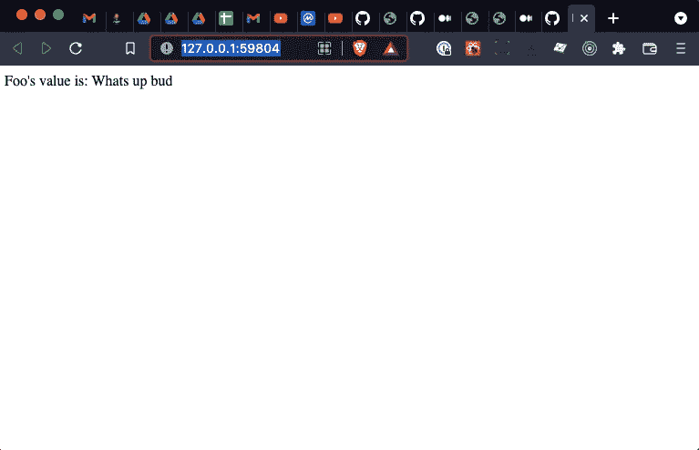
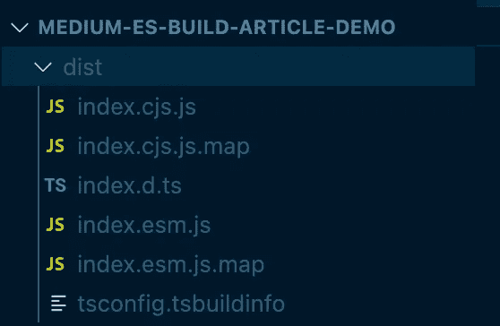

# 使用 esbuild、React 和 TypeScript 构建和打包 NPM 组件

> 原文：<https://javascript.plainenglish.io/develop-and-publish-a-react-component-with-esbuild-and-typescript-3eb756adda6e?source=collection_archive---------4----------------------->


您是否正在为 React 组件寻找一个简单、直接的开发环境，以便为 NPM 发行版进行捆绑和打包？这是我们团队使用 [esbuild](https://esbuild.github.io/) 、 [TypeScript](https://www.typescriptlang.org/) 和 [React](https://reactjs.org/) 的方法。

## 快速背景

最近，我们在西北大学图书馆的开发团队着手创建一个开源的图像、音频和视频查看器组件来显示来自我们数字收藏 UI 应用的项目。

这些要求是:

*   在各种应用程序中重复使用组件
*   建立一个简单的开发环境(以实时重载、快速捆绑等为特色)，不使用 Create React App、Next.js 等额外的帮助工具。
*   便于 NPM 配送的包装
*   关于如何在任何 IDE 中通过类型和智能感知支持使用该组件的公共 API(通过 TypeScript)

虽然有许多关于上述技术的不同组合的有用文章，但我们认为应该分享我们的特定用例。

如果你想直接跳到代码，这里有一个最终代码的例子:[https://github.com/adamjarling/medium-es-build-article-demo](https://github.com/adamjarling/medium-es-build-article-demo)。

# esbuild

由于其简化的 API、速度、对 TypeScript 的本地支持和许多其他优秀特性，esbuild 最近获得了很多关注。这似乎是一个更精简的方法，所以我们将使用它作为我们的 JavaScript bundler/packager。

如果您想调整配置，在通读本文或按照步骤设置项目时，参考 [esbuild 的 API](https://esbuild.github.io/api/#build-api) 可能会有所帮助。

# 设置项目

首先，为您的项目创建一个新目录，并输入项目。接下来，让我们初始化项目中的`npm`和`git`，以获得一个`package.json`文件。现在继续接受所有的命令提示符默认值(您可以随时更新)。

```
// Create your new project directory
mkdir my-awesome-project
cd my-awesome-project// Initialize npm
npm init// Initialize git
git init
```

# 设置开发环境

让我们建立并运行一个开发环境。首先，我们将安装一些初始开发依赖项:

```
// Install development dependencies
npm install -D esbuild typescript chokidar rimraf live-server
```

**我们在安装什么？**

用于监视我们代码中的变化，以帮助实时重载。

`rimraf`用来清理我们的输出目录，确保文件新鲜、干净。

`live-server`是一个轻量级的本地 web 服务器，我们将使用它来服务于开发环境，这样你就可以在浏览器中看到你的工作。

接下来，我们将安装 React 及其类型(因此 TypeScript 知道语法)，这是我们的应用程序需要在浏览器中运行的依赖项。

```
npm install react react-dom @types/react @types/react-dom
```

## 添加开发环境项目结构

现在让我们在项目中添加一些初始开发环境文件。我们将从两个样板配置文件开始，`.gitignore`和`tsconfig.json`。在项目根目录下创建它们:

```
touch .gitignore
touch tsconfig.json
```

首先，您可以将[这个文件](https://github.com/adamjarling/medium-es-build-article-demo/blob/main/.gitignore)的内容复制到`.gitignore`中，并将[这个文件](https://github.com/adamjarling/medium-es-build-article-demo/blob/main/tsconfig.json)复制到您的 TypeScript 配置文件`tsconfig.json`中

## /公共

让我们创建一个名为`/public`的目录，其中包含本地开发服务器将使用的文件。

```
// Create dev environment files
mkdir public
cd public
touch index.html
```

将[这个文件](https://github.com/adamjarling/medium-es-build-article-demo/blob/main/public/index.html)的内容复制到你的`/public/index.html`中。

index.html

`<div id="root" />`是我们的 React 组件将附加到的 HTML 元素。而`<script src="/script.js"></script>`是我们的捆绑开发代码最终需要在浏览器中呈现的地方。

## /src

现在让我们模拟一个消费应用程序和我们要导入的组件在我们的开发环境中的样子。让我们创建两个文件，其中一个,`dev.tsx`模拟消费应用程序，另一个,`index.tsx`表示消费应用程序将导入的顶级组件。

首先，回到我们项目的根目录，在`/public`旁边创建一个兄弟`/src`目录。

```
mkdir src
cd src
touch dev.tsx
touch index.tsx
```

您的项目现在应该如下所示:



在`/src/dev.tsx`中，复制[该文件](https://github.com/adamjarling/medium-es-build-article-demo/blob/main/src/dev.tsx)的内容:

dev.tsx

并且在`/src/index.tsx`中，复制[这个文件](https://github.com/adamjarling/medium-es-build-article-demo/blob/main/src/index.tsx)的内容:

index.tsx

## 捆绑代码并在浏览器中呈现

现在我们将创建一个文件`/src/serve.js`，它将包含我们的开发环境的配置。这个文件将监视我们代码中的变化，为浏览器捆绑我们的代码，并提供实时的重新加载体验。

```
// /src/serve.js
touch serve.js
```

将文件中[的内容复制到`src/serve.js`中](https://github.com/adamjarling/medium-es-build-article-demo/blob/main/serve.js)

serve.js

这里发生了很多事情，但是如果您通读代码，主要的收获是:

*   esbuild 的`build`方法将我们的代码与一些应用的基本配置捆绑在一起，并创建`/public/script.js`文件作为输出。
*   `chokidar`正在监视对任何 TypeScript 文件的更改，然后我们告诉 esbuild 重新构建。
*   正在使用一些基本配置启动本地 web 服务器。

现在让我们创建一个脚本，这样我们就可以运行代码并进行测试。

## npm 运行开发

我们需要更新我们的`package.json`文件来添加一个`npm run dev`命令，我们可以运行这个命令来验证一切正常。替换我们的`package.json`文件中的`scripts`键，以匹配以下内容:

```
// package.json...
"scripts": {
  "dev": "node serve.js"
}, 
```

现在运行:

```
npm run dev
```

你会看到一个新的浏览器窗口或标签打开。对你的代码做一些修改，注意实时重载应该也可以工作了。



Screen shot of local app running. Not too exciting but proves the point

此时，您可以向您的应用程序添加尽可能多的组件，让它变得简单或复杂，但保留`index.tsx`作为导入所有其他子组件的顶级组件。

# 设置生产构建环境

我们现在有一个最小的开发环境启动并运行。此时，您可能想要添加单元测试、linters 和其他项目最佳实践，所以请随意探索和构建您的应用程序。如果有人感兴趣，我们可以在另一篇文章中更详细地介绍我们团队使用的工具。

## build.js

让我们添加另一个文件，该文件使用 esbuild 的`build`方法来捆绑我们的组件，以便导入到其他 React 项目中，并准备分发到 NPM。

在项目根目录下创建一个`/build.js`文件:

```
// build.js
touch build.js// The project structure should look like...
build.js
serve.js
src/
  ...
```

将文件中[的内容复制到`/build.js`中。](https://github.com/adamjarling/medium-es-build-article-demo/blob/main/build.js)

build.js

在这个配置文件中，我们将入口文件`/src/index.tsx`和两种输出文件格式:ESModules 和 CommonJS 定义到项目`dist`文件夹中，作为打包组件代码的最终目的地。

通常，大多数基于浏览器的应用程序将使用`esm`格式，节点环境应用程序将使用`cjs`格式，但由于我们不确定使用应用程序的捆绑程序将使用哪种类型，我们将同时提供这两种格式。

现在让我们跳回到`package.json`文件，并完成接线。

下面是[我们将把](https://github.com/adamjarling/medium-es-build-article-demo/commit/670831d4e1afef215bdfc873f9c6e0d1fbb78fef#diff-7ae45ad102eab3b6d7e7896acd08c427a9b25b346470d7bc6507b6481575d519)添加到`package.json`文件中的差异。最新的文件将如下所示:

package.json

以下是新增内容:

*   `main`最终捆绑文件的通用 JS 格式位置。
*   `module` ES 模块最终捆绑文件的格式位置。
*   这个命令清空了`/dist`目录，然后通过`build.js`文件执行我们的 ESBuild。该命令还创建了 Typescript 类型定义，这些定义将与我们的最终捆绑文件一起导出，因此 ide 将为我们导出的组件获得 IntelliSense 和 autocomplete。
*   `scripts.clean`清理`dist`文件夹中任何残留的碎屑。
*   `scripts.prepublishOnly`这确保了每次执行`npm publish`时，都会执行`build.js`命令。否则，每次发布之前，您都必须手动构建新的生产文件，这很容易忘记:)
*   告诉 NPM 只打包这个项目目录数组中的文件

## 构建包

我们现在已经准备好构建包了:

```
npm run build
```

我们现在将看到一个新的`/dist`目录已经创建，其内容应该如下所示:



# 本地测试

为了测试我们的组件实际上成功地导出和导入，在您的本地环境中打开任何 React 项目，并从本地文件路径直接导入这个组件。这里有一个例子:

```
// Install the local package
npm install '../location/of/your/local/project';
```

将组件导入本地 React 应用程序:

```
// Some other React app
import MyAwesomeComponent from 'my-awesome-project';...<MyAwesomeComponent foo="something goes here" />
```

# 发布到 NPM

恭喜你，你知道有一个项目准备交付给 NPM！有很多关于如何将包发布到 NPM 的文章，所以请浏览 NPM 的文档以了解更多细节，但最基本的形式很简单:

```
npm publish
```

# 文章/参考文献

感谢下面我们用来构建配置的一些很好的模式和参考:

*   [https://github . com/souporserious/bundling-typescript-with-es build-for-NPM](https://github.com/souporserious/bundling-typescript-with-esbuild-for-npm)
*   【https://github.com/zaydek/esbuild-hot-reload 

*更多内容请看*[*plain English . io*](http://plainenglish.io/)*。报名参加我们的* [*免费周报*](http://newsletter.plainenglish.io/) *。在我们的* [*社区获得独家写作机会和建议*](https://discord.gg/GtDtUAvyhW) *。*