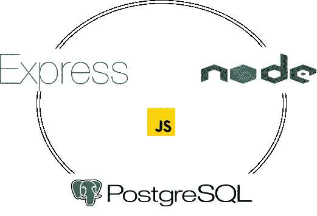

# 使用 Express Framework 和 PostgreSQL 开发 APIs 第 1 部分

> 原文：<https://javascript.plainenglish.io/develop-apis-with-express-framework-and-postgresql-part-1-5cf2bbed90c2?source=collection_archive---------7----------------------->



API development with Node + Express + PostgreSQL

# 什么是 ExpressJS？

ExpressJS 是一个预构建的 NodeJS 框架，可以帮助您更快、更智能地创建服务器端 web 应用程序。简单性、极简主义、灵活性和可伸缩性是它的一些特征，因为它是在 NodeJS 本身中制造的，所以它也继承了它的性能。

# 为什么选择 ExpressJS？

ExpressJS

*   允许设置中间件来响应 HTTP 请求。通过使用各种中间件，我们可以模块化我们的应用程序。在处理请求的任何时候添加中间件都提供了一个复杂的、易于维护的请求处理管道。
*   定义用于根据 HTTP 方法和 URL 执行不同操作的路由表。Express 提供了路由 API，可以用较少的开发时间创建微服务。
*   允许基于向模板传递参数来动态呈现 HTML 页面。

# 开始使用:

1.安装节点 js。要检查节点是否已安装，运行以下命令:
`node -v` 这将返回您系统上安装的 nodejs 版本。如果这个命令出现错误，可以使用这个[链接](https://nodejs.org/en/)来安装节点。

2.为服务器创建一个目录:
`mkdir server`
在这里你可以用你的应用名称替换`server`。


3.用`package.json`文件初始化服务器:
`yarn init -y`
`-y`或`--yes`标志将帮助您创建具有必要属性默认值的`package.json`文件。
生产下列`package.json`:

```
{
  "name": "server",
  "version": "1.0.0",
  "main": "index.js",
  "license": "MIT"
}
```

有关`yarn init`的更多信息，请在这里找到官方文档[。](https://classic.yarnpkg.com/lang/en/docs/cli/init/)

4.现在，我们将向我们的应用程序添加以下 npm 包:

*   **express** : Express JS 是一个 Node.js 框架，旨在快速构建 API 的 web 应用跨平台移动 app，让 node.js 变得简单。
*   **Nodemon** :一个帮助开发基于 Node.js 的应用程序的工具，当检测到目录中的文件改变时自动*重启 node 应用程序*。
    `yarn add express && yarn add nodemon -D`(作为开发依赖)

# 在 package.json 中添加服务器脚本

更新后的`package.json`文件将如下所示:

```
{
  "name": "server",
  "version": "1.0.0",
  "main": "app.js",
  "license": "MIT",
  "scripts": {
    "start": "NODE_ENV=production node src/app.js",
    "dev": "nodemon src/app.js"
  },
  "dependencies": {
    "express": "^4.18.2",
  },
  "devDependencies": {
    "nodemon": "^2.0.20"
  }
}
```

1.在`start`脚本中，我们将环境变量`NODE_ENV`的值更改为`production`，并使用`app.js`条目文件运行我们的节点应用程序。

2.在`dev`脚本中，我们运行 nodemon 让服务器在应用程序中每次保存更改时重启。

# 从源目录开始

1.创建一个包含我们源代码的 src 目录。
`mkdir src && cd src`

2.创建一个入口文件:`app.js`
`app`对象通常表示快速应用程序。通过调用 Express 模块导出的顶层`express()`函数来创建它

使用指定的回调函数将 HTTP GET 请求路由到指定的路径。

`app.listen([port[, host[, backlog]]][, callback])` 绑定并监听指定主机和端口上的连接。这个方法与 Node 的 [http 相同。Server.listen()](https://nodejs.org/api/http.html#http_server_listen) 。

```
const express = require("express");
const app = express();
const PORT = 5000;

app.get("/", (req, res) => {
  res.send("Hello world!");
});

app.listen(PORT, () => console.log(`Server started at http://localhost:5000/`));
```

3.运行:
`cd server && yarn dev`

4.在你的浏览器中进入[**http://localhost:5000/**](http://localhost:5000/)，你会看到‘Hello world！’在浏览器窗口中。

5.我们在这里向路径`/`的服务器发送一个 get 请求。分配给该路径或路由的回调在服务器上执行，响应按照回调中的定义发送。

# 配置 PostgreSQL 数据库

*   按照教程从这个[链接](https://www.youtube.com/watch?v=0n41UTkOBb0)到 ***在 windows 上安装 PostgreSQL*** 。
*   我们将需要一个 npm 包`pg`及其类型来建立与 PostgreSQL 数据库的连接。
    `pg`软件包官方文档可从[这里](https://node-postgres.com/)获得。
*   在根目录下运行以下命令安装`pg`包:
    `yarn add pg`
*   添加`db.js`文件:
    `new Pool(config: Config)`
    构造一个新的池实例。
    该池最初是空的，并将在需要时*缓慢地*创建新客户端。`config`对象的每个字段都是完全可选的。当池创建客户机时，传递给池的配置也会传递给池中的每个客户机实例。
    在这里了解更多关于池 API [的信息。](https://node-postgres.com/apis/pool)

```
const { Pool } = require("pg");

const pool = new Pool({
  host: "localhost",
  user: "postgres",
  port: 5432,
  password: "admin",
  database: "postgres",
});

module.exports = { pool }
```

*   现实项目中的所有细节都存储在`.env`文件和生产环境变量中。它们是敏感的秘密，不能通过适当的认证和授权来共享。我们在本文中没有使用`.env`文件，因为这预计是使用 node-express 开发 API 之旅的开始。
*   更新`app.js` :
    在这里，`pool.query`返回一个承诺，该承诺在被解析时返回`pg.Result`对象。
    `result.rows`返回查询结果的行数组。如果查询没有返回结果，那么`rows`返回一个空数组。
    点击了解更多结果对象[。](https://node-postgres.com/apis/result)

```
const express = require("express");
const app = express();

const PORT = 5000;

// import pool object from db module that we just created
const { pool } = require("./db");

app.get("/", (req, res) => {
  res.send("Hello world!");
});

// async-await pattern for get callback argument
app.get("/users", async (req, res) => {
  try {
    // pool.query runs a query on the first available idle client and
    // return its result
    const result = await pool.query(`Select * from users`);
    res.send(result.rows);
  } catch (err) {
    console.error('Error executing query', err.stack)
    res.status(500).json({ error: 'Something went wrong'});
  }
});

app.listen(PORT, () => console.log(`Server started at http://localhost:5000/`));
```

*   在测试 API 之前，请确保添加到池构造函数中的数据库细节是准确的并且可以工作。然后运行下面的查询来创建表并添加一些虚拟数据。

```
-- Table: users

-- DROP TABLE users;

CREATE TABLE users
(
    id integer NOT NULL GENERATED ALWAYS AS IDENTITY ( INCREMENT 1 START 1 MINVALUE 1 MAXVALUE 2147483647 CACHE 1 ),
    name character varying(50) NOT NULL,
    email character varying(30),
    CONSTRAINT users_pkey PRIMARY KEY (id)
);

ALTER TABLE users
    OWNER to postgres;

-- INSERT data

INSERT INTO
    users (name, email)
VALUES
    ('user1', 'user1@mail.com'),
    ('user2', 'user2@mail.com'),
    ('user3', 'user3@mail.com');
```

*   因为我们关注的是 Expressjs 开发，所以我们不会深入数据库管理。如果您成功地运行了查询，您就可以开始了。
*   结果对象的形状如下所示:

```
{
  command: 'SELECT',
  rowCount: 3,
  oid: null,
  rows: [
    { id: 1, name: 'user1', email: 'user1@mail.com' },
    { id: 2, name: 'user2', email: 'user2@mail.com' },
    { id: 3, name: 'user3', email: 'user3@mail.com' }
  ],
  fields: [
    Field {
      name: 'id',
      tableID: 16947,
      columnID: 1,
      dataTypeID: 23,
      dataTypeSize: 4,
      dataTypeModifier: -1,
      format: 'text'
    },
      arrayParser: [Object],
      builtins: [Object]
    },
    text: {},
    binary: {}
  },
  RowCtor: null,
  rowAsArray: false
}
```

*   请注意，在上面的示例中，不需要签出或释放客户端。池在内部进行获取和释放。
*   确保服务器正在运行，然后转到[**http://localhost:5000/users**](http://localhost:5000/users)在浏览器窗口中查看查询结果。

[](https://github.com/yogeshdatir/node-express-starter-kit-with-javascript-postgresql) [## GitHub-yogeshdatir/node-express-starter-kit-with-JavaScript-PostgreSQL

### 此时您不能执行该操作。您已使用另一个标签页或窗口登录。您已在另一个选项卡中注销，或者…

github.com](https://github.com/yogeshdatir/node-express-starter-kit-with-javascript-postgresql) 

# 参考资料:

1.  [快递文件](https://expressjs.com/)
2.  `[pg](https://node-postgres.com/)` [包文档](https://node-postgres.com/)

# 有用资源:

1.  [多药耐药表](https://developer.mozilla.org/en-US/docs/Learn/Server-side/Express_Nodejs)

*更内容于*[](https://plainenglish.io/)**。报名参加我们的* [***免费周报***](http://newsletter.plainenglish.io/) *。*[](https://twitter.com/inPlainEngHQ)*[***领英***](https://www.linkedin.com/company/inplainenglish/)*[***YouTube***](https://www.youtube.com/channel/UCtipWUghju290NWcn8jhyAw)T42**T44**T48*上追随我们。对增长黑客感兴趣？查看* [***电路***](https://circuit.ooo/) *。****