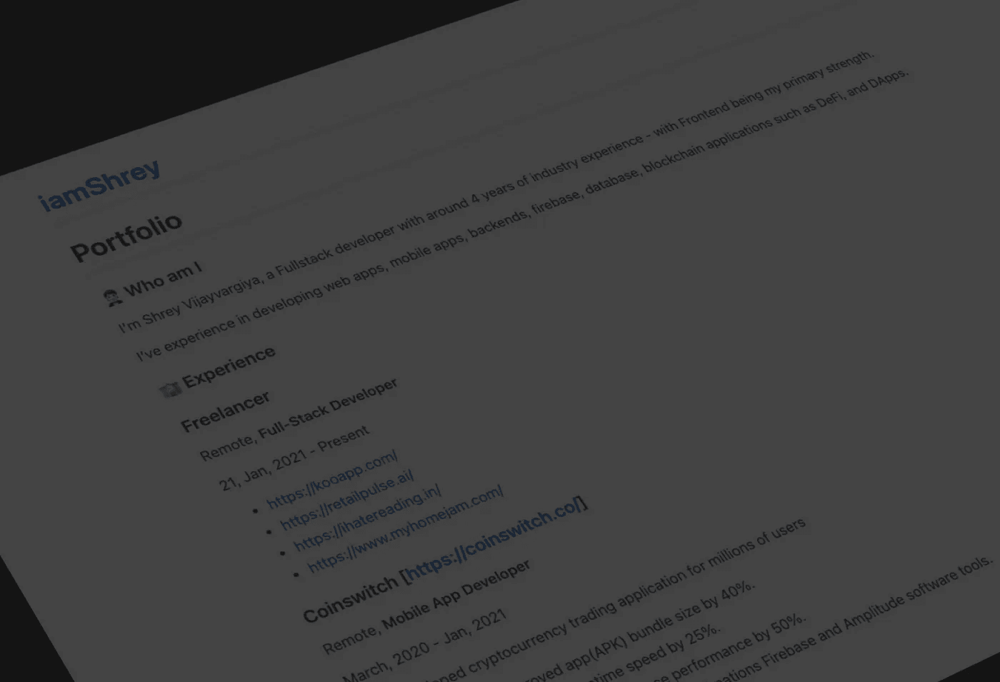
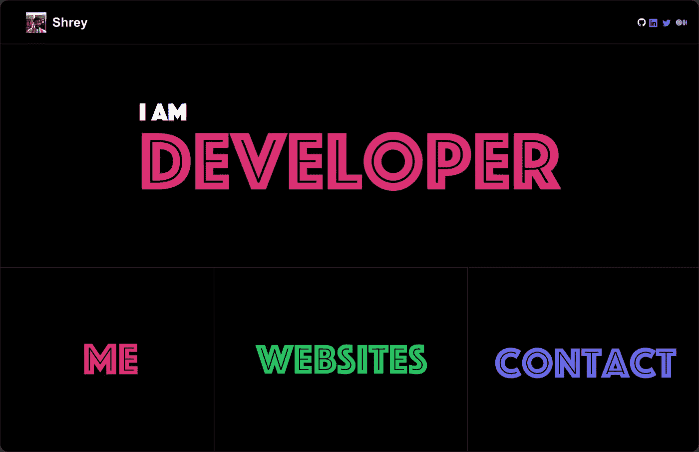

# 创建、管理、部署和托管您的投资组合网站

> 原文：<https://javascript.plainenglish.io/developers-personal-portfolio-e5db5bff81e5?source=collection_archive---------8----------------------->

## 我用了不到 10 分钟的时间就完成了，使用的工具有 idea、Github、Github Pages 和 GoDaddy。

[iamshrey.me](http://iamshrey.me)

## 在后台

我想发展我的个人投资组合，经过一年的自由职业，我做了一些设计。我等了这么长时间，因为我希望我的设计是体面的。

但是现在我必须了解用户体验和用户界面的概念。

我打算换工作，从 web2 转到 web3。我想做的第一件事是创建一个实时投资组合。因为我有很多东西可以在我的名下展示，比如我的工作经验、项目和技能。

这是我已经为我的简历完成的几个设计。

Home page

主页看起来像一个打字机文本效果在中心，标题介绍我的个人资料在 5 秒钟。

## 为什么是个人投资组合？

你可以在谷歌上搜索大量关于如何以及为什么开发个人投资组合的理由。我不会在这里讨论这个问题，而是让我给出我的理由。

*   个人营销——给投资者、读者等等留下印象。
*   个人网络——就像我的数字卡
*   个人联系——人们可以直接从我的网站给我发电子邮件，并直接与我联系。
*   筹集资金的个人项目——我将发布现实世界的项目，以获得更多的众筹和流量。

## 投资组合开发

实际上，我在不到 10 分钟的时间里就完成了我的作品集。

*   首先，我使用概念来创建我的投资组合页面，并将其导出为 markdown。
*   为我的作品集创建一个 GitHub 资源库
*   在 repository settings 选项卡下为存储库创建 GitHub 页面。
*   购买 GoDaddy 域名(这是我的— [iamshrey.me](http://iamshrey.me) )
*   在 GitHub 的 Godaddy 中添加 DNS 和 CNAME
*   在 GoDaddy(自定义)链接上托管 GitHub 页面
*   然后，我在存储库的自述文件中添加了导出的概念页面标记

嘣！我的网站是托管在 GitHub 上的。

这太简单太疯狂了，该死。没有 CSS 没有风格，没有主机，总的时间节省，我们完成了。

它实际上没有代码组合，但我们不能这样命名，因为它需要一个 GitHub 帐户和代码库。

## 使用的工具是-

*   概念
*   开源代码库
*   GitHub 页面
*   GoDaddy

所有这些都是免费的，除了自定义域。费用取决于 SSL 证书和域名。我建议去两年，因为它比一年花费少。

## 使用概念的体验

*   它不是高度可定制的，并且不能添加许多动画。
*   容易作出和推动变化，实际上没有编码是必需的。
*   易于导出且免费，我可以导出成 HTML 文件并直接部署它。

## 使用 Github 页面的经验

*   添加域名相当容易
*   启用页面和添加域名的过程需要 2-5 分钟
*   免费
*   一切都是从 Readme 文件中处理的，如果不需要这个概念，可以很容易地编辑它。

## 这个想法的利弊

我想的不仅仅是个人投资组合。我用概念作为工具创建了一个网站，这对于很多开发者和自由开发者来说非常有帮助。

所有你需要的是在 GitHub 页面下，DNS 管理，和概念。我们甚至可以发布第一个只有链接和联系方式的 MVP 静态页面，并在现实中测试这个想法。

这是一种非常强大、省时且成本较低的市场测试方法，而不是使用基本的 React 应用程序。

## 结论

我对 Youtube 有一个想法，并计划用这个行动计划来测试它，发布一个没有无代码工具的无代码网站。

你可以自己尝试这种方法，并让我知道这对你来说有多简单，或者是否太难了，如果是的话，我会尝试找到另一种方法来解决它。

继续发展
Shrey
T2【IHA tereading】T3

*更多内容看* [***说白了就是***](https://plainenglish.io/) *。报名参加我们的* [***免费周报***](http://newsletter.plainenglish.io/) *。关注我们关于* [***推特***](https://twitter.com/inPlainEngHQ) ， [***领英***](https://www.linkedin.com/company/inplainenglish/) *，*[***YouTube***](https://www.youtube.com/channel/UCtipWUghju290NWcn8jhyAw)*，以及* [***不和***](https://discord.gg/GtDtUAvyhW) *。对增长黑客感兴趣？检查* [***电路***](https://circuit.ooo/) *。*