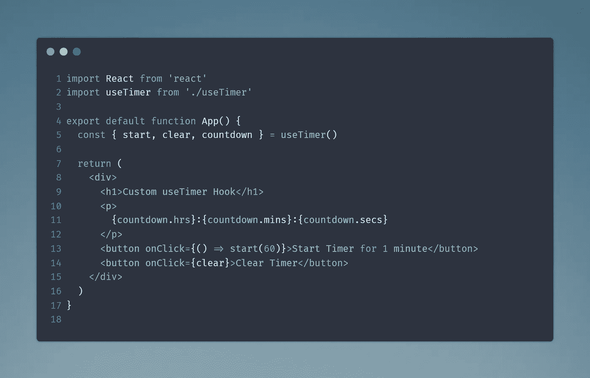
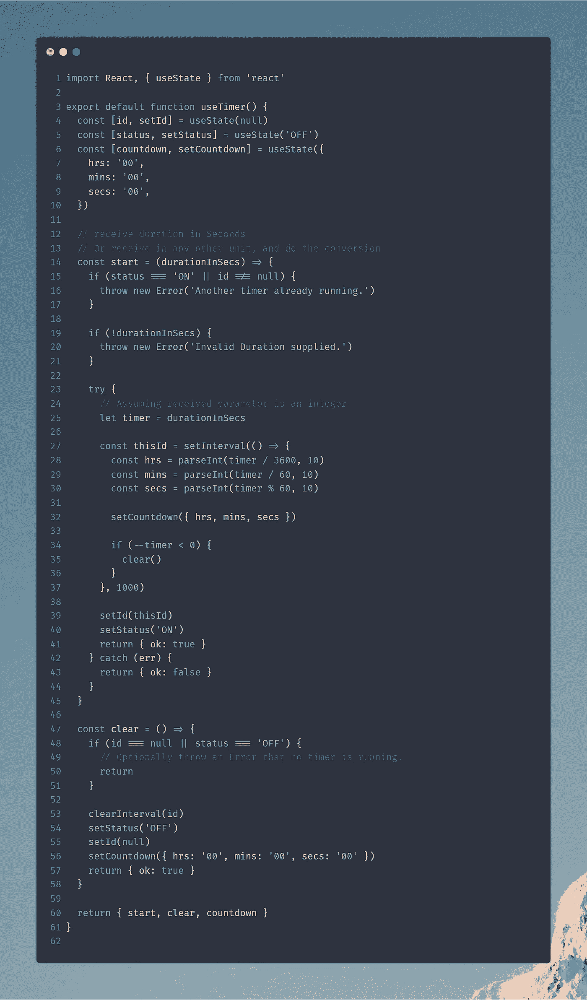

# 在 React 中开发一个自定义的 useTimer 钩子

> 原文：<https://javascript.plainenglish.io/developing-a-custom-usetimer-hook-in-react-18585ea3d24?source=collection_archive---------3----------------------->

## 一个小例子，为 React 应用程序创建一个自定义的 useTimer 钩子，负责任地绕过恶意的 setInterval 函数。



计时器是一些应用程序的基本元素，比如生产力应用程序、游戏、任务管理应用程序等等。我举了一个小例子来为 React 应用程序创建一个定制的`useTimer`钩子，以负责任地绕过 JavaScript 中恶意的 setInterval/setTimeout 函数。

让我们从样板任务开始:

```
npx create-react-app usetimer-hook
cd usetimer-hook// Using VSCode for development
code . && exit// Bash in VSCode
npm start
```

在这里，我使用 CRA 建立了一个标准的 React 应用程序，并在退出 bash 窗口时在 VSCode 中打开它。接下来，使用 VSCode 中内置的 Bash，我已经开始了我的项目，这将打开浏览器到 localhost:3000，我们的 React 应用程序正在那里运行。我将清除 App.js 文件中的样板文件。

接下来，在 src 目录中创建一个 useTimer.js 文件。



下面是我们钩子的详细解释:

**第 1-10 行**

我们在这里使用一个内置的`useState`钩子用于多种目的。

*   id:这将是一个状态参数，用于记忆当前运行区间的 ID。
*   状态:这是一个指示变量，用于检查定时器当前是开还是关。
*   倒计时(小时，分钟，秒):一个对象，每秒更新一次计时器，以指示剩余时间。

**第 14–45 行(启动功能)**

启动功能将做到这一点，即启动我们的计时器。它接受一个参数，即以秒为单位的总持续时间。或者，您可以提供其他单位的持续时间，并对其调用自定义转换函数。

对于第一个 if 块，它检查是否有其他计时器正在运行。如果是，它会抛出一个错误，说明同样的情况。在下一个 if 块中，它检查是否提供了持续时间，或者持续时间是否为 0，并相应地抛出一个错误。

*在试块内*

我们定义了一个局部变量，该变量的值来自我们的 duration 参数。您可以向参数添加检查，以检查它是否为整数。接下来，我们最后使用 JavaScript 中内置的`setInterval`函数调用一个区间。现在，`setInterval`函数返回一个 id 来惟一地标识它。该 id 属于数字类型。由于 setInterval 函数本质上是异步的，所以在调用它之后，我们直接进入下面的语句。我们将 id 状态设置为计时器 id，并将计时器状态设置为“开”。我们返回一个“ok”标志来验证计时器是否成功启动。

现在，在 setInterval 函数中，我们通过将 interval duration 参数设置为 1000 毫秒(或 1 秒)来更新每秒后的倒计时状态。我们对计时器变量进行计算，以获得剩余的小时、分钟和秒，并将这些值更新为倒计时状态。

在第 34 行，我们首先将定时器变量减 1，然后检查它是否小于 0。如果它小于 0，我们调用 clear 函数来清除计时器。

**第 47–58 行**

在 clear 函数中，我们首先检查是否有定时器在运行，如果没有，我们就返回。

接下来，使用 JavaScript 中内置的`clearInterval`函数，并使用我们存储的计时器 id，我们清除运行间隔，然后刷新我们的状态变量。最后，我们再次返回一个“ok”标志。

然后，我们继续返回这些如此定义的函数和状态。

# 使用钩子


使用钩子非常简单。简单地从我们的`useTimer`钩子中提取开始、清除函数和倒计时状态，使用析构。

在上图中，我们调用了 60 秒的计时器，即 1 分钟。

*希望这是有帮助的！:)
对任何 bug，或者缺点做评论。*

*更多内容看* [***说白了。报名参加我们的***](http://plainenglish.io/) **[***免费周报***](http://newsletter.plainenglish.io/) *。在我们的* [***社区不和谐***](https://discord.gg/GtDtUAvyhW) *获得独家获取写作机会和建议。***