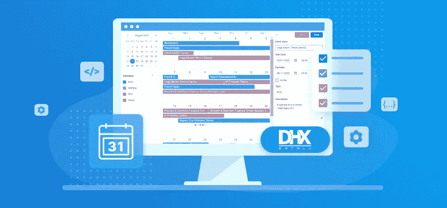
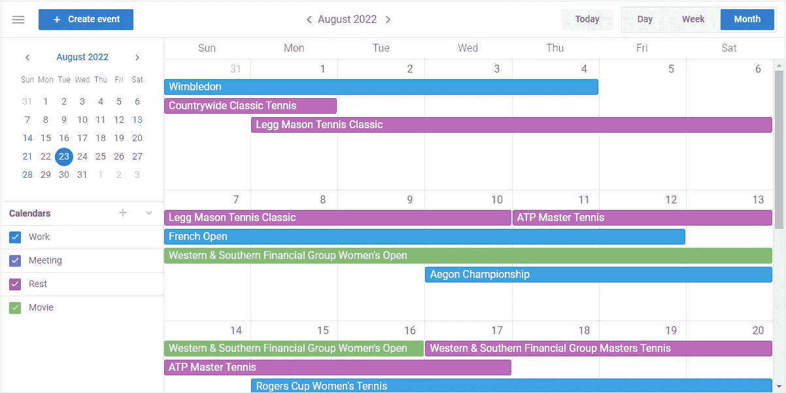
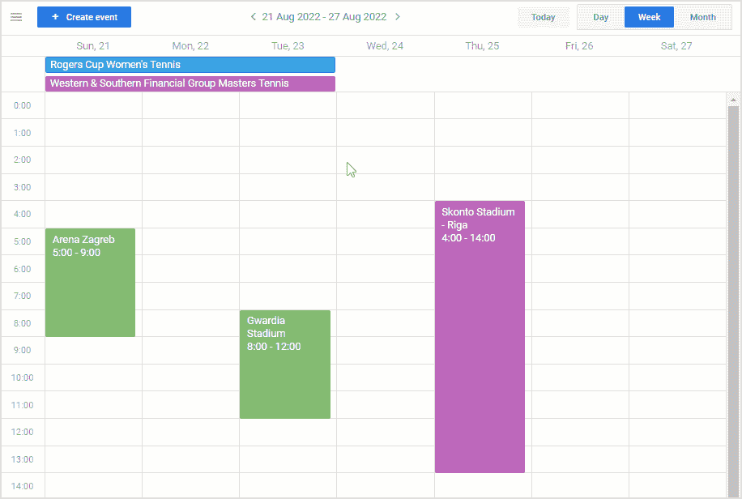
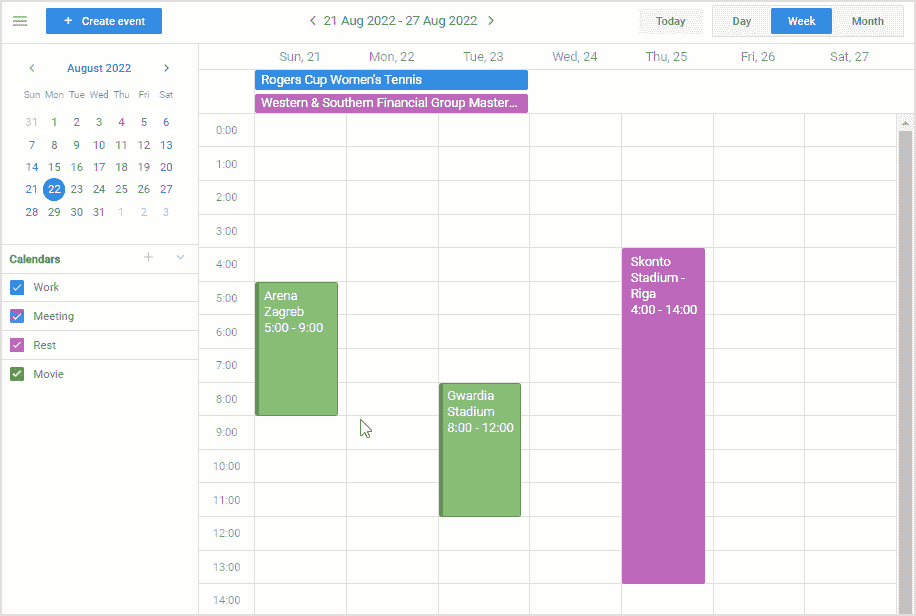
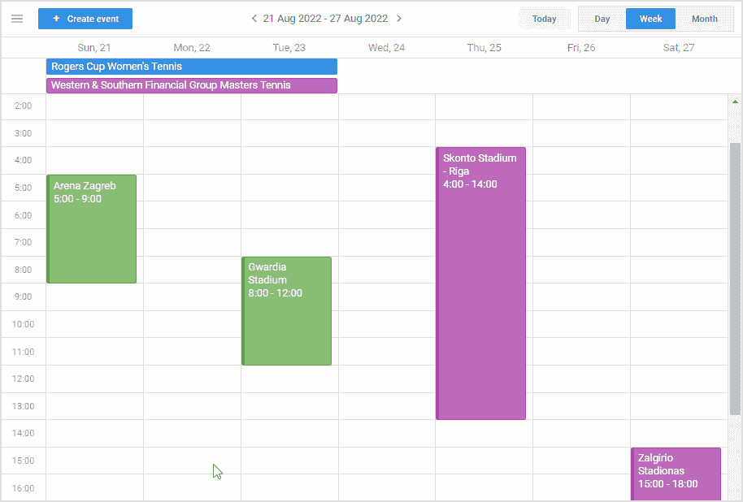
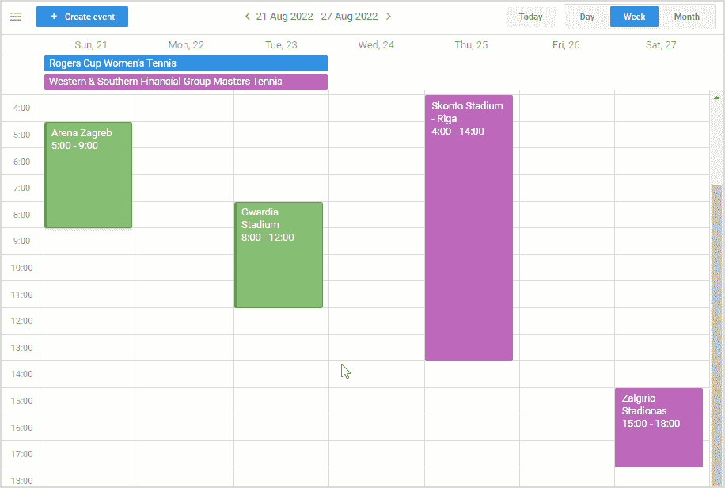
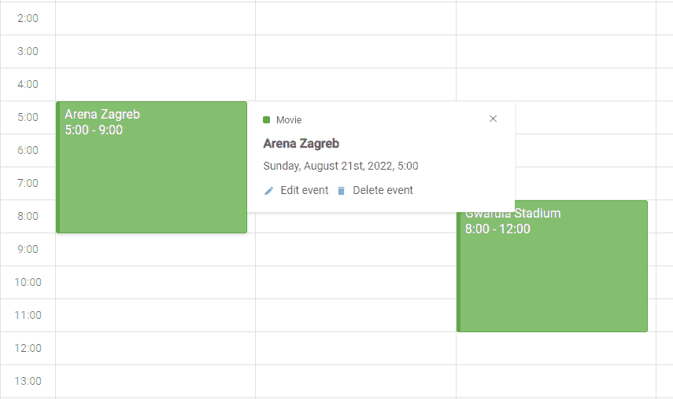
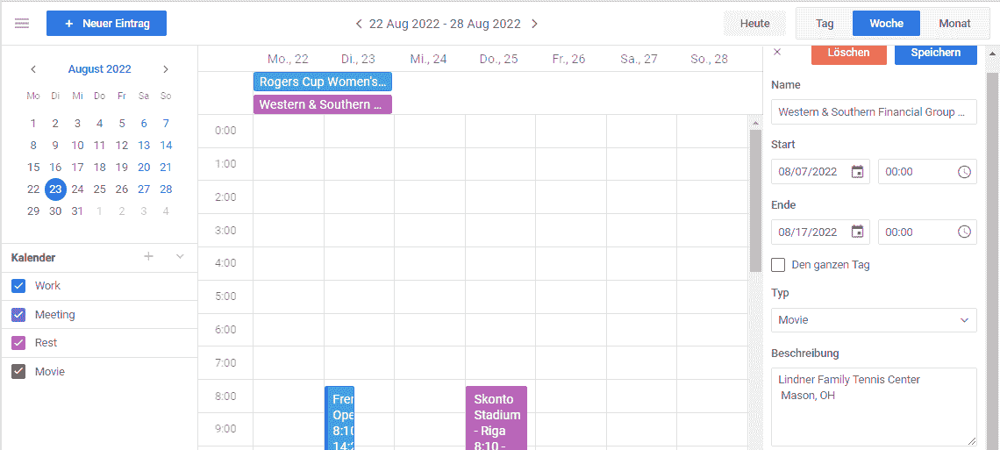
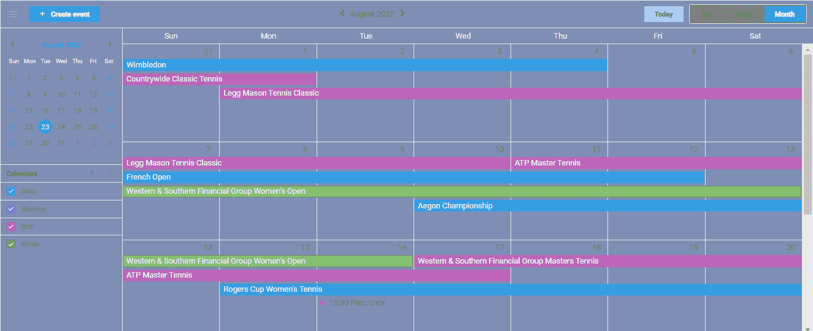

# DHTMLX 活动日历:用于高效活动规划的新 JavaScript 库

> 原文：<https://javascript.plainenglish.io/dhtmlx-event-calendar-new-javascript-library-for-productive-event-planning-284adbb0e939?source=collection_archive---------11----------------------->

## DHTMLX 事件日历库的主要特性。

许多公司和企业家求助于使用事件日历来更有效地组织他们的日常活动。难怪这种功能经常包含在生产力应用程序的技术需求中。我们的经验告诉我们，在这种情况下，开发人员需要提供类似于 Google calendar 这样的知名规划服务。这就是我们全新的 [JavaScript 活动日历](https://dhtmlx.com/docs/products/dhtmlxEventCalendar/)的全部内容。

在本文中，我们将重点介绍 DHTMLX 事件日历库的主要特性。

# 直观的用户界面便于活动管理

没有必要进行研究来确定用户友好的 UI 在任何 web 应用程序的成功中起着重要的作用。有了 DHTMLX Event Calendar，我们受到了 Google Calendar 的用户界面设计的启发。我们希望它能带来令人耳目一新的简单直观的用户体验。

# DHTMLX 事件日历的结构元素及其核心特性

我们的事件日历的结构由 5 个关键部分组成:工具栏、侧边栏、时间表网格、编辑器和弹出窗口。

现在我们可以更详细地考虑所有日历元素及其功能。

## 工具栏

工具栏位于日历的顶部。它提供了一组用于处理日历操作的控件。

首先，工具栏允许使用相应的“创建事件”按钮添加任意数量的事件，包括多日和叠加(一个单元格中的几个事件)事件。有三种预定义的查看模式(日、周、月)，旨在以所需的方式查看所有计划的活动。在工具栏的中心，您可以找到一个下拉的日期选择器，用于在所有视图模式下导航日历。除此之外，工具栏还有“今天”按钮来查看当天应该发生的事情，还有“汉堡包”图标来显示/隐藏侧边栏。

## **侧边栏**

DHTMLX Event Calendar 通过位于界面左侧的侧边栏提供了用多个日历计划事件的可能性。这是集成到我们组件中的最需要的特性之一。

在侧边栏中，用户有机会创建新的日历和管理现有的日历。另一个很棒的功能是，通过选中/取消选中相应的复选框，可以在属于特定日历的时间表网格中显示/隐藏事件。就像在工具栏中一样，您可以在这里找到用于更好的日历导航的日期选择器选项。

## **时刻表网格**

时间表网格是我们日历的核心，用于显示事件并与之交互。除了工具栏中的“创建事件”按钮，时间表网格还提供了两种添加新事件的额外方法:

*   双击一个空单元格，
*   用鼠标左键点击一个空单元格，向下拖动光标(并通过这样做来设置事件持续时间)。

在时间表网格中，你也可以通过拖拽来改变你的计划。只需将事件拖到需要的日期，并调整其大小以设置新的时间界限。值得一提的是，根据所选的视图模式，网格可以有垂直或水平时标。

## **编辑**

活动策划很少会没有一些复杂和意想不到的曲折。这就是为什么 DHTMLX 事件日历有一个内置的编辑器。它包括一系列组成事件内容的字段和控件(名称、开始/结束日期(持续时间)、日历类型、描述)。

要打开编辑器菜单，需要双击要更新的事件。

## **弹出窗口**

弹出窗口是我们日历的又一个辅助工具。它用于查看特定任命的一般信息。

此外，它还包括用于在所选事件中打开编辑器或删除编辑器的按钮。当点击所需的事件时，弹出窗口出现在时间表网格中。

# 丰富的配置和定制机会

与所有现有的 DHTMLX 产品类似，新的事件日历以各种配置和定制选项而闻名。利用现代而简单的 API，您可以以所需的方式配置所有日历元素。例如，您可以为整个日历或特定事件启用只读模式，向编辑器添加新控件，嵌入自动保存选项，更改区域设置，等等。

当谈到定制功能时，您可以通过定制模板来更改各种日历部分(事件、弹出窗口、时间刻度标题)的外观和行为。日历风格化几乎不会引起任何问题，因为我们的新库为此提供了一组易于使用的 CSS 变量。您还可以使用 3 种内置主题(材质、柳树、深色)来定义整体日历设计。

# 与其他 DHTMLX 组件的流畅工作

在活动日历的开发过程中，我们的团队使用了与其他最新 DHTMLX 产品相同的方法——[看板](https://dhtmlx.com/docs/products/dhtmlxKanban/)和[待办事项列表](https://dhtmlx.com/docs/products/dhtmlxTodo/)。如果您仔细查看这些库的文档页面和示例，您肯定会注意到 API 和 UI 设计中的许多相似之处。实际上，它应该帮助 web 开发人员在一个应用程序中应用所有三个组件，而不会遇到任何兼容性问题。

# 结论

综上所述，我们可以说，当需要在 web 项目中快速添加类似 Google 的事件日历时，DHTMLX 事件日历可以成为不可或缺的帮手。这个简单而有效的工具可以跟踪即将到来的事件、截止日期和里程碑，其核心功能是现成的。如果您想在自己的项目中尝试一下，只需下载一个[免费 30 天试用版](https://dhtmlx.com/docs/products/dhtmlxEventCalendar/download.shtml)。

***来源:*** [*发布文章*](https://dhtmlx.com/blog/meet-dhtmlx-event-calendar-v1-0/) *发布于 2022 年 9 月 1 日，在 DHTMLX 博客上*

*更多内容看* [***说白了。报名参加我们的***](https://plainenglish.io/) **[***免费每周简讯***](http://newsletter.plainenglish.io/) *。关注我们关于* [***推特***](https://twitter.com/inPlainEngHQ) ，[***LinkedIn***](https://www.linkedin.com/company/inplainenglish/)*，*[***YouTube***](https://www.youtube.com/channel/UCtipWUghju290NWcn8jhyAw)*，* [***不和***](https://discord.gg/GtDtUAvyhW) *。对增长黑客感兴趣？检查出* [***电路***](https://circuit.ooo/) *。***