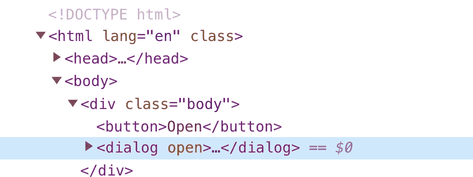

# 用<dialog>元素构建一个对话框</dialog>

> 原文：<https://javascript.plainenglish.io/build-a-dialog-box-with-dialog-efb08952551d?source=collection_archive---------10----------------------->

## 关于构建对话框或模式的教程。


Photo by [Jouwen Wang](https://unsplash.com/@sodacheese?utm_source=medium&utm_medium=referral) on [Unsplash](https://unsplash.com?utm_source=medium&utm_medium=referral)

不管你构建了多少次 UI 组件，总有一些事情不太容易做到，例如，对话框，也就是模态对话框。在本文中，我们将看到构建对话的挑战，然后看看是否有简单的方法。

## 页面内容上方

这是一切开始的地方:

```
<**div** class='body'>
  <**button**>Open</**button**>
  <**div** class='dialog'>Dialog</**div**>
</**div**>
```

有一个按钮，如果我们点击它，我们会打开一个对话框。我们可以应用一些 CSS 代码，使对话框看起来像是从屏幕上弹出来的，我们可能需要使用一些 JavaScript 代码来触发 open 事件。我们还需要在开始时让观众看不到这个对话。如果我们想有一个快速旋转的对话框，这可能就是所有的工作。

然而，如果你想把它变成一个可重用的组件，它缺少一些东西。一个主要问题是，对话内容需要显示在所有内容之上。例如，对话框背景需要覆盖原始页面内容。好了，这里我们可以将对话框的`z-index`设置得高一点。

但是无论你如何设置对话框`z-index`，你很快就会意识到这是一个不可能完成的任务:a)有一个 body 元素已经预置了高`z-index`，比如一个下拉面板；b)有一个具有预定宽度和高度的边界可滚动体(通过`overflow: scroll`)。当您遇到这些情况时，您无能为力，除非我们可以稍微调整 HTML 的结构，例如重新定位对话框元素，使其不在内容元素中:

```
<**div** class='body'>
  <**button**>Open</**button**>
</**div**>
<**div** class='dialog'>Dialog</**div**>
```

虽然看起来很微妙，但现在对话的更高的`z-index`会将它提升到主体内所有内容之上。有了这种结构上的改变，主体中的任何东西都不能再覆盖对话内容了。不错！

## 保留旧的 HTML

现在，我们可能会想，有没有一种方法可以自动转换 HTML 的结构，这样我们就可以像以前一样继续编写对话框代码？

这就是一些实用组件背后的想法，比如 React 社区的`Portal`:

```
<**div** class='body'>
  <**button**>Open</**button**>
  <Portal>
    <**div** class='dialog'>Dialog</**div**>
  </Portal>
</**div**>
```

通过用`Portal`包装对话框代码，对话框代码可以保存在页面块中。当对话框将要被创建时，它将被物理地放置在 body div 之外。因此，有一些幕后的工作为你实现这一点。

顺着这个思路，更好的是现在 HTML 也自带了自己的元素`dialog`。只需用`dialog`替换`Portal`即可。有什么区别？最主要的一点是，你不需要使用 React。

```
<**div** class='body'>
  <**button**>Open</**button**>
  <**dialog**>
    <**div** class='dialog'>Dialog</**div**>
  </**dialog**>
</**div**>
```

## 什么是`dialog now`

如果是第一次听说`dialog`元素，可以看看这个教程:

这里是文档[https://developer . Mozilla . org/en-US/docs/Web/HTML/Element/dialog](https://developer.mozilla.org/en-US/docs/Web/HTML/Element/dialog)。

真正令人惊奇的是，如果你打开开发面板看一看 HTML 的结构:



即使在 DOM 中物理地创建了它，它仍然存在于 body 元素中。所以现在这个对话框基本上可以作为一个常规的 DOM 元素来工作，并且作为一个对话框来操作，而不需要我们知道所有的麻烦。如果你今天刚开始接触网络技术，很容易就能学会并使用它。

所以，这里是`dialog`元素。您可以按常规方式设置它的样式，或者向它添加任何动画:

```
dialog {
  padding: 50px;
  border-radius: 5px;
  border: 0;

 &**::backdrop** {
   background: rgba(0, 0, 0, 0.4);
 }

 &**[open]**, 
 &**::backdrop** {
  animation: show 500ms ease;
 }
}
```

# 摘要

如果我们还没有开始使用`dialog`元素，也许是时候开始使用它了，尤其是在新的或者小的项目中。`dialog`元素是一个模仿对话框行为的本地 HTML 元素。

*更多内容看* [***说白了就是 io***](https://plainenglish.io/) *。报名参加我们的* [***免费周报***](http://newsletter.plainenglish.io/) *。关注我们关于* [***推特***](https://twitter.com/inPlainEngHQ) ， [***领英***](https://www.linkedin.com/company/inplainenglish/) *，*[***YouTube***](https://www.youtube.com/channel/UCtipWUghju290NWcn8jhyAw)*[***不和***](https://discord.gg/GtDtUAvyhW) *。对增长黑客感兴趣？检查* [***电路***](https://circuit.ooo/) *。**