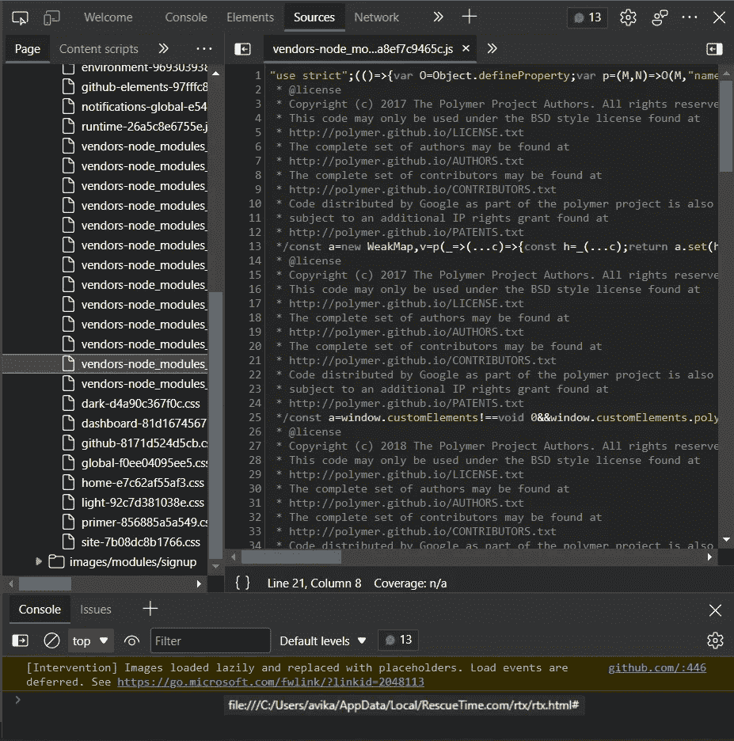

# 用户如何从浏览器控制台修改您的 JavaScript 变量

> 原文：<https://javascript.plainenglish.io/did-you-know-that-users-can-modify-your-javascript-variables-from-browser-console-e7537ce85d62?source=collection_archive---------7----------------------->

## 你不会相信弄乱客户端脚本有多容易。如果您也在前端使用 JS 进行后端调用，请继续阅读！

Photo by [Mitchell Luo](https://unsplash.com/es/@mitchel3uo?utm_source=medium&utm_medium=referral) on [Unsplash](https://unsplash.com?utm_source=medium&utm_medium=referral)

几乎所有现在建立的网站都有一些 JavaScript 代码在里面运行。你不会相信弄乱这些脚本有多容易。如果您也使用客户端 JS 进行后端调用，请继续阅读！

大多数浏览器中的 JavaScript(在 MS Edge 和 Chrome 中测试)以这样的方式管理其内存分区，即显示的 HTML 文件中的`console`和其余脚本将在相同的环境中运行。如果您想作为开发人员测试一些东西，比如变量的最终值，这是很好的。但是它会导致一些你可能不喜欢的用户行为。

尤其是因为你所有的客户端代码都可以在开发者选项的“源代码”标签中轻松访问。看看[GitHub.com](https://github.com)的客户端源代码:

Client-side Source Code of GitHub’s website

我将向您展示一些可以演示问题的场景，然后讨论有助于降低相关风险的最佳实践。

我将使用`setTimeout`来模拟代码任何部分执行中的任何延迟。如果您的 web 应用程序进行 API 调用或执行某种复杂的处理，执行时间可能长达 1 秒，那么您的情况可能与这里显示的情况相匹配。

# 在 HTML 中访问浏览器变量