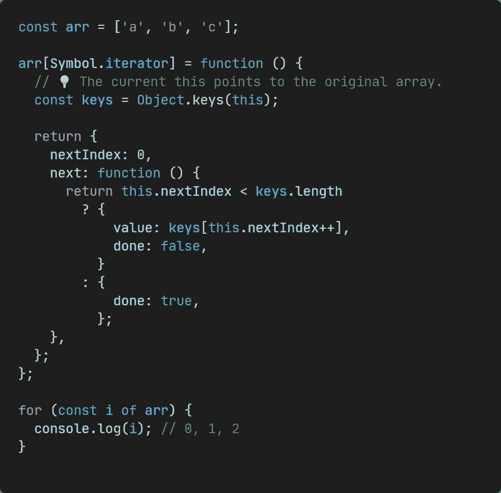

# “for…of”和“for…in”的区别

> 原文：<https://javascript.plainenglish.io/difference-between-for-of-and-for-in-7244104133bf?source=collection_archive---------11----------------------->

## 它们看起来很像，那么如何正确使用呢？

Photo by [Etienne Boulanger](https://unsplash.com/@etienneblg?utm_source=medium&utm_medium=referral) on [Unsplash](https://unsplash.com?utm_source=medium&utm_medium=referral)

`for...in`和`for...of`语句都可以迭代某些东西，但是它们之间很容易混淆。

在本文中，我会先说明它们在遍历不同类型数据时的特点是什么，然后**分析它们的本质**，这样你才能真正分辨出它们之间的区别，开始吧！

# 排列

当它们被用来迭代一个数组的时候，`for...in`会返回数组的索引，但是请注意，**这里会被转换成字符串类型**，这通常违背了我们的理解，容易造成 bug。

当使用`for...of`时，它返回数组的每一项。当我们使用`Array.prototype.entries()`得到一个新的数组迭代器对象(它包含数组中每一项的键/值对)时，我们也可以对它使用`for...of`，那么我们得到的数组下标就是一个数值类型。

# 普通物体

可以看到，`for...in`可以直接迭代普通对象的属性名，而`for...of`不行。

如果我们想使用`for..of`来迭代一个对象的属性，我们可以使用`Object.keys()`方法来获得一个对象属性的数组。

# Unicode 字符串

`for ... of`支持遍历 Unicode 字符串，而`for...in`不支持。

# 重要结论

`for...in`语句迭代**对象的可枚举、非符号属性**，而`for...of`语句迭代**可迭代对象定义要迭代的值。**

我们根据结论来分析一下`for...in`和`for...of`。

## 为了…在

这意味着原型链上的可枚举属性也可以被`for...in`找到，但是我们也可以在循环中使用`Object.prototype.hasOwnProperty()`来过滤掉那些继承的属性。

因此，不建议使用`for...in`循环遍历数组。更适用的场景是对于**调试**，可以检查对象的属性是否如预期存在。

## 为了…的

`for...of`迭代依赖于 [**可迭代协议**](https://developer.mozilla.org/en-US/docs/Web/JavaScript/Reference/Iteration_protocols) **。**如果一个对象实现了 iterable 协议，那么`for...of`可以用在它上面。

要成为可迭代的，一个对象必须实现`@@iterator`方法。这意味着一个对象(或其原型链上的某个对象)必须有一个带有关键字`@@iterator`的属性，可以通过常量 [**符号访问。**](https://developer.mozilla.org/en%20-CN/docs/Web/JavaScript/Reference/Global_Objects/Symbol/iterator)

JavaScript 中也有一些内置的 iterable 对象如 String、Array、TypedArray、Map 和 Set。

所以当遍历数组时，我们得到数组的每一项，这是内置的`Array.prototype[@@iterator]()`逻辑。我们也可以改变它来获得不同的效果，虽然通常这没有实际用途。

你可以看到我改变了它的内置逻辑来得到数组的下标。

*感谢阅读。如果你喜欢这样的故事，想支持我，请考虑成为* [*中等会员*](https://medium.com/@islizeqiang/membership) *。每月 5 美元，你可以无限制地访问媒体内容。如果你通过* [*我的链接*](https://medium.com/@islizeqiang/membership) *报名，我会得到一点佣金。*

你的支持对我来说很重要——谢谢。