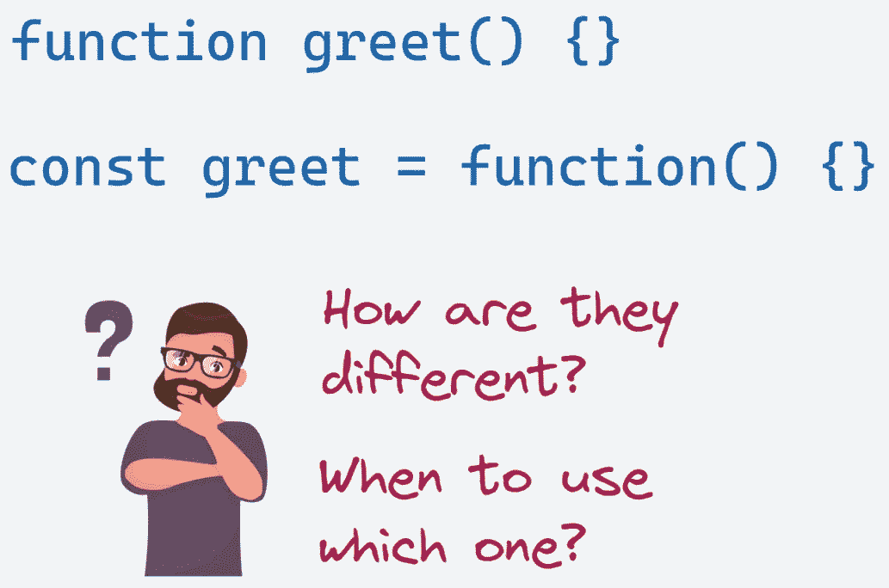
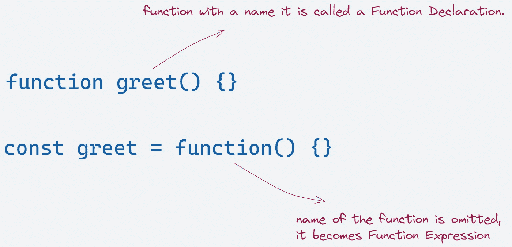
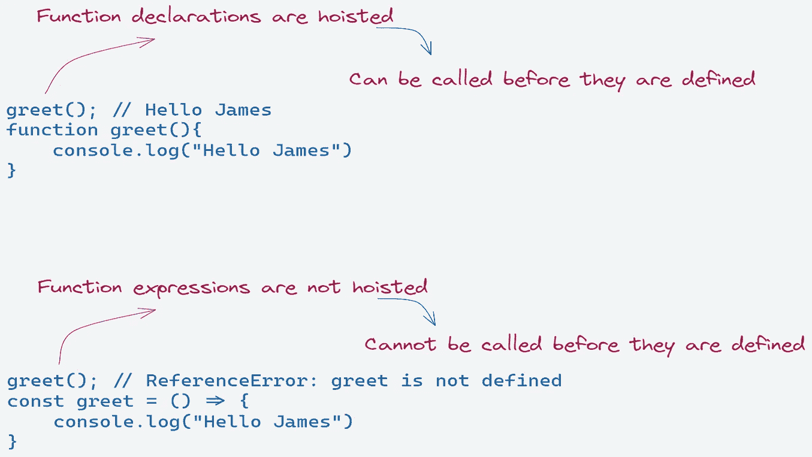

# JavaScript 中函数声明和函数表达式的区别

> 原文：<https://javascript.plainenglish.io/difference-between-function-declaration-and-function-expression-22601bc7d28d?source=collection_archive---------8----------------------->

了解函数声明和函数表达式之间的区别，以及何时使用它们。



我们已经熟悉了定义函数的两种方式:`function greet() {}`和`const greet = function() {}`。

但是它们有什么不同，什么时候使用其中一个？大多数开发人员不确定使用哪一个，并且经常倾向于使用错误的一个。让我们试着在这篇文章中找出这些答案。

# 主要差异

## 1.具名 vs 匿名



当你创建一个有名字的函数时，它被称为**函数声明。**

```
function greet() {}
```

这里的`greet`是函数的名字。

当函数名被省略时，它变成**函数表达式**。因为函数没有名字，所以叫做匿名函数。

```
const greet = function() {}
```

这里该功能被分配给`greet`变量。您也可以对函数表达式使用箭头函数。

```
const greet = () => {}
```

## 2.提升



简单地说，**托管**指的是变量和函数在代码顶部的可用性，而不是在它们被创建的时候。

函数声明被提升到结束函数或全局范围的顶部，这意味着可以在定义之前调用。

考虑下面的例子

```
greet(); // Hello Jamesfunction greet(){
    console.log("Hello James")
}
```

函数声明`greet`是悬挂的，所以在定义之前就可以调用。

函数表达式没有被提升，这意味着它只有在执行流到达时才被创建，并且从那时起就可以被使用。

我们试着用一个例子来理解这一点。

```
greet(); // ReferenceError: greet is not definedconst greet = () => {
    console.log("Hello James")
}
```

函数表达式`greet`只有在执行到的时候才会创建。所以它会导致一个错误。

# 那么什么时候使用每一个呢？

使用函数表达式是一个很好的实践，因为它使代码更易于维护。由于函数表达式没有被提升，所以可以确保在定义它之前不会调用它，从而使调试更容易。

函数表达式的一个很好的用例是回调函数。作为参数传递给其他函数的函数称为回调。

考虑下面的例子。

```
function filter_odd(value) => { 
   **return** value % 2 == 1;
}**let** odd_numbers = numbers.**filter**(filter_odd);
```

在这里,`filter_odd`将对您的整个应用程序可用，这是不需要的。只在`filter`函数内部需要。我们可以通过将回调函数定义为函数表达式来改进这一点。

```
**let** odd_numbers = numbers.**filter(**(value) => { 
   **return** value % 2 == 1;
});
```

然而，在某些情况下，函数声明是有用的。一种是当你想在整个代码中使用你的函数时，或者当你需要递归调用一个函数时。

# 结论

当您希望函数在整个代码中都可用时，应该使用函数声明。当您想要创建匿名函数或想要控制函数的执行时间时，应该使用函数表达式。

希望这篇文章有助于让区别变得清晰。感谢您的阅读。

*更多内容请看*[***plain English . io***](https://plainenglish.io/)*。报名参加我们的* [***免费周报***](http://newsletter.plainenglish.io/) *。关注我们上*[***Twitter***](https://twitter.com/inPlainEngHQ)[***LinkedIn***](https://www.linkedin.com/company/inplainenglish/)*[***YouTube***](https://www.youtube.com/channel/UCtipWUghju290NWcn8jhyAw)**和* [***不和***](https://discord.gg/GtDtUAvyhW) *对成长黑客感兴趣？检查* [***电路***](https://circuit.ooo/) ***。*****