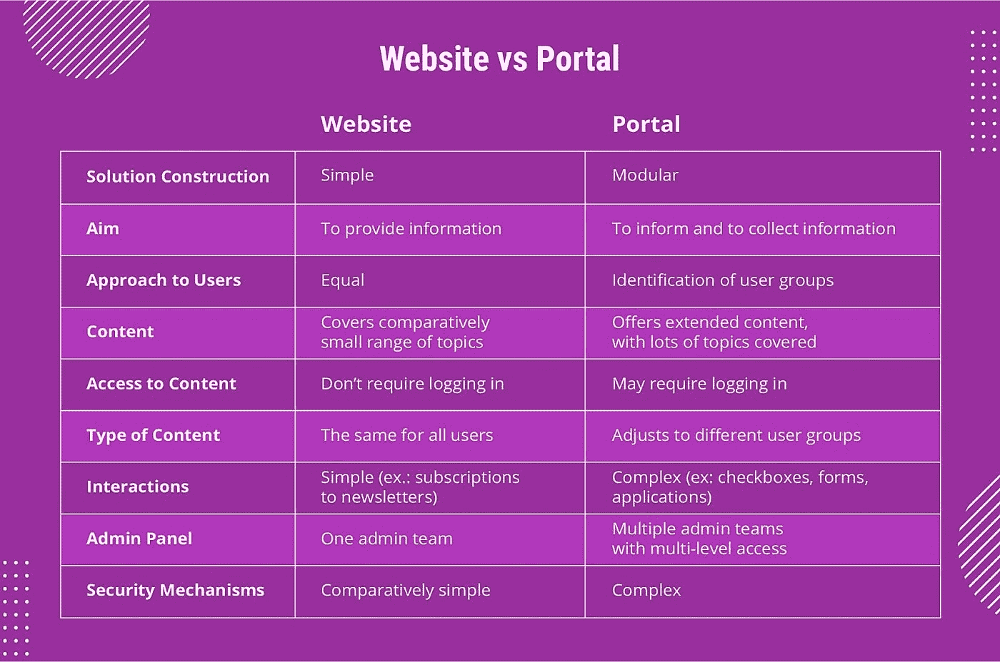

# 网站与门户网站:主要区别

> 原文：<https://javascript.plainenglish.io/differences-between-websites-web-portals-53df5ced2bb3?source=collection_archive---------26----------------------->

## 网站和门户网站的主要区别。

Photo by [Campaign Creators](https://unsplash.com/@campaign_creators?utm_source=medium&utm_medium=referral) on [Unsplash](https://unsplash.com?utm_source=medium&utm_medium=referral)

没有网站，企业就无法运作。在成千上万的人面前，它帮助企业传达他们的意图和目标。你可以通过网站建立在线形象来接触你的目标受众。

术语[网站](https://www.wingstechsolutions.com/service/web-development/)和门户网站经常被混淆，因为两者都提供了很好的平台选择，但是它们用于非常不同的目的。网站和门户网站都是基于网络的，所以它们是不同的术语，但相互关联。网站是网页的集合，而门户网站提供对万维网和几种服务的访问。

与网站相反，门户网站允许用户被细化到特定的用户群，并限制他们可以接触到的用户数量。在这里，我们将讨论网站和门户网站的区别。

## 什么是网站？

典型地，网站包括在互联网上托管的几个网页。任何用户都可以通过网址轻松访问网站。网站上的内容在全球范围内都是可见的，供公众使用。对于访问它的个人来说，这些内容始终保持不变，访问这些页面不需要登录。网站上的用户可以执行各种任务，如点击链接、输入电子邮件等等。

关于特定行业、产品、公司或其他任何东西的网站都可以在这里找到。这种性质的网站旨在告知和教育他们的访问者关于他们的产品、行业和服务。在这种情况下，可能不需要个性化数据库。因此，在这个网站上没有提到它。

## 什么是门户网站？

门户网站是用于管理知识和数据的系统，使各种公司和组织能够构建、共享、交换和重用他们的数据。门户网站是互联网上的私有位置。可以通过提供 id 和密码以及唯一的 URL 来访问门户网站。其中包含的信息是高度安全和受保护的。用户可以选择接口是公共的还是私有的，这是特定于他们的。

用户可以通过 web 门户访问多个角色。这些门户以动态内容为特色，内容经常变化。一个人对其整体内容的理解与另一个人不同。换句话说，根据组成员的设置，包含的知识和数据对每个用户来说可能是唯一的。门户网站从各种不同的来源收集内容。

## 网站和门户网站的主要区别

## 结论

根据你经营的业务和你做的在线任务，你可能会找到不同的答案。如果你想增加销售额和吸引新客户，你可能需要一个网站。如果您希望提高客户忠诚度、增加品牌认知度并留住现有客户，门户网站是一个合理的选择。

如果您想创建一个与合作伙伴或供应商协作的中心，web 门户也是正确的选择。如果您仍然不确定自己的决定，或者对自己的选择充满信心，只是需要尽快找到一个可靠的实施合作伙伴，您也可以联系 [Wing Tech 的团队](https://about.me/wingstechsolutions)。我们很乐意帮助你！

*更多内容看* [***说白了。报名参加我们的***](http://plainenglish.io/) **[***免费周报***](http://newsletter.plainenglish.io/) *。在我们的* [***社区获得独家访问写作机会和建议***](https://discord.gg/GtDtUAvyhW) *。***