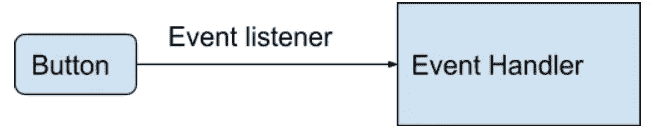
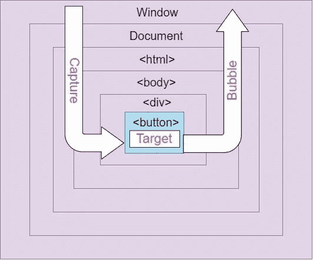
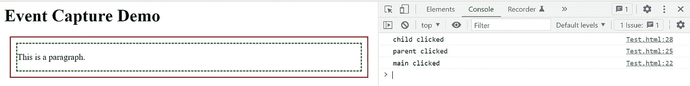
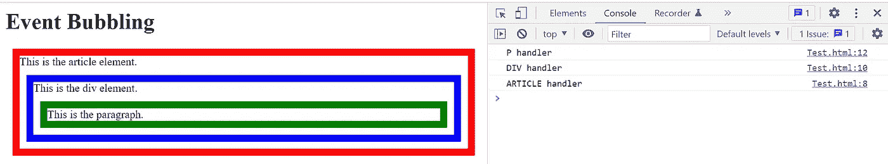

# JavaScript 中事件的不同阶段

> 原文：<https://javascript.plainenglish.io/different-phases-of-events-in-javascript-901ed0b23999?source=collection_archive---------2----------------------->

以及他们的一切


Photo by [Paula Palmieri](https://unsplash.com/@paulapalmieri?utm_source=medium&utm_medium=referral) on [Unsplash](https://unsplash.com?utm_source=medium&utm_medium=referral)

我们与网站交互时发生的任何动作都是 JavaScript 事件。这些操作包括按键盘上的一个键、在选择框中选择一个选项、提交表单、移动鼠标光标等等。它们还可以包括单击链接或按钮。在极少数情况下，如在页面加载和卸载事件期间，浏览器可能是启动事件的浏览器。

本文将介绍 JavaScript 事件在整个生命周期中的许多阶段。我们将举几个例子，看看它们是如何在网站上使用的，以帮助你理解不同的阶段。

## JavaScript 事件:概述

事件是在浏览器中发生的事情，要么是因为用户，要么是因为浏览器本身启动了它们。以下是网站上可能发生的一些典型情况:

*   当页面完全加载后
*   当用户按下按钮时
*   用户完成并提交表单
*   用户按下键盘上的一个键

## 事件处理程序和事件侦听器

当用户点击按钮或按键时，一个事件被启动。这些事件分别称为按键事件或点击事件。当事件发生时，一个称为事件处理程序的 JavaScript 函数被激活。通过向响应接口添加事件侦听器，元素可以等待并“侦听”事件的发生。

将事件绑定到元素有三种可能性:

*   内联事件的处理程序
*   事件处理程序的属性
*   事件监听器

让我们看一个简单的例子:单个元素的事件触发由一个事件侦听器处理；这是按钮:



## 事件流

在上一节中，我们学习了 javascript 事件的基础知识。现在让我们来看看浏览器处理针对嵌套元素的事件的步骤。事件流是指在网页上接收事件的顺序。

让我们用一个例子来更好地理解它。考虑单击嵌套其他项目的按钮或 div。目标元素必须首先在每个父元素上启动 click 事件，从顶部的全局窗口对象开始，然后才能单击它。一般来说，每个 HTML 元素都是 window 对象的子元素。

## 事件流的三个阶段

如果我们有许多嵌套的对象处理同一个事件，我们会弄不清哪个事件处理程序会先触发。在这种情况下，了解事件的进展是很有用的。

JavaScript 事件的生命周期有三个不同的阶段:

1.  **捕获阶段**
2.  **目标阶段**
3.  **冒泡阶段**

通过查看下图，您可以更好地理解事件传播生命周期。



Source: [blog.bitsrc.io](https://blog.bitsrc.io/event-bubbling-and-capturing-in-javascript-6bc908321b22)

## 捕获阶段

事件从事件捕获阶段最不具体的元素开始，向下移动到最具体的元素。

在捕获过程中:

*   如果元素的最外层祖先`<html>`有一个为捕获阶段注册的 click 事件处理程序，浏览器将运行。
*   然后对随后的`<html>`元素重复该过程，等等，直到到达实际上是所选元素的直接父元素的元素。

```
<html>
  <head>
    <title>Event Capture Demo</title>
  </head>
  <body>
    <h1>Event Capture Demo</h1>
    <article id="main">
      <div id="parent" style="border: 2px solid brown; margin: 10px;">
        <div id="child" style="border: 2px dashed green; margin: 10px;">
          <p>This is a paragraph.</p>
        </div>
    </article>
  </body>
</html>

<!--- event capture --->
<script type="text/javascript">
  var ancestor = document.getElementById("main");
  var parent = document.getElementById("parent");
  var child = document.getElementById("child");
  ancestor.addEventListener("click", function(event){
    console.log("main clicked");
  });
  parent.addEventListener("click", function(event){
    console.log("parent clicked");
  });
  child.addEventListener("click", function(event){
    console.log("child clicked");
  });
</script>
```



当您单击前面示例中的`<p>`元素时，所有父元素的 click 事件处理程序都被调用，从最外层开始并在目标元素`<p>`:`**<html>**`**->**`**<body>**`**->**`**<article>**`**->**`**<div>**`**->**`**<p>**`**。**

## 目标阶段

生成嵌套最深的事件的元素是目标元素。它的网址是`event.target`。该事件由目标元素或最初引起它的元素接收。

目标阶段开始时:

*   如果在目标属性上注册了 click 事件，浏览器将为该事件运行事件处理程序。
*   如果 bubbles 为真，所选元素的直接父元素首先接收事件，然后是下一个，直到到达`<html>`元素。如果 bubbles 为 false，则目标的任何祖先都不会收到该事件。

## 气泡阶段

捕捉是气泡阶段的反义词。根据事件冒泡模型，事件从最具体的元素开始，然后向上移动到最不具体的元素(文档甚至窗口)。

在冒泡阶段，发生了与捕获阶段完全相反的情况:

*   如果元素的直接父级有一个为冒泡阶段注册的 click 事件处理程序，浏览器将运行
*   该过程随后被重复直到`<html>`元素，然后对于每个随后的直接祖先元素。

```
<!--- Event bubbling--->
<html>
<head>
<title>Event Bubbling</title>
</head>
<body onclick="console.log('The body handler is here!');">
<h1>Event Bubbling</h1>
<article style="border: 10px solid red; margin: 10px;" id="ancestor" onclick="console.log('ARTICLE handler'); event.stopPropagation()">
    This is the article element.
    <div style="border: 10px solid blue; margin: 10px;" id="parent" onclick="console.log('DIV handler')">
        This is the div element.
        <p style="border: 10px solid green; margin: 10px;" id="child" onclick="console.log('P handler')">
            This is the paragraph.
        </p>
    </div>
</article>
</body>
</html>
```



当您单击上面示例中的`<p>`元素时，所有父元素的 click 事件处理程序都被调用，从最外层开始，并向内部传播到目标元素`<p>`。以下是流程:`<p>`**->**`**<div>**`**->**`**<article>**`**->**`**<body>**`**->**`**<html>**`**。**

## 结论

本教程告诉我们 JavaScript 的事件冒泡和捕获如何有效地处理 web 应用程序中的事件。通过了解事件流以及捕获和冒泡是如何操作的，您可以改进 web 应用程序中的事件处理。

```
Want to Connect?

Connect with me on [LinkedIn](https://www.linkedin.com/in/gouravkajal/).
```

感谢阅读！

*更多内容看* [***说白了就是***](https://plainenglish.io/) *。报名参加我们的* [***免费每周简讯***](http://newsletter.plainenglish.io/) *。关注我们* [***推特***](https://twitter.com/inPlainEngHQ) ， [***领英***](https://www.linkedin.com/company/inplainenglish/) *，*[***YouTube***](https://www.youtube.com/channel/UCtipWUghju290NWcn8jhyAw)*，* [***不和***](https://discord.gg/GtDtUAvyhW) *。对增长黑客感兴趣？检查出* [***电路***](https://circuit.ooo/) *。*