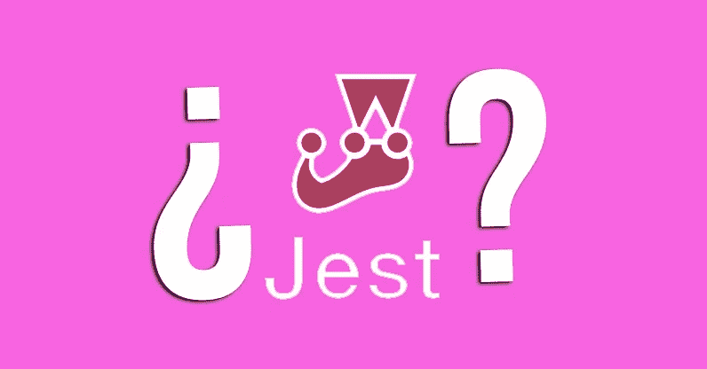
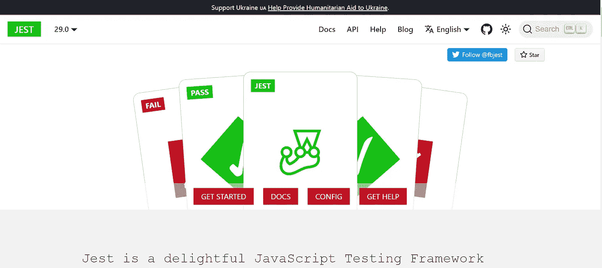
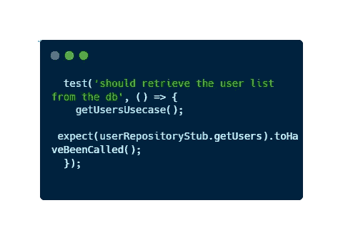
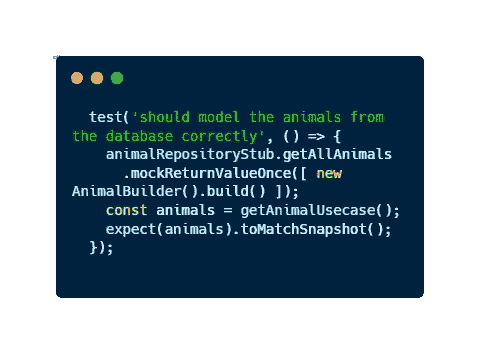
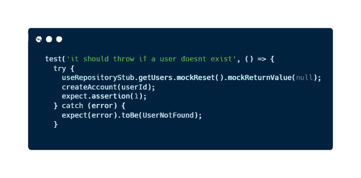

# 5 分钟发现 Jest:一个简单的 JavaScript 测试框架

> 原文：<https://javascript.plainenglish.io/discover-jest-in-3-minutes-a-simple-and-amazing-javascript-testing-framework-11abdc04a9c3?source=collection_archive---------5----------------------->

## 一个非常简单的 JavaScript 测试框架来创建您的测试。



当我开始工作时，我并不期望找到爱情。现在我爱上了一个有用的 JavaScript 测试框架。我在日常工作中使用它，它的**极端简单**让我成为一个更有生产力的开发人员。

如果你在软件开发领域，你**需要了解测试**。在许多情况下，这可能是一项可怕的任务。然而，如果我们使用 JavaScript，我们可以使用一个名为 Jest 的神奇工具。

# 什么是玩笑？

[Jest](https://jestjs.io/) 是一个基于**简单性**的 **JavaScript 测试**框架。它是由脸书建造的。起初，它主要是为基于 React 的应用程序设计的，但也可以用于任何基于 Javascript 的应用程序。例如，我在日常工作中使用它来测试 NodeJS。

它不仅可以与 JavaScript 一起工作，而且如果您正在使用这种语言的一种变体，如 TypeScript、Node、React 或 Angular 等，也可以使用它。

它既快速又安全，并且具有真正有用的特征。此外，它背后有一个非常好的哲学。



Jest [Official Website](https://jestjs.io/)

## 笑话的特点

该框架的一些特性包括:

*   **不需要配置**。仅安装 de 依赖项和代码。
*   **嘲讽支持**。使用 Jest 你可以创建任何类型的模仿。mock 是一个对象，我们可以创建它来模拟真实对象的行为，以测试我们的应用程序。将来我会写一篇文章解释所有关于嘲笑的事情。
*   **测试被隔离**。简而言之，每个测试都在自己的沙箱中运行。这个特性确保了两个测试不会互相干扰。
*   你可以创建快照。快照是一种工具，我们可以用它来确保我们的 UI 不会发生意外的变化。
*   **真正庞大的** [**文档**](https://jestjs.io/docs/getting-started) 。它的[官方文档](https://jestjs.io/docs/getting-started)涵盖了我们可以用这个框架做的所有事情。它有很多解释和例子。

此外，您可以为您的 VS 代码下载 [Jest Runner 扩展](https://marketplace.visualstudio.com/items?itemName=firsttris.vscode-jest-runner)。有了这个扩展，您可以**单独运行和调试您的测试****。如果你打算使用这个框架，这是一个必须的扩展。**

**如果您想了解更多关于 JavaScript 测试的内容，请阅读这篇文章:**

**[](/an-easy-and-general-approach-to-unit-tests-using-javascript-examples-1a29ba58c948) [## 使用 JavaScript 示例进行单元测试的简单通用方法

### 在不到 5 分钟的时间内发现一种可理解的方法，使用 JavaScript 进行单元测试，成为更好的…

javascript.plainenglish.io](/an-easy-and-general-approach-to-unit-tests-using-javascript-examples-1a29ba58c948) 

## 用 Jest 开发的测试示例

我们可以用 Jest 做的一些例子是…



An example of a test with Jest



Matching a snapshot with Jest



Catching a throw using Jest

*你喜欢这些例子吗，你想自己尝试这个框架吗？*

# 只需 3 步即可开始使用 Jest

我们可以通过三个简单的步骤开始使用 Jest:

## 1.用你最喜欢的软件包管理器安装它

```
npm install --save-dev jest
```

## 2.选择一个函数进行测试，并创建一个名为 *.test.js* 的文件。

```
// sum.js
function subtract(firstNumber, secondNumber) {
  return firstNumber - secondNumber; 
}
module.exports = subtract;// subtract.test.js
const subtract = require('./subtract'); test('it should subtract two numbers correctly', () => {
  expect(subtract(2, 2).toBe(0);
});
```

如果你想知道更多关于如何用这个框架测试的信息，你应该查看官方文档。

## 3.通过将命令添加到 package.json 来运行测试

```
// package.json{
  "scripts": {
    "test": "jest"
  }
}
```

要运行，请打开命令行并…

```
npm test
```

而且…不会再有了！您已经看到了使用 Jest 创建和运行测试是多么容易。** 

# **最后的想法**

**测试是软件开发的关键部分。如果我们谈论的是 **web 开发**或者我们将使用 **API** 的系统，这一点就更加重要了。**

**如今，JavaScript 是实现这些发展最常用的语言之一。如果我们在项目中使用 JavaScript，我们可以降低使用 Jest 开发测试的复杂性。**

**如果你想了解更多关于这种奇妙语言的知识，请查阅以下文章:**

**[](/an-easy-and-general-approach-to-unit-tests-using-javascript-examples-1a29ba58c948) [## 使用 JavaScript 示例进行单元测试的简单通用方法

### 在不到 5 分钟的时间内发现一种可理解的方法，使用 JavaScript 进行单元测试，成为更好的…

javascript.plainenglish.io](/an-easy-and-general-approach-to-unit-tests-using-javascript-examples-1a29ba58c948) [](/what-is-javascript-5-basic-features-that-define-this-amazing-language-9e12d273da8) [## JavaScript 是什么？定义这种神奇语言的 5 个基本特征

### 如果你想成为一名 JavaScript 开发者，你需要知道的 5 个基本特性。

javascript.plainenglish.io](/what-is-javascript-5-basic-features-that-define-this-amazing-language-9e12d273da8) 

在本文中，我们看到了对 Jest 的简单而简短的解释，Jest 是一个 JavaScript 测试框架，以其简单性而著称。我希望这个小小的介绍能让你第一次接触 JavaScript 的测试世界。

你通常如何在你的项目中开发测试？在我们测试的时候，你有什么建议可以分享吗？

# 结论👋

谢谢大家！非常感谢您阅读这篇文章。如果您想了解更多关于技术和发展的信息，请不要忘记**关注我**。我很想知道你对此的看法，所以不要花花公子**写在评论里**，我会读给你听。

如果这篇文章帮助你记住了，你可以**为它鼓掌**并与你的战友分享。

# 关于作者🤓

嗨！很高兴见到你！我是**赫苏斯·拉加雷斯**。目前，我是一名后端软件工程师，正在加的斯大学完成我的计算机科学学位。

我的两大爱好是**技术**和**交流**，所以我会抓住一切机会谈论或撰写关于技术的文章。我喜欢把复杂的概念转换成每个人都能理解的简单概念。

# 想要连接吗？📲

📸[**Instagram**](https://instagram.com/jesuslagares_)**|**💼 [**领英**](https://www.linkedin.com/in/jesus-lagares/) **|** 📹[Youtube](https://www.youtube.com/c/Jes%C3%BAsLagares)**|**🐦 [**推特**](https://twitter.com/jesuslagares_)

📩**jesuslagaresgalan@gmail.com**

谢谢！❣️

*更多内容请看*[***plain English . io***](https://plainenglish.io/)*。报名参加我们的* [***免费周报***](http://newsletter.plainenglish.io/) *。关注我们关于*[***Twitter***](https://twitter.com/inPlainEngHQ)[***LinkedIn***](https://www.linkedin.com/company/inplainenglish/)*[***YouTube***](https://www.youtube.com/channel/UCtipWUghju290NWcn8jhyAw)*[***不和***](https://discord.gg/GtDtUAvyhW) *。对增长黑客感兴趣？检查* [***电路***](https://circuit.ooo/) *。*****