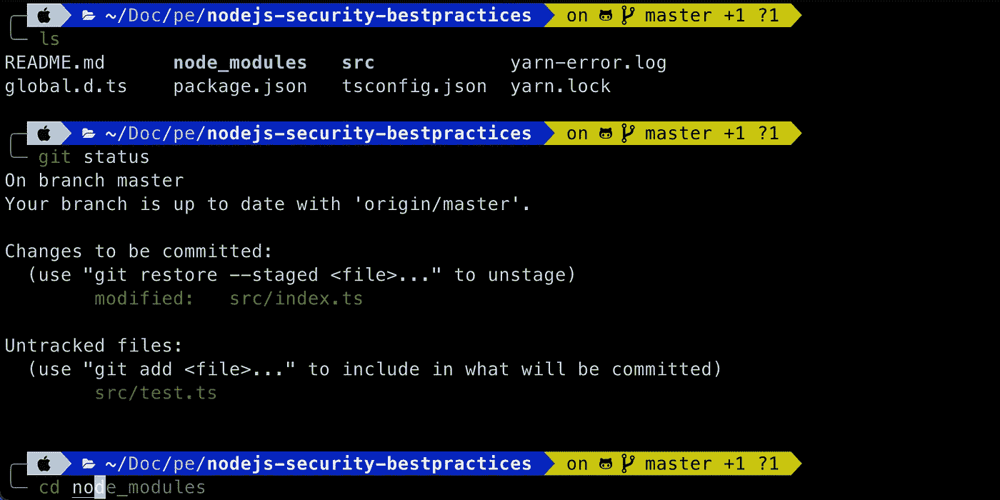
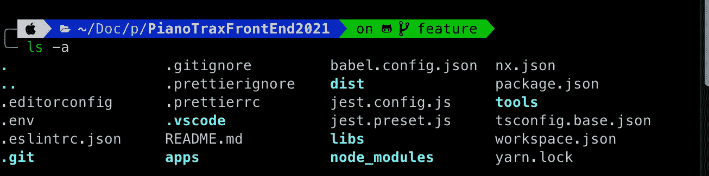
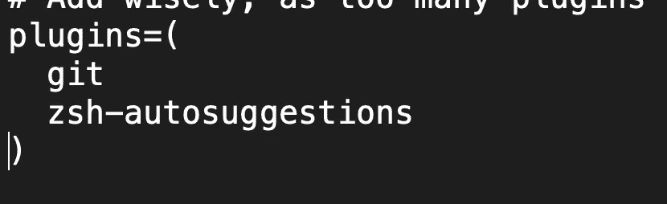
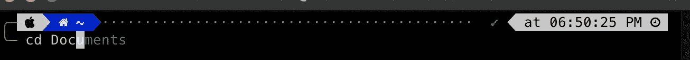

# 丢掉你无聊的终端，让它变得更有用

> 原文：<https://javascript.plainenglish.io/ditch-your-boring-terminal-and-make-it-more-useful-261493aa8400?source=collection_archive---------9----------------------->

## 有一个漂亮的终端，支持自动完成和搜索建议。



Expected design

与流行的观点相反，程序员也是人。我们喜欢美好的事物。终端是我们日常使用的最重要的东西之一。

所以，当你可以让一个无聊的终端变得丰富多彩和有趣时，为什么还要和它生活在一起呢？

今天，我们将这样做。我们开始吧！

# 安装自制软件

如果你用的是 mac，你很可能已经熟悉了[家酿](https://brew.sh/)。它有助于在 macOS 上安装软件。

运行以下命令:

```
/bin/bash -c "$(curl -fsSL [https://raw.githubusercontent.com/Homebrew/install/HEAD/install.sh](https://raw.githubusercontent.com/Homebrew/install/HEAD/install.sh))"
```

在此之前，您可能需要安装 XCode 的 CLI 工具:

```
xcode-select —-install
```

如果出现错误，请运行以下命令进行重置:

```
xcode-select -r
```

就是这样！

# 2.安装 Iterm2

[Iterm2](https://iterm2.com/) 是一款 macOS 的终端仿真器。它是你原来终端的替代品。它附带了一系列很酷的特性和定制，我们稍后会详细介绍

运行以下命令:

```
brew cask install iterm2
```

# 3.安装 ZSH

[ZSH](https://github.com/robbyrussell/oh-my-zsh/wiki/Installing-ZSH) ，也称为 Z shell，是伯恩 Shell (sh)的扩展版本。它有一些高级功能，如

*   自动 cd:只需输入目录名。
*   插件和主题支持:ZSH 有许多插件和主题框架来增强你的终端。

要安装它，请运行以下命令:

```
brew install zsh
```

你应该准备好了。

# 4.安装我的 ZSH

根据他们的[网站](https://ohmyz.sh/) …

> Oh My Zsh 是一个令人愉快的、开源的、社区驱动的框架，用于管理您的 Zsh 配置

简而言之，它将帮助您管理 Z Shell 的配置和定制。

要安装，请运行以下命令:

```
sh -c "$(curl -fsSL https://raw.githubusercontent.com/robbyrussell/oh-my-zsh/master/tools/install.sh)"
```

好了，现在，你已经完成了基本的设置。

你应该已经有一个比以前好看的终端了。

# 5.自定义主题

现在重新启动 iTerm2 并输入以下命令:

```
open .zshrc
```

它将使用文本编辑器打开配置文件。喜欢的话也可以用 nano。

现在会有一个名为`ZSH_THEME`的变量。而那里的值是`robbyrussell`。如果我们将它设置为随机，那么每次我们打开终端时，都会加载一个新的主题


ZSH THEME

然而，你可以在这里选择各种各样的主题。

让我们使用一个流行的自定义主题，名为 [powerlevel10k](https://github.com/romkatv/powerlevel10k) 。首先，安装它。

```
git clone --depth=1 https://github.com/romkatv/powerlevel10k.git ${ZSH_CUSTOM:-$HOME/.oh-my-zsh/custom}/themes/powerlevel10k
```

然后设置主题名称:

```
ZSH_THEME="powerlevel10k/powerlevel10k"
```

然后保存文件，并从终端运行以下命令:

```
exec zsh
```

然后再次打开 iterm2，并通过运行以下命令来配置终端:

```
p10k configure
```

它将带您完成配置过程，最后，您将拥有一个漂亮的终端！



Colorful Terminal

# 6.用插件定制

插件使得`zsh`如此强大和有趣。这里有很多你可以找到的[插件](https://project-awesome.org/unixorn/awesome-zsh-plugins)。让我们试试其中的一个吧！

你喜欢打字吗？我想不会。通过使用一个名为`[zsh-autosuggestions](https://github.com/zsh-users/zsh-autosuggestions)`的插件，我们可以在终端内部进行一些自动建议。

运行以下命令。

```
git clone https://github.com/zsh-users/zsh-autosuggestions $ZSH_CUSTOM/plugins/zsh-autosuggestions
```

然后打开你的`.zshrc`文件。并找到`plugins`段。你会看到那里已经有一个插件(git)。添加我们的新插件。



ADD A NEW PLUGIN

就是这样。现在，当你想输入命令时，终端会给你建议！



Auto Suggestions

# 最后的想法

你可以用`oh my zsh`做很多事情。我已经在这里展示了绝对的基础知识。我希望你喜欢它。

祝您愉快！

资源:

*   [https://www . freecodecamp . org/news/how-to-configure-your-MAC OS-terminal-with-zsh-like-a-pro-c 0 ab 3 F3 c 1156/](https://www.freecodecamp.org/news/how-to-configure-your-macos-terminal-with-zsh-like-a-pro-c0ab3f3c1156/)
*   [https://medium . com/tech-explained/4-simple-steps-to-create-an-awesome-terminal-experience-on-your-MAC-70 BD 7a 0 E1 b 59](https://medium.com/tech-explained/4-simple-steps-to-create-an-awesome-terminal-experience-on-your-mac-70bd7a0e1b59)

*更多内容请看*[***plain English . io***](https://plainenglish.io/)*。报名参加我们的* [***免费周报***](http://newsletter.plainenglish.io/) *。关注我们关于*[***Twitter***](https://twitter.com/inPlainEngHQ)*和*[***LinkedIn***](https://www.linkedin.com/company/inplainenglish/)*。查看我们的* [***社区不和谐***](https://discord.gg/GtDtUAvyhW) *加入我们的* [***人才集体***](https://inplainenglish.pallet.com/talent/welcome) *。*