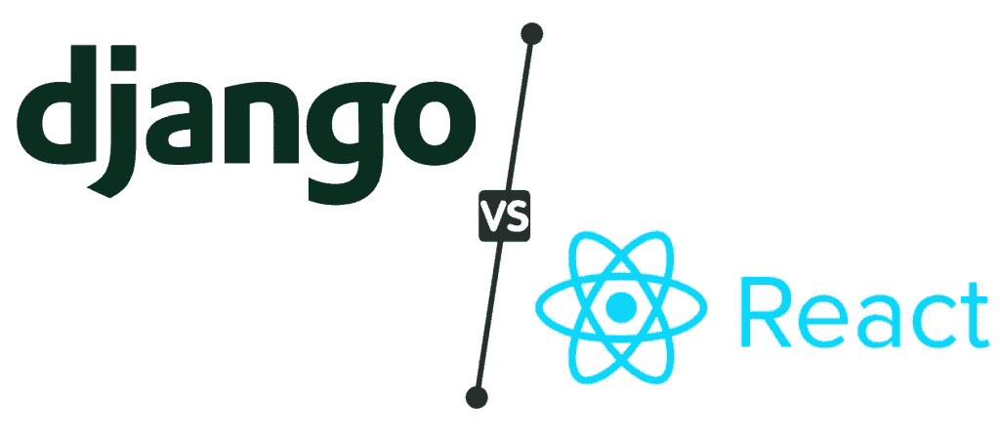

# Django Vs React:哪个最适合 Web 开发？

> 原文：<https://javascript.plainenglish.io/django-vs-react-which-one-is-best-for-web-development-60e661aca245?source=collection_archive---------2----------------------->

## **Django Vs React Js:2023 年 Web 开发怎么挑最好的？**

无论你是打算建立一个 web 应用还是一个网站，在 2023 年为你的项目选择最好的前端框架将是一个令人困扰的决定。不要担心，这篇博文将通过比较顶级 JavaScript 框架来帮助你做出明智的决定。

当谈到开发应用程序时，网飞、Instagram、脸书、DoorDash 和 Swiggy 是企业的几个顶级例子。想知道这些应用程序为什么以及如何进入用户的大脑？

简单这些应用程序有一些独特的东西，那就是它们的用户界面！

在当今的数字世界中，用户界面是应用程序中最重要的元素之一，它可以决定你的商业应用程序的成败。不管你在后台运行的功能有多复杂，用户总是喜欢这个应用程序简单、容易、干净、有条理的用户界面。

然而，选择简单的用户界面并不意味着提供有限的功能和可操作性。这就是担忧的开始。为了保持竞争力，企业主必须投资选择正确的 web 开发框架。

那么从哪里开始呢？

*谈到 web 应用程序开发，JavaScript 和 Python 框架被全球开发者所采用。但是 Django 和 ReactJs 是 Python 和 JavaScript 前端开发最流行的两个框架。*

Django 和 React JS 是两个开源的 web 框架，提供优秀的功能，可以分别用 Python 和 JavaScript 开发 web 应用。虽然两者都是顶级的，但它们在许多方面都有所不同，包括它们的特性和性能。

那么在你雇佣印度的网页开发者之前，你应该选择哪一个呢？如果你正在考虑用 Django 和 React JS 来创建你的下一个 web 项目，但是还没有决定哪一个是好的，那么这篇文章将会告诉你每个框架的优缺点。有了这个完整的指南，您可以根据自己的偏好、项目需求和目标选择最佳选项。

# **姜戈 Vs React:理解概念**

**结论:【React 和 Django 都是强大的框架，可以让你的 web 应用立刻起飞。Django 是一个 Python 框架，而 React 是一个 JavaScript 库。**

每种框架都有自己的优点和缺点，在决定哪种框架最适合您的 web 开发需求时，您需要考虑这些优点和缺点。如果您不确定选择哪一个，请考虑以下内容:

## ***Django:一个 Python Web 框架***

Django 是一个开源的基于 Python 的 web 框架，支持快速开发，关注代码可读性。它使用模型视图控制器模式将数据从用户界面中分离出来。它提供了广泛的开箱即用特性，让您可以轻松上手 Django，而无需编写大量定制代码。

如果你想用 Python 构建一些新的东西，那么 Django 是一个很好的选择，因为它能马上给你所有你需要的东西。但是如果你正在寻找一些更简单或者极简的东西，那么还有其他的选择，比如 Flask 或者 Bottle，它们提供的功能更少，但是仍然是非常强大的框架。

> **使用 Django 的优势**

作为一个 web 开发工具，Django 提供了许多优势。其中包括:

*   Django 速度快，重量轻，是小型项目的理想选择。
*   初学者会发现 Django 很容易学。
*   Django 是高度可用的，这意味着它可以处理大范围的负载而不会崩溃。

> **使用 Django 的缺点**

如果您想要一个快速、可靠、可伸缩以满足项目需求的框架，Django 可能不是您的最佳选择。

*   React 和 Angular 是比 Django 更快的框架。
*   与 React 或 Angular 相比，Django 不太可靠。
*   React 和 Angular 是比 Django 更流行的框架。

## ***React:一个 JavaScript 库***

React 是一个开源的 JavaScript 库，用于用 JavaScript 构建用户界面。它是由脸书创建并发布的，该公司在网站内部和移动应用程序中使用它。React Js 的主要优点是，它在视图(用户界面)和数据之间提供了清晰的分离，并且是一个基于组件的库，便于重用代码。

有了这个好处，开发人员可以与程序员团队一起创建大型应用程序，比使用其他框架更容易。此外，你可以 [**雇佣一个 React 原生开发者**](https://www.appsdevpro.com/hire-developers/hire-react-native-developers.html) 为了获得这些好处，React Js 还拥有一个围绕任何当前可用框架的最好的开发者社区。这篇博文还指出，谷歌趋势分析显示，从 2009 年到 2017 年，React 的搜索量是 Django 的 10 倍。

> **使用 ReactJs 的优势**

React 是一个开源的 JavaScript 库，它允许开发人员通过用组件声明性地组成视图层次结构来创建交互式的动态用户界面。因此，对底层数据模型的更改将反映在 UI 中，而不必执行任何不必要的更新，反之亦然，从而提供了改进的最终用户体验。

React 还为您在应用程序生命周期的不同阶段呈现视图提供了很大的灵活性，因为它们可以在一个或多个 JavaScript 文件中定义，并在需要时调用。

> **使用电抗器的缺点**

React js 有一个陡峭的学习曲线，在大型应用程序中实现起来可能很有挑战性。此外，它的单向数据流会导致混乱的代码，如果没有控制台或日志文件，很难调试问题。最后，这种语言不太适合初学者。

# **Django Vs React Js:人气**

***结论:说到这些框架的受欢迎程度，*** [***Django 有叉 27.8k/Star 66.4k/2.3k***](https://github.com/django/django)***看而***[***ReactJs 有叉 6.5 / Star 7.9k.***](https://github.com/topics/react)

React JS 在最近几年更受欢迎，而 Django 的历史更长、更成熟。尽管如此，这两个框架之间的选择应该取决于您的需求。如果你需要定制你的应用程序的用户界面，或者如果你正在构建一个有几种不同类型用户的应用程序，那么你会想要使用 React JS，因为它可以同时进行 JavaScript 和 HTML 渲染。

让我们评估一下每个框架的受欢迎程度，以便做出更好的决定。

## **React Js 其人气**

React Js 越来越受欢迎，因为它简单，可以在前端和后端使用，而且与其他框架相比，它的尺寸相对较小。React Js 的最大缺点是它严重依赖 JavaScript 库，并且比 Django 需要更多的关于事物如何工作的预先知识。

## 姜戈的受欢迎程度

Django 从 2005 年就已经存在了，它被开发成一个框架，帮助开发高质量的 web 应用程序，大部分是用 Python 语言开发的。Django 在最近几年变得非常受欢迎，它提供了许多现成的功能，这使得快速轻松地构建高质量的 web 应用程序变得非常容易。它也非常用户友好，因为它的电池包括哲学。

# 姜戈 Vs React Js:简单易学

**结论** : Python 和 JavaScript 都是流行的编程语言，可以轻松构建强大的 web 应用。Python 是一种通用语言，非常适合一系列不同的任务，从 web 开发到数据分析、大数据和机器学习。

它也相对容易学习，因为它与其他流行语言如 C++、C#、Java 和 Perl 有一些相似之处。与此同时，JavaScript 是互联网上最常用的编程语言，也是任何开发人员工具箱中必不可少的工具。

超过 90%的网站依赖于这种特殊的技术，超过 50%的互联网内容使用 Javascript。如今，许多开发人员正在使用 jQuery 或 AngularJS 框架来帮助他们快速、轻松地创建交互式界面。

然而，你可以雇佣 Django 开发者来创建更多的交互式 web 应用。看一下流行度图表，很明显 Django 在最近几年比这些技术更成功。

# **Django Vs React Js:开发速度**

Django 和 ReactJS 的开发速度相似，但最终的决定取决于开发人员在编码风格方面的偏好。

使用 Django 意味着使用 Python 进行开发，而使用 ReactJS 意味着使用 JavaScript 进行开发，这对于一些喜欢不同语言或希望使用他们已经熟悉的语言的开发人员来说可能更有吸引力。

React 的虚拟 DOM 算法是固执己见的，只让你渲染页面中发生变化的部分。它还附带了一组预定义的组件，无需编写任何代码就可以轻松开始使用。另一方面，Django 要求您编写自己的 HTML 模板，并手动管理 web 应用程序中的数据更新方式——除非您使用第三方库，如 django-react-bootstrap。

使用这些库的缺点是它们没有很好的文档，并且当新版本的 Django 或 React 出现时，通常缺乏支持。你可以 [**雇佣一个专门的应用开发者**](https://www.appsdevpro.com/hire-developers.html) 来加快开发进程。但是，如果您希望快速创建带有少量自定义功能的简单站点，React 可能是更好的选择。如果您的目标是构建复杂的应用程序，那么 Django 应该很适合您。

# **Django Vs ReactJs:安全**

**结论** : Django 被设计成与 Python 编程语言一起工作，这使得它比 ReactJS 更安全。虽然两者都能满足我们的需求，但是在我们决定选择其中任何一个之前，最好评估一下我们的项目需要什么样的安全级别。

很难比较这两者，因为它们是两个不同的框架，具有不同的目的和受众，但是在做出决定之前了解它们的安全性差异是一个好主意。Django 不使用 JavaScript，所以它不容易受到影响其他 web 应用程序的相同类型的 XSS 攻击。

此外，Django 在默认情况下强制执行所有输入验证，这提供了针对 SQL 注入和跨站点脚本漏洞的保护。相比之下，ReactJS 没有内置的表单验证，需要希望保持数据安全的开发人员遵守一些规则。

Django 和 ReactJS 都是免费的 web 开发框架。它们都是开源的，可以免费使用。Django 是一个全栈框架，ReactJS 是一个前端框架。就这两者而言，安全性是否是一个问题取决于您。

如果您正在寻找一个快速学习的轻量级库，ReactJS 可能会更好，但是如果您正在寻找更广泛的特性和更强大的安全选项，那么请使用 Django！

# Django Vs ReactJs:学习曲线

**结论**:对于 web 开发的新手来说，学习曲线可能有点陡峭，但谢天谢地，网上有很多资源可以帮助你。Django 和 React 也有活跃的社区，如果你遇到困难，他们会提供支持。这两个框架还提供了大量的教程，因此找到适合您需求的东西并不困难。

React JS 比 Django 需要做更多的工作，学习曲线也更陡。使用 Django，您要做的第一件事就是遵循官方教程，在几分钟内构建您的第一个应用程序。

与 React JS 相反，React JS 要求您对 JavaScript 有很好的理解，以便入门。

此外，在 React JS 中使用 HTML 模板会给新开发人员增加难度。不过，一旦你学会了如何使用 React JS，这就不是什么大问题了，因为你可以更高效地编码。这是因为 React JS 只会呈现你真正想看的内容。

一方面，用这种方式开发 web 应用程序有优势；例如，调试通常需要你知道作为一个系统，一切是如何工作的，而不仅仅是一个编码天才。此外，你可以 [**雇佣一个网络应用开发者**](https://www.appsdevpro.com/hire-developers/hire-web-app-developers.html) 用 ReactJs 创建一个应用。另一方面，这有许多困难。例如，浏览器和第三方库的内置支持较少；这意味着可供您使用的调试工具和功能较少。

# **Django Vs React Js:可扩展性**

**结论**:当你决定使用哪个框架时，你不仅要考虑框架的特性，还要考虑它的可伸缩性和性能。基于 Django 构建的 web 应用程序可以轻松支持数十万并发用户，而用 ReactJS 构建的类似应用程序将很难同时处理数千个活跃用户。

你需要你的网站能够做到的一件事是拥有大量的用户而不崩溃。对于任何网站项目来说，可伸缩性都是一个关键的考虑因素。

你能告诉我哪个框架更具可扩展性吗？姜戈还是雷卡特斯？虽然这两个框架都是可扩展的，但 ReactJS 比 Django 有更好的内存管理系统，所以更大的网站加载会更快。

然而，Django 的系统适用于任何类型的数据库，并在后端设计中提供了更大的灵活性。要确定哪个框架最适合您的项目，您需要决定速度和灵活性哪个更重要。

# **结论:2023 年 Web 框架的最佳选择是哪个？**

总之，Django 和 React JS 都是很好的学习框架，但是了解它们各自的优缺点以做出最适合开发人员需求的明智决定是很重要的。

你可以 [**雇佣印度**](https://www.appsdevpro.com/hire-developers/hire-web-app-developers.html) 的 web 应用程序开发人员来做出最好的决定，因为他们都可以轻松地创建健壮的 web 应用程序，所以一切都取决于他们的偏好。如果您刚刚开始 web 开发，那么您可能希望在投入太多时间在另一个框架上之前先尝试这些框架中的一个，因为它们可能不适合您所寻找的。

因此，如果您有一个项目想法，但还不确定应该使用哪种技术或框架，那么您可以与专家讨论或联系我们以获得详细的解决方案。

*更多内容请看*[***plain English . io***](https://plainenglish.io/)*。报名参加我们的* [***免费周报***](http://newsletter.plainenglish.io/) *。关注我们关于*[***Twitter***](https://twitter.com/inPlainEngHQ)[***LinkedIn***](https://www.linkedin.com/company/inplainenglish/)*[***YouTube***](https://www.youtube.com/channel/UCtipWUghju290NWcn8jhyAw)*[***不和***](https://discord.gg/GtDtUAvyhW) *。对增长黑客感兴趣？检查* [***电路***](https://circuit.ooo/) *。***