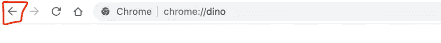

# JavaScript 中的 history.back()简介

> 原文：<https://javascript.plainenglish.io/do-you-know-history-back-in-javascript-cbc0cecc2993?source=collection_archive---------17----------------------->

## 什么是 history.back()有什么用？


所以，我们都上网看 YouTube 视频和 StackOverflow 等等。而我们一般都是点击“↓”这个按钮回到上一个网站。



你知道吗？
您可以用 JavaScript 创建与浏览器的“↓”按钮相同的功能🔥

# 让我们创建一个后退按钮

```
<button>Go Back</button>
```

是时候让它成为功能性的✌️了

*   给按钮添加`onclick`属性

```
onclick="history.back()"
```

*   这是最后一点代码🙂

```
<button onclick="history.back()">Go Back</button>
```

# 这是如何工作的？

`history.back()`方法从历史列表中加载前一个 URL。只有在上一页存在的情况下才有效。

亲自尝试:[现场演示](https://codewithsnowbit.github.io/history.back-tutorial/)(仅在此选项卡中打开此链接，因为它将创建上一页🙂)

请随时通过 Twitter 联系我— [@codewithsnowbit](https://twitter.com/codewithsnowbit)

# 🌏让我们连接

*   [GitHub](https://github.com/codewithsnowbit)
*   [推特](https://twitter.com/codewithsnowbit)
*   [YouTube](https://www.youtube.com/channel/UCNTKqF1vhFYX_v0ERnUa1RQ?view_as=subscriber)

*敬请期待下一篇文章。保持安全和快乐的编码！*

如果你喜欢我的内容并觉得有帮助，那么你可以在这里支持我。

*更多内容看* [***说白了就是***](https://plainenglish.io/) *。报名参加我们的* [***免费每周简讯***](http://newsletter.plainenglish.io/) *。关注我们* [***推特***](https://twitter.com/inPlainEngHQ) *和*[***LinkedIn***](https://www.linkedin.com/company/inplainenglish/)*。加入我们的* [***社区不和谐***](https://discord.gg/GtDtUAvyhW) *。*