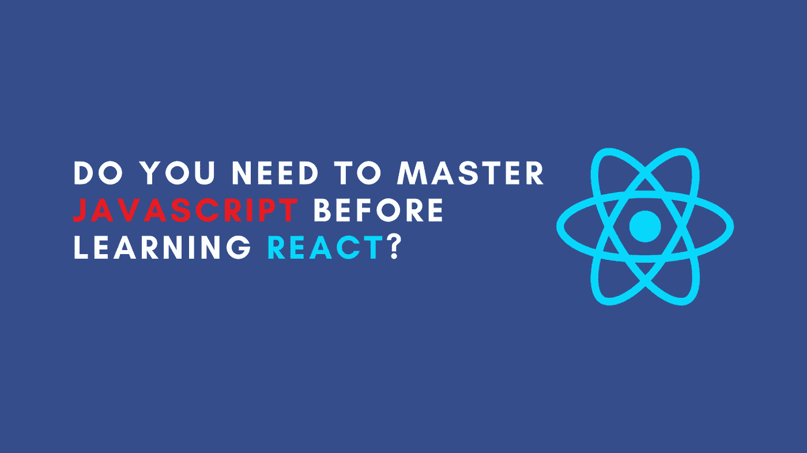

# 学习 React 前需要掌握 JavaScript 吗？

> 原文：<https://javascript.plainenglish.io/do-you-need-to-master-javascript-before-learning-react-3b86bbc4f1ba?source=collection_archive---------7----------------------->

我在不同平台上看到的学习 React 的开发人员的主要担忧之一是 JavaScript 知识和 React 之间的关系。他们中的大多数人都知道 React 是一个 JavaScript 库，因此他们应该对 JavaScript 有一定的了解。但是在转向 React 之前，他们通常不确定应该对 JavaScript 钻研到什么程度。

作为一个 4 年多前开始自学 React 并在过去 3 年中一直从事 React 开发工作的人，这是一个我非常熟悉的问题。这是我开始时的挣扎。虽然最后成功了，但这肯定会是一个更顺利的过程。利用这些经验，本文将讨论在学习 React 之前是否应该掌握 JavaScript，以及应该掌握到什么程度。

新手通常担心的主要问题是他们对 JavaScript 的掌握有限，因此他们无法正确地学习 React。

毫无疑问，拥有 JavaScript 的先验知识并对其有正确的理解将有助于你更快地学会反应。最终，React 只是一个建立在 HTML/CSS/JavaScript 之上的 UI 库，其中 JS 负责大部分逻辑。了解变量、数组函数、回调、作用域、闭包等概念以及其他 JS 相关主题肯定会让你受益匪浅。这将极大地加快你学习和反应的速度。

但是，这是否意味着你不知道这些概念就不能学习反应？

我要说的是，绝对推荐你去熟悉它们。这会让你的学习过程变得相当容易，但这绝不是必须的。如果你的目标是学习 React，不要等到你认为已经掌握了所有的 JavaScript。根据个人经验，这一时刻很可能不会发生。最后，你唯一的收获是学会了 JavaScript，而不是 React。

在 React 之前，有很多参考资料可以为您提供建议学习的 JavaScript 概念和函数。看一看，让你自己熟悉它们，但不要花上几年时间。对于大多数情况来说，知道它们的存在就足够了。之后，开始学习 React。

是的，会有你不懂的 JavaScript 主题，但这没关系。既然您已经熟悉了最常见的 JavaScript 主题，那么您应该能够不停顿地浏览 React。你可以查找你不理解的话题，然后快速学习。在学习 React 的时候这样做可以保证它是相关的，并增加它坚持下去的机会。

但是，我应该学习 JavaScript 的所有知识吗？

不完全是。虽然了解某些 JavaScript 概念是有益的，但并不是 JavaScript 中的每个概念都在 React 中使用。例如，我会说不知道`this`的细节(如果你没有使用类组件)或者不知道原型链是如何工作的是完全没问题的。虽然它们对于正确的 JavaScript 开发至关重要，但有些主题与 React 开发人员的日常工作并不相关。

# 最后的想法

人们经常试图让自己准备过度。这同样适用于学习新技术、框架或库。我看到很多开发人员也用 React 做这件事，包括我开始前端开发之旅的时候。回过头来看，本文利用这一经历回答了一些关于 JavaScript 和初学者学习 React 之间关系的最大问题。

React 是一个基于 JavaScript 的 UI 库，这是不争的事实。如果你想写 React 代码，你也必须写 JavaScript 代码。因此，建议学习一点 JavaScript。但是不要过度。建立一个基础，然后继续做出反应。在更糟糕的情况下，你可以在飞行中学习。最终，你的目标是学习 React，而不是 JavaScript。

如果你喜欢这篇文章，可以考虑看看[不凡反应](https://www.getrevue.co/profile/chakshunyu)时事通讯和我的[推特](https://twitter.com/keraito)中的其他条目，以便将来更新。

*更多内容看* [***说白了就是 io***](http://plainenglish.io/) *。报名参加我们的* [***免费周报***](http://newsletter.plainenglish.io/) *。在我们的* [***社区不和谐***](https://discord.gg/GtDtUAvyhW) *获得独家获取写作机会和建议。*