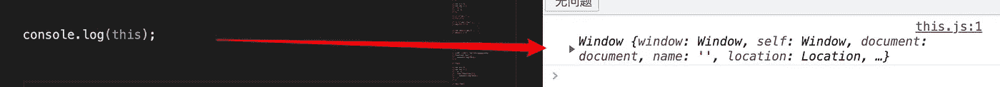
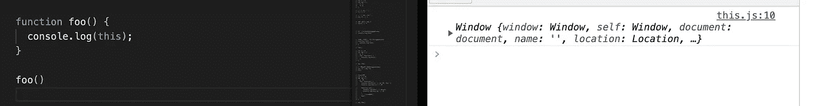

# 你真的知道 JavaScript 中的“这个”吗？

> 原文：<https://javascript.plainenglish.io/do-you-really-know-this-in-javascript-cbdd80b79442?source=collection_archive---------1----------------------->

Photo by [Cristian Castillo](https://unsplash.com/@castillcc?utm_source=medium&utm_medium=referral) on [Unsplash](https://unsplash.com?utm_source=medium&utm_medium=referral)

# 介绍

在前端面试过程中，面试官经常会问到关于`this`这个关键词的问题，即使是工作多年的人可能也只是一知半解。因此，本文对`this`关键词进行了详细的分析，以便他人能够深入理解。

# 地图轮廓

# `this`是什么？

当一个函数被调用时，一个执行环境将被创建。`this`在运行时根据函数的执行环境进行绑定。它允许函数在内部引用上下文中的执行变量，使得函数编程更加优雅和简洁。

看看下面的代码，想想为什么不同的调用方法会打印出不同的结果。

其实很简单，因为不同调用方法的`this`指向不同的点。为什么这指向不同的函数调用方法？这是由什么决定的？现在我们带着问题开始深入了解`this`问题吧！

# “这个”的约束规则

## 默认绑定

在默认绑定规则下，函数的运行环境是全局环境，`this`默认指向`Window`。

默认绑定规则如下:

1.  **全局功能** `**this**` **指向** `**Window**`

在全局函数中直接打印`this`时，可以看到`this`指向`Window`。

**2。独立函数调用** `**this**` **指向** `**Window**`

独立函数调用，即直接调用函数，比如`foo()`。

这里的`foo`默认链接`Window`，相当于`window.foo()`。根据函数的隐式绑定规则，谁调用就指向谁。`this`这里指的是`Window`。结果如下:

同样，如果嵌套函数中直接调用的函数也是独立函数调用，那么`this`也指向`Window`:

在上面的代码中，子函数`son`也嵌套在对象`obj`的方法`foo`中。当直接调用`son`方法时，`son`里面的`this`指向`Window`，那么`son`里面的`this.a`结果就是全局变量`a`，也就是 10。

如果要在`son`函数中使用`obj`中的变量`a`怎么办？只需将`this`对象赋给另一个变量`that`，并在`son`方法中引用该变量:

**3。对于自执行函数调用，** `**this**` **指向** `**window**`

自执行函数，顾名思义，就是在函数定义后自动调用的函数。自执行功能的`this`指向如下代码:

上面代码中的`foo`函数内部嵌套了一个自执行函数`son`，`son`内部的`this`指向`Window`。这里，`this`指向的原理类似于独立函数调用，即先声明一个`son`方法，然后通过`son()`执行函数。如果想获取`son`中上层对象`obj`的变量，可以在调用时将`this`点作为参数传递给自执行函数`son` 。

**4。闭包内的** `**this**` **指向** `**Window**`

闭包可以理解为一个函数内部定义的函数，它可以访问其他函数的内部变量。当我们查看闭包中的`this`点时，我们可以看到`this`指向`Window`。

在上面的代码中，`foo`函数的第一个`this.a`的`this`指向了`obj`对象，所以结果是 20。返回函数调用的`this`指向`Window`，结果为 10。`obj.foo()()`可以理解为:

`fn`是`obj.foo()`返回的函数。函数的`fn`被独立调用，`this`指向`Window`。

## 隐式结合

当一个函数作为方法调用时，`this`指向该函数的直接父对象，称为隐式绑定。

在隐式绑定规则中，认为`this`指向调用函数的人，并且将指向函数的直接父对象。比如`obj.foo()`中`foo`函数内部的`this`指向`obj`，而 obj1 中的`foo`函数。`obj2.foo()`指向`obj2`。

上面的代码也是对`foo`函数的调用。调用方法不同，结果也不同。

‘exp1’中的`foo`被独立函数直接调用，所以`this`指向`Window`，结果是 10；‘exp2’中的调用方法是`obj. Foo()`,`foo`函数的`this`指向上级调用对象`obj`；结果是 20。' exp3 '中`foo`函数的直接上级对象是`obj2`，所以结果是 30。

**隐式绑定丢失**

隐式绑定丢失是指隐式绑定的函数丢失了绑定对象，所以默认绑定到`Window`。这种方法很容易在我们的项目中造成错误，但也很常见。

1.  **隐式绑定的函数被赋值为变量，没有** `**this**` **指向。**

在下面的代码中，`obj`下的`foo`值实际上是`foo`函数的地址信息，而不是真正的`foo`函数。调用`obj. foo()`时，`this`的`this`被隐式绑定到`obj`。当`var fn=obj.foo`向`fn`分配功能时。相当于把`foo`函数的地址分配给`fn`。此时`fn`与`obj`没有关联，所以这里是`fn()`的运行环境是全局环境，`this`指向`Window`，`this. a`的结果是 10。

2.**隐式绑定的函数作为参数传递给函数，** `**this**` **点丢失。**

当一个隐式绑定的函数作为参数直接传递给另一个函数时，`this`绑定会丢失，从而指向全局`Window`。如下图，`obj.foo`作为参数传递给 bar 函数后，`this.a`的结果是 10。在这里，`bar(obj.foo)`相当于`var fn=obj.foo; bar(fn)`。

**3。内置对象** `**setTimeout**` **和** `**setInterval**` **中函数的隐式绑定丢失**

内置函数`setTimeout`和`setInterval`的`this`默认指向`Window`。

顺便说一下，当`setTimeout`或`setInterval`的第一个参数是箭头函数时，`this`会指向上层的函数执行环境。代码如下:

## 显式绑定

当我们要将函数绑定到指定对象时，可以使用`call`、`apply`、`bind`等方法手动改变`this`方向，即显式绑定。

在下面的代码中，分别使用`call`、apply 和`bind`举例说明了将`foo`显式绑定到`p`对象的方法。显式绑定`call`和`apply`的方法会在显式绑定后直接调用，而显式绑定`this`到`bind`的方法需要手动调用。

**关于硬装订**

显式绑定可以帮助我们将`this`改为指定的对象，但是无法解决隐式绑定缺失的问题，比如:

上面的代码中，`call`用于绑定`this`指向`p`对象，但最后`this`指向`Window`。此时，我们可以通过硬绑定来解决这个问题。

## “新”绑定

`new`捆绑是我们常用的方法。事实上，我们可以创建一个构造，然后`new`一个实例对象。此时，`this`指向了从`new`出来的实例对象。

当我们认识对方时，我们主要做以下事情:

a.创建新对象

b.让这个点指向新的对象并执行构造的主体

c.设置新对象的`proto`属性指向构造的原型对象

d.判断构造的返回类型。如果是，则返回新对象。如果它是引用类型，它将返回该类型的对象。

首先创建了“人”的构造，然后通过“新建”创建了“张三”的一个实例对象。在“张三”的“foo”函数中，“this”指向了“张三”的实例。

# 在严格模式下，“这”指出了一个问题

## 1.独立调用函数的内部“this”是“未定义的”

## 2.“call()”和“apply()”中的 this 总是他们的第一个参数

# 摘要

`this`是一个相对复杂的知识点。当然，如果我们真的理解了`this`的原理，那么遇到`this`指出的问题就很简单了。如果我们理解了`this`，这不仅是前端面试的加分项，也有利于我们的发展和学习。

我们总结一下。`this`的约束原则如下:

1.  默认绑定，`this`指向全局`Window`。
2.  叫`this`的会指着他。不要忘记隐藏绑定的丢失。
3.  它显示了约束。他用`call`、`apply`、`bind`改变了这个方向。
4.  `new`绑定，构造`new`的实例，`this`指向`new`的实例对象。

最后，如果文章有什么错误或者需要改正的地方，可以在评论区留下评论。

*更多内容请看*[***plain English . io***](https://plainenglish.io/)*。报名参加我们的* [***免费周报***](http://newsletter.plainenglish.io/) *。关注我们关于*[***Twitter***](https://twitter.com/inPlainEngHQ)[***LinkedIn***](https://www.linkedin.com/company/inplainenglish/)*[***YouTube***](https://www.youtube.com/channel/UCtipWUghju290NWcn8jhyAw)***，以及****[***不和***](https://discord.gg/GtDtUAvyhW) *对成长黑客感兴趣？检查* [***电路***](https://circuit.ooo/) ***。*****