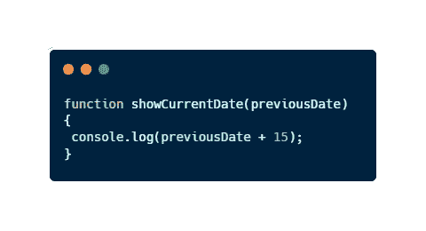
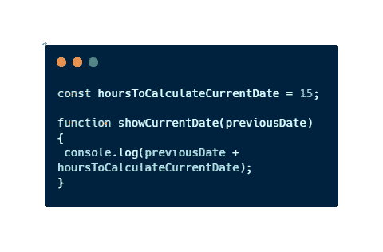

# 你想保住你的好工作吗？那就不要使用魔法常数

> 原文：<https://javascript.plainenglish.io/do-you-want-to-keep-your-fantastic-job-then-do-not-use-magic-constants-2dac70989a5d?source=collection_archive---------2----------------------->

## 说真的，我不想你被炒鱿鱼，所以不要再这样了


作为我日常工作的一部分，有一天**我看到一条我不理解的消息**，当时我正在为一个指定的端点编写一个函数的逻辑。这个错误是由我使用的一个叫做 **ESLint** 的工具提供的，它写着类似…

```
/*eslint no-magic-numbers: "error"*/
```

嗯，我认为自己是一名优秀的程序员(别忘了我还是大三学生),但也是为了创造奇迹……好吧，不。我在网上搜索了这个错误，**我找到了一些提高代码质量的东西，我现在就能创建代码**。

我发现了**什么是魔法常数**和**它如何破坏我的代码**并导致我立即被解雇，因为它们的使用给代码带来了许多问题。

今天，我将告诉你我所学到的一切，来帮助你保住你的工作，并支持你成为一名更好的开发人员。

*你知道魔法常数吗？你知道如何避免使用它吗？*

# 什么是幻常数？

**幻常数**是我们在代码中包含一个**字面量而没有提及该字面量来自**时使用的术语。下面的代码片段就是一个很好的例子:



An example of Magic Constant using JavaScript

如果你读了这段代码，你就会明白有一个函数可以显示给定日期的当前日期。当你写这段代码的时候你已经清楚了，你知道这个 15 意味着什么。但是现在，你清楚了吗？任何试图理解你的代码的人都会知道这 15 条是什么意思。**不**！出于这个原因，我们把它命名为神奇康斯坦斯。

> 它们神奇地出现在代码中

此外，许多开发人员认为这种做法是一种**反模式**，因为它打破了最古老的编程规则之一。使用它的**意图**和**解释**该值的使用都**丢失**。

尽管如此，为了对抗这种模式，我们可以这样做:



Solving the problem of magic constants

我们更喜欢这个，不是吗？现在**我们知道了这个值的含义**和**我们可以毫无疑问地在我们需要的时候改变它和扩展它**。

# 为什么用了会被开除？

也许使用这个标题听起来有点像启示录，但是这个选择背后的原因是**不断使用魔法会在我们的代码**中产生几个问题。

这些问题将导致我们公司的**成本**和我们项目的**时间损失**。甚至在很多情况下，它会在**中总结出新的 bug**和**我们代码**的错误行为。

事实上，它们真的会让我们无法完成工作。每个人都知道如果你不做好你的工作，你会被解雇。

如果这个理由对你来说听起来不够有力，让我给你更多的解释:

*   使用它们会降低我们程序的可读性和可理解性。
*   使用它们，我们的代码会有可伸缩性的问题。因为如果我们多次输入 15，我们将搜索这个值并改变所有的出现次数。然而，如果我们使用一个 var，我们只需要改变它的值。
*   使用幻常数**几乎和不正确命名变量**一样糟糕。在之前的文章中，我们已经看到这是一个非常糟糕的主意。
*   我们的代码不会是不言自明的。高质量代码的一个特点是不言自明。每个人都应该通过阅读来正确理解我们的代码。这意味着了解代码的意图、功能、背后的逻辑等等。
*   具有神奇常数**的代码几乎不可能被重构**。当我们不止一次地使用同一个神奇的常数时，重构这段代码的复杂性会呈指数级增长(这是统计学的发明，但说真的，它会变得非常乏味)。

但是不要担心，我会给你一个非常有用的建议来避免它们；).


Photo by [Icons8 Team](https://unsplash.com/@icons8?utm_source=medium&utm_medium=referral) on [Unsplash](https://unsplash.com?utm_source=medium&utm_medium=referral)

# 为什么可以预防？

最简单的解决方案是使用一个名为常量的**，而不是在我们的代码**中随机放入数字。但这是显而易见的，你不需要我告诉你已经想到了。

我给你一个更好的选择，一个可以永远改变你写的代码质量的实践。当你写完代码后，把你的手从键盘上抬起来，花 **5 分钟来看看并理解你的代码**。

> 你完全理解你的代码吗？你能像阅读一本书一样阅读你的代码吗？这是不言自明的？

如果你对其中一个问题的回答是否定的，那么是时候**回到**并且**把**改成更好的了。实际上，这并不是避免魔法常数的特定实践，但是我确信有了它你会避免它们。此外，您的整个代码的质量也将得到提高。

还有，你可以使用工具避免它成为 [**ESLint**](https://eslint.org/) (以后我会告诉你这个奇妙的工具)。

如果你想**提高你的代码质量**，更不能错过这些有用的文章:

[](https://medium.com/codex/what-is-exactly-test-driven-development-tdd-explained-easily-in-just-5-minutes-3d44811a260f) [## 什么是测试驱动开发？TDD 在短短 5 分钟内简单解释

### 你想改进你测试软件的方式吗？然后你必须发现 TDD。你会喜欢这个的…

medium.com](https://medium.com/codex/what-is-exactly-test-driven-development-tdd-explained-easily-in-just-5-minutes-3d44811a260f) [](/5-chrome-extensions-for-being-a-more-productive-web-developer-in-2022-8d17de09ac2e) [## 5 Chrome 扩展，让你在 2022 年成为更高效的网络开发者

### 使用这些有用的(免费的)Chrome 扩展，节省时间并提高开发人员的工作效率。

javascript.plainenglish.io](/5-chrome-extensions-for-being-a-more-productive-web-developer-in-2022-8d17de09ac2e) 

# 最后的想法

**魔法常数**被认为是**应该避免的**反模式**。**

在我们的代码**中直接使用数字总是一个坏主意**，尽管如此，我们应该使用**命名的常量**或正确命名的变量。我们必须记住每一种数据类型和文字。

在本文中，我们已经讨论了什么是幻常数以及使用它们的一些缺点，比如降低代码的可读性。此外，**我给了你一种新的编码方法**,它可以让你提高整个代码的质量，避免不可思议的常数。

有人在你的作品中使用幻数吗？你推荐哪些实践来提高我们代码的质量？

> *你是不是在考虑买一个* [*中等会员*](https://medium.com/@jesuslagares/membership) *？如果你想访问媒体上最好的内容，可以考虑使用我的推荐链接**[*。同样的价格，你会支持我的工作。*](https://medium.com/@jesuslagares/membership)*

# *结论👋*

*谢谢大家！非常感谢您阅读这篇文章。如果你想了解更多关于技术和发展的知识，别忘了跟我来。我很想知道你对此的看法，所以不要花花公子**写在评论**里，我会读给你听。*

*如果这篇文章帮助你记住了，你可以**为它鼓掌**并与你的同志们分享。*

# *关于作者🤓*

*嗨！很高兴见到你！我是赫苏斯·拉加雷斯。目前，我是一名后端软件工程师，正在加的斯大学完成我的计算机科学学位。*

*我的两大爱好是**技术**和**通信**，所以我会抓住一切机会谈论或撰写关于技术的文章。我喜欢把复杂的概念转换成每个人都能理解的简单概念。*

# *想要连接吗？📲*

*📸[**insta gram**](https://instagram.com/jesuslagares_)**|**💼 [**领英**](https://www.linkedin.com/in/jesus-lagares/) **|** 📹[**Youtube**](https://www.youtube.com/c/Jes%C3%BAsLagares)**|**🐦 [**推特**](https://twitter.com/jesuslagares_)*

*📩**jesuslagaresgalan@gmail.com***

*谢谢！❣️*

**更多内容请看*[***plain English . io***](https://plainenglish.io/)*。报名参加我们的* [***免费每周简讯***](http://newsletter.plainenglish.io/) *。关注我们关于*[***Twitter***](https://twitter.com/inPlainEngHQ)[***LinkedIn***](https://www.linkedin.com/company/inplainenglish/)*[***YouTube***](https://www.youtube.com/channel/UCtipWUghju290NWcn8jhyAw)***和*** [*对成长黑客感兴趣？检查出*](https://discord.gg/GtDtUAvyhW) [***电路***](https://circuit.ooo/) ***。*****