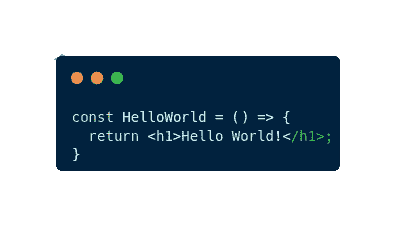
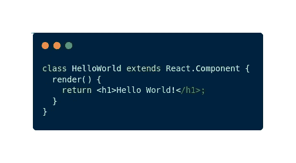
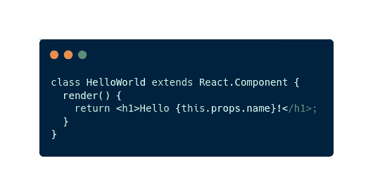
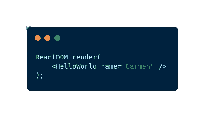
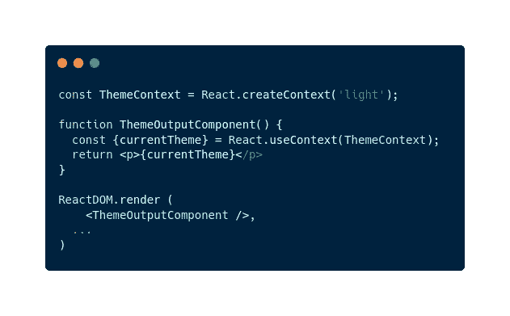

# 成为更好的开发人员应该掌握的 3 个基本 React 概念

> 原文：<https://javascript.plainenglish.io/do-you-want-to-use-react-3-basic-react-concepts-that-you-have-to-master-9bf894158a85?source=collection_archive---------6----------------------->

## 掌握这些概念将有助于您成为更好的开发人员

Photo by [Lautaro Andreani](https://unsplash.com/@lautaroandreani?utm_source=medium&utm_medium=referral) on [Unsplash](https://unsplash.com?utm_source=medium&utm_medium=referral)

目前，我在工作中帮助完成前端任务。因此，在过去的几天里，我学到了很多关于反应型和 T2 型的知识。今天我将向你揭示一些**反应的基本概念，如果你想用这个神奇的库构建伟大的应用程序，你必须掌握这些概念。**

React 它现在真的很受欢迎，因为它是一个**非常有用的 JavaScript** 工具来构建你的用户界面。然而，如果你不理解基础，你将开始复制和粘贴你在互联网上找到的代码**而不理解任何东西**。所以，如果你想构建好的 React 代码，最好先理解基本概念。

*什么？你还在想为什么要用 React 吗？*

# 为什么要反应？

如今，React 是前端开发最流行的技术之一。使用这个 JavaScript 库，我们可以用一种非常简单的方式创建一个可爱的用户界面。有很多应用程序使用它，如网飞，Freedly，或 HelloSign。但是，我们为什么要在项目中使用 React 呢？让我给你一些理由:

*   你可以**重用组件**。
*   这是对 SEO 友好的。
*   它背后有强大的社区支持。
*   它允许你构建高度可测试的应用程序。
*   只有**要求**你懂 **JavaScript** 。

如果你想了解更多关于 React 的内容，你可以查看这些(免费的)精彩文章:

 [## 反应不到 5 分钟就解释完毕

### 今天学习什么是反应。发现你是否应该在你的下一个网络项目中使用它，并在你的下一份工作中给你惊喜…

medium.com](https://medium.com/quick-code/reactjs-explained-in-less-than-5-minutes-321a38fdd8c3)  [## ReactJS vs NextJS:你的下一个项目应该用哪个？

### NextJS 和 ReactJS 哪个最好？🥊💻。今天我们来回答这个问题，给你一个比较，这样你就可以…

medium.com](https://medium.com/codex/reactjs-vs-nextjs-which-one-should-you-use-for-your-next-project-22d65dc1cbef) 

既然你已经被说服了，并且你将在你的下一个项目中使用 React，那么让我教你 **3 个概念，如果你想在 React 中构建好的应用程序，你必须掌握这些概念:组件、道具和上下文。**

# 成分

组件是 React 的**核心**。有了这个框架，你可以**为你的应用程序构建可重用模块**。这就保证了 React 的潜力。事实上，我们可以将每个 React 应用程序定义为几个协同工作的组件。

组件是一个 JavaScript 类或函数，**返回一个 React 元素**，描述用户界面 (UI)的**部分应该如何出现。使用它们，我们可以将 UI 视为多个独立组件的结合。**

我们可以区分**功能组件**和**类组件**。

## 功能组件示例

A simple functional component

## 类组件示例

A simple class component

这些组件可以接受 props 作为参数来扩展它们的功能。*你不知道什么是道具吗？*

# 小道具

使用简单的组件允许你在你的 React 应用中构建静态元素，但是如果你想创建一些动态的东西，那么你必须使用道具。看到上面的例子，想象你想显示“你好卡门”而不是世界(卡门是一个命名变量)，你需要一个道具。

属性是在 React 中组件之间传递数据的方式。这类似于函数参数。它们是只读参数**所以你不能从组件内部修改属性。我们可以用这个来访问它们，当我们渲染组件的时候，我们必须传递它。**

让我给你看一些例子:

Accessing props using React

Passing a prop value to a component in React

这是使用 React 传递数据的一种奇妙方式。然而，我们可能会遇到这样的情况:相同的数据必须传递给每个组件。例如语言偏好或特定的 UI 配置。

在这些情况下，更正确的做法是创建和使用上下文。你不知道什么是语境吗？

# 语境

上下文为我们提供了一种在组件之间共享值的方法，而不必显式地通过每个组件传递一个属性。当我们必须共享被认为是全球性的数据时，我们应该使用它。这类数据的一些例子是语言偏好、使用的主题或经过身份验证的用户。

我们只需要使用 *createContext* 方法创建一个上下文，并围绕它包装我们的组件。

这个解释可能有点令人困惑，所以我们来看一个例子:

# 最后的想法

在 React 中，您将学到许多概念。这是一个令人难以置信的库，**允许我们为我们的应用程序**构建奇妙的 UI。然而，如果你是新手，并且没有太多的网络开发经验，这可能会有点累人。

出于这个原因，我在这篇文章中分享了三个基本概念，从我的角度来看，当你是这个库的初学者时，你必须掌握它们。你会在每个 React 应用中找到这些概念。因此，如果你从一开始就掌握了它，你就能在学习过程中节省时间。

你以前知道这些概念吗？你脑海中有没有其他人反应你想指出的概念？

> *你是不是想买个* [*中等会员*](https://medium.com/@jesuslagares/membership) *？如果你想在媒体上获得最好的内容，考虑一下* [*使用我的推荐链接*](https://medium.com/@jesuslagares/membership) *。同样的价格，你会支持我的工作。*

# 结论👋

谢谢大家！非常感谢您阅读这篇文章。如果你想了解更多关于技术和发展的知识，别忘了**跟我来**。我很想知道你对此的看法，所以不要花花公子**写在评论里**，我会读给你听。

如果这篇文章帮助你记住了，你可以**为它鼓掌**并与你的同志们分享。

# 关于作者🤓

嗨！很高兴见到你！我是赫苏斯·拉加雷斯。目前，我是一名后端软件工程师，正在加的斯大学完成我的计算机科学学位。

我的两大爱好是**技术**和**交流**，所以我会抓住一切机会谈论或撰写关于技术的文章。我喜欢把复杂的概念转换成每个人都能理解的简单概念。

# 想要连接吗？📲

📸[**Instagram**](https://instagram.com/jesuslagares_)**|**💼[**LinkedIn**](https://www.linkedin.com/in/jesus-lagares/)**|**📹****|**🐦 [**推特**](https://twitter.com/jesuslagares_)**

**📩**jesuslagaresgalan@gmail.com****

**谢谢！❣️**

***更多内容请看*[***plain English . io***](https://plainenglish.io/)*。报名参加我们的* [***免费周报***](http://newsletter.plainenglish.io/) *。关注我们关于*[***Twitter***](https://twitter.com/inPlainEngHQ)[***LinkedIn***](https://www.linkedin.com/company/inplainenglish/)*[***YouTube***](https://www.youtube.com/channel/UCtipWUghju290NWcn8jhyAw)*[***不和***](https://discord.gg/GtDtUAvyhW) *。对增长黑客感兴趣？检查* [***电路***](https://circuit.ooo/) *。*****