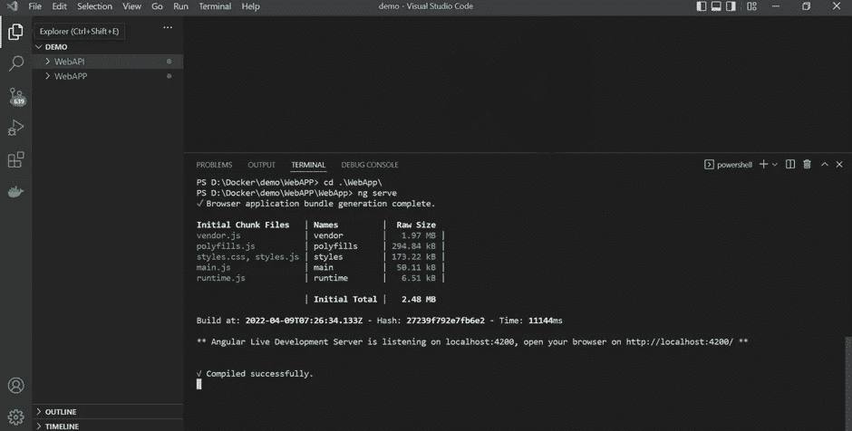

# 码头工人。NET 核心 API 和使用 Docker Compose 的 Angular 端到端应用程序

> 原文：<https://javascript.plainenglish.io/docker-net-core-api-and-angular-end-to-end-application-using-docker-compose-2548ddf891c9?source=collection_archive---------3----------------------->


# 构建。NET Core REST-API 后端

**安装** [Visual Studio 社区](https://visualstudio.microsoft.com/en/vs/community/)(免费)带 ASP.NET 和 web 开发工作量。

创建一个新的 ASP.NET 核心 Web API 项目


配置新项目


设置项目的附加信息，如目标框架、认证类型、启用 Https、启用 Docker、Docker 操作系统支持等。


添加新的控制器“DemoController”。欢迎回到码头工人的世界！当我们调用 get 方法时。


这就是 Visual Studio 在创建新的 Web 应用程序时启用 Docker 支持选项时创建的 Docker 文件。因为有不同的步骤，首先我们使用 aspnet 的基本映像，然后设置默认 docker 应用程序目录和容器默认端口，稍后，添加。net SDK 来构建应用程序，然后将所有内容从主机复制到 docker 目录并设置入口点。


之后，当我们使用 Docker 运行该应用程序时，它将在 Docker 桌面中创建 Docker 映像，您将该映像安装在本地机器上。(请确认 Docker 桌面在您的机器上正常运行，并且将处于运行模式)


这里您将看到执行 DemoController 的 get 方法后的输出。


# CORS 支持

CORS 的完整形式是跨产地资源共享。它是一个 W3C 标准，允许服务器从指定的域进行跨域调用，同时由于浏览器的安全性，默认情况下拒绝其他调用。它防止网页从一个域向另一个域发出 Ajax 请求。

但是很多时候我们使用多域应用程序，这些应用程序需要从一个域调用另一个域；在这种情况下，我们需要允许跨来源策略。

为此，我们需要在启动类的 ConfigureServices 方法中添加 CORS。

```
services.AddCors(c =>
{
c.AddPolicy(“AllowOrigin”, options =>
{
options.AllowAnyOrigin()
.AllowAnyHeader()
.AllowAnyMethod();
});
});
```

稍后，还要将中间件添加到配置方法中

```
app.UseCors(“AllowOrigin”);
```

# DOCKER-撰写

Compose 是**一个定义和运行多容器 Docker 应用的工具**。使用 Compose，您可以使用 YAML 文件来配置应用程序的服务。然后，只需一个命令，您就可以从您的配置中创建并启动所有服务。

现在，在 Visual Studio 中添加 Docker-Compose 容器编排支持后，添加 Docker-Compose 来设置我们后端应用程序所需的动态端口，如图所示。


现在，我们将为后端应用程序设置端口，以便每次都使用该端口来运行应用程序


现在，当我们运行我们的应用程序时，它将在 docker 桌面中创建图像，并在 4015 端口上运行应用程序。


这都是关于后端 web 应用程序的。现在，我们将研究前端角度应用。

# 构建前端角度应用程序

打开 Visual Studio 代码

1.在特定位置创建新目录

```
mkdir WebAPP
```

2.进入 WebAPP 目录

```
cd .\WebAPP\
```

3.在里面安装 Angular CLI。

```
npm install -g @angular/cli
```


4.安装 Angular CLI 后，创建新的 Angular 项目。

```
ng new WebApp
```


5 .稍后进入你新创建的应用程序，运行你的 Angular 应用程序。

```
ng serve
```



在这里，您将看到您的应用程序现在处于运行模式


6 .在 app.module.ts 文件中添加 HTTP 客户端模块，我们将在服务中使用该模块来连接我们的后端应用程序以获取数据。

7.还要添加配置。src/app/assets/config.json 下的 Json 文件，我们使用它来配置我们的后端 API URL，并在整个应用程序中使用它来获取数据。

```
{
“apiServer”: {
“url”: “https://localhost:4015",
“version”: “v1”
}
}
```

8.使用以下命令为我们的 WebApp 应用程序添加演示服务

```
ng generate service demo
```

执行上述命令后，将创建一个文件 demo.service.ts，其中添加了以下代码，我们将使用这些代码从已经处于运行模式的后端应用程序中获取数据。

9.现在，在 app.component.ts 文件中添加以下代码。

10.最后，用下面的 HTML 替换 app.component.ts 代码。

# 为 Angular 应用程序添加 Docker 支持

1.  首先，我们创建与 nginx 服务器相关的 nginx-custom.conf 文件，并使用它根据我们的需要配置一些东西，如反向代理和负载平衡等。

2.然后，我们创建 Dockerfile，在添加了将 image 运行到容器中时需要的所有依赖项和配置之后，我们用它来创建 web 应用程序的映像。

正如我在 Dockerfile 中提到的，首先我们使用节点映像并设置默认的 docker 工作目录(app)，然后将内容复制到 app 目录，使用 npm 安装所有依赖项，并使用创建 dist 文件夹的 npm build 创建生产版本。其次，我们使用 Nginx 服务器映像运行我们的 web 应用程序，并在其中添加 nginx-custom.conf 文件，并复制 dist 的内容。

3.最后，我们将添加一个 Docker-Compose 文件来构建图像并运行我们的应用程序。

4.现在运行以下命令，使用 docker-compose 构建 docker 映像。

```
docker-compose build
```

5.最后，使用 docker-compose 运行下面的命令来运行映像。

```
docker-compose up
```

6.运行这两个应用程序后，你可以在 docker 桌面上看到运行模式下的 docker 图像，正如我在截图中提到的。


7.此外，在 Docker Desktop 的容器部分，您可以看到容器处于运行模式，并且可以访问该模式。

8.最后，当您在浏览器中点击 [http://localhost:4014/](http://localhost:4014/) 时，您会看到我们从后端 API get 方法获得的应用程序输出，并将该输出修补到 Angular 应用程序中。


希望它对你理解这些概念有所帮助。

此外，如果你想更喜欢使用 docker-compose 动态 API_URL 配置，请访问我的博客。

*   [使用 Docker 编写 YML 文件的 Angular 应用程序的动态 API_URL 配置](https://medium.com/@jaydeepvpatil225/angular-environmental-variables-and-backend-api-url-dynamic-configuration-using-docker-compose-yml-7eece6c89cfc)

*更多内容看* [***说白了。报名参加我们的***](https://plainenglish.io/) **[***免费周报***](http://newsletter.plainenglish.io/) *。关注我们关于*[***Twitter***](https://twitter.com/inPlainEngHQ)*和*[***LinkedIn***](https://www.linkedin.com/company/inplainenglish/)*。查看我们的* [***社区不和谐***](https://discord.gg/GtDtUAvyhW) *，加入我们的* [***人才集体***](https://inplainenglish.pallet.com/talent/welcome) *。***