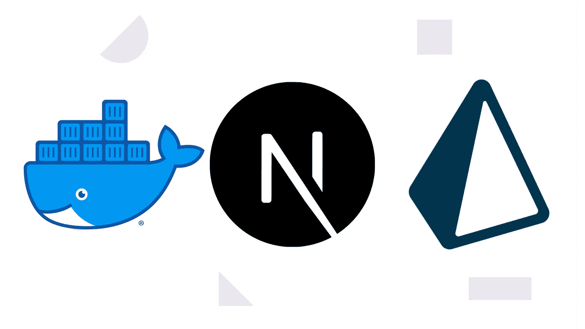

# 用 Prisma App 实现 Dockerize Next.js

> 原文：<https://javascript.plainenglish.io/dockerize-next-js-with-prisma-app-ff4ab5d79a31?source=collection_archive---------2----------------------->

## Prisma 应用程序的简单 docker 文件



Source: Author

您是否曾经遇到过这样的情况:您找到了部署应用程序的理想平台，但却未能对应用程序进行 dockerize？

最近我想在 Fly.io 上部署我的 SaaS [Wildfire](https://usewildfire.com) ，唯一的方法是使用 Dockerfiles 来部署。

我遇到了一堆问题，除了一堆不直观的 GitHub 问题之外，我找不到任何关于在 M1 芯片上使用 Prisma 的 Next.js 指南。

最后，我成功地建立了一个图像，但它非常大，我花了将近半个小时来建立。

理想情况下，您希望 docker 图像尽可能小，当您使用 Prisma 时，您需要在开始 Next.js 项目之前运行几个命令来生成 Prisma 客户端。

在本指南中，我们将为 Next.js 和 Prisma 应用程序构建一个精简、简单的 Docker 映像。我假设你没有对你的应用程序进行 docker 化，并且对 docker 文件有一定的了解。

# M1 芯片的 Mac 用户注意

如果你没有 M1 芯片，你可以安全地跳过这一部分。

苹果 M1 芯片、docker 和 Prisma 似乎相处得不太好。

当你用 Node alpine base image 在 M1 芯片上运行 Prisma 命令`npx prisma generate`时，它会抛出许多错误，提示你缺少库或者花费了非常长的时间(超过 20 分钟)。你可以在这里找到一个这样的问题[。](https://github.com/prisma/prisma/issues/7755)

使用任何其他节点图像可能可行，但它会极大地影响您的图像大小。

**解决方案？**

只需使用远程生成器。这不是理想的方式，但我强烈建议使用远程构建器，因为它们运行在 x86 架构上，而不是我们的 M1 芯片的 arm64 上。

Fly.io 免费提供远程构建器。您还可以设置一个 GitHub 操作来为您构建 docker 映像，并将其推送到 Docker hub(如果您想要一个关于设置它的详细指南，请对本文进行评论)。

## Docker 文件

下面是整个 Dockerfile 文件，您可以安全地复制和试验。这个 Dockerfile 文件使用 NPM 作为包管理器。

```
FROM node:16-alpine AS builder# Check https://github.com/nodejs/docker-node/tree/b4117f9333da4138b03a546ec926ef50a31506c3#nodealpine to understand why libc6-compat might be needed.RUN apk add --no-cache libc6-compatWORKDIR /appCOPY . . RUN npm ciENV NEXT_TELEMETRY_DISABLED 1RUN npx prisma migrate deployRUN npx prisma generateRUN npm run buildRUN mkdir -p /app/.next/cache/images # Production image, copy all the files and run nextFROM node:16-alpine AS runnerWORKDIR /appENV NODE_ENV productionENV NEXT_TELEMETRY_DISABLED 1RUN addgroup --system --gid 1001 nodejsRUN adduser --system --uid 1001 nextjs COPY --chown=nextjs:nodejs --from=builder /app/ ./USER nextjsENV PORT 3000CMD ["npm", "run","start"]
```

还有。dockerignore 文件:

```
node_modules.next.env.local
```

首先，我们把 app 分成了两个阶段，叫做`runner`和`builder`。

这称为多阶段构建。核心概念是通过仅从`builder`阶段复制必要的文件来创建非常精简的映像。

因此，在构建阶段，我们安装依赖项并构建 Next.js 应用程序，而在构建阶段，我们只是复制文件。

## 构建阶段

在构建器阶段，我们已经使用 Node.js 16 alpine image 作为基础。

我们还增加了`libc6-compat`。

```
RUN apk add --no-cache libc6-compat
```

我们需要这个库，因为它为`glibc`提供了兼容性库，而`glibc`为 GNU 系统和 GNU/Linux 系统以及许多其他使用 Linux 作为内核的系统提供了核心库。

接下来，我们运行标准命令来安装所有的依赖项。

在构建发生之前运行 Prisma generate 命令是很重要的。

```
RUN npx prisma migrate deployRUN npx prisma generate
```

确保您的文件夹中有一个包含`DATABASE_URL`变量的`.env`文件。

我尝试在`.next/cache/images`中运行 docker 镜像而不创建目录，但是我遇到了一些问题，因此我必须显式地创建目录。

## 转轮阶段

在跑步者阶段，我们使用了与构建者阶段相同的基础图像。

然后，我们将环境变量`NODE_ENV`设置为生产，并选择退出 Next.js [遥测](https://nextjs.org/telemetry)收集。

出于安全目的，我们还创建了一个用户组和用户，并相应地从构建器阶段的`./app`文件夹中复制了文件。

文件的其余部分是不言自明的。

## **结论**

尽管 docker 文件对于部署来说是完美的，并且在生产服务器中工作得非常好，但我仍然无法弄清楚如何在我的 Macbook Air M1 中构建这个映像。

一种可能的方法是使用`buildx`设置平台`linux/amd64`。

```
docker buildx build --tag [image-tag] -o type=image --platform=linux/arm64,linux/amd64 .
```

然而，即使这样，它在 20 分钟的构建映像抛出错误(关于内存使用限制和其他类似问题)后还是失败了。

无论如何，我希望这些问题在不久的将来得到解决，因为苹果不会很快停止推出苹果硅芯片。

*更多内容请看*[***plain English . io***](https://plainenglish.io/)*。报名参加我们的* [***免费周报***](http://newsletter.plainenglish.io/) *。关注我们关于*[***Twitter***](https://twitter.com/inPlainEngHQ)*和**[***LinkedIn***](https://www.linkedin.com/company/inplainenglish/)*。加入我们的* [***社区***](https://discord.gg/GtDtUAvyhW) *。**