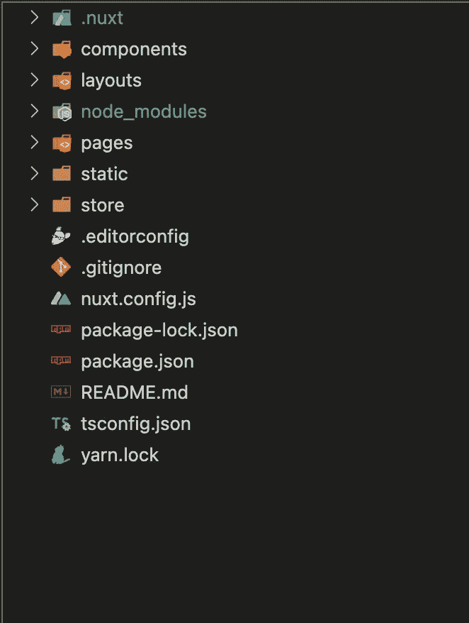

# Nuxt.js 是否有过度工程化的可能？

> 原文：<https://javascript.plainenglish.io/does-nuxt-js-have-the-potential-of-over-engineering-8d75d7d5c573?source=collection_archive---------6----------------------->

我决定创建自己的网站来分享我的职业生涯。我计划通过它分享我的作品和建议。既然有经验，就决定用 Vue.js 来搭建自己的应用。我带着一些疑虑开始考虑使用 Nuxt.js，这让我做了一些研究。在这篇文章中，我想分享我为什么决定使用 Nuxt.js。希望考虑利弊可以帮助你为下一个应用程序选择框架。本文假设您已经熟悉使用 Vue.js 进行开发。

## Nuxt 到底是什么？

*这是一个构建在 Vue 之上的高级框架，帮助您构建生产就绪的 Vue 应用*。这意味着您的应用程序仍在使用 Vue.js，但它为您提供了 Vue 无法提供的开箱即用的功能和可伸缩性。他们的座右铭是“轻松创建快速网站”。让我们看看怎么做。

## 1.文件夹结构

Nuxt 基于 Vue 应用程序的最佳实践来设置您的项目。当然，您可以在以后自由地更改它，但是下面是它是如何与 nuxt@2.15.8 版本的默认 Nuxt 应用程序一起提供的。

Folder structure that comes with Nuxt.js

这里的好处是你不必浪费时间去寻找最佳实践，它已经为你开始开发做好了准备。

## 2.它附带预配置

当您启动 Nuxt 应用程序时，vuex、路由器和更多插件的配置已经准备就绪。也许你已经注意到了上面的 nuxt.js.config 文件。这意味着您可以覆盖 Nuxt 提供的任何现成的预配置。所以没必要大惊小怪。当你开始一个新项目时，它可以节省你很多时间和精力。

我想在这里补充一个额外的提示；在 Nuxt 3 中，Vite 成为了默认的捆绑器。你不需要在你的 Nuxt 应用程序中安装 *vite* 。

## 3.准备好路线

在 Vue 应用程序中，开发人员负责在路由器文件中创建各种路由和相关组件。Nuxt 使用`/pages`目录下的文件夹结构来自动配置 Vue 路由器并生成你的 URL。

## 3.搜索引擎友好

这是我最喜欢的部分，它是搜索引擎优化友好。Nuxt 是预先配置的，可以在服务器上生成应用程序，还可以启动您的路线，以便于添加与 SEO 相关的标签。因为它，搜索引擎可以很容易地索引你的内容，这提高了你的搜索引擎优化。查看 [Vue-meta 插件](https://github.com/nuxt/vue-meta)，它可以帮助你管理 Vue.js 组件中的 HTML 元数据，并支持 SSR。Nuxt 已经在使用 vue-meta 插件，所以不需要安装它，你可以开始在你的应用程序中添加 meta 标签。

但是让我们看看 Nuxt.js 是如何在服务器上生成应用程序的。这很有趣，也解决了一个额外的问题。

# 通用模式

我假设你已经熟悉单页应用程序(SPA)的好处。SPA 在浏览器中执行逻辑，而不是在服务器中。当用户导航到另一条路线时，服务器仍然返回*index.html*。浏览器请求 js 文件，服务器返回 JS 文件。浏览器执行逻辑并显示页面。因此，它不会在您每次浏览应用程序时都刷新。但是你可以预期这是一个比渲染 HTML 代码慢的过程。

Nuxt 的解决方案是将 JS 代码分割成更小、更易管理的代码块，从而缩短加载时间。所以当你浏览新的路径时，比如说/articles，只有 *articles.js* 文件会被发送到浏览器。这样浏览器就不会下载所有可能永远不需要的文件。服务器将在 HTML 文件发送到浏览器之前呈现它。但是在页面呈现后，服务器发送 JS 文件，当用户浏览页面时，应用程序的行为类似于 SPA。Nuxt 称之为“水合作用”，app 的行为将完全像一个 SPA，但由于服务器渲染，它将更快。

Nuxt 的另一个神奇之处是，[它最近引入了智能预取](https://nuxtjs.org/announcements/introducing-smart-prefetching)。当您在页面上看到一个 nuxt-link 时，它已经预取了这些页面的 JS 文件。

通用模式很棒，但前提是你的内容变化太频繁。如果它不经常改变，为什么每次请求都生成一个 HTML？就我而言，只有当我上传一篇新文章到我的网站时，我的内容才会改变。使用通用模式似乎有些过了。Nuxt 有一个静态站点生成部署的解决方案。对于静态站点生成的部署，HTML 加载一次，然后部署到服务器。它基本上会将所有的网站生成到你本地电脑的 dist 文件夹中。这种部署使得网站 SSR 的行为类似于 SPA，但只生成一次。主要的好处是它快速而安全。你可以在这里查看如何做[。](https://nuxt.com/docs/getting-started/deployment#static-hosting)

## Nuxt 是否有潜在的过度工程化？

我的第一直觉是创建一个没有任何框架或插件的 Vue3 应用程序，这样我就可以控制正在发生的事情。经过一点研究，我发现 Nuxt 是一个强大且功能丰富的框架。向项目中添加许多特性和依赖项是很容易的，甚至是不必要的。这可能会使您的项目更加复杂，甚至难以调试依赖关系的一些内部问题。

此外，这意味着它是 Vue 框架之上的另一个框架。这听起来像是超负荷了，尤其是对于一个简单的项目。虽然 nuxt.js 试图通过预配置为您赢得一些时间，但它可能需要一些时间来适应框架。另一方面，它为你提供了一个很好的寻求帮助的社区。

总的来说，选择一个框架是个人的决定，它高度依赖于你和项目。但是考虑到好处，我已经决定在我的下一个项目中使用 Nuxt.js。在我的例子中，我发现了 [Nuxt-Content 库](https://github.com/nuxt/content)，它支持 Nuxt3 并从 Vue 组件生成 Markdown。如果你打算创建一个博客网站，我强烈推荐你去看看。希望我的研究有助于你做决定。

*更多内容看* [***说白了。报名参加我们的***](https://plainenglish.io/) **[***免费周报***](http://newsletter.plainenglish.io/) *。关注我们关于* [***推特***](https://twitter.com/inPlainEngHQ)[***LinkedIn***](https://www.linkedin.com/company/inplainenglish/)*[***YouTube***](https://www.youtube.com/channel/UCtipWUghju290NWcn8jhyAw)*[***不和***](https://discord.gg/GtDtUAvyhW) *。对增长黑客感兴趣？检查* [***电路***](https://circuit.ooo/) *。*****