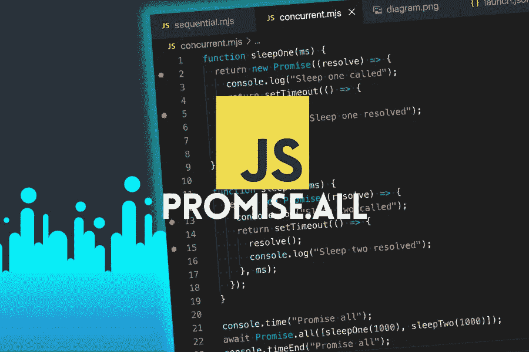
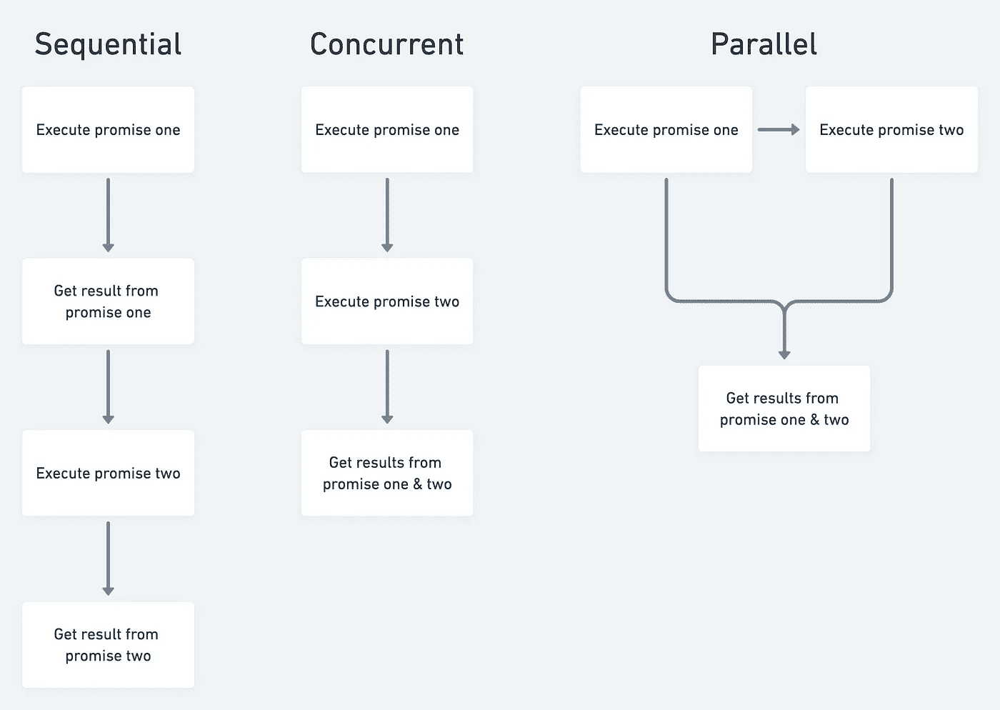

# Promise.all 并行执行吗？Promise.all 如何在 JavaScript 中工作

> 原文：<https://javascript.plainenglish.io/does-promise-all-execute-in-parallel-how-promise-all-works-in-javascript-fffc2e8d455d?source=collection_archive---------3----------------------->

我在网上看到一些人称赞 [Promise.all](https://developer.mozilla.org/en-US/docs/Web/JavaScript/Reference/Global_Objects/Promise/all) 允许你的承诺并行运行。虽然这个技巧的精神是正确的，但是在 Promise.all 中可能会加速多个承诺的执行，从技术上来说“并行”这个词是不正确的。

在这篇文章中，我将尽可能简单地解释 Promise.all 是如何工作的，以及为什么它不能并行运行。

## 顺序与并发与并行

为了理解 JavaScript 的 Promise.all 是如何工作的，我们首先需要理解三种不同的执行范例，顺序、并发和并行。

为了说明这些范例，我将使用以下两个承诺。

顺序执行意味着执行并解决一个承诺，然后执行并解决下一个承诺，直到程序结束。下面的代码执行顺序性。

睡眠功能一执行并解决，然后睡眠功能二执行并解决，最后程序退出。

另一方面，并发执行意味着一个承诺将被执行，而不需要等待它解决，下一个承诺将被执行，最后，当所有承诺都被解决时，程序将退出。以下代码同时执行。

睡眠功能一将执行，并且不等待它解决，睡眠功能二将执行。当两个承诺都完成时，程序退出。

如你所见，Promise.all 并发执行代码，但什么是并行执行呢？

JavaScript 是单线程的，一次只能执行一个工作块，所以并行执行对于 JavaScript 来说是不可能的，除了一些情况，比如 [web workers](https://developer.mozilla.org/en-US/docs/Web/API/Web_Workers_API/Using_web_workers) 。

并行执行意味着多个代码单元可以同时执行。在上面的例子中，这意味着睡眠功能一和睡眠功能二在完全相同的时间执行，而实际情况并非如此。

## 那么，为什么要用 Promise.all 呢？

Promise.all 非常强大，尤其是在执行 I/O 操作时，在 Promise 执行之后，应用程序不需要做任何工作，比如网络或数据库请求。允许一次发送多个请求意味着应用程序在等待网络请求响应时不会被阻塞。

🌎请跟随我:

YouTube:【https://www.youtube.com/TomDoesTech 

不和:[https://discord.gg/4ae2Esm6P7](https://discord.gg/4ae2Esm6P7)推特:[https://twitter.com/tomdoes_tech](https://twitter.com/tomdoes_tech)脸书:https://www.facebook.com/tomdoestech insta gram:https://www.instagram.com/tomdoestech☕给我买杯咖啡:[https://www.buymeacoffee.com/tomn](https://www.buymeacoffee.com/tomn)

*更多内容看* [***说白了就是 io***](https://plainenglish.io/) *。报名参加我们的* [***免费周报***](http://newsletter.plainenglish.io/) *。关注我们关于*[***Twitter***](https://twitter.com/inPlainEngHQ)*和*[***LinkedIn***](https://www.linkedin.com/company/inplainenglish/)*。加入我们的* [***社区***](https://discord.gg/GtDtUAvyhW) *。*