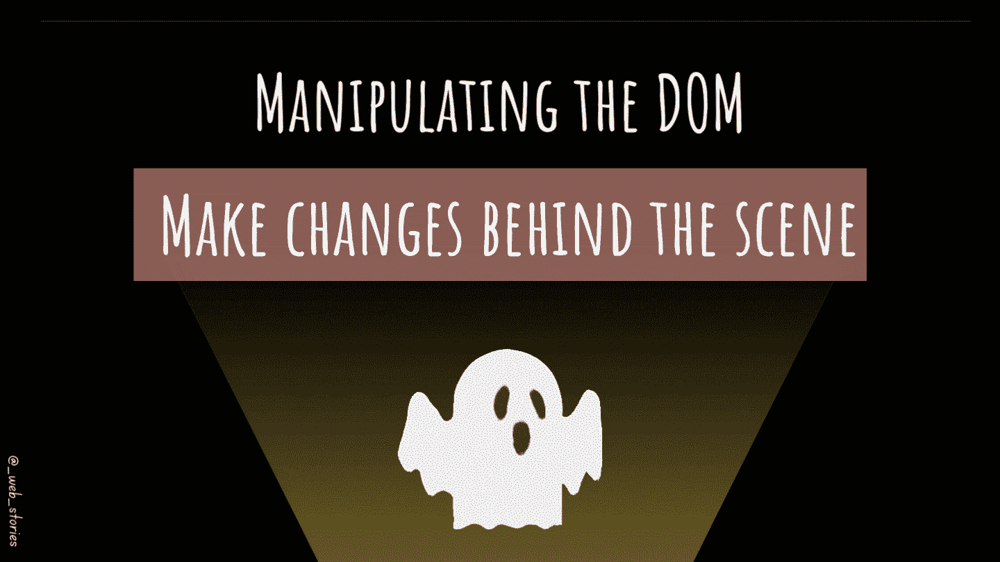

# 👻DOM 操作

> 原文：<https://javascript.plainenglish.io/dom-manipulation-13959986300?source=collection_archive---------15----------------------->

## 实时进行幕后更改



By FAM

## 你好👋

[上次](/selecting-dom-elements-e33fb235e81d)，你学习了选择 DOM 元素。是时候用这些元素做事了！

我们可以用 DOM 做很多事情。以下是一些常见的用法:

## 1.获取和设置元素的文本

```
const header= document.**querySelector**('h1');// Get the header text:
console.log(header.**textContent**);// Set/change the header text
header.**textContent** = 'This is the new header';
```

💡返回的元素是在 DOM 树中找到的第一个头`h1`。内容仅针对第一个标题进行更改。

## 2.迭代选择器元素

假设你有一个物品清单。每个项目都有一个 CSS 类`.item`。您可以通过使用`querySelectorAll`方法来遍历所有条目。

```
const items = document.**querySelectorAll**('.item');items.forEach( item => item.**style.color** = 'pink');
```

## 3.在 DOM 中创建新的元素

```
 const newParagraph = document.**createElement**('p');newParagraph.**textContent** = "This is a new paragraph added to the webpage through JS script thanks to the DOM object";// To see it added to your web page you need to append it to an // existing element or the body
document.**body**.**appendChild**(newParagraph);
```

## 4.移除 DOM 中的元素

当它已经是基于节点的引用，而不是具有父元素的元素时。你需要使用`**element.remove(...)**`。当元素有父元素时，您需要将它作为子元素移除(就像从`ul`列表`**parentelement.removeChild(...)**`中移除一个`li`)。

```
// remove a node (element without a parent)
const msg= document.**getElementById**("error");
msg.**remove()**;// remove an element inside a parent element
const items= document.**getElementById**("items");
items.**removeChild**(items.**children[0]**); //remove the first child
```

## 5.更改样式(CSS)

```
const element = document.querySelector('p');element.**style**.**color** = 'lightgray';
element.**style**.**backgroundColor** = 'black';
element.**style**.**padding** = '10px';
```

## 6.隐藏或显示元素

为此，我们将通过更改`display`属性来利用元素样式。您也可以使用`visibility`属性，但是它不会隐藏整个元素。它只会隐藏元素的内容，它的位置保持不变。

```
const header = document.**getElementById**('myheader');//hide
header.**style.display** = "none";//show
header.**style.display** = "block"; // or any other value based on what you need to see
```

你可以让它看起来像有鬼一样👻用`setYimeout()`玩你的网页:

```
element**.style.display**="none";
**setTimeout(**() => {
  element.**style.display**="block"; // show after 5 seconds
}, 5000**);**
```

我们可以用 DOM 做无数的事情！你需要谷歌一下。你会找到合适的方法来满足客户的需求。

今天就到这里，看阿雅🙋

如果您有任何问题或反馈，请点击评论或通过 LinkedIn 联系我— **我洗耳恭听！**

[**想请我喝杯咖啡吗？☕️**](https://www.buymeacoffee.com/fatimaamzil)

> 让我们为 2022 年打造一个更好的‘我们’！

## 了解有关 2022 年网络快车计划的更多信息:

I- [网络常识](https://medium.com/geekculture/2022-web-program-chapter-n-1-is-done-499fb0707220?source=your_stories_page----------------------------------------)

[II-网页骨架:HTML](https://famzil.medium.com/your-html-essentials-69d9b2349355?source=your_stories_page----------------------------------------)

[III-网页样式:CSS](https://medium.com/geekculture/recap-of-the-css-chapter-ae388d51e564?source=your_stories_page----------------------------------------)

网络互动:JavaScript

## 虚拟物料清单和 DOM

*   [什么是 BOM 和 DOM](https://medium.com/geekculture/what-are-the-dom-and-bom-9fb1a3ed736f?source=your_stories_page-------------------------------------) ？
*   [元素选择器](/selecting-dom-elements-e33fb235e81d)

**操纵 DOM**

*   迭代节点列表
*   属性和样式操作
*   Ajax & Fetch
*   事件冒泡和委托
*   事件循环
*   阴影 DOM
*   蜜蜂

[](https://medium.com/geekculture/2022-web-program-is-launched-f38a3280af1a) [## 2022 网络计划启动！

### 改变来自心态和习惯

medium.com](https://medium.com/geekculture/2022-web-program-is-launched-f38a3280af1a) 

与想成为 web 开发人员的人分享该程序！这将有助于保持进步，并在旅途中互相帮助。

*如果你喜欢我的文章，* [***订阅***](https://famzil.medium.com/subscribe) *获取我的最新。如果你自己喜欢体验媒介，可以考虑通过**[***报名会员来支持我和其他成千上万的作家。它每月只需花费***5 美元，它支持我们，作家，你也有机会用你的写作**** **赚钱。当然，你可以随时取消会员资格。通过注册**](https://famzil.medium.com/membership) *[*这个链接*](https://famzil.medium.com/membership) *，你就直接用你的一部分费用来支持我，不会多花你多少钱。如果你这样做了，万分感谢！***

**让我们在 [**上**取得联系****](https://medium.com/@famzil/)**[**Linkedin**](https://www.linkedin.com/in/fatima-amzil-9031ba95/)**[**脸书**](https://www.facebook.com/The-Front-End-World)**[**insta gram**](https://www.instagram.com/the_frontend_world/)**[**YouTube**](https://www.youtube.com/channel/UCaxr-f9r6P1u7Y7SKFHi12g)**或**[](https://twitter.com/FatimaAMZIL9)**********

********[](https://famzil.medium.com/membership) [## 通过我的推荐链接——FAM 加入 Medium

### 作为一个媒体会员，你的会员费的一部分会给你阅读的作家，你可以完全接触到每一个故事…

famzil.medium.com](https://famzil.medium.com/membership) 

*更多内容看* [***说白了就是***](https://plainenglish.io/) *。报名参加我们的* [***免费周报***](http://newsletter.plainenglish.io/) *。关注我们关于*[***Twitter***](https://twitter.com/inPlainEngHQ)*和*[***LinkedIn***](https://www.linkedin.com/company/inplainenglish/)*。查看我们的* [***社区不和谐***](https://discord.gg/GtDtUAvyhW) *加入我们的* [***人才集体***](https://inplainenglish.pallet.com/talent/welcome) *。*********