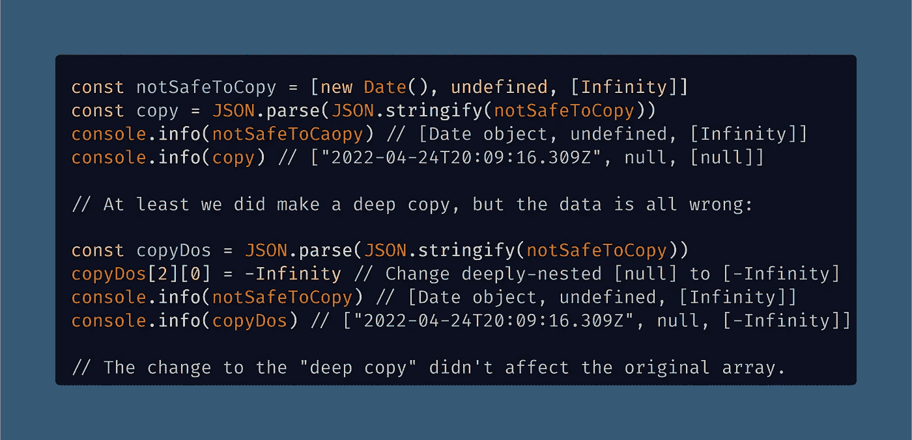
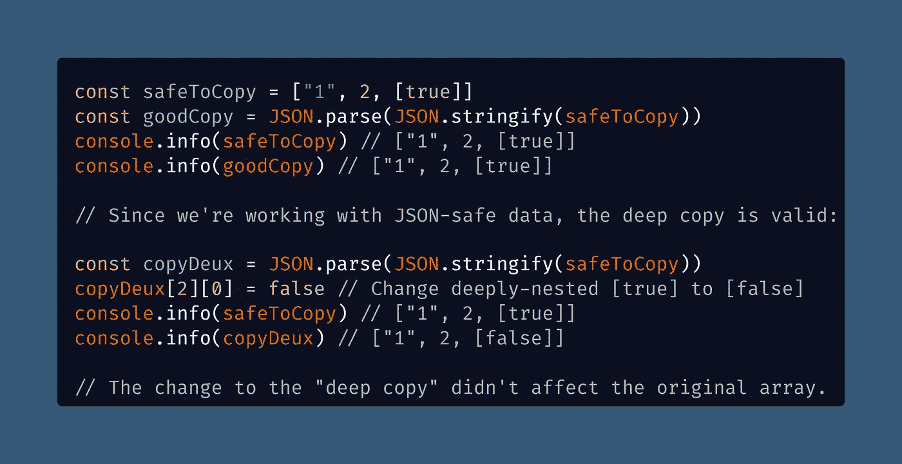

# 不要用 JSON 深度复制。Stringify 和 JSON。用 JS 解析——原因如下

> 原文：<https://javascript.plainenglish.io/dont-deep-copy-with-json-stringify-and-json-parse-in-js-here-s-why-c3f2783661e9?source=collection_archive---------2----------------------->

## 如果您关心常见的数据类型，包括正确获得深度复制的`Date`对象和`undefined`，请注意这种由 JSON 规范中的怪癖引起的常见错误。

Photo by [Quaritsch Photography](https://unsplash.com/@quaritsch?utm_source=medium&utm_medium=referral) on [Unsplash](https://unsplash.com?utm_source=medium&utm_medium=referral)

如果我问你一个面试问题，向我解释一下[JavaScript Object Notation(JSON)](https://medium.com/swlh/what-is-json-used-for-in-javascript-programming-9d71284359a9)，你会提到它的具体局限性吗？

 [## JSON 在 JavaScript 编程中是用来做什么的？

### JSON (JavaScript Object Notation)是一种常用的文件格式，用于存储数据，而不是像 XML 或 YAML 这样的替代文件

medium.com](https://medium.com/swlh/what-is-json-used-for-in-javascript-programming-9d71284359a9) 

如果我来回答这个问题，我可能不会提到任何限制。我认为 JSON 是一种有用的编写 JavaScript 对象的方法，使用的语法基本上与 JS 本身相同。

除此之外，我要补充的是，它通常用于以文本格式存储数据，并且有`JSON.stringify()`和`JSON.parse()`助手方法。

 [## 如何在 JavaScript 中使用 JSON.stringify()和 JSON.parse()

### JSON.stringify()和 JSON.parse()是处理 JSON 格式内容的有用工具

javascript.plainenglish.io](/how-to-use-stringify-and-parse-in-javascript-6b637b571a32) 

但是我会完全跳过 JSON 的限制和怪癖，从它不能处理许多常见的数据类型到我实际上更喜欢使用`[ES6 export](https://medium.com/p/3242c9eae48c)`将对象存储在`.js`(或者`.ts`，对于 [TypeScript](/how-to-sort-imports-in-typescript-automatically-in-vs-code-f4fe4e499bb1) )文件中。

我猜[我不会雇佣自己](https://blog.devgenius.io/why-you-cant-just-be-a-software-engineer-689e56eacef3)做[高级开发人员](/top-10-advanced-vs-code-settings-for-senior-developers-46e348351bd6)或者类似的事情。好吧，也许这有点苛刻。你还记得你头顶上的限制吗？如果你有，你比我强。如果没有，请继续阅读！

# JSON 的局限性，以及它们的重要性

在你的记忆库中，你可能有一个模糊的记忆，JSON 并不完美，某些数据类型不能被"[序列化](https://www.oreilly.com/library/view/javascript-the-definitive/9781449393854/ch06s09.html)"

这么说吧，JSON 规范有点粗糙，以至于我已经习惯了为 JavaScript 代码格式化器更漂亮的而不是默认的`.prettierrc`制作一个`[prettier.config.js](https://betterprogramming.pub/how-to-set-up-vs-code-like-a-pro-in-just-5-minutes-65aaa5788c0d)`文件。

在这种情况下，没有什么理由更喜欢使用`.js`文件扩展名而不是隐含的 JSON 文件扩展名`.prettierrc`，但我还是这么做了。

这有助于提醒我 JSON 中存在某些问题，例如:

*   在 JSON 文件的列表中不能有尾随逗号，但是在 JavaScript 中可以，这会影响到[对象](https://levelup.gitconnected.com/how-to-check-for-an-object-in-javascript-object-null-check-3b2632330296)和[数组](/how-to-check-for-an-array-in-javascript-6ad20f7a0e21)的语法。
*   值`[undefined](https://medium.com/coding-at-dawn/how-to-check-for-undefined-in-javascript-bcedd62c8ad)`无效，`[Symbol](/how-to-check-for-a-symbol-in-javascript-30c3f294ea65)` s 无效，`[Function](/how-to-check-for-a-function-in-javascript-986248827790)`s 也无效。
*   `Date`值通过`[date.toISOString()](https://developer.mozilla.org/en-US/docs/Web/JavaScript/Reference/Global_Objects/Date/toISOString)`进行转换，因此它们可以存储为[字符串](/how-to-check-for-a-string-in-javascript-a16b196915ff) [原语](/what-are-primitive-types-in-javascript-671909def6ca)。
*   特殊的 [JavaScript 数字](/how-to-check-for-a-number-in-javascript-8d9024708153) `[NaN](/how-to-check-for-a-number-in-javascript-8d9024708153)` [(非数字](/how-to-check-for-a-number-in-javascript-8d9024708153))和`[Infinity](https://medium.com/swlh/what-is-infinity-in-javascript-%EF%B8%8F-1faf82f100bc)`被转换成`[null](/how-to-check-for-null-in-javascript-dffab64d8ed5)`，尽管`[-0](https://medium.com/coding-at-dawn/is-negative-zero-0-a-number-in-javascript-c62739f80114)` [(负零)](https://medium.com/coding-at-dawn/is-negative-zero-0-a-number-in-javascript-c62739f80114)也可以。

哇，真是一大堆无聊的琐事，对吧？不对！正如我们将在后面看到的，当试图用 JavaScript 进行深层复制时，您可以对您的数据集进行修改。

# 关于 JSON 需要知道的其他重要事情

在处理某些数据类型时，还有一些其他重要的差异会导致特定的问题:

*   “如果值有一个`[toJSON()](https://developer.mozilla.org/en-US/docs/Web/JavaScript/Reference/Global_Objects/JSON/stringify#tojson_behavior)`方法，它负责定义哪些数据将被序列化。[…]
*   `JSON.stringify()`可以在传入`JSON.stringify(function() {})`或`JSON.stringify(undefined)`等“纯”值时返回`undefined`。
*   所有`[Symbol](https://developer.mozilla.org/en-US/docs/Web/JavaScript/Reference/Global_Objects/Symbol)`键控属性将被完全忽略，即使使用`replacer`功能。
*   所有其他的`[Object](https://developer.mozilla.org/en-US/docs/Web/JavaScript/Reference/Global_Objects/Object)`实例(包括`[Map](https://developer.mozilla.org/en-US/docs/Web/JavaScript/Reference/Global_Objects/Map)`、`[Set](https://developer.mozilla.org/en-US/docs/Web/JavaScript/Reference/Global_Objects/Set)`、`[WeakMap](https://developer.mozilla.org/en-US/docs/Web/JavaScript/Reference/Global_Objects/WeakMap)`和`[WeakSet](https://developer.mozilla.org/en-US/docs/Web/JavaScript/Reference/Global_Objects/WeakSet)`)将只有它们的可枚举属性被序列化。"
    — [MDN 文档](https://developer.mozilla.org/en-US/docs/Web/JavaScript/Reference/Global_Objects/JSON/stringify#description)

把这些都放在一起，JSON 没用吗？我们是否应该将对象加载到 JavaScript 文件中，而不是 JSON 文件中，然后就此结束？

实际上 JSON 很好，但是有时候(比如使用`undefined`)你可能需要将 JavaScript 对象保存为`.js`文件，而不是`.json`。

但是还有一件更重要的事情需要记住，那就是[数组嵌套在](https://en.wikipedia.org/wiki/Recursive_islands_and_lakes)数组内部的数组内部。

# 关键要点:记住这些 JSON 限制会影响深层副本

JSON 在其规范中具有某些怪癖的最重要的影响与使用内置递归算法来深度复制 JavaScript 中的“深度嵌套”对象有关。

当处理类似于 [Matryoshka doll](https://en.wikipedia.org/wiki/Matryoshka_doll) 的数据结构时，你需要小心，你成功地“深度复制”了所有的对象，正如我在我以前的权威指南中谈到的那样。

 [## 如何在 JavaScript 中深度复制对象和数组

### 复制对象或数组的常用方法只能进行浅层复制，所以深度嵌套的引用是个问题…

javascript.plainenglish.io](/how-to-deep-copy-objects-and-arrays-in-javascript-7c911359b089) 

既然 `JSON.stringify()`将成功地将其他对象内部的对象(“深度嵌套”对象和数组)编码成 JSON 格式，那么很明显，您可以使用`JSON.parse()`进行“深度复制”。

事实上，这是网上给出的关于如何深度克隆可能包含其他对象的对象数组的常见解释——只需使用 JSON，深度复制对象就再也不会有任何问题了。

*下面是要知道的。* **如果**你的深度嵌套[对象](https://levelup.gitconnected.com/how-to-check-for-an-object-in-javascript-object-null-check-3b2632330296)或数组只包含某些原始值([字符串](https://medium.com/javascript-in-plain-english/how-to-check-for-a-string-in-javascript-a16b196915ff)、[数字](https://medium.com/javascript-in-plain-english/how-to-check-for-a-number-in-javascript-8d9024708153)、[布尔](/how-to-check-for-a-boolean-in-javascript-98fdc8aec2a7)、[空值](/how-to-check-for-null-in-javascript-dffab64d8ed5)，那么你可以使用`JSON.parse()` & `JSON.stringify()`进行深度复制而不会出现问题。

让我们来看看当你尝试使用这种方法深度复制`undefined`、`[Date](https://medium.com/coding-in-simple-english/how-to-parse-a-date-using-a-regular-expression-in-javascript-f4e5b1d02935)`、[、](https://medium.com/coding-in-simple-english/how-to-parse-a-date-using-a-regular-expression-in-javascript-f4e5b1d02935)、`[RegExp](https://medium.com/coding-in-simple-english/how-to-parse-a-date-using-a-regular-expression-in-javascript-f4e5b1d02935)`、[对象](https://medium.com/coding-in-simple-english/how-to-parse-a-date-using-a-regular-expression-in-javascript-f4e5b1d02935)或`[Infinity](https://medium.com/swlh/what-is-infinity-in-javascript-%EF%B8%8F-1faf82f100bc)`时会发生什么。记住，这些都是不可序列化的 JSON 数据的例子，所以我们预计会有意想不到的结果。

# 带有不可序列化的 JSON 数据的`Date`

正如您将要看到的，当处理无法“字符串化”的不可序列化的数据时，我们的深层副本不会成功

我在使用内置 JavaScript `[Date](https://medium.datadriveninvestor.com/how-to-find-unique-dates-in-an-array-in-javascript-efd87ecfea66)`对象时最常遇到这个问题，该对象被转换成 ISO 字符串。

顺便说一下，您可能想阅读我的另一篇文章，这篇文章使用[ES6](https://medium.com/coding-at-dawn/how-to-use-set-to-filter-unique-items-in-javascript-es6-196c55ce924b)对象来查找数组中包含的唯一的`Dates`:

 [## 如何在 JavaScript 中查找数组中的唯一日期

### JavaScript 有三种方法来定义日期对象是否惟一:它是否有惟一的对象引用…

medium.datadriveninvestor.com](https://medium.datadriveninvestor.com/how-to-find-unique-dates-in-an-array-in-javascript-efd87ecfea66) 

那篇文章还讨论了一些关于“对象引用”的细节，以及在 JavaScript 中作为唯一对象的真正含义。

现在，我们将看到当我们试图将不“JSON 安全”的数据输入到`JSON.parse()`和`JSON.stringify()`的等待口中时会发生什么。

# 复制不安全:`Date`、`undefined`和`Infinity`

在第一个例子中，我们成功地制作了深层副本，但是由于 JSON 的限制，我们在这个过程中丢失了所有数据:

[View raw code](https://gist.github.com/DoctorDerek/4b3f092b6fdc9ce3143b9bafaadba752) as a GitHub Gist

从上面我们可以看到，我们确实有一个“深度克隆”，我们可以在不影响原始对象或数组的情况下改变嵌套值。

# 安全复制 JSON 数据:原始类型

另一方面，如果您能够保证您的数据只包含某些 JSON 认可的原语，那么您就可以参加比赛了。

[View raw code](https://gist.github.com/DoctorDerek/f71798fd5498345ba3d0f4ce3253d397) as a GitHub Gist

是的，这肯定比编写自定义递归函数或导入一些外部依赖项更方便。

毕竟，不管怎样，谁会费心去记住[你是应该使用](https://medium.com/p/3242c9eae48c) `[import](https://medium.com/p/3242c9eae48c)` [还是](https://medium.com/p/3242c9eae48c) `[require](https://medium.com/p/3242c9eae48c)`来加载那个 Lodash 助手函数呢？

 [## JavaScript 中 ES6 的“导入”和 ES5 的“要求”之间的巨大差异

### 你还在代码库中使用 require 吗？让我们尽快将您升级到现代 JavaScript 导入语法…

javascript.plainenglish.io](/the-huge-difference-between-es6-import-and-es5-require-in-javascript-3242c9eae48c) 

这种方法不一定管用，真的太可惜了。JavaScript 中没有可靠的内置深度复制方法，t [哼哼的是 breaks](https://www.urbandictionary.com/define.php?term=Them%27s%20the%20breaks) 。

# 第二个要点:在 JavaScript 中用 JSON Parse 和 Stringify 进行深度复制什么时候是安全的？

在某些情况下，使用我们在这里讨论的 JSON helper 方法进行深度复制是完全安全的。

事实上，知道如何方便地做到这一点可能会在任何涉及深层拷贝话题的技术面试中有所帮助。

另一方面，如果面试官期待的是递归算法，那么随便使用`JSON.stringify()`和`JSON.parse()`可能会让你看起来很糟糕。

我想说，你回答这个问题的方式应该取决于该公司是否热衷于“技术不可知论”

对于像谷歌、脸书这样的大雇主，以及某些喜欢在面试中问关于算法和数据结构的问题的小公司，你可能应该准备实施一个定制的递归解决方案。

如果你申请的是一家更“致力于”某项技术的公司，比如我只申请了使用 Next.js (React)和 Tailwind CSS 的公司，那么我认为你使用 JSON `stringify()`和`parse()`会很安全。

事实上，记住本文中的 JSON 限制是展示您 JavaScript 知识深度的一种有用方式，特别是如果您能够将它与您以前的工作联系起来。[能挖吗？](https://www.youtube.com/watch?v=V-OYKd8SVrI)

# 延伸阅读:你知道怎么排序吗？

如果你喜欢这篇文章，你可能会喜欢阅读我在 Medium 上的其他作品，发表在 *Coding at Dawn* 和*JavaScript in Plain English*:

 [## 60 秒内排序:关于排序的快速 JavaScript 面试答案

### 开发者访谈经常会问到排序算法——以下是如何解释 10 种不同的排序算法…

medium.com\](https://medium.com/coding-at-dawn/sorts-in-60-seconds-speedy-javascript-interview-answers-on-sorting-acb72bdea8a2)  [## 如何在 JavaScript ES6 中对集合进行排序

### 需要排序一套？我已经用这个方便快捷的教程给你介绍了如何对一组独特的物品进行分类…

javascript.plainenglish.io](/how-to-sort-a-set-in-javascript-es6-51b53f6ef71a)  [## 如何在 JavaScript 中对字符串数组进行排序

### JavaScript 的默认值。sort()方法按字母升序对数组进行排序，如果您正在处理…

javascript.plainenglish.io](/how-to-sort-an-array-of-strings-in-javascript-5d59b1ac64be)  [## 给网络开发者的 46 条鼓励语录

### 过多的网络开发让你沮丧？当我有这种感觉时，我喜欢读这份引语清单，让自己振作起来…

medium.com](https://medium.com/coding-at-dawn/46-encouraging-quotes-for-web-developers-21f3e68a9fdd) 

或者，你可能已经是所有这些话题的专家了。那也很好。

**编码快乐！**🌠🍀🤞😉😄

Photo by [Girl with red hat](https://unsplash.com/@girlwithredhat?utm_source=medium&utm_medium=referral) on [Unsplash](https://unsplash.com?utm_source=medium&utm_medium=referral)

[德里克·奥斯丁](https://www.linkedin.com/in/derek-austin/)博士是《职业规划 [*:如何在 6 个月内成为一名成功的 6 位数程序员*](https://www.amazon.com/dp/B0BRJDLJ43) 的作者，现在亚马逊上有售。