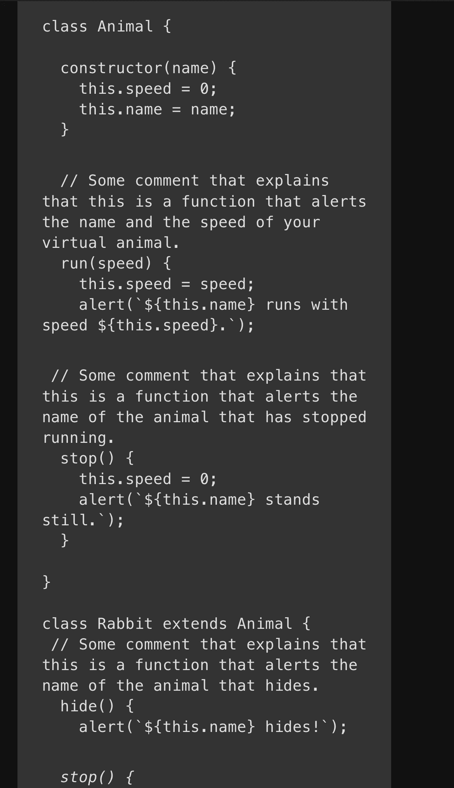
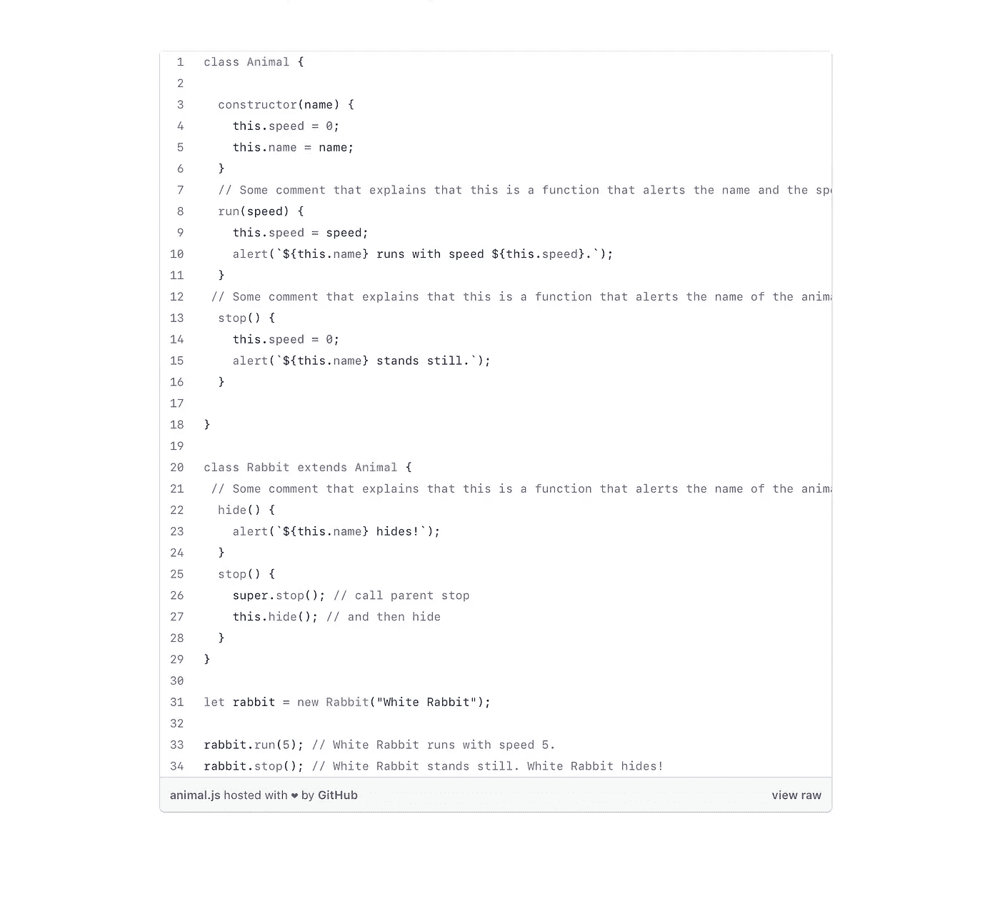
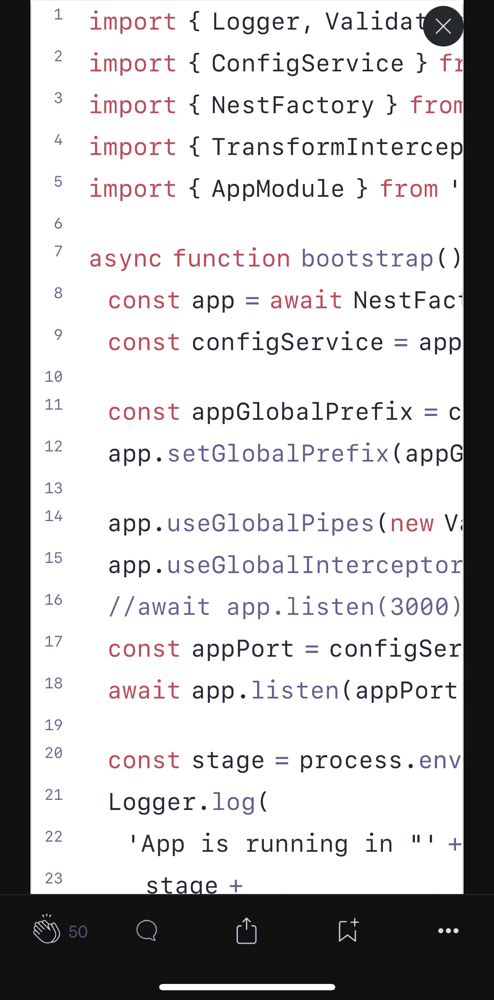
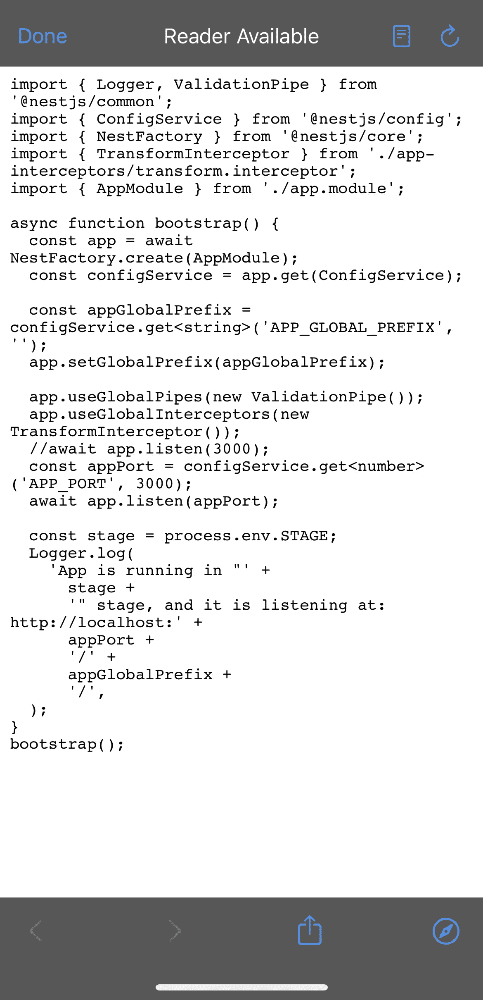
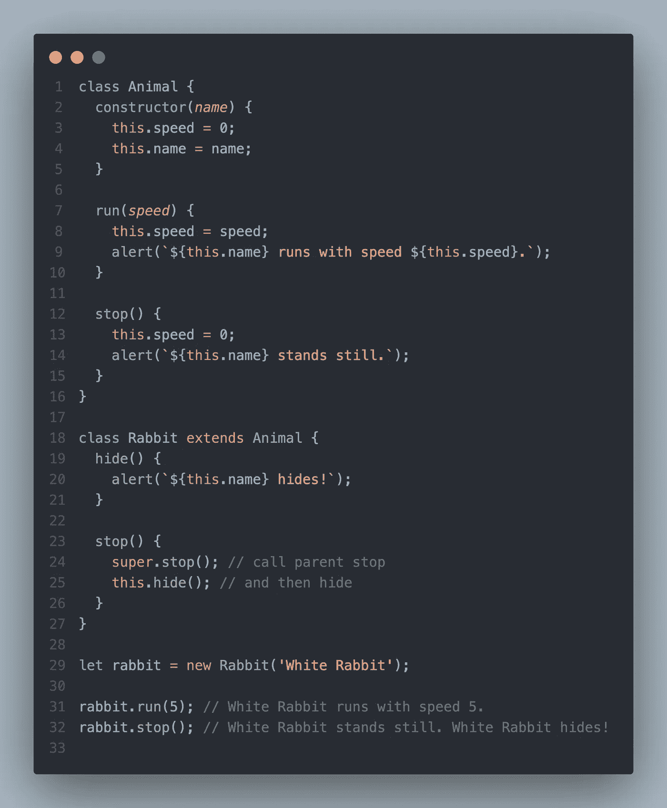
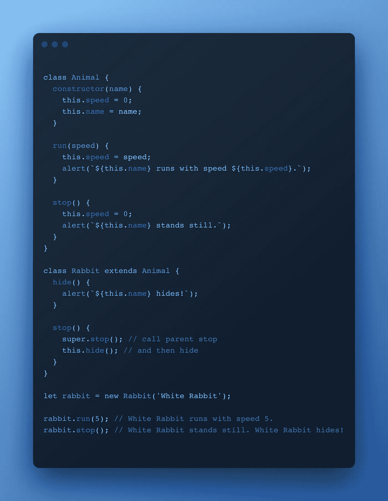
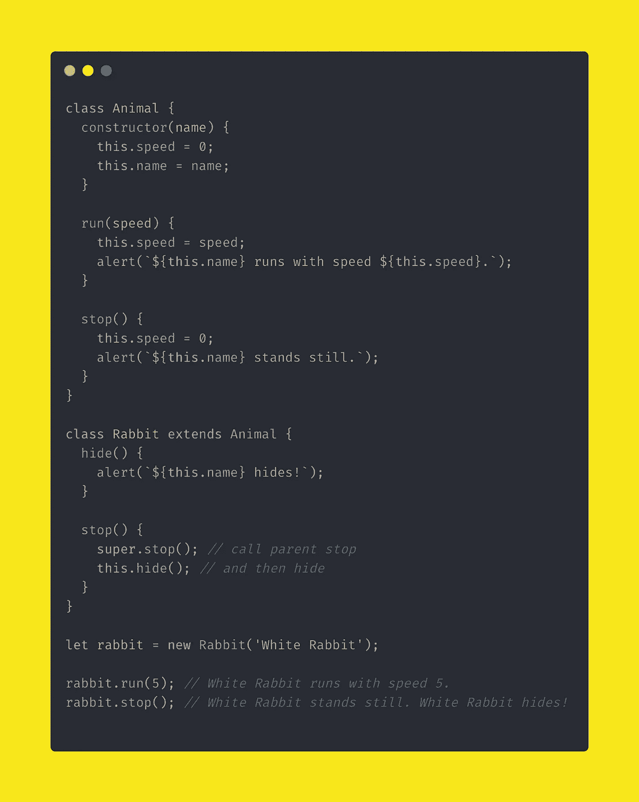
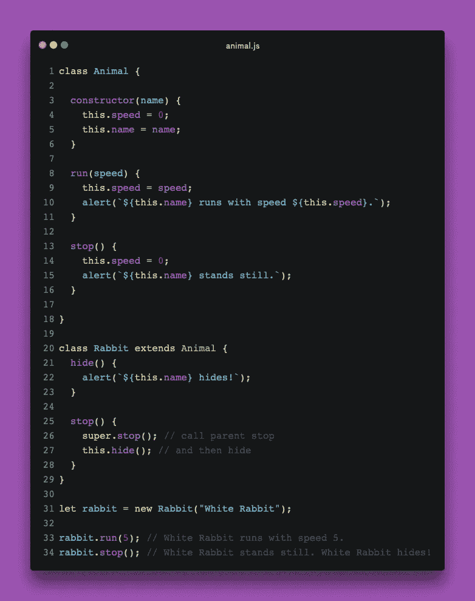

# 注意事项或如何在媒体中插入代码

> 原文：<https://javascript.plainenglish.io/dos-and-don-ts-or-how-to-insert-code-in-medium-6c98fab86948?source=collection_archive---------4----------------------->

## 有许多方法可以做到这一点，但我将向您展示最有效的方法。


Writing Code GIF from [gyfcat](https://gfycat.com/acceptableunevenindochinahogdeer)

在一篇中型文章中插入代码的方式主要有四种，嵌入式代码、GitHub gists、在线代码编辑器、代码截图。

现在让我们更深入地了解为什么你会选择一个而不是另一个，如果我是读者，我会喜欢哪一个。

# 嵌入式代码

## 内嵌代码

内联代码看起来是这样的，`const str = 'Hello World!'`要添加内联代码，你需要使用反斜线(`` ` ),它可以位于`esc`键的正下方。

当提到与编程相关的事情时，内联代码会很有用，例如，“`JavaScript`太棒了！”。或者，如上所示，只放一小段代码。

## 分组码

这种类型的嵌入式代码可以用于更大的代码片段。例如:

```
class Animal {
  constructor(name) {
    this.speed = 0;
    this.name = name;
  } run(speed) {
    this.speed = speed;
    alert(`${this.name} runs with speed ${this.speed}.`);
  } stop() {
    this.speed = 0;
    alert(`${this.name} stands still.`);
  }
}

let animal = new Animal("My animal");
```

可以看出，这不是插入代码的最有效方式。是的，它看起来和主文章不一样，你可以看出这是一个代码。然而，它越长，读者就越难理解代码中发生了什么。当涉及到一些评论时，情况会变得更糟。

```
class Animal {

  constructor(name) {
    this.speed = 0;
    this.name = name;
  } // Some comment that explains that this is a function that alerts the name and the speed of your virtual animal.
  run(speed) {
    this.speed = speed;
    alert(`${this.name} runs with speed ${this.speed}.`);
  } // Some comment that explains that this is a function that alerts the name of the animal that has stopped running.
  stop() {
    this.speed = 0;
    alert(`${this.name} stands still.`);
  }

}

class Rabbit extends Animal {
 // Some comment that explains that this is a function that alerts the name of the animal that hides.  
  hide() {
    alert(`${this.name} hides!`);
  } *stop() {
    super.stop(); // call parent stop
    this.hide(); // and then hide
  }*
}

let rabbit = new Rabbit("White Rabbit");

rabbit.run(5); // White Rabbit runs with speed 5.
rabbit.stop(); // White Rabbit stands still. White Rabbit hides!
```

**你最不想做的事情就是挫败一个疯狂寻找 bug 解决方案的程序员。**

我非常确定，不仅仅是我对这种类型的代码嵌入感到恼火。我的意思是，来吧，看看这个，这只是一个不同背景颜色和字体的文本。大多数时候，我只是关闭文章，尤其是当我在手机上阅读时。

如果你想知道它在手机上看起来怎么样，让我为你节省一些时间并分享截图。



Screenshot of a embedded code block from Medium’s mobile app

相当忙乱，不是吗？你会花时间检查这些乱七八糟的东西吗？我也没有。


GIF MEME of group of people doing face palm

> **注意:** Medium 现在支持代码高亮显示👨🏻‍💻这是它看起来的样子:

```
class Animal {
  constructor(name) {
    this.speed = 0;
    this.name = name;
  }
  run(speed) {
    this.speed = speed;
    alert(`${this.name} runs with speed ${this.speed}.`);
  }
  stop() {
    this.speed = 0;
    alert(`${this.name} stands still.`);
  }
}

let animal = new Animal("My animal");
```

非常整洁，希望他们不久将增加黑暗模式。亲爱的 [Medium Staff](https://medium.com/u/a32c340ea342?source=post_page-----6c98fab86948--------------------------------) ，如果你正在阅读这篇文章，请为那些正在编码或只想在晚上学习新东西的程序员添加黑暗模式🙃

# GitHub Gists

GitHub gists 只是实现上面显示的嵌入式代码块的一种更好的方式。

虽然 GitHub gists 有语法高亮，但是只在桌面上看起来还可以。你一在手机上打开它，它就变得和嵌入的代码块一样烦人。此外，GitHub gists 没有黑暗模式，这可能会困扰一些在手机上使用 Medium 黑暗模式的用户。

为了证明我的观点，我将提供桌面和移动版本的截图。

这是它在桌面上的样子:



Desktop screenshot of GitHub Gist in a Medium article

读者可能不介意在桌面版上侧滚来阅读评论的结尾，但我肯定他们会介意在移动版上侧滚来阅读每一行。

这是它在手机上的外观:



Mobile screenshot of GitHub Gist in a Medium article

每当我想在手机上阅读一篇文章，读到有一些代码示例的部分，看到这个，我就关闭。

但是有一天，我发现 GitHub 上有一个 raw 模式，并认为它在移动设备上可能看起来不错，但它看起来是这样的:



Mobile screenshot of GitHub Gist raw in a Medium article

它没有让你想起什么吗？是的，没错，它看起来就像一个嵌入的代码块。没有任何语法突出显示和适当的换行，这也缺少了较暗的背景色。

> **注意:**有些出版物要求您使用 GitHub gists，请在为特定出版物写作或向其提交之前检查指南。

我仍然认为 GitHub gists 是一种很酷的代码共享方式，但不一定是在中型文章中。

# 来自在线编辑器的代码

你可能听说过甚至使用过一些我将要提到的在线代码编辑器。比如:

*   [CodePen](https://codepen.io/)
*   [**代码沙箱**](https://codesandbox.io/)
*   [**栈闪电战**](https://stackblitz.com/)
*   [**JS 提琴**](https://jsfiddle.net/)
*   [**JSBin**](https://jsbin.com/)
*   [**回复**](https://replit.com)

您可以构建一个教程/项目，并使用这些在线编辑器与您的受众共享分步代码。我不会在这篇文章中详细讨论这些编辑器的优缺点，它们几乎是一样的，一些支持一些语言和技术，而另一些不支持，反之亦然。

在这种情况下，您需要根据您的教程/项目所使用的语言或技术来选择它们。

下面是我的 *CodePen* 项目中的一个例子:

CodPen Project Demonstration

这些编辑器的好处是它们可以在桌面和移动设备上工作。与嵌入式代码和 gists 不同，你可以在这里定制你的编辑器——比如主题、换行符和其他细节。有些编辑给出的选项比其他人多，但在这种情况下，少即是多。

# 代码截图

也许分享代码的最好方式之一，尤其是在博客中，就是截图。如今，代码截图不仅仅是一个 JPEG 或 PNG 文件。有很多工具可以帮助你创建一个很酷的代码片段，并以不同的格式分享它，这取决于你计划在哪里分享它。

## [代码快照](https://marketplace.visualstudio.com/items?itemName=adpyke.codesnap)

这是一个 [VSCode](https://code.visualstudio.com) 扩展，允许你选择和截图你的代码的任何部分。它的好处是，它带有许多定制选项，可以在设置中进行更改。

例如，您可以更改*背景颜色* **，** *框阴影* **，** *容器填充*等等。有关选项的完整列表，请查看他们的[文档](https://marketplace.visualstudio.com/items?itemName=adpyke.codesnap)。

下面是一个没有更改任何设置的屏幕截图示例:



Code screenshot from

## [雷.索](https://ray.so)

如果你正在寻找一个类似的选择，但是是一个在线版本，那么就这样吧。这是最简单的在线代码截图生成器。没有太多的主题可供选择，但它的工作。

您可以将图像保存为两种格式，SVG 和 PNG。但是，还有两种方法可以共享图片，即复制图片的链接或复制 URL。所有这些选项都可以在页面的右下角找到，上面写着*出口。*

下面是截图的样子:



Code screenshot from [ray.so](https://ray.so)

## [carbon.now.sh](https://carbon.now.sh)

另一个类似于前面工具的选项是**碳。碳纤维为定制提供了更多选择。例如，窗口类型、填充、阴影、行高等。**

此外，carbon 有更多的选择来分享你的杰作。你可以直接分享到 Twitter 上吹嘘说现在可以在`console`里印上你的名字了。或者你可以复制它作为一个图像，iframe，纯网址，或者你可以复制一个特殊的链接只是中等。

虽然最后一个选项让你的读者能够直接从你的文章中复制代码，但我不喜欢它被裁剪的事实，如果有人只想阅读它，他们必须上下滚动。

为了演示它的外观:

Code snippet from [carbon.now.sh](https://carbon.now.sh)

这是它的截图:



Code screenshot from [carbon.now.sh](https://carbon.now.sh)

## [代码 io](https://codeimg.io)

最后但同样重要的是， **codeimg** 是一个截图生成器，它给你最多的选项来改变你截图上的每一个细节。

除了这些可以改变的疯狂选项，还有一个选择画布大小的功能。你可以为 Twitter、脸书、Instagram 帖子、甚至 Instagram 故事等等选择画布。

该工具仍处于测试模式，但可以肯定地说，他们有很多更酷的东西即将推出。在写这篇文章的时候，还没有类似于前两个工具的特殊嵌入选项，但是他们正在努力。

目前，截图只能以 JPEG、PNG 和 SVG 格式下载。这是它的样子:



Code screenshot from codeimg.io

# 该做的和不该做的

## 嵌入式代码

**做**

*   使用`inline code`解释一个简短的概念。
*   用`inline code`提一些编程相关的东西。例如:“我现在已经编码 5 年了，我可以肯定地说`JavaScript`是我最喜欢的编程语言。”
*   只要你解释的内容足够短，读者能够立即理解，就使用`block code`。例如:

```
function sum(a, b) {
  return a + b;
}console.log(1, 2) // 3
```

**不要**

*   不要插入嵌入代码块的大片段，因为缺乏语法突出会使读者很难理解你试图解释/教授的内容。
*   不要插入嵌入式代码块，因为包括我在内的许多用户有时会在移动设备上浏览中型应用程序。嵌入式代码块在手机屏幕上变得拥挤，理解代码变得更加困难。

## GitHub Gists

**做**

*   如果您编写的出版物只接受这种代码插入格式，请使用 GitHub gists。
*   如果你不关心移动用户，使用 GitHub gists
*   如果你正在教一些必须运行才能看到结果的东西，使用 GitHub gists，因此移动用户无论如何都不能在他们的手机上运行代码。

**不要**

*   如果你共享一小段代码，比如一行函数，就不要使用 GitHub gists。
*   如果你想让移动用户看到和阅读你的代码而没有任何问题，比如侧滚，就不要使用 GitHub gists。
*   如果你关心黑暗主题，就不要使用 GitHub gists，因为与 Medium 的网站不同，该应用支持黑暗模式，而 GitHub gists 不支持。所以它们在 Medium 的文章上会一直以浅色模式出现。

## 来自在线编辑器的代码

**做**

*   如果你共享小的编码项目，比如我上面分享的那个，使用在线编辑器。
*   如果你想让读者能够在不离开你的文章的情况下与代码进行交互，那么就使用在线编辑器。
*   如果你在教一些东西，并且想让读者看到直接的结果，使用在线编辑器。

**不要**

*   如果你在解释一个不涉及任何视觉表现的小概念，比如:算法、挑战的解决方案，或者仅仅是一行程序。那些不需要任何可视化表示，所以在线编辑器可能有点过头了。

## 代码截图

**做**

*   使用截图来解释没有任何设计的简单概念，比如算法。
*   使用截屏来个性化文章，让读者能够将代码段保存为图像或文本。 [carbon.now.sh](https://carbon.now.sh) 非常适合这样做，因为你可以分享他们特殊的媒体链接，允许用户点击一下就可以将代码复制到他们的剪贴板上，你也可以分享一张图片，这样移动用户就可以保存图片以供将来参考。
*   如果你想确保在任何设备上使用截图。(台式机、平板电脑、移动设备)，您的代码片段将被看到，没有任何问题。

**不要**

*   如果你想让读者立即看到结果，就不要使用截图。
*   如果你希望读者能够与文章中的代码进行交互，就不要使用截图。

# 最后

这些该做的和不该做的只是建议，没有 100%正确或错误的答案。有些人可能会同意我的观点，说他们也发现当你在手机上浏览媒体时，在轻模式下侧滚 GitHub gists 很烦人。还有人会不同意，争论说如果只是截图，代码有什么用。

这就是为什么每个人都需要记住他们的受众是谁，他们提供什么类型的内容。因为如果使用正确，上面所有的例子都能让作者和读者受益。

使用正确的工具将你的观点传达给读者，这才是最重要的。其他的都只是喜好和风格的问题。

我希望这是有帮助的，如果你喜欢阅读这篇文章，请随时查看我下面的其他文章。

[](https://medium.com/@kens_visuals/membership) [## 通过我的推荐链接加入 Medium-Ken Nersisyan

### 用媒介释放你的潜能。立即加入，阅读我和其他顶尖作家的文章。读书，学习，变得更好…

medium.com](https://medium.com/@kens_visuals/membership) 

## **延伸阅读**

[](/how-to-master-problem-solving-as-a-programmer-d16a0b8780ab) [## 作为程序员如何掌握解决问题的能力

### 14 种练习解决问题的资源以及我是如何掌握技能的。

javascript.plainenglish.io](/how-to-master-problem-solving-as-a-programmer-d16a0b8780ab) [](https://medium.com/@kens_visuals/this-is-your-sign-to-start-blogging-c9c39739ba65) [## 这是你开始写博客的标志

### 首先，让我告诉你，我不相信迹象，迷信，或任何这类事情。

medium.com](https://medium.com/@kens_visuals/this-is-your-sign-to-start-blogging-c9c39739ba65) 

## **我们来连线**

[](https://twitter.com/kens_visuals) [## 在推特上关注我﹫kens_visuals

### 👨🏻‍💻👾

twitter.com](https://twitter.com/kens_visuals) [](https://github.com/kens-visuals) [## kens-视觉效果-概述

### 前端开发者| JS 爱好者|科技写手。kens-visual 有 55 个可用的存储库。遵循他们的准则…

github.com](https://github.com/kens-visuals) 

*更多内容请看*[***plain English . io***](http://plainenglish.io/)*。报名参加我们的* [***免费周报***](http://newsletter.plainenglish.io/) *。在我们的* [***社区***](https://discord.gg/GtDtUAvyhW) *获得独家获得写作机会和建议。*