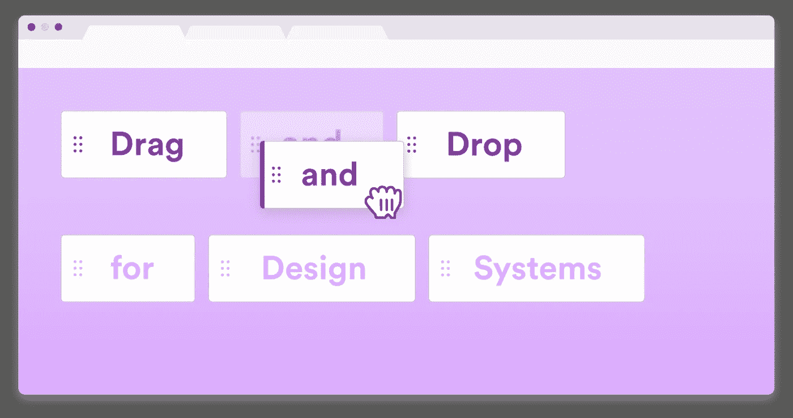
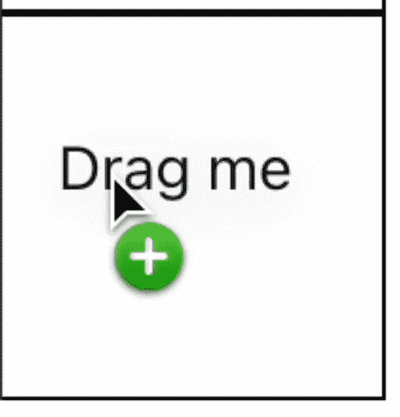

# 使用 React 从头开始拖放

> 原文：<https://javascript.plainenglish.io/drag-and-drop-from-scratch-with-react-be2aa96cc210?source=collection_archive---------6----------------------->

## 关于如何创建一组 React 组件来处理拖放的教程



拖放是互联网的奥秘之一。在我们的开发生涯中，我们都曾经使用过它们，但是我们实际上从来没有想过它是如何工作的。今天，一切都将改变！

*这篇文章纯粹是信息性的。有很多用于所有框架的拖放库，我强烈推荐你使用其中的一个！*

# 谅解

在开始任何编码之前，让我们试着多理解一点拖放是如何工作的。

拖拽**主要由你的浏览器**处理。为了允许元素可拖动，您所要做的就是将`draggable="true"`属性添加到您的`div`中

用容器**系统**进行悬垂和放下工作。一个容器将包含您的可拖动项目，您将拖放到另一个。

还有一点工作是让容器**准备好接受可拖动的项目**。

最后，我们必须**处理下降并更新我们的状态**。

就这么简单！让我们看看它如何与 React 一起工作。

# 创建我们的组件

在开始拖放之前，我们将开始**创建我们的组件**以使我们的生活更容易。

首先，让我们创建我们的**可拖动项目**。这个项目将是一个简单的文本，以便我们可以拖动它。我们还会将属性`draggable`设置为 true。

```
const Draggable = () => {
  return (
    <div draggable>
      Drag me
    </div>
  )
}

export default Draggable;
```

接下来，让我们创建一个**盒子组件**。该组件将是一个容器，它将包含可拖动的项目:

```
import './App.css'
import Draggable from "./Draggable";

const Box = ({ hasItem }) => {
  return (
  <div className="box">
    {hasItem && <Draggable/>}
  </div>
)
}

export default Box;
```

在我们的`App.css`中，您还可以找到`box`课程:

```
.box {
  display: flex;
  width: 100px;
  height: 100px;
  border: 1px solid black;
  justify-content: center;
  align-items: center;
}
```

酷！接下来，我们将开始**让我们的容器准备好与我们的可拖动组件**交互。

# 处理事件

我们将依赖于 3 个事件:

*   **拖动回车** ( `dragenter`)
*   **拖过** ( `dragover`)
*   **下降** ( `drop`)

*在这里我们将把* `*dragenter*` *和* `*dragover*` *视为相同，但是* ***都需要使用。***

## 可拖动和容器之间的相互作用

我们的第一步是当`dragenter`或`dragover`触发时调用`event.preventDefault()`,这样我们的可拖动项和容器就可以交互了。通过这样做，我们的容器将成为有效的目标:

```
const Box = ({ hasItem }) => {

  const dragEnterOrOver = (e) => {
    e.preventDefault();
  }

  return (
    <div 
      onDragEnter={dragEnterOrOver} 
      onDragOver={dragEnterOrOver} 
      className="box">
      {hasItem && <Draggable/>}
    </div>
  )
}
```

此外，让我们在应用程序中使用我们的 Box 组件:

```
return (
  <div>
    <Box hasItem/>
    <Box/>
  </div>
);
```

立即试用您的应用程序！如果您拖动`drag me`并四处移动，您会在鼠标旁边看到这个图标:



> 根据您的操作系统，它会显示有点不同，但你会认出它！

您可能已经注意到，这个图标也显示在当前选择的图标上方。这不是我们想要的。

让我们稍微修改一下代码，不要在初始框中显示这个图标:

```
const dragEnterOrOver = (e) => {
  if (hasItem) return;
  e.preventDefault();
}
```

## 移动我们的拖车，保持状态

我们要做的第一件事是**为选择添加一个状态**(这里我们将使用 positions)并且**以编程方式呈现这个框**:

```
const ITEMS = 3;

function App() {
  const [position, setPosition] = useState(0);

  return (
    <div>
      {
        ***Array***(ITEMS).fill(null).map((_, index) => {
          return <Box 
                   key={index} 
                   hasItem={index === position} 
                   onSelect={() => setPosition(index)}/>
        })
      }
    </div>
  );
}
```

> 我知道使用索引作为键是一种不好的做法，但是因为这个例子非常简单，所以我不能使用其他任何东西。

在 box 组件内部，让我们处理 drop 事件并调用`onSelect`回调:

```
const Box = ({hasItem, onSelect}) => {

  const dragEnterOrOver = (e) => {
    if (hasItem) return;
    e.preventDefault();
  }

  return (
    <div
      onDrop={onSelect}
      onDragEnter={dragEnterOrOver}
      onDragOver={dragEnterOrOver}
      className="box"
    >
      {hasItem && <Draggable/>}
    </div>
  )
}
```

瞧啊。现在，再次尝试你的应用程序，你就可以将你的拖拽从一个容器移动到另一个容器了！

我希望这篇文章能帮助你更好地理解拖放是如何工作的！

不要犹豫留下掌声或跟随它！

本文基于[本指南](https://www.javascripttutorial.net/web-apis/javascript-drag-and-drop/#:~:text=Introduction%20to%20JavaScript%20Drag%20and%20Drop%20API&text=To%20drag%20an%20image%2C%20you,you%20would%20drag%20an%20image.)。

[](/zip-a-folder-with-node-js-5cd940c5c4fe) [## 用 Node.js 压缩文件夹

### 如何用 Node.js 将文件夹和文件压缩成 ZIP

javascript.plainenglish.io](/zip-a-folder-with-node-js-5cd940c5c4fe) [](/unzip-a-file-with-nodejs-5f94b360f7df) [## 如何用 Node.js 解压文件

### 在 FS 能够实现的所有特性中，解压缩不是其中之一。让我们看看如何使用 Node.js 来实现这一点

javascript.plainenglish.io](/unzip-a-file-with-nodejs-5f94b360f7df) [](/server-sent-events-with-nodejs-bbdc9a9584cb) [## 使用 Node.js 的服务器发送的事件

### 从您的后端接收定期更新，而不发送垃圾 HTTP 请求

javascript.plainenglish.io](/server-sent-events-with-nodejs-bbdc9a9584cb) 

*更多内容请看*[***plain English . io***](https://plainenglish.io/)*。报名参加我们的* [***免费周报***](http://newsletter.plainenglish.io/) *。关注我们关于*[***Twitter***](https://twitter.com/inPlainEngHQ)[***LinkedIn***](https://www.linkedin.com/company/inplainenglish/)*[***YouTube***](https://www.youtube.com/channel/UCtipWUghju290NWcn8jhyAw)*[***不和***](https://discord.gg/GtDtUAvyhW) *。对增长黑客感兴趣？检查* [***电路***](https://circuit.ooo/) *。***