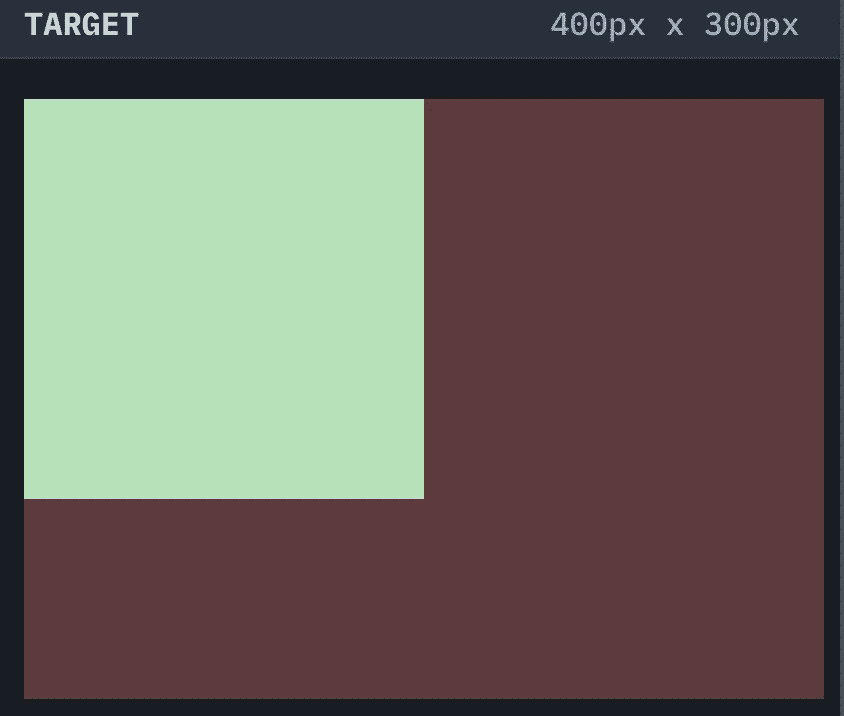
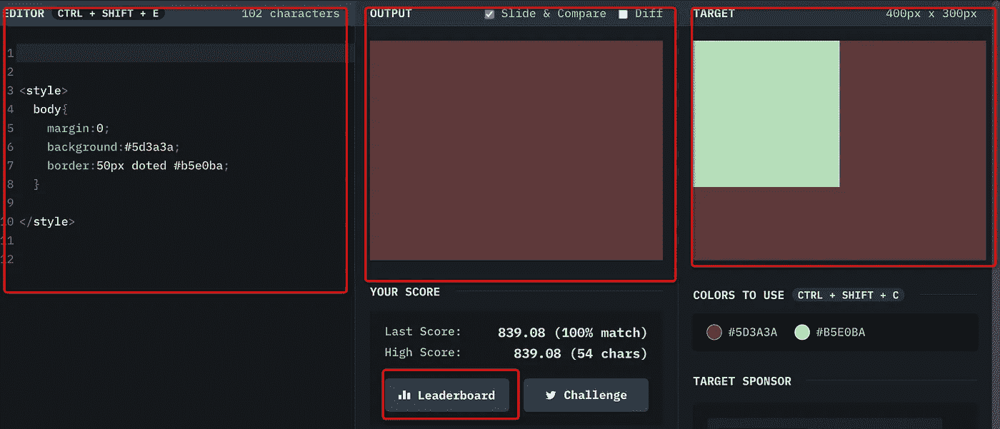
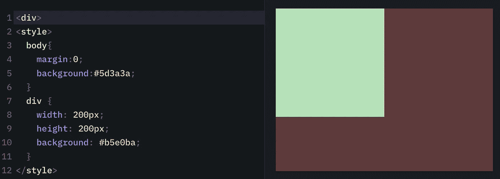
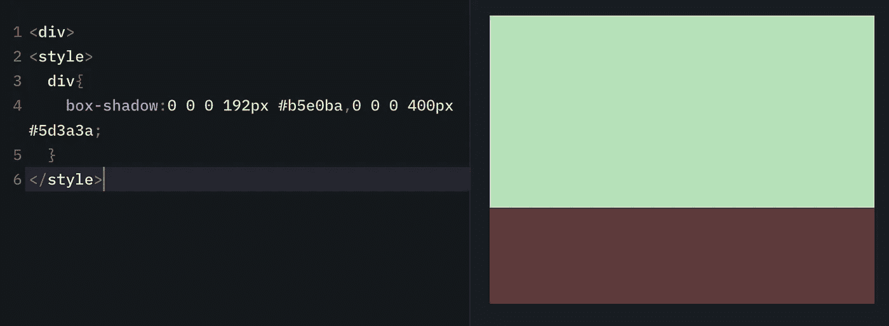
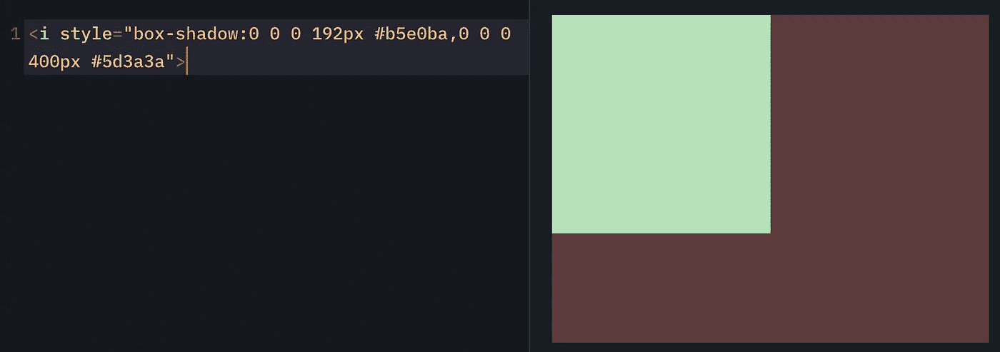
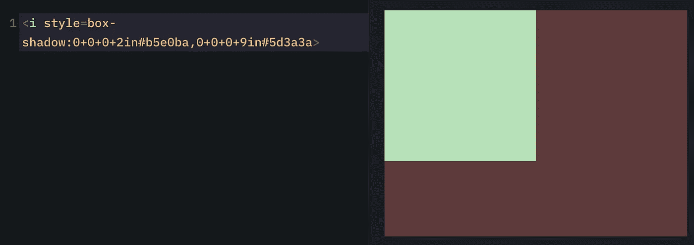

# 用一行 CSS 代码画一个正方形

> 原文：<https://javascript.plainenglish.io/draw-a-square-with-one-line-of-css-code-364a6b36057?source=collection_archive---------11----------------------->

答案如下:

```
<a style=box-shadow:0+0+0+2in#b5e0ba,0+0+0+9in#5d3a3a>
```



如果你对这行代码感兴趣，请听下面的故事。

# 介绍

这是来自 [CSSBattle](https://cssbattle.dev/play/1) 的挑战，一起来看看吧。使用更少的代码字符将获得更高的分数，这样您就可以在排行榜上获得一席之地。



为什么要参加这个挑战？我认为你可以从这个挑战中获得以下三个层面的好处:

1.  第 1 级—学习使用基本的 CSS 代码
2.  第 2 级—学习编写简洁的 CSS 代码
3.  第 3 级—学习一些 CSS 技巧

当然，看完这篇文章你也会有这三个好处，开始吧。

# 一级

传统的写法是用 div 标签和 CSS 样式画一个正方形，同时设置正文的边距和背景色。



共`146 characters`。然后我们在网页上提交答案，恭喜你得到了 `699.48 score`。

# 第二级

我想你可能还会想到 `box-shadow`、`spread-radius`中的`fourth`参数，它也支持多个阴影的扩散。这里我们可以用两个`spread-radius`方法。一个画小方块，另一个画背景。



但是效果是这样的，原因是`div is a block element`，所以 192px 的正方形变成了长方形，填满了整行。这时我们会想到`span and i, which are inline elements` 而不会填充整行。当考虑一些字符时，我们使用`i`标签。同时，我们知道 style 可以直接写在`i`标签上，它变成了:



`63 characters 819.42`，目前为止未知是我们的最高分。已经相当不错了，我们在看排行榜，最高分是`54 characters 839.08 score`，说明还有提升空间。但是下一步可能会使用一些 CSS 技巧来获得。


# 第三级

我们直接看答案:



`54 characters 839.08 score`。与排行榜上的最高分相同。当然，这里使用了两个技巧。让我们来看看:

1.  使它成为一个字符串，用+来连接数字，因为样式本身就是一个字符串，并删除了""也。
2.  用`inch`代替`px`减少字符。`1in = 2.54cm`，2in 正好是小正方形的大小。9in 随便写，只要超过背景大小就行。可以用 5、6、7、8 中的任意一个来代替。

# C 结束语

其实我觉得代码写到 `Level 2`就已经很好了，在可理解性和可读性方面更好。虽然`Level 3`使用的字符数最少，但是在实际项目中会造成可读性和可维护性的下降。但是`Level 3`也可以让你掌握一些额外的 CSS 技能，在一些特殊场景下可能还是会用到。

**感谢阅读。**期待期待您的关注和阅读更多高质量的文章。

[](https://levelup.gitconnected.com/the-story-of-clip-path-and-endangered-animals-in-css-8af987927fc6) [## CSS 中剪辑路径和濒危动物的故事

### 使用 CSS 剪辑路径创建奇妙的动画

levelup.gitconnected.com](https://levelup.gitconnected.com/the-story-of-clip-path-and-endangered-animals-in-css-8af987927fc6) [](/identify-javascript-data-types-two-methods-are-enough-882e2c238e6b) [## 识别 JavaScript 数据类型:两种方法就足够了

### 引入一个实用方法来识别所有数据类型

javascript.plainenglish.io](/identify-javascript-data-types-two-methods-are-enough-882e2c238e6b)  [## 面试官:如何在 forEach()中修改原数组

### foreach 的使用提示

javascript.plainenglish.io](/interviewer-how-to-modify-the-original-array-in-foreach-fd36a08c6ce1) 

*更多内容看* [***说白了。报名参加我们的***](https://plainenglish.io/) **[***免费周报***](http://newsletter.plainenglish.io/) *。关注我们*[***Twitter***](https://twitter.com/inPlainEngHQ)*和*[***LinkedIn***](https://www.linkedin.com/company/inplainenglish/)*。查看我们的* [***社区不和谐***](https://discord.gg/GtDtUAvyhW) *加入我们的* [***人才集体***](https://inplainenglish.pallet.com/talent/welcome) *。***