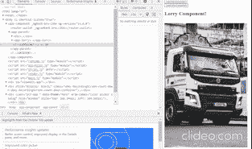

# 以角度表示的动态分量载荷

> 原文：<https://javascript.plainenglish.io/dynamic-component-loading-4945ce73ad1?source=collection_archive---------2----------------------->

## 使用角度指令的动态组件加载。

Angular 为在运行时加载新组件提供了一个漂亮的特性。动态组件加载可以通过各种方式实现，包括结构指令，如 ngSwitchCase、ngIf、ngFor 和 router-outlet。

然而今天，我想看一个有趣的使用指令简化的例子。该指令将起到锚的作用。在这种情况下，anchor 指令定义了动态加载的组件在 DOM 中的插入位置。

该指令注入 viewContainerRef，它将用于访问用来承载动态组件的元素。

anchor 指令是由 ng-template 提升的，因为 ng-template 不在 DOM 树上呈现任何额外的节点，并且在它没有值的情况下，它将不会被呈现，从而也减小了总的包大小。

在放置指令的组件上，我们使用 viewChild decorator 来定位指令。

在父组件上，我们可以创建一个函数来加载组件。视图 containerRef 包含方法 createComponent()，该方法返回对组件的引用。

这两个组件都有一个名为“image”的公共变量，用于传递 URL。这是说明动态组件加载的一种简单方式。数据可以从服务中加载。在结构相同的情况下，一个组件可以与不同的数据一起重用。

我们的最终结果将显示，在运行时，单击一个按钮就可以加载不同的组件。

再次感谢阅读！

*更多内容请看*[***plain English . io***](https://plainenglish.io/)*。报名参加我们的* [***免费周报***](http://newsletter.plainenglish.io/) *。关注我们关于*[***Twitter***](https://twitter.com/inPlainEngHQ)*和*[***LinkedIn***](https://www.linkedin.com/company/inplainenglish/)*。查看我们的* [***社区不和谐***](https://discord.gg/GtDtUAvyhW) *加入我们的* [***人才集体***](https://inplainenglish.pallet.com/talent/welcome) *。*