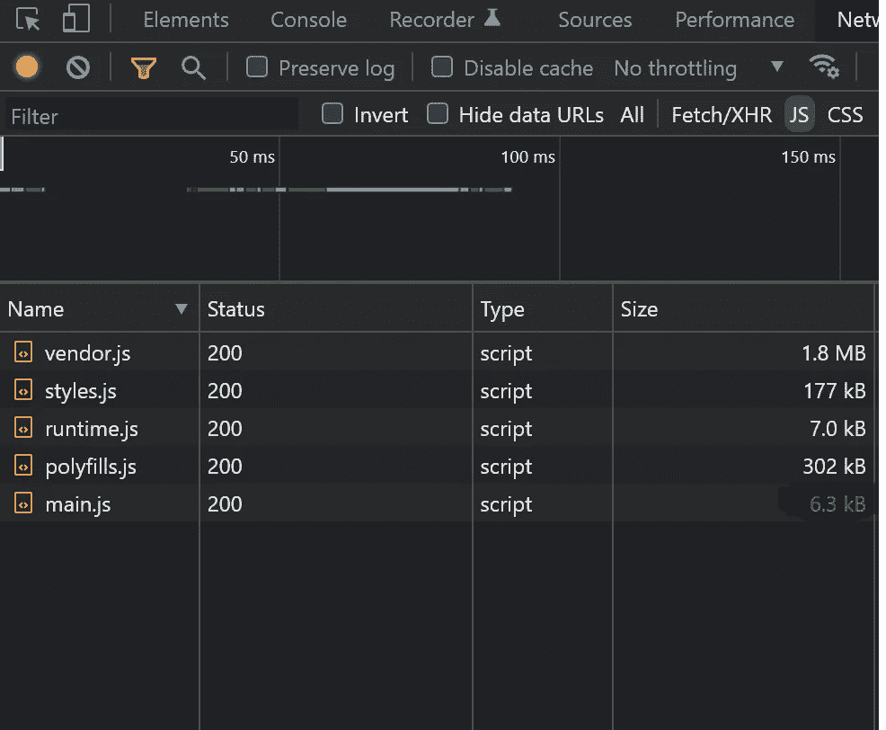
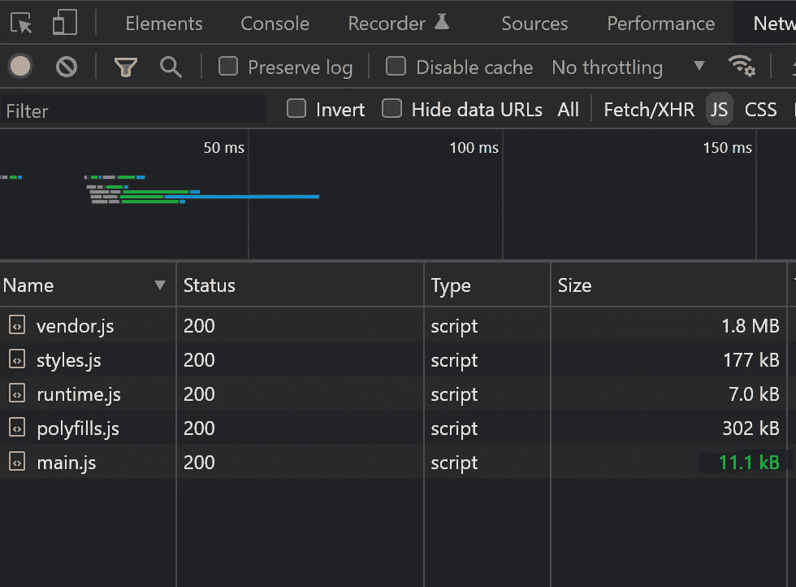
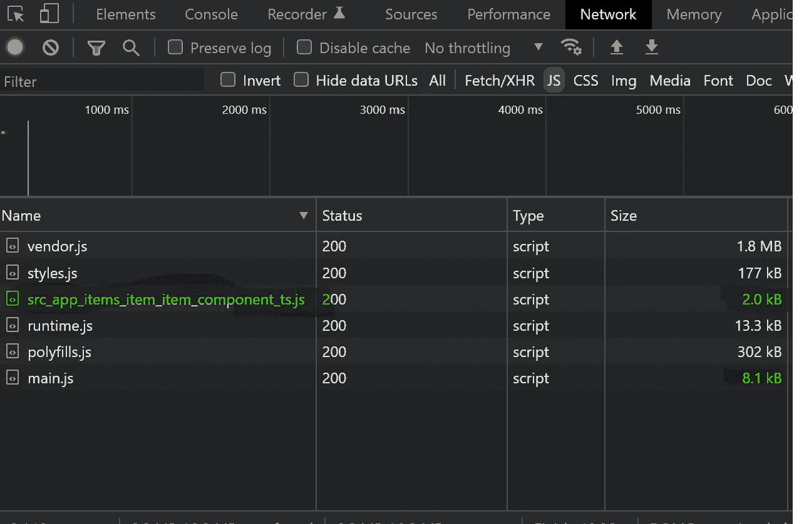

# 动态导入:提高 Angular 应用程序性能的最佳方式

> 原文：<https://javascript.plainenglish.io/dynamic-imports-the-best-way-to-improve-angular-application-performance-2295f25adf83?source=collection_archive---------0----------------------->

## 使用动态导入提高 Angular 应用程序性能的指南。


惰性加载模块是提高初始加载时 Angular 应用程序性能的好方法。您只能通过使用角度路由器来实现这一点。

假设你不想使用路由，但仍然可以实现相同的行为，比如侧边栏面板，模态就是一个很好的用例。

创建一个角度项目来查看动态导入的效果。我将使用 Angular CLI 来简化您的工作。

```
ng n dynamic-imports
```

一旦应用程序准备就绪，请确保运行“ng serve ”,并通过访问 localhost:4200 在浏览器中查看该应用程序。例如，我们将在应用程序组件中有一个按钮，当用户单击该按钮时，我们需要显示一个组件。我们把这个组件命名为“项目”。

一个非常简单的例子来理解 Angular 的一个强大的特性。

如果你打开浏览器，查看网络，你会看到下面下载的文件的大小。



让我们生成一个新模块，点击按钮的*显示*项目组件*。就这个例子来说，item 组件的 HTML 除了“item works”之外不包含任何内容。当我们重新加载浏览器并注意到网络选项卡时，您会看到如下内容:*

```
ng g module items
```



注意:看看 main.js 文件的大小(11.1 kB)

使用当前的方法，即使我们没有在 UI 中显示 items 组件，我们仍然在浏览器中下载它。在我们的例子中，它只有 5KB，但是在任何真实世界的应用中，它可以是巨大的模块。

现在我们知道了问题所在，让我们使用动态导入来解决这个问题。

首先，从应用程序模块导入中移除项目模块，并在应用程序组件中单击“让我们拥有以下代码”:

```
import { Component, ViewChild, ViewContainerRef} from '@angular/core';@Component({
  selector: 'app-root',
  template: `
    APP works
    <button type="button" (click)="onShow()">Show items</button>
    <ng-container #viewContainerRef></ng-container>
  `
})
export class AppComponent {
  @ViewChild('viewContainerRef', { read: ViewContainerRef, static: true })
  public readonly itemViewContainer!: ViewContainerRef constructor() { } async onShow() {
    const {ItemComponent} = await import('./items/item/item.component');
    const resolvedComponent = this.itemViewContainer
      .createComponent(ItemComponent);
  }
}
```

让我们在代码片段中分解我们正在尝试做的事情:

*   在 onShow 方法的第一行，我们手动导入 items 组件。
*   使用 ViewContainerRef，我们可以动态地将 items 组件添加到视图中。

最后，让我们在浏览器中运行它，看看上面的代码能得到什么。



在上图中，您可能会注意到下载了一个 2 KB 的新文件，主文件恢复为 8 KB。“src_app_items**”文件只有在用户请求时才会被下载。

你可以在这里找到完整的工作示例。

在 [Medium](https://medium.com/@manthenav01) 或 [Twitter](https://twitter.com/SunilManthena08) 上关注我，阅读更多关于 Angular 和 JavaScript 的内容！

*更多内容请看*[***plain English . io***](https://plainenglish.io/)*。报名参加我们的* [***免费周报***](http://newsletter.plainenglish.io/) *。关注我们关于*[***Twitter***](https://twitter.com/inPlainEngHQ)*和*[***LinkedIn***](https://www.linkedin.com/company/inplainenglish/)*。加入我们的**[***社区不和谐***](https://discord.gg/GtDtUAvyhW) *。**