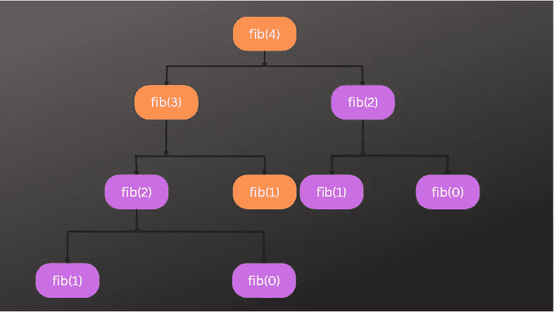
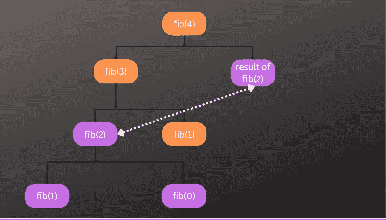

# 使用记忆的动态规划

> 原文：<https://javascript.plainenglish.io/dynamic-programming-using-memoization-e1fd31bc9a55?source=collection_archive---------7----------------------->

## JavaScript 算法基础第 5 部分:用记忆技术理解动态编程


Photo by [Markus Spiske](https://unsplash.com/@markusspiske?utm_source=medium&utm_medium=referral) on [Unsplash](https://unsplash.com/?utm_source=medium&utm_medium=referral)

# **动态编程**

动态编程是一种**优化技术**，可以应用于使用相同输入重复调用的**递归算法**。这里的基本思想是，如果我们已经为给定的输入解决了一个问题，那么我们将结果保存为一个参考，并使用这个保存的结果，而不是为相同的输入重新计算整个问题，从而节省运行时间。

在上一篇文章中，我们看到了**斐波那契递归解**如何导致**的指数时间复杂度**。在本文中，我们将使用**动态规划**优化相同的 Fibonacci 递归解决方案，以获得线性时间复杂度。你可以在下面的链接中参考上一篇文章的例子。

[第四部分:递归算法及其时间复杂度 O(n) vs O(2^n)](https://medium.com/p/713856ad4e2)

## **记忆化**

我们将在这里使用动态编程的**记忆技术**来优化斐波纳契问题的递归解决方案。记忆化简单地意味着**存储数据**，以便它可以在以后用于执行某个过程。

我们知道，递归对于重复计算非常有用，但是正如我们在下面的递归树中看到的，它会导致**重复工作**，这取决于我们正在解决的问题。斐波纳契递归函数中的 **fib(2)** 函数分支被多次执行**。我们多次重复同样的计算，这正是导致指数增长率问题的原因。**

****

**Recursive Fibonacci Algorithm Function Executions**

## **那么储存一些数据对我们有什么帮助呢？**

**如果我们在第一次执行时将 **fib(2)** 的结果存储在某个地方，那么我们可以检查在第二次执行时是否有 **fib(2)** 的结果，然后我们就不再进行第二次计算了。相反，我们第二次使用保存的结果。这样，我们可以在下一次中保存对 **fib(2)的额外函数调用，这又为我们保存了对 **fib(1)** 和 **fib(0)** 的进一步调用，这些调用已经被计算为 **fib(2)** 的一部分。****

**这就是我们的想法，如果我们能消除额外的函数调用，我们就消除了递归树的所有分支。这就是动态编程的意义所在。这是关于递归的，用记忆解决一个特殊的问题。所以通过存储一些中间结果，我们可以优化递归算法。现在让我们用记忆化来实现相同的斐波那契解。**

## **记忆解决方案**

**为了实现记忆化，我们需要**存储**。对于我们的例子，我们将使用一个本地**对象**，它将作为一个参数传递给递归函数。最初，存储器将是空的，随着更多递归步骤的执行，它将被中间结果填充。**

**因此，每个递归进程都有自己的存储空间，只用于特定的递归树。**

```
function fib(n, **storage**) {
 let result;

 if(n === 0 || n === 1) {
  result = 1;
 } else {
  result = fib(n - 1, **storage**) + fib (n - 2, **storage**)
 }return result;
}**fib(3, {})  // Passing empty object initially**
```

**在上面的函数中，我们引入了第二个参数作为**对象传递给函数，以存储中间结果**。**

**但是，函数仍然不完整，因为我们没有存储中间结果。**

**为此，我们可以通过动态添加键将结果保存在“**存储**”对象中。**

```
function fib(n, **storage**) {
 let result;

 if(n === 0 || n === 1) {
  result = 1;
 } else {
  result = fib(n - 1, **storage**) + fib (n - 2, **storage**)
 }**storage[n] = result;  // Memoization** return result;
}
```

**因为“**存储**”对象是一个引用类型，所以它的值将在所有函数调用中保持不变，并且我们动态添加的属性将在所有函数调用中可用。即使现在，我们也只是存储中间结果，但是我们并没有对它做任何事情。**

**所以，我们仍然没有优化到位。因此，还缺少最后一步。**

**这一步将检查对于 **n** ，我们是否已经在我们的“**存储”**对象中有一个条目。并且，如果我们在`**storage[n]**`中有一个保存的结果，那么我们返回结果，从而跳过剩余的代码。**

```
function fib(n, **storage**) {
 let result;**if(storage[n]){      // Memoization
  return storage[n]
 }**

 if (n === 0 || n === 1) {
  result = 1;
 } else {
  result = fib(n - 1, **storage**) + fib (n - 2, **storage**)
 }**storage[n] = result;  // Memoization**return result;
}
```

**通过这种优化，我们跳过了所有进一步的步骤，这些步骤可能会导致更多的函数调用，从而导致函数调用的重复分支。因此，我们的函数执行更少。**

****

**Optimized Recursive Fibonacci Function**

**正如您在上面的树中所看到的，完全跳过了 **fib(2)** 的重复分支，并使用了来自另一个分支的 **fib(2)** 函数的保存值。**

## **我们新的时间复杂度是多少？**

****它的线性时间复杂度**。因为如果我们执行上述算法并进行**渐近分析**，那么我们会看到，随着 **n** 的增加，我们会得到 **2n** 次迭代。**

**因此， **2n** 听起来像我们的**时间复杂度**，正如我们所学的，我们只是将其简化为 **O(n)** ，因为我们关心一般的模式。所以我们从 **O(2^n)** 到仅仅 **O(n)** ，这是一个巨大的进步。**我们将指数时间复杂度解决方案转换为线性复杂度解决方案**。原因是，借助于动态编程，我们用这种优化技术跳过了树中的整个分支。而且，这种技术在解决一些复杂棘手的问题时非常强大。**

## ****爬楼梯问题****

**下面是爬楼梯问题，这是使用动态规划方法解决的最佳问题之一。编码面试的时候也问过很多类似的 DP 问题。**

## **问题陈述**

**你正在爬一个需要 n 级台阶才能到达顶端的楼梯。每次只能爬 1 步或 2 步。我们需要计算并返回爬上楼梯顶部的独特方式的总数。**

****例 1****

```
**Input**: n = 2
**Output**: 2**Explanation**: There are two ways to climb to the top
1\. 1 step + 1 step
2\. 2 steps
```

****例 2****

```
**Input**: n = 3
Output: 3**Explanation**: There are three ways to climb to the top
1\. 1 step + 1 step + 1 step
2\. 1 step + 2 steps
3\. 2 steps + 1 step
```

**我们可以使用上面讨论的同样的记忆技术来解决这个问题。**

**希望这篇文章对你有用。感谢阅读。**

***更多内容请看*[***plain English . io***](https://plainenglish.io/)*。报名参加我们的* [***免费每周简讯***](http://newsletter.plainenglish.io/) *。关注我们* [***推特***](https://twitter.com/inPlainEngHQ) ，[***LinkedIn***](https://www.linkedin.com/company/inplainenglish/)*，*[***YouTube***](https://www.youtube.com/channel/UCtipWUghju290NWcn8jhyAw)*，* [***不和***](https://discord.gg/GtDtUAvyhW) *。对增长黑客感兴趣？检查出* [***电路***](https://circuit.ooo/) *。***