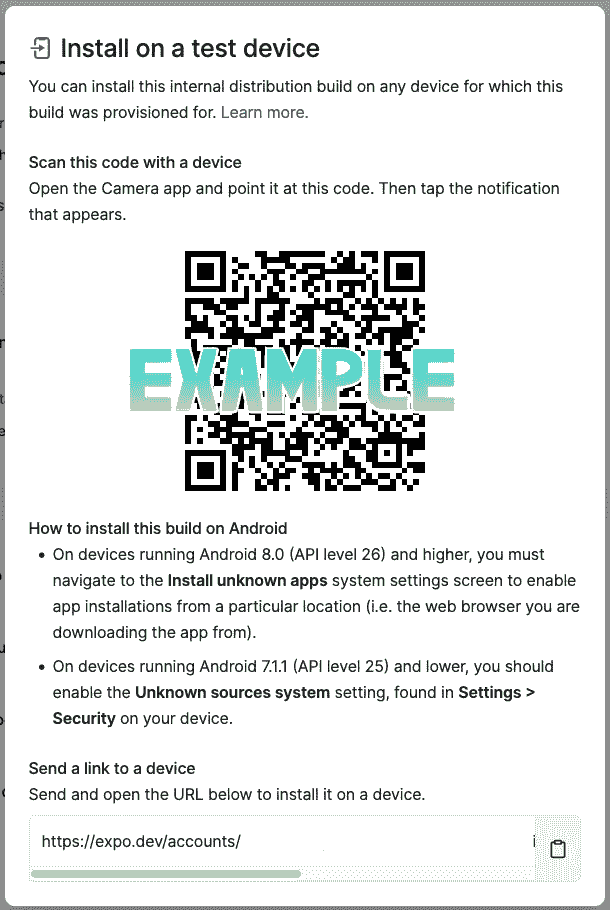

# React Native 应用服务入门

> 原文：<https://javascript.plainenglish.io/eas-expo-application-services-react-native-quick-start-7f1f01cf0f7b?source=collection_archive---------0----------------------->

## React Native 世博会应用服务简介。


Photo by [Arnold Francisca](https://unsplash.com/@clark_fransa?utm_source=medium&utm_medium=referral) on [Unsplash](https://unsplash.com?utm_source=medium&utm_medium=referral)

让我们从一些关于 EAS 的解释开始。EAS 是 Expo 和 React 本地应用的云服务，由 Expo 背后的团队开发。使用 EAS 可以让你更快更容易地将应用从开发阶段带入应用商店。

我们将带您浏览 2 项服务，构建并提交 ea。

# EAS 构建

如果你知道 Expo，你可能知道`[expo build:[ios/android]](https://docs.expo.dev/distribution/building-standalone-apps/)` command，所以 EAS Build 是它的下一代。EAS Build 将为分发构建您的应用程序，如果您愿意，它还将为您处理您的应用程序签名凭据。这还不是全部，它最伟大的部分是允许你通过内部发布与你的团队共享构建。

将您的应用程序上传到 TestFlight 和 Google Play 可能会花费很长时间，例如，在可供测试人员使用之前等待构建通过静态分析，但这并不存在，也有一个限制，例如，TestFlight 一次只能有一个活动的构建，这里 EAS Build 可以提供帮助，通过使用包含测试应用程序所需的所有信息的可共享 URL，您的团队可以在构建完成后直接从 web 浏览器下载应用程序并将其安装到物理设备上。

要在 android 或 IOS 设备上运行该应用程序，您应该将下面的 URL 共享到您的 android 或 IOS 设备，然后它将下载客户端开发应用程序。下载完成后，安装应用程序。



shareable URL for android devices

要在 IOS 或 android 模拟器设备上运行应用程序，您应该将应用程序下载到您的 PC 上，然后将其拖放到模拟器中，之后它将安装客户端开发应用程序。

## EAS。JSON 文件

文件 eas.json 将包含您构建的所有概要文件，它应该包含您想要的所有配置。

例如:

```
{
  "build": {
    "production": {
      "node": "16.13.0"
    },
    "simulator": {
      "extends": "production",
      "developmentClient": "true",
      "distribution": "internal"
    }
  }
}
```

上面的例子是一个创建可用于测试的模拟器构建的例子，运行它的命令应该是:

`eas build --profile simulator --platform all`

您也可以为生产创建一个概要文件，您只需要在 eas.json 文件中配置它。

# EAS 提交

**EAS Submit** 是一个托管服务，用于上传和提交你的 React 原生应用到 App Store & Play Store。只要你能在电脑上运行 EAS CLI，这项托管服务就能让你将应用提交到两家商店。这样，您可以从 macOS、Windows 或 Linux 工作站或 CI 轻松提交/上传您的 iOS 和 Android 应用程序。

## 提交到 Apple App Store:

在开始这个过程之前，请注意下面的两个必要步骤。

*   首先，你需要有一个付费开发者账户，这是提交应用程序的要求——你可以在[苹果开发者门户](https://developer.apple.com/account/)上创建一个苹果开发者账户。
*   其次，您应该检查是否安装了 EAS CLI，然后检查它是否通过了您的 Expo 帐户的认证。这个命令将完成两项任务:`npm install -g eas-cli && eas login`。

设置完上面的 2 个步骤后，现在您可以通过使用正确的配置设置 eas.json 来构建一个生产应用程序。

命令`eas submit -p ios`将引导你一步一步地完成向应用商店提交应用的过程。

## 向谷歌 Play 商店提交:

在开始这个过程之前，请注意下面的 4 个必要步骤。

*   付费开发者账户是必需的——你可以在 [Google Play 控制台注册页面](https://play.google.com/apps/publish/signup/)创建一个 Google Play 开发者账户。
*   你必须创建一个[谷歌服务账户](https://cloud.google.com/iam/docs/creating-managing-service-accounts)并下载它的 JSON 私钥。
*   之后，你必须在 [Google Play 控制台](https://play.google.com/apps/publish/)上创建一个应用程序，并至少手动上传一次。
*   您还需要安装 EAS CLI，并使用您的 Expo 账户`npm install -g eas-cli && eas login`进行认证。

设置完上面的 4 个步骤后，您现在可以通过使用正确的配置设置 eas.json 来构建一个生产应用程序。

命令`eas submit -p android`将引导您一步步完成向 Play Store 提交应用程序的过程。

## EAS。JSON 配置—示例

```
{
  "cli": {
    "version": ">= 0.34.0"
  },
  "submit": {
    "production": {
      "android": {
        "serviceAccountKeyPath": "../path/to/api-xxx-yyy-zzz.json",
        "track": "internal"
      },
      "ios": {
        "appleId": "nissimzarur@gmail.com",
        "ascAppId": "1234567890",
        "appleTeamId": "AB12XYZ34S"
      }
    }
  }
}
```

**感谢您到目前为止的阅读，如果您喜欢这样的内容，并且您想支持我作为一名程序员和作家撰写更多这样的文章， [***请使用我的链接注册 Medium 成为会员(每月订阅 5 美元)，您将可以无限制地访问 Medium 上的所有内容。***](https://medium.com/membership/@nissimzarur)**

这就是现在，希望你喜欢它。

关注我，获取更多有趣且有帮助的文章。

*更多内容请看*[***plain English . io***](https://plainenglish.io/)*。报名参加我们的* [***免费周报***](http://newsletter.plainenglish.io/) *。关注我们关于*[***Twitter***](https://twitter.com/inPlainEngHQ)*和*[***LinkedIn***](https://www.linkedin.com/company/inplainenglish/)*。查看我们的* [***社区不和谐***](https://discord.gg/GtDtUAvyhW) *加入我们的* [***人才集体***](https://inplainenglish.pallet.com/talent/welcome) *。*