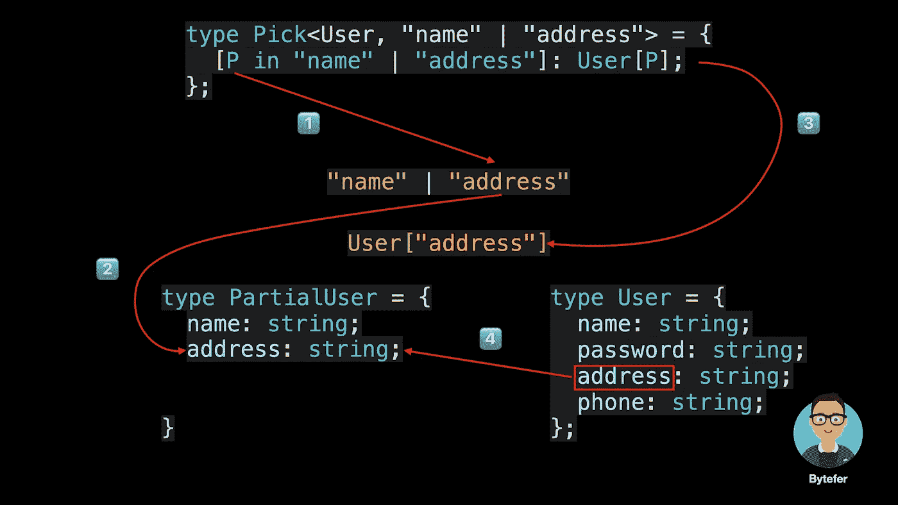

# 轻松理解 TypeScript 通用实用工具类型

> 原文：<https://javascript.plainenglish.io/easily-understand-typescript-generic-utility-types-c7070cd29abe?source=collection_archive---------5----------------------->


欢迎来到**掌握打字稿**系列。本系列将以动画的形式介绍打字稿**的核心知识和技巧。让我们一起学习吧！以前的文章如下:**

*   [**TypeScript 泛型中的 K、T、V 是什么？**](https://medium.com/frontend-canteen/what-are-k-t-and-v-in-typescript-generics-9fabe1d0f0f3)
*   [**使用 TypeScript 像 Pro 一样映射类型**](/using-typescript-mapped-types-like-a-pro-be10aef5511a)
*   [**使用 TypeScript 条件类型像亲**](/use-typescript-conditional-types-like-a-pro-7baea0ad05c5)
*   [**使用 TypeScript 交集类型像亲**](/using-typescript-intersection-types-like-a-pro-a55da6a6a5f7)
*   [**使用打字稿推断像亲**](https://levelup.gitconnected.com/using-typescript-infer-like-a-pro-f30ab8ab41c7)
*   [**使用 TypeScript 模板字面类型像亲**](https://medium.com/javascript-in-plain-english/how-to-use-typescript-template-literal-types-like-a-pro-2e02a7db0bac)
*   [**可视化打字稿:15 种最常用的实用类型**](https://medium.com/javascript-in-plain-english/15-utility-types-that-every-typescript-developer-should-know-6cf121d4047c)

如果您是 TypeScript 的新手，当您阅读关于 TypeScript 内置实用程序类型的用法和内部实现的文章时，您可能会看到 **Pick** 实用程序类型，并且您可能不熟悉该类型的语法。


```
/**
 * From T, pick a set of properties whose keys are in the union K.
 * typescript/lib/lib.es5.d.ts
 */
type Pick<T, K extends keyof T> = {
    [P in K]: T[P];
};
```

学习新事物的一个更好的方法是使用类比。接下来，我将借助 JavaScript 中的函数帮助您快速理解 **Pick** 实用程序类型背后的语法。


在上面的代码中，`function`是用来声明 JavaScript 函数的关键字，`Pick`是函数名，`obj`和圆括号中的`keys`是参数，函数体在花括号中定义。


对于 Pick 实用程序类型，`type`关键字用于给类型一个别名，方便重复使用。`Pick`是类型的名称。尖括号内的`T`和`K`是类型参数。**与 JavaScript 函数中的参数不同的是，类型参数存储类型，而 JavaScript 函数参数存储值。**


其中`K extends keyof T`是泛型约束的语法，用于约束类型的范围。大括号内是实用工具类型的具体实现，它使用 TypeScript 映射类型的语法。

实际上，您可以将 TypeScript 的内置实用程序类型视为用于处理 TypeScript 中存在的类型的特殊函数。调用实用程序类型和调用 JavaScript 函数的区别在于尖括号的使用。

为了让大家更容易理解，我将以动画的形式演示 Pick 实用程序类型的执行过程。



如果您不熟悉 TypeScript，我希望在阅读本文之后，您会对 TypeScript 的内置实用程序类型有更好的理解。文章中介绍的 Pick 实用程序类型在内部使用了 TypeScript 的映射类型。如果您不熟悉 TypeScript 映射类型，我推荐您阅读下面的文章。

[](/using-typescript-mapped-types-like-a-pro-be10aef5511a) [## 像专业人员一样使用 TypeScript 映射类型

### 映射类型—用动画解释。掌握 TypeScript 映射类型并理解 TypeScript 的内置…

javascript.plainenglish.io](/using-typescript-mapped-types-like-a-pro-be10aef5511a) 

如果您想了解 TypeScript 的其他非常有用的内置实用工具类型，相关文章也为您准备好了。

[](/15-utility-types-that-every-typescript-developer-should-know-6cf121d4047c) [## 可视化的类型脚本:15 种最常用的实用程序类型

### 每个 TypeScript 开发人员都应该知道的 15 种实用工具类型

javascript.plainenglish.io](/15-utility-types-that-every-typescript-developer-should-know-6cf121d4047c) 

如果你喜欢学习动画形式的 TypeScript，可以关注我。

# 资源


[字节优先](https://medium.com/@bytefer?source=post_page-----c7070cd29abe--------------------------------)

## 掌握打字稿系列

[View list](https://medium.com/@bytefer/list/mastering-typescript-series-688ee7c12807?source=post_page-----c7070cd29abe--------------------------------)47 stories[](https://www.typescriptlang.org/docs/handbook/utility-types.html) [## 文档-实用程序类型

### TypeScript 提供了几种实用工具类型来促进常见的类型转换。这些实用程序可用…

www.typescriptlang.org](https://www.typescriptlang.org/docs/handbook/utility-types.html) [](https://medium.com/frontend-canteen/what-are-k-t-and-v-in-typescript-generics-9fabe1d0f0f3) [## TypeScript 泛型中的 K，T，V 是什么？

### 用动画讲解，让你轻松掌握 TypeScript 泛型类型参数。

medium.com](https://medium.com/frontend-canteen/what-are-k-t-and-v-in-typescript-generics-9fabe1d0f0f3) 

*更多内容请看*[***plain English . io***](https://plainenglish.io/)*。报名参加我们的* [***免费周报***](http://newsletter.plainenglish.io/) *。关注我们关于* [***推特***](https://twitter.com/inPlainEngHQ)[***领英***](https://www.linkedin.com/company/inplainenglish/)**和* [***不和***](https://discord.gg/GtDtUAvyhW) ***。****