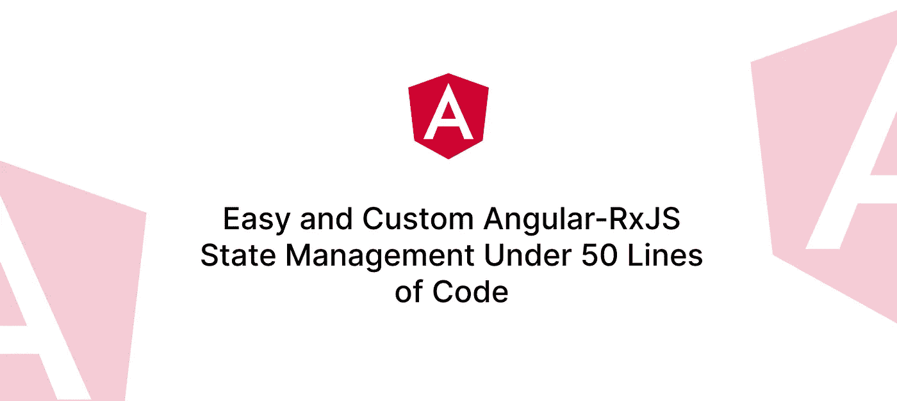

# 50 行代码下的简单定制 Angular-RxJS 状态管理

> 原文：<https://javascript.plainenglish.io/easy-and-custom-angular-rxjs-state-management-under-50-lines-of-code-a2e7188da926?source=collection_archive---------1----------------------->



前端应用程序中的状态管理总是一个可怕的话题。”*对 NGRX* 的恐惧“是真实存在的(😅)，至少对我来说是这样。所以我尽量远离它，除非在我的工作场所需要它。但是，在其核心，状态管理是一个强大的概念，可以帮助您编写健壮、可维护、可读和高质量的代码。一旦我掌握了这个概念，我就不会回头了。现在我所有的个人项目都使用状态管理，虽然不是用 NGRX。我遵循一个非常简单和轻量级的实现，对我的大脑来说很容易，我希望对你也是如此！所以，让我们开始吧。

## 步骤 1:陈述主题

你知道 RxJS 给你三种题材——`Subject, BehaviorSubject`，和`AsyncSubject`。为了开发我自己的状态管理解决方案，我需要从 BehaviorSubject 中获取更多信息。

进入**状态服从**。

基本上，StateSubject 是一个扩展的 BehaviorSubject，它拥有一个初始值，可以被重置为初始值，并且可以通过深度相等操作来检查它的可观察流。

```
import { isEqual } from 'radash'
import { BehaviorSubject, distinctUntilChanged, Observable } from 'rxjs'

/**
 * An extended BehaviorSubject that can be reset to its initial value.
 * The stream of change is checked for deep equality so that only when 
 * the value has trully changed, the stream will emit.
 * 
 * This util is also available as a npm package: 
 * https://www.npmjs.com/package/rxjs-state-subject
 * @author Touhid Rahman <touhidrahman1987@gmail.com>
 */
export class StateSubject<T> extends BehaviorSubject<T> {
    private initialValue: T

    constructor(value: T) {
        super(value)
        this.initialValue = value
    }

    get value$(): Observable<T> {
        return super.asObservable().pipe(
            distinctUntilChanged((a, b) => isEqual(a, b))
        )
    }

    update(value: T): void {
        this.next(value)
    }

    reset(): void {
        this.next(this.initialValue)
    }
}
```

StateSubject 的用途主要是在值没有发生本质变化时限制不必要的发出。例如，您可能有一个带有布尔值的 BehaviorSubject。稍后，您用相同的值更新它两次。该流将发出两次。

```
const loading = new BehaviorSubject<boolean>(false)

loading
    .asObservable()
    .subscribe({ next: (val) => console.log(val) })

// update
loading.next(true)
loading.next(true)

// output (timeline)
// -false-----true-----true----
```

另一方面，如果使用 StateSubject，它将发出一次，因为第二次文本值没有改变。

```
const loading = new StateSubject<boolean>(false)

loading
    .value$
    .subscribe({ next: (val) => console.log(val) })

// update
loading.next(true)
loading.next(true)

// output (timeline)
// -false-----true-------------
```

## 第二步:储存

好的，我们花了大约 15 行在 StateSubject 类上。接下来是带**店**级的~35。

```
import { isEqual } from 'radash'
import { distinctUntilChanged, filter, map, Observable, share, Subject, takeUntil } from 'rxjs'
import { StateSubject } from './state-subject'

export class Store<T extends Object> {
    private unsubscriber: Subject<void>
    private state: StateSubject<T>

    constructor(value: T, unsubscriber: Subject<void>) {
        this.state = new StateSubject(value)
        this.unsubscriber = unsubscriber
    }

    setState(value: Partial<T>): void {
        this.state.next({ ...this.state.value, ...value })
    }

    getState(): T {
        return this.state.value
    }

    select<K extends keyof T>(key: K): Observable<T[K]> {
        return this.state.value$.pipe(
            map((state) => state[key]),
            distinctUntilChanged((a, b) => isEqual(a, b)),
            share(),
            takeUntil(this.unsubscriber),
        )
    }

    selectAll(): Observable<T> {
        return this.state.value$.pipe(
            share(), 
            takeUntil(this.unsubscriber)
        )
    }

    reset(): void {
        this.state.reset()
    }
}
```

为了初始化 store 类，我们需要一个起始值和一个终止 Store 的退订器`Subject`。商店的其他方法:

*   **setState** :用输入值覆盖状态。
*   **getState** :获取当前状态的静态值。有时它会非常方便。
*   **选择**:你可能熟悉其他状态管理库中的术语`select`。它选取状态的一部分作为可观测值。
*   **选择全部**:当需要整个状态为可观察时。
*   **复位**:将整个状态复位到初始值。

## 步骤 3:用法:MovieListStateService

我们已经完成了管理应用程序状态所需的类。在这个示例场景中，我们正在编写一个具有搜索和分页功能的电影列表页面。首先，我们需要弄清楚组件的状态需要什么值:

*   **加载**:显示一个微调按钮或进度条。
*   **页**:当前页码。
*   **大小**:每页的结果数。
*   **搜索词**:按名称搜索电影。
*   **年份**:过滤特定年份以后上映的电影。
*   **电影**:最后是 API/数据库返回的电影列表。

其次，我们需要为整个状态得出一个合理的初始值。开始的时候，不会有电影，搜索栏也是空的。所以我们可以这样声明我们的商店:

```
store = new Store<{
    loading: boolean
    movies: Movie[]
    page: number
    size: number
    year: number
    search: string
}>(
    {
        loading: false,
        movies: [],
        page: 0,
        size: 10,
        year: new Date().getFullYear(),
        search: '',
    },
    this.unsubscriber, // 1
)
```

注意(1)，我们需要一个退订主题，它将在组件被销毁时完成。这将确保不会发生内存泄漏。我们可以将它挂在`ngOnDestroy`挂钩上，轻松制作一个:

```
private unsubscriber = new Subject<void>()

ngOnDestroy() {
    this.unsubscriber.next()
    this.unsubscriber.complete()
}
```

现在，我们需要一种机制，无论何时搜索、页码、页面大小或年份值发生变化，都可以获取电影:

```
combineLatest({
    search: this.store.select('search'),
    page: this.store.select('page'),
    size: this.store.select('size'),
    year: this.store.select('year'),
})
.pipe(
    debounceTime(300), // 2
    tap(() => this.store.setState({ loading: true })),
    switchMap(({ search, page, size, year }) => {
        return this.movieApi.find({ search, page, size, year })
    }),
    takeUntil(this.unsubscriber),
)
.subscribe({
    next: (res) => {
        this.store.setState({ 
            movies: res.data, 
            loading: false 
        })
    },
})
```

注意(2):有些时候参数更新得非常快——比如用户在分页栏上单击 next 太快。这就是为什么我们使用`debounceTime()` RxJS 操作符来丢弃间歇值，以便后端不会被过于频繁地调用。

我们可以考虑另一个功能—每当搜索词更新时，页码应该重置为 1:

```
private onSearchTermChange(): void {
    this.store.select('search').pipe(
        distinctUntilChange(),
        takeUntil(this.unsubscriber),
    ).subscribe({
        next: () => this.store.setState({ page: 1 })
    })
}
```

请注意，即使在编写模板之前，您也在定义业务逻辑。以这种方式隔离业务逻辑给了您对可读性和可测试性的巨大控制。现在大多数代码都是单元可测试的，不需要进行 e2e 测试来以编程方式点击一个按钮并测试一个特性。如果业务逻辑正常工作，表示层也是如此。

这里是`MovieListStateService`的完整代码。因为它将在一个组件中提供，所以我们不在`@Injectable`装饰器中使用`providedIn: 'root'`。

```
import { Injectable, OnDestroy } from '@angular/core'
import { Movie} from '@core/interfaces'
import { Store } from '@core/utils/store'
import { combineLatest, debounceTime, Subject, switchMap, takeUntil, tap } from 'rxjs'
import { MovieApiService } from '../services/movie-api.service'

@Injectable()
export class MovieListStateService implements OnDestroy {
    private unsubscriber: Subject<void> = new Subject<void>()

    store = new Store<{
        loading: boolean
        movies: Movie[]
        page: number
        size: number
        year: number
        search: string
    }>(
        {
            loading: false,
            movies: [],
            page: 0,
            size: 10,
            year: new Date().getFullYear(),
            search: '',
        },
        this.unsubscriber,
    )

    constructor(private movieApi: MovieApiService) {
        this.init()
        this.onSearchTermChange()
    }

    ngOnDestroy(): void {
        this.unsubscriber.next()
        this.unsubscriber.complete()
    }

    private init(): void {
        combineLatest({
            search: this.store.select('search'),
            page: this.store.select('page'),
            size: this.store.select('size'),
            year: this.store.select('year'),
        })
        .pipe(
            debounceTime(300),
            tap(() => this.store.setState({ loading: true })),
            switchMap(({ search, page, size, year }) => {
                return this.movieApi.find({ search, page, size, year })
            }),
            takeUntil(this.unsubscriber),
        )
        .subscribe({
            next: (res) => {
                this.store.setState({ 
                    movies: res.data, 
                    loading: false 
                })
            },
        })
    }

    private onSearchTermChange(): void {
        // when search term changes, reset page to 1
        this.store.select('search').pipe(
            distinctUntilChange(),
            takeUntil(this.unsubscriber),
        ).subscribe({
            next: () => this.store.setState({ page: 1 })
        })
    }
}
```

## 步骤 4:将它插入组件

现在让我们将我们的`MovieListStateService`提供给页面组件。

```
@Component({
    standalone: true,
    imports: [CommonModule, RouterModule, //...],
    template: `
    <app-loading-spinner *ngIf="loading$ | async"></app-loading-spinner>

    <input type="text" [(ngModel)]="search">
    <button (click)="doSearch()">Search</button>

    <div 
        *ngIf="movies$ | async as movies" 
    >
        <app-movie-card
            *ngFor="let movie of movies"
            [movie]="movie"
        ></app-movie-card>
    </div>

    <button (click)="changePage(-1)">Prev</button>
    <button (click)="changePage(1)">Next</button>
    `,
    providers: [MovieListStateService],
})
export class HomePageComponent {
    search = ''

    constructor(
        private movieListState: MovieListStateService,
        private activatedRoute: ActivatedRoute,
    ) {
        const page = +this.activatedRoute.snapshot.queryParams.page
        // load first page
        this.movieListState.store.setState({ page: page ?? 1 })
    }

    get movies$(): Observable<Movie[]> {
        return this.movieListState.store.select('movies')
    }

    get loading$(): Observable<boolean> {
        return this.movieListState.store.select('loading')
    }

    changePage(dir: 1 | -1): void {
        const next = this.movieListState.store.getState().page + dir
        this.movieListState.store.setState({ page: next })
    }

    doSearch(): void {
        this.movieListState.store.setState({ search: this.search })
    }
}
```

我们从状态中选择`movies`数组和`loading`值，在模板中查看。然而，我们更新页面，搜索等。通过事件用新值设置状态。就是这样！我们的组件除了演示之外不做任何复杂的工作。Angular 本来就是这样的。

你一直编码错误！😄

## 结论

使用状态管理解决方案为您的代码库带来了许多可能性。您的业务逻辑与世隔绝，这是一个巨大的好处。您可以在多个组件中重用一个状态。最重要的是，你的应用程序会感觉流畅。

让团队的新成员使用基本解决方案更容易。当每个人都准备好了，你就可以很容易地移植到 NGRX 或任何其他高级状态管理库，因为它们的工作原理是一样的。

感谢您的阅读。关注我更多类似这样有趣的有角度的文章。

*   **如果你不想在每个项目中写 StateSubject 和 Store 类，那么好消息！我已经在一个名为*[*rxjs-state-subject*](https://www.npmjs.com/package/rxjs-state-subject)*的 npm 包中发布了这些类。它使用 RxJS v7.5+，和*[*radash*](https://www.npmjs.com/package/radash)v 9.3+(lodash 的现代替代)。

*更多内容看* [***说白了就是***](https://plainenglish.io/) *。报名参加我们的* [***免费周报***](http://newsletter.plainenglish.io/) *。关注我们* [***推特***](https://twitter.com/inPlainEngHQ) ，[***LinkedIn***](https://www.linkedin.com/company/inplainenglish/)*，*[***YouTube***](https://www.youtube.com/channel/UCtipWUghju290NWcn8jhyAw)*，*[*不和*](https://discord.gg/GtDtUAvyhW) *。对增长黑客感兴趣？检查出* [***电路***](https://circuit.ooo/) *。*