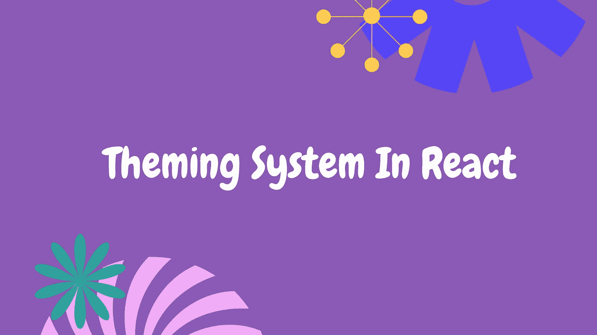
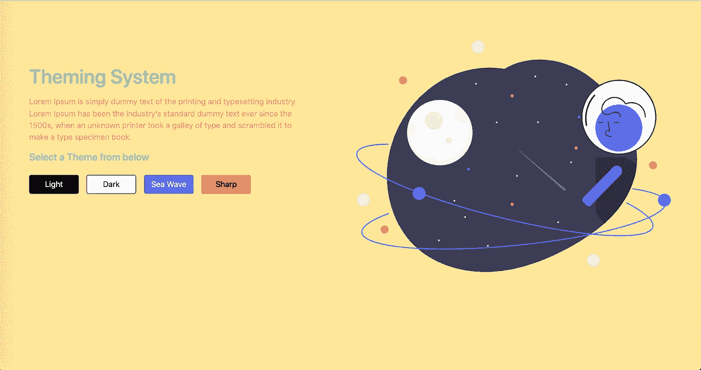

# 在 React 应用程序中添加多个主题的简单方法

> 原文：<https://javascript.plainenglish.io/easy-way-to-add-multiple-themes-in-react-app-ff45eeca67cb?source=collection_archive---------2----------------------->

theming system

主题是网站的整体外观、感觉和风格。

如果你想给你的 react 应用添加**多个主题**，那么这篇文章就是为你准备的。今天我将讨论如何在你的 react 应用中添加多个主题。

有很多方法可以实现，比如你可以在 JS 中使用 **CSS 模块**、 **CSS，也有一些 **npm 包**。但是对于**可扩展的应用**，我将向您展示一种非常简单的方法。**

我将使用 **CSS 变量**和**数据主题属性**添加多个主题，使用这些我们可以构建一个**强大且易于使用的主题化系统**。

> CSS 变量允许您定义包含可在 CSS 文档中重用的特定值的命名变量。
> 
> data-*属性使我们能够在所有 HTML 元素上嵌入定制的数据属性。

现在在 **:root 标签中，**我正在定义默认的主题变量，在我的例子中是 **light-theme** 。我正在为 body 标签设置**数据主题属性**属性，并且我正在为每个特定的主题设置这个属性，比如**黑暗主题**、**海洋主题**、**尖锐主题**。

在这之后，我只是在我的 div 中使用这些**变量**。

单击按钮时，我将数据主题属性更改为特定的主题。这就是如何在 react 应用程序中添加多个主题。

您可以在**本地存储器**中存储数据属性值，并在页面刷新时设置所选值。我在我的项目中也使用了同样的方法。

我希望你喜欢这篇文章，现在你可以轻松地将多个主题添加到你的项目中👍。

> ***请喜欢，并关注我获取更多此类文章❤️.***

## 进一步阅读

 [## 使用 React 和 Bit 在组件中进行主题化

### 工程和设计团队面临的一个大的组织问题是分离外观和感觉…

比特云](https://bit.cloud/blog/theming-in-components-with-react-and-bit-l386casw) 

*更多内容请看*[***plain English . io***](https://plainenglish.io/)*。报名参加我们的* [***免费周报***](http://newsletter.plainenglish.io/) *。关注我们关于*[***Twitter***](https://twitter.com/inPlainEngHQ)[***LinkedIn***](https://www.linkedin.com/company/inplainenglish/)*[***YouTube***](https://www.youtube.com/channel/UCtipWUghju290NWcn8jhyAw)***，以及****[***不和***](https://discord.gg/GtDtUAvyhW) *对成长黑客感兴趣？检查* [***电路***](https://circuit.ooo/) ***。*****