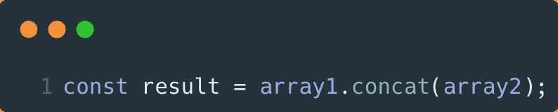
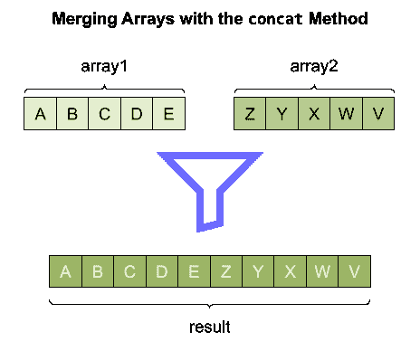
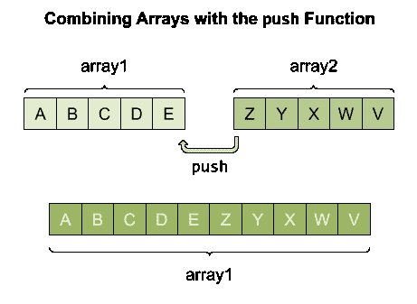
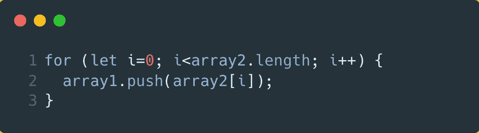
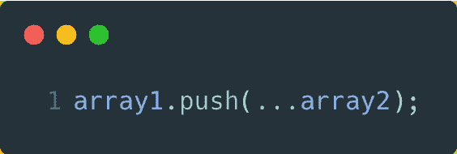
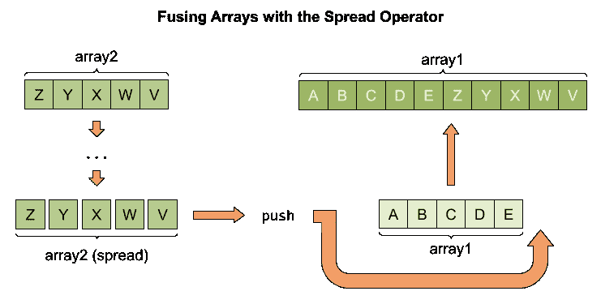
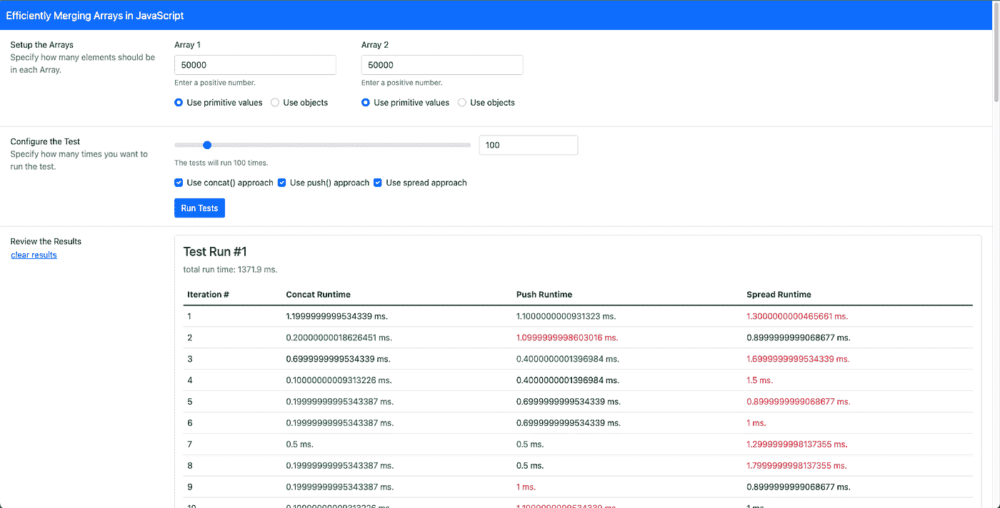
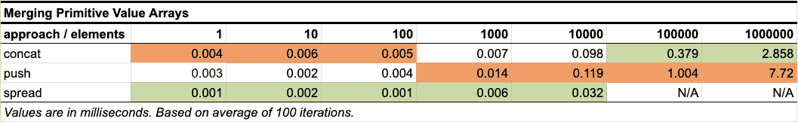
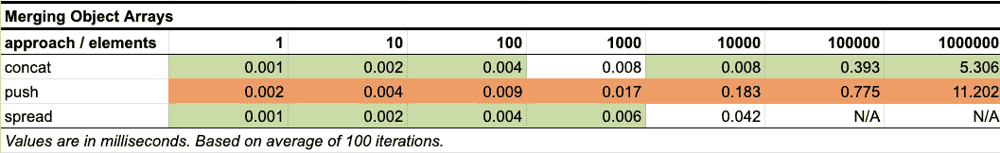
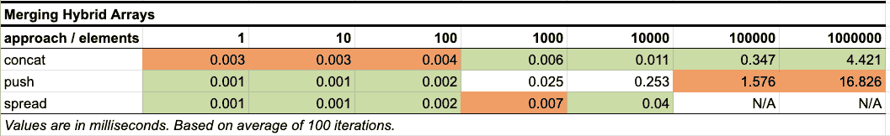

# 如何在 JavaScript 中有效地合并数组

> 原文：<https://javascript.plainenglish.io/efficiently-merging-arrays-in-javascript-32993788a8b2?source=collection_archive---------1----------------------->

Photo by [Gabriel Heinzer](https://unsplash.com/@6heinz3r?utm_source=medium&utm_medium=referral) on [Unsplash](https://unsplash.com?utm_source=medium&utm_medium=referral)

最近，我需要在 JavaScript 中组合两个数组对象。我想要一种简单易懂的方法，运行速度快。这让我比较了 JavaScript 中各种可用的数组函数。我决定创建一些性能基准来比较几种方法。我对我所看到的感到非常惊讶。在这篇文章中，我将分享我所学到的。如果你想快速外卖:

# 外卖(或 TL；博士)

> 最安全的方法是使用 Array 对象的 concat 方法来合并两个数组。如果速度至关重要，您可以考虑对较小的数组使用 JavaScript 的 spread 语法和数组对象的 push 方法。您应该使用最大数量的元素来测试合并数组，以避免意想不到的后果。

[如果你觉得这份外卖有帮助，请跟我来](https://medium.com/@chad.campbell)。用于得出上述结论的回购可以在[这里](https://github.com/ecofic/article-efficiently-merging-arrays-in-javascript)找到。该报告还包括本文中使用的在 JavaScript 中合并数组的示例。本文还将包括一个性能分析，比较组合数组的方式。

# JavaScript 中组合数组的编码方式

就我个人而言，当我写代码时，我的目标是写出 a)有效 b)易于下一个人阅读(即维护)和 c)在运行时有性能的代码。这三个目标有时会发生冲突。不过，一个好的起点是尽可能使用标准的内置特性。因此，本节将*而不是*展示定制实现。

在这一节中，我将向您展示如何用 concat 方法合并数组。然后，我将向您展示一种将数组与 push 函数结合起来的方法。最后，我将把 spread 语法与 push 函数集成起来，作为融合数组的最终方式。这三个实现将作为下一节中性能分析的基础。我们开始吧。

## 用 Concat 方法合并数组

concat 函数是 JavaScript 中合并数组的事实上的标准。事实上， [MDN 文档](https://developer.mozilla.org/en-US/docs/Web/JavaScript/Reference/Global_Objects/Array/concat)特别声明了这种“用于合并两个或更多数组的方法”。读到这里，实现如下示例所示的代码是有意义的:

sample 1

示例 1 将数组 2 的元素追加到数组 1 的末尾。值得注意的是，数组 1 和数组 2 是由 concat 函数*而不是*改变的。相反，会创建一个新的*数组。下图显示了 concat 函数的行为。*

image 1

图 1 强化了示例 1 中的代码。示例 1 展示了简洁易读的代码。因为 concat 函数从 ES1 开始就出现在 JavaScript 中，所以可以肯定它是健壮的。这个 OG 数组函数似乎是正确的选择。尽管如此，我还是想知道如果使用推送功能会发生什么。

## 用 Push 函数组合数组

push 函数将元素添加到现有数组*的末尾。这种行为与 concat 函数略有不同，因为一个现有的*数组被改变了。下面的示例显示 array2 被推到 array1 的末尾。**

image 2

图 2 中使用了 push 函数来更新 array1，以包含 array2 的内容。当数组 1 改变时，数组 2 是*而不是*。如果您可以接受更改现有阵列，推送功能可能会满足您的需求。下面的示例显示了代码反射图像 2。

sample 2

与 concat 函数一样，push 函数从 ES1 开始就是数组类型的函数。示例 2 中的代码仍然易于阅读。然而，它不如示例 1 中的代码简洁。要将这段代码浓缩成一行，可以使用 JavaScript 语言中最近添加的代码。这种添加是扩展语法。

## 用扩展语法融合数组

spread 语法可用于将数组扩展为单个元素。然后，这些元素可以被视为原始元素的独立浅表副本。由于 push 函数接受一个*或多个*参数，因此 spread 语法可用于 push 函数，如下所示:

sample 3

示例 3 将示例 2 浓缩为一行代码。它更简洁一点。如果您不熟悉 spread 语法，那么这一行的可读性不如前两个示例。尽管如此，下面的图片可能有助于你形象化的行为。

image 3

图片 3 看起来比前面的图片更复杂。知道有两个更简单、可读性更强的选项后，人们可能会想，spread 语法是否值得考虑。至少我很好奇。我在比较以不同方式合并数组的性能时看到的结果让我大吃一惊。

# 比较合并阵列的性能

为了比较合并数组的性能，我创建了一个工具来测试性能。该工具可以在[这个库](https://github.com/ecofic/article-efficiently-merging-arrays-in-javascript)中找到。如果您克隆了存储库，您可以自己运行这个工具。运行时，您会看到类似这样的内容:

image 4

图 4 所示的工具允许您 a)设置两个数组 b)指定合并数组的次数 c)指定合并数组时使用的方法。我使用这个工具测试了三个不同的场景:

1.  原始值数组
2.  对象数组
3.  具有对象数组的原始值数组(即混合数组)

对于每一个场景，我都使用包含 1、10、100、1，000、10，000、100，000 和 1，000，000 个元素的数组运行了 100 次测试。比较这些的适当方法是使用大ω(即大 O)符号。然而，为了简单起见，我只是在 2020 年的 13 英寸 MacBook Air 上运行谷歌 Chrome 96.0.4664.55 的 macOS 版本 12.0.1 进行了测试。您可以自己运行它们，看看是否能得到其他结果。如果你想学习大 O 记数法，可以看看下面这个关于教育性的附属[大 O 记数法课程。下面三张图是我亲自观察的结果。](https://www.educative.io/courses/big-o-notation-for-interviews-and-beyond?aff=x4mY)

image 5: results merging arrays of primitive values

image 6: results merging arrays of objects

image 7: results of a hybrid scenario

图 5-7 显示了我观察到的结果。绿色单元格显示了用于测试场景的最快方法。橙色单元格显示了用于测试场景的最慢方法。乍一看，当综合考虑这三种情况时，spread 语法似乎通常是最快的方法。也就是说，直到你得到更大的数组。事实上，如“N/A”所示，spread 语法甚至不能用于更大的数组！😲

spread 语法不适用于较大的数组。当使用 100，000 个元素进行测试时，spread 语法生成了一个 RangeError，并显示消息:*最大调用堆栈大小超过了*。我手动调整了工具中的数字，以确定导致该错误的元素的实际数量。我发现元素的数量是 63，653。我现在还不清楚为什么这个数量的元素会导致这个错误。不知道是我的具体环境，具体代码，还是别的什么原因。但是我认为这超出了本文的范围。

因为 spread 语法已经嵌入到 JavaScript 中，所以我没有想到会遇到 RangeError。发生这种情况的原因是因为 spread 语法将整个源数组(即 array2)加载到堆栈上。这意味着较大的数组可能会导致类似 RangeError 这样的错误。我说*可能*是因为，实际后果取决于使用的浏览器引擎([来源](https://developer.mozilla.org/en-US/docs/Web/JavaScript/Reference/Global_Objects/Function/apply#using_apply_and_built-in_functions))。

如果您需要合并较小的数组，spread 语法可以帮助您有效地做到这一点。对于包含更多元素的大型数组，请使用 concat 函数。不管您的场景如何，都要用您期望的最大数量的元素来测试您的代码。目标是创建有效、易读的代码。

在本文中，您看到了在 JavaScript 中合并两个数组的三种方法。如果你找到了更有效的方法，我希望你能在下面的评论中分享。如果你觉得这篇文章有帮助，请鼓掌👏，或者拍手，在下面。这会让我和其他人知道你觉得它很有用。如果您想了解类似的内容，我鼓励您现在就[关注我](https://medium.com/@chad.campbell)。感谢阅读。

*更多内容看* [***说白了。报名参加我们的***](http://plainenglish.io/) **[***免费周报***](http://newsletter.plainenglish.io/) *。在我们的* [***社区获得独家访问写作机会和建议***](https://discord.gg/GtDtUAvyhW) *。***