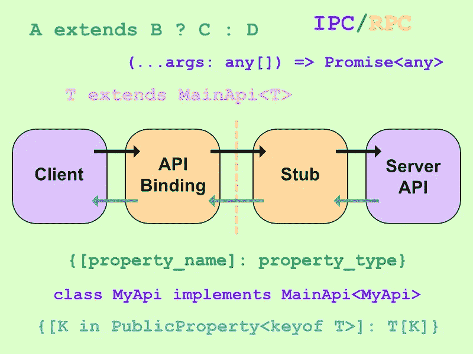
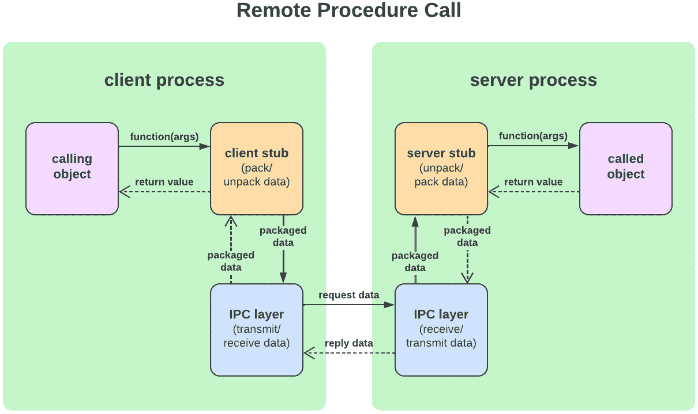
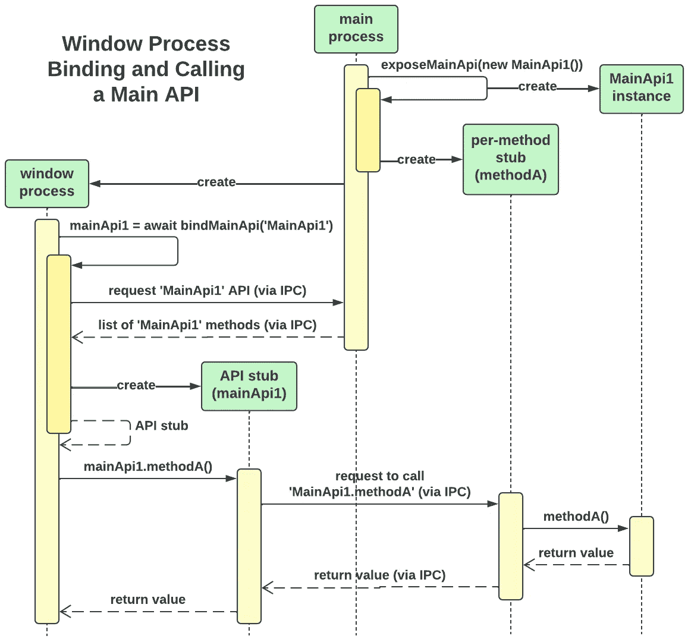
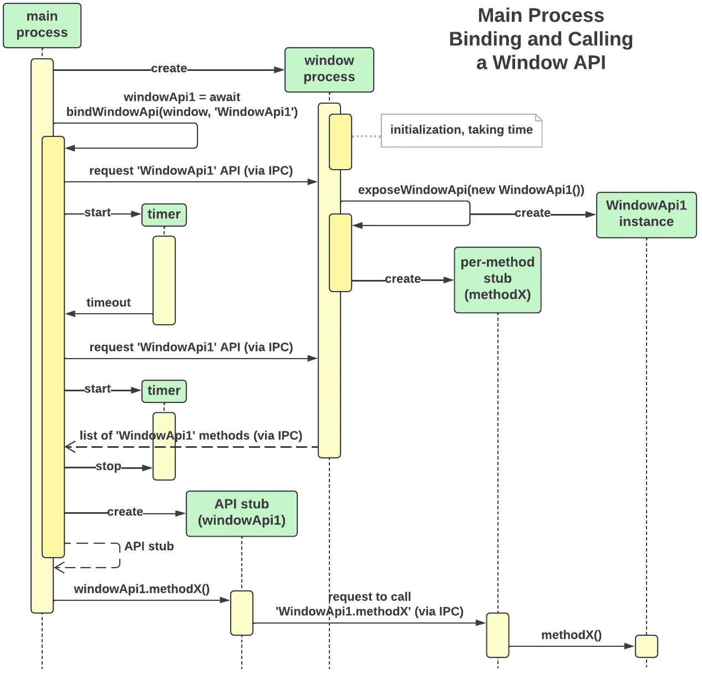

# 使用 TypeScript 魔法的电子 RPC

> 原文：<https://javascript.plainenglish.io/electron-rpc-using-the-magic-of-typescript-9d24530ea8f1?source=collection_archive---------8----------------------->

## 用于构建 RPC 库的 TypeScript 功能概述



TypeScript 很神奇。它的类型和对象灵活性使我能够在[电子跨平台框架](https://www.electronjs.org/)中为进程间通信(IPC)开发远程过程调用(RPC)。我称这个解决方案为[电子亲和势](https://github.com/jtlapp/electron-affinity)。

Electron Affinity 是一个开源库，它使得使用 Electron IPC 就像调用本地函数一样无缝。利用 TypeScript 和普通 JavaScript 的神奇特性，该库从远程定义的函数的类型签名中动态构造可调用的客户端函数。本文解释了这些神奇的特性，并试图传达 TypeScript 的一些强大功能。

# 什么是进程间通信(IPC)？

作为 web 开发人员，我们熟悉使用 HTTP `get`或`post`在浏览器和 web 服务器之间交换信息。一个进程在浏览器上运行，另一个在服务器上运行，当它们共享数据时——瞧！—我们有进程间通信。在这种情况下，这两个进程通常驻留在不同的计算机上，但是它们也可以在同一台计算机上。

在[电子](https://www.electronjs.org/)中，两个进程*都在同一个电脑上*。Electron 是一个框架，它允许我们将浏览器和网站捆绑到一个桌面应用程序中，该应用程序由一个可执行文件组成。由于前端使用 Chrome 浏览器，后端使用 Node.js，Electron 将 web 开发变成了跨平台的桌面应用程序开发。

但是 Electron 在浏览器和 Node.js 之间不使用 HTTP，这可能是因为 HTTP 对于驻留在同一台计算机上的进程之间的 IPC 来说是一个低效的解决方案。相反，电子提供了一种通过命名的 IPC 通道监听和发送消息的机制。

# 电子工控机的改进

不幸的是，Electron 的 IPC 机制需要编写大量样板代码，并且在共享 IPC 数据上强制类型的简单方法都需要在前端代码中复制后端类型声明。当我使用 electronic 时，我发现 IPC 是一个常见的错误来源，我希望我使用的是远程过程调用(RPC)机制。在 RPC 中，一个进程调用一个调用相应远程函数的函数，而调用者或远程函数都没有意识到调用是在进程之间进行的。

这就是我开始用[电子亲和能](https://github.com/jtlapp/electron-affinity)做的事情——为在电子中使用 IPC 提供简单的 RPC 机制。电子允许浏览器向 Node.js 发送 IPC 消息，Node.js 向浏览器发送 IPC 消息，所以任何一方都可以是调用者或被调用者。在 RPC 的说法中，调用者是“客户”,被调用者是“服务器”,不管哪一方进行调用，所以我们将这样称呼他们。每个浏览器窗口都运行自己的进程，所以我们将它们称为“窗口进程”，而 Electron 将 Node.js 进程称为“主进程”，所以这也是我们要做的。

# 远程过程调用

在标准的 RPC 体系结构下，开发人员创建可远程调用的函数，包括它们的类型签名，然后运行一个特殊的程序从类型签名生成存根。这些存根被链接到客户端和服务器程序中，以便可以远程访问这些功能。

一个存根是客户端存根，另一个是服务器存根。它们分别使远程函数调用在客户机和服务器看来是本地的。



客户端存根是远程函数的代理。它将函数的参数打包，通过一个低级 IPC 层传输到服务器进程。服务器存根是调用者的代理。它对从 IPC 层接收的数据进行解包，并将参数传递给预期的远程函数。这些函数的返回值遵循相反的过程，从服务器存根到 IPC 层到客户端存根，最后返回到调用对象。

在我们的例子中，函数实际上是对象上的方法，所以我实现了一种称为远程方法调用(RMI)的 RPC 形式。在 RMI 中，客户机存根暴露具有远程对象上的方法签名的函数。调用这些函数会将方法名、方法参数和目标对象传递给 IPC 层。接收到这些数据后，服务器存根将调用指向目标对象的预期方法。通常生成客户端和服务器存根来表示对象的整个类。

# 第二十二条军规

在我们的例子中，我们不希望在使用它们之前产生和链接存根的额外步骤；我们希望这一切都是无缝的，这样，当我们编写可远程调用的服务器端方法时，客户端中的一两行代码就可以立即让我们访问这些方法及其类型签名。但是这意味着在服务器上创建一个对象也应该在客户机上创建一个对象(客户机存根)，这是一个完全不同的过程。我们如何做到这一点？我们不能将远程对象导入到客户端来转换它，因为那样也会导入该对象所依赖的所有服务器端代码。

看来我们有一个第二十二条军规。

您可能还记得，TypeScript 有一个特殊的`import type`指令，它在不拉入可执行代码的情况下拉入类型数据。该类型数据包含了我们构建客户端存根所需的所有信息——方法名、它们的参数以及它们的返回值——因此我们可以使用它来完成这项工作，这似乎是合理的。但是我们不能。此类型信息仅在编译时可用于类型检查；当需要构造客户机存根的代码实际运行时，它在运行时不可用。

# 远程绑定协议

摆脱第 22 条军规的方法是，除了使用`import type`获取类型信息之外，还要实现一个远程绑定协议。在远程绑定协议中，客户端使用准系统 IPC 从服务器获取关于远程可调用对象的信息。它从接收到的信息中构造客户端存根，从而将每个客户端存根“绑定”到其远程对象。该解决方案使用`import type`信息对客户端进程随后在这些绑定的客户端存根上进行的函数调用进行类型检查。

电子亲和为窗口到主进程的调用实现了一个远程绑定协议，为主进程到窗口的调用实现了一个略有不同的绑定协议。该库将每个可远程调用的对象称为“API”，意思是“应用程序接口”每个 API 实际上是实现 API 的类的一个实例，类的名称就是 API 的名称。API 的方法是可远程调用的函数。当进行远程调用时，客户端指示 API 和方法。

下图说明了电子亲和用于公开主流程 API，然后从窗口远程绑定到它们的协议:



这是一个 [UML 序列图](https://developer.ibm.com/articles/the-sequence-diagram/)。绿框代表进程或对象。它们下面的虚线是代表时间流逝的‘生命线’。黄色方框表示过程或对象激活。箭头显示对象之间发送的消息，破折号表示返回值。

该图显示了从类`MainApi1`创建 API 并使其对窗口进程可用的主进程。它为 API 的每个方法创建了一个单独的服务器端存根，尽管图中只显示了`methodA`的存根。只有在公开了所有必需的 API 之后，主进程才会创建任何可能需要使用这些 API 的窗口。然后，为了绑定到 API，窗口请求 API 的方法列表。在接收到该列表后，窗口创建一个客户机存根，作为 API 的代理。

对于主进程希望对窗口进程进行的调用，绑定协议略有不同。这个序列图说明了这一点:



在这种情况下，当主进程试图绑定到一个窗口时，它使用一个超时来重复尝试绑定。这是必要的，因为主进程必须在窗口可以展示 API 之前创建窗口，要求主进程等待窗口使 API 可用。即便如此，如果束缚的时间太长，电子亲和力还是会出错。

这两个协议的另一个区别是电子亲和不支持从窗口 API 返回值。

# 定义远程 API

如果一个可远程调用的方法的签名在客户机和服务器上都相同，那么它就不能是任何一个函数。虽然方法可以在服务器上快速运行并返回，但客户端必须等待参数到达服务器，然后等待返回值返回给客户端。幸运的是，如果我们要求远程方法返回[承诺](https://developer.mozilla.org/en-US/docs/Web/JavaScript/Reference/Global_Objects/Promise)，相同的签名允许方法在服务器上同步，在客户端异步。

下面是一个带有异步方法的主流程 API 的示例:

这些方法返回承诺是很重要的，所以我们希望 TypeScript 强制执行这一点。但是如果我们扩展了一个库提供的类或者实现了一个库提供的接口，这个类或者接口也将指定方法的名字。我们将无法定义自定义 API。因此，我们将调用我们的第一个打字稿魔术:

`ElectronMainApi<T>`是约束主流程 API 签名的类型。这取决于类型`PublicProperty<keyof T>`，它产生提供给`ElectronMainApi<T>`的任何类型`T`的公共属性。`T`是 API 类。我们一会儿将更仔细地检查`PublicProperty`。现在，让我们关注一下`ElectronMainApi<T>`的结构:

```
{ [property_name]: property_type }
```

外面的花括号`{}`表示我们正在定义一个对象。方括号`[]`提供了这个对象的属性，一次评估一个属性。每个属性都被赋予冒号`:`后面的类型。回头参考`ElectronMainApi<T>`的定义，我们看到每个属性都是`K in PublicProperty<keyof T>`，每个属性的类型都是`(...args: any[]) => Promise<any>`。让我们把这些分解一下。

我们首先需要了解类型`PublicProperty<P>`。这个名字告诉我们，这种类型以某种方式产生了一个公共属性，但是到底什么是公共属性呢？TypeScript 允许我们将属性声明为`private`或`protected`，因此所有缺少这些声明的属性都是潜在的公共属性。但是从 ES2022 开始，JavaScript 也支持[私有属性](https://developer.mozilla.org/en-US/docs/Web/JavaScript/Reference/Classes/Private_class_fields)，特别是名称以`#`开头的属性。此外，给属性加上前缀`_`表示它们被视为私有的，这是长期以来的惯例，因此这些属性也应该算作私有的。因此，出于我们的目的，非公共属性是那些声明为`private`的属性、那些声明为`protected`的属性以及那些以`#`或`_`为前缀的属性；所有其他属性都是公共的。

类型`PublicProperty<P>`包含以下形式的两个表达式，一个嵌套在另一个中:

```
A extends B ? C : D
```

这是[三元运算符](https://developer.mozilla.org/en-US/docs/Web/JavaScript/Reference/Operators/Conditional_Operator)的类型模拟。我们可以这样理解，“如果`A`的类型是`B`，那么求值为`C`；否则评估为`D`。”检查上面的`PublicProperty<P>`的定义，我们看到如果`P`是以`_`或`#`开头的字符串文字，那么它的值为类型`never`，否则它的值为`P`本身。类型`never`表示“从不发生”，因此`PublicProperty<P>`过滤掉带有前缀的`P`。TypeScript 可以计算编译时已知的字符串值，这是一件很神奇的事情。在我们的例子中，字符串将是方法名——TypeScript 在编译时当然知道这些名称。

实际的属性表达式是`K in PublicProperty<keyof T>`。这里，`keyof T`产生 API 类`T`的所有公开声明的*属性*(“键】)；如果 TypeScript 声明了任何属性`private`或`protected`，`keyof T`不会产生该属性。这是一件好事，因为`PublicProperty`类型只查看属性名前缀，而不查看声明。当我们将集合`keyof T`传递给`PublicProperty<keyof T>`时，`PublicProperty`类型产生了一组属性，该集合是对`keyof T`的公共属性的进一步限制，只限于没有前缀`_`或`#`的公共属性。表达式`K in PublicProperty<keyof T>`将`K`分配给这个集合中的一个公共属性。当我们将这个表达式放在方括号`[]`中时，我们枚举属性`K`的所有可能值，并为每个值分配一个类型。

(技术上，`keyof`也不会产生以`#`开头的 ES202 私有属性；我只是想让`PublicProperty<P>`在没有`keyof`的情况下仍然有用。)

API 类型`ElectronMainApi<T>`因此定义了`T`的公共属性，约束了 API 对象的所有公共属性的类型。因为这种类型没有声明非公共属性，所以 API 对象(及其类)可以随意使用私有属性。例如，API 类可以自由地将内部资源保存在私有成员中，并且可以自由地定义支持该类的 API 方法的私有方法。

`ElectronMainApi<T>`将每个公共属性限制为以下类型:

```
(...args: any[]) => Promise<any>
```

这个类型定义了一个函数签名。这里我们使用了普通 JavaScript 的魔力:参数。rest 参数收集传递给该方法的参数位置及其之后的所有参数，将它们收集到一个给定名称的数组中，在本例中为`args`。如果从那时起没有参数，数组为空。因此，该签名接受任意数量的参数，包括零个参数。它返回一个承诺，因此也定义了一个异步函数。

让我们把它们放在一起。表达式`K in PublicProperty<keyof T>`一次给`K`分配一个公共属性，所以每个`K`都是 API 的公共属性，每个`K`都有上面的类型签名。`ElectronMainApi<T>`因此表示一个由`T`的公共异步方法组成的对象。

我们现在可以强制 API 类的所有公共属性成为返回承诺的方法，而不限制它们的名称或参数:

这里我们见证了更多的类型脚本魔术:类型可以循环引用它自己，正如你在`class MainApi1 implements ElectronMainApi<MainApi1>`中看到的。循环引用允许类型只约束方法返回值，而不约束方法名。使用`implements`使 TypeScript 能够准确地标记 API 中出现问题的地方。

但是库不能相信开发人员已经对 API 类应用了这种限制，所以用于公开 API 的函数也将 API 限制为这种类型:

TypeScript 从`mainApi`推断泛型类型`T`，所以调用者不需要单独提供`T`。暴露`MainApi1`的调用看起来像这样:

```
exposeMainApi(MainApi1);
```

如果函数定义如下，`T`将被推断为符合类型`ElectronMainApi<T>`的`mainApi`的任何子集，如果有的话，并且`mainApi`根本不会被约束:

```
// incorrect
function exposeMainApi<T>(mainApi: ElectronMainApi<T>): void
```

# 构建服务器存根

函数`exposeMainApi(mainApi)`构建服务器存根，使客户端可以使用`mainApi`的方法。它通过迭代`mainApi`的公共属性来实现这一点，这些属性必须是异步方法，并对每个方法执行以下操作:

*   创建一个服务器存根，在调用方法本身时调用该方法。
*   在 IPC 通道上注册服务器存根，以便当客户端通过通道发送方法参数时，存根可以接收这些参数。
*   跟踪与 API 相关联的方法，以便当客户端请求绑定到 API 时，可以将它们发送到客户端。

这不需要太多的代码，但是很复杂。为了实现这一点，我们必须从普通的 JavaScript 调用一些魔法:

函数`[getPropertyNames](https://github.com/jtlapp/electron-affinity/blob/6e8be9019bee5a7e98a5ac24a3cdd6cc25f475e7/src/lib/shared_lib.ts#L83)`是一个定制函数，它返回一个 [iterable](https://developer.mozilla.org/en-US/docs/Web/JavaScript/Reference/Iteration_protocols) ，迭代一个对象的所有属性，包括从超类继承的属性，但有一些例外。`registerIpcHandler`是将函数参数附加到 IPC 通道的函数的替代。该函数参数是单个 API 方法的服务器存根。

这段代码的神奇之处在于:

*   JavaScript 允许我们在运行时迭代对象的属性。
*   给定对象的任何方法的名称，我们可以得到方法本身。在这种情况下，我们从`mainApi[methodName]`得到函数`method`。
*   JavaScript 的`bind`方法允许我们分配函数被调用时使用的`this`值。`method.bind(mainApi)`将`this`设置为`mainApi`，允许该函数访问`mainApi`的私有属性。
*   我们已经看到了使用`...args`作为参数，但是这里我们把它作为一个参数。在本例中，`...`是一个[扩展操作符](https://developer.mozilla.org/en-US/docs/Web/JavaScript/Reference/Operators/Spread_syntax)，它将数组`args`的内容扩展成一系列独立的参数。

您可能已经注意到，上面的代码只过滤掉了带有`_`或`#`前缀的私有属性。这是因为`private`和`protected`声明只在编译时存在；在运行时，我们使用纯 JavaScript。因此，代码为缺少这些前缀的非公共属性生成存根。这不是问题，因为正如我们将看到的，我们在客户端使用的类型不会使这些属性可用。

假设服务器也处理客户端对方法名的请求，那么服务器端就完成了，API 方法可以远程调用。

# 客户端 API 绑定

在窗口可以使用主进程 API 之前，它必须首先将一个存根绑定到 API。这个存根(客户机存根)是一个对象，它拥有远程 API 的所有公共方法，并使 API 看起来好像是客户机本地的。电子亲和将这些存根称为“API 绑定”或简称为“绑定”以下是该库创建和使用绑定的方式:

函数`bindMainApi`创建每个绑定。我们之前用方法`methodA`、`methodB`等定义了服务器端类`MainApi1`。在客户机中，绑定`mainApi1`有这些相同的方法，客户机正在调用它们。调用这些方法之一最终会导致调用同名的远程方法，然后检索其返回值(如果有返回值的话)。

每个绑定符合类型`MainApiBinding`，定义如下:

这种类型简单但有效。客户端提供远程 API 类的类型作为通用参数`T`。表达式`keyof T`产生 API 类的所有公开声明的属性名的集合。`PublicProperty`进一步将这个集合限制为那些没有前缀`_`或`#`的集合，所以我们将`MainApiBinding<T>`定义为一个只具有`T`属性的对象，用于公共用途。回想一下，服务器端类型`ElectronMainApi<T>`将`T`的所有公共属性限制为异步方法；`MainApiBinding<T>`因此正是由这些方法组成的。如果已经在服务器上为没有前缀`_`或`#`的非公共属性生成了存根，`MainApiBinding<T>`将不会使该属性对客户端可用。

在上面的示例代码中，客户端绑定`mainApi1`具有类型`MainApiBinding<MainApi1>`，为其提供了远程服务器类`MainApi1`的所有公共方法。虽然客户端和服务器方法具有相同的类型签名，但它们的实现却大不相同。

这种解决方案使得在 TypeScript 中维护 API 变得容易，特别是在电子应用程序中，客户端和服务器代码属于同一个源代码库。将方法添加到 API(服务器端)可以让客户端立即使用它们，而在 API 中更改方法签名会阻止客户端进行编译，直到客户端的调用得到适当的修改。看到 [VSCode](https://code.visualstudio.com/) 为服务器上的 API 所做的每一个改变而立即改变客户端中的代码自动完成和代码帮助是很神奇的。

# 构造 API 绑定

我们已经看到函数`bindMainApi`负责构建客户端存根 API 绑定——但是我们还没有看到它是如何做的。幸运的是，这非常简单。该函数从主进程中检索 API 的方法名，并为每个方法名构造一个函数，该函数执行以下操作:

*   接收传递给该方法的任何参数。
*   通过 IPC 将参数发送到专用于该方法的通道上的主进程。
*   等待主进程的响应。
*   将结果返回给调用者。

`bindMainApi`将这个函数附加到客户机存根上，赋予它相同的方法名，这样在存根上调用这个方法就会调用这个函数。

下面是来自`bindMainApi`的相关代码:

函数`requestApiMethods`和`sendIpcAndGetResponse`都是实际代码的替身。`requestApiMethods`使用基本的 IPC 向主进程发送消息，并检索提供给它的类的方法名。`sendIpcAndGetResponse`使用为特定 API 类/方法对指定的 IPC 通道来调用远程 API 类上的方法。

我们使用了一点 JavaScript 魔法来构造将作为 API 绑定的对象。代码通过一次附加一个方法在`boundApi`中构建绑定。它附加的每个方法都是一个接受 rest 参数`...args`的函数，因此该函数可以有任意数量的参数。该函数将这些参数和一个方法标识符传递给`sendIpcAndGetResponse`，然后等待响应。响应的返回值作为函数的返回值返回。当远程方法不返回值时，函数返回`undefined`。

TypeScript 在这里也贡献了一些魔力。考虑这个客户端调用`bindMainApi`来获取 API 绑定的演示:

当调用`bindMainApi`时，客户端提供通用参数`T`，为其指定类型`MainApi1`。因此，TypeScript 将返回值的类型指定为`MainApiBinding<MainApi1>`，这为绑定`mainApi1`提供了`MainApi1`的所有公共方法，包括它们各自的类型签名。这就是为什么在服务器端代码中对`MainApi1`所做的更改会立即影响客户端代码——也许这是最神奇的事情。

# 神奇冰山的一角

我们已经看到 TypeScript 及其 JavaScript 子集做了一些神奇的事情，但这只是冰山一角。作为一种原型语言，JavaScript 在它所能表达的方面有着非凡的表现力。微软的人试图让 TypeScript 能够捕捉这种表现力中发现的所有类型，令人惊讶的是，他们似乎已经成功了。

TypeScript 不断地扩展我对类型可能性的想象，你会在[电子亲和力](https://github.com/jtlapp/electron-affinity)中发现比我在这里描述的更多的类型魔力。例如，电子亲合性可以自动恢复 IPC 传递的对象的类，当 API 认为调用方应对错误负责时，可以诱导它们的远程调用方抛出异常。

如果您还没有踏上使用 TypeScript 的旅程，我希望您能加入我的行列。

*更多内容看* [***说白了。报名参加我们的***](https://plainenglish.io/) **[***免费周报***](http://newsletter.plainenglish.io/) *。关注我们关于*[***Twitter***](https://twitter.com/inPlainEngHQ)*和*[***LinkedIn***](https://www.linkedin.com/company/inplainenglish/)*。加入我们的* [***社区***](https://discord.gg/GtDtUAvyhW) *。***