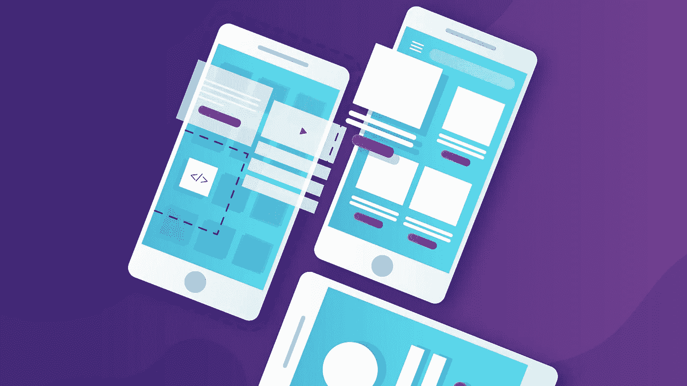

# 设计移动应用时需要考虑的 10 个因素

> 原文：<https://javascript.plainenglish.io/elements-to-consider-when-designing-mobile-app-c93585c0c0ea?source=collection_archive---------14----------------------->

## 在设计移动应用程序时，请牢记这 10 个要素，以满足用户的期望。

根据 Flurry 最近的一份 [**报告，美国人现在平均每天花五个小时在他们的移动设备上。自 2015 年第四季度以来，增长了 20%。美国人大约有 33%的时间花在各种社交媒体和消息应用上，当使用提供世界级用户体验的应用时，他们会感到更加联系和参与。快乐的用户向他们的朋友推荐应用，给应用开发者带来更多的客户。**](https://www.flurry.com/blog/us-consumers-time-spent-on-mobile-crosses-5/)

*一旦新用户开始使用你的应用，你只有几分钟的时间让他们相信你的应用易于使用，并且提供了他们想要的东西。*

用户友好的移动用户体验的市场需求非常高。但是你的 app 要获得并保持用户的注意力并不容易。在设计和开发应用程序时，你需要考虑用户的需求，并遵守某些 [**UX 设计准则**](https://www.uxmatters.com/mt/archives/2019/11/creating-a-ux-design-style-guide.php) 以确保他们拥有良好的用户体验。

# ***为什么 UX 设计如此重要？***

*尤其重要的是，UX 设计师要解决影响用户决定是否使用该应用的痛点。*

有效的移动应用程序用户界面可确保更成功的用户交互、更高的用户参与度和更好的用户体验。在决定开发什么样的应用功能时，你需要考虑它们会如何影响用户在使用应用之前、期间和之后的认知和感受。尤其重要的是，UX 的设计师要解决影响用户决定是否使用该应用的痛点。用户如何感知你的 app？移动应用程序必须:

*   易于使用
*   包括必要的能力
*   提供快速的页面加载时间
*   达到预期目的

所有这些因素在把你的用户带回你的应用程序并说服他们定期使用它的过程中起着重要的作用。如果他们觉得这种体验没有乐趣和回报，要么他们不会再使用你的应用，或者更糟，他们可能会删除你的应用。

虽然你的应用程序的特性可能是吸引用户的原因，但设计细节才是说服他们继续使用你的应用程序的原因。

 [## 7 UI/UX 设计趋势打造黑仔移动应用

### 这种对最新 UI/UX 设计趋势的深刻分析将减少跳出率，增加转化率…

javascript.plainenglish.io](/ui-ux-design-trends-to-build-mobile-app-bba6562b6f04) 

# ***什么才是伟大的用户体验？***

如果我们看看市场上成功的应用程序，它们都有一个共同点:非凡的 UX 设计。当用户使用一个设计良好的应用程序时，他们会感到更加投入。这需要对市场和用户需求有广泛而深入的了解。

一个产品要想吸引用户的注意力，占领一个巨大的市场，就需要提供巨大的价值。如果你计划推出一个大项目，一定要做必要的用户研究，以确保你的应用满足用户的需求。UX 设计需要的不仅仅是让用户界面更好。这需要战略规划。

用户界面设计是你的应用给人的第一印象，这应该是最好的。 [**UI 设计和**](https://www.xongolab.com/important-aspects-of-ui-ux-design-and-development/)UX 设计在 **app 开发过程**中都起着至关重要的作用。伟大设计的几个基本要素是:

*   清楚
*   熟悉
*   响应性
*   一致性
*   美学

 [## 移动应用程序开发流程概述

### 如何开发移动应用程序的分步指南。

javascript.plainenglish.io](/mobile-app-development-process-ac109426bda4) 

# 需要考虑的 10 个因素

设计移动应用时，您需要考虑以下因素:

1.  **确定你的目标受众**

*首先，你必须了解你的目标受众，才能设计出合适的 UX 设计策略。*

如果你不了解你的目标用户，你就不能对你的 UX 设计做出好的决定。为了确保您可以为目标用户优化应用程序的用户体验，请执行以下操作:

*   进行竞争分析。研究竞争对手的产品和服务可以帮助你设计出有效的设计策略。它们提供了什么有用的功能？你喜欢和不喜欢这些应用程序的哪些功能？考虑所有这些因素，然后设计你的应用。
*   确定你的目标用户。进行用户研究，确定你的目标用户，了解他们的需求。如果你不了解你的用户，你将无法为他们设计和开发一个有效的应用程序。这一切都是为了了解用户对应用程序的期望，并决定如何实现这些期望。

**2。认识到一致性是关键**

为了确保您创建高质量的用户体验，遵守某些设计准则是非常重要的——尤其是在您创建一致性非常重要的用户界面时。如果用户觉得你的应用程序易于使用，他们更有可能再次使用你的应用程序。脸书和 Instagram 都提供了卓越的用户体验，因此享誉全球。

**3。简化导航**

简单易学的导航增加了用户在你的应用中停留一段时间并探索他们感兴趣的功能的机会。让用户长时间活跃在你的应用中的一个方法是避免复杂的导航系统。尽量不要混合导航模式。将最常用的项目放在屏幕底部，将最不常用的项目放在顶部。在屏幕上放置功能，以确保用户的方便和舒适。确保有足够的空间让大指尖轻敲触摸目标。最重要的是，确保按钮至少是 30x30 像素。用户应该能够在你的应用中轻松地去他们想去的任何地方。

**4。优先考虑核心功能**

根据你的用户研究和你对用户希望从应用程序中得到什么的理解，优先考虑核心功能，并使它们更加直观和吸引人。一旦你对应用的核心功能有了好的设计方案，你就可以添加更多的功能，这样用户就有更多的空间去探索。更少的功能意味着更少的用户参与。功能集的范围也可能直接影响应用程序的用户数量。

**5。确保可点击的目标和清晰的文本**

当点击目标不能很好地工作时，用户会非常恼火。如果一个点击目标太小，它有可能在大部分时间里没有响应。要解决这个问题，请创建至少 87 毫米乘 10 毫米的按钮、控件和链接。此外，考虑什么样的字体是用户友好的，在任何给定的大小下都能很好地工作。使用大而清晰的字体，易于阅读和理解。

**6。预测用户需求**

如果你对用户的需求有深刻的理解，你就能给他们一个难忘的体验。在设计应用程序的屏幕时，要牢记用户的需求。如果你能识别用户在使用你的应用时的行为，你就能为你的目标受众提供无缝体验。你的 app 的用户体验决定了你的 app 的好坏。

**7。整合视觉元素**

视觉效果在决定你的应用的外观和感觉中扮演着重要的角色。好看的 app 让用户满意。独特的视觉元素有助于确保出色的应用程序用户体验。你的用户在使用你的应用时可能会感觉更投入。选择吸引人的配色方案、排版、互动和视觉元素。它们的一致使用可以帮助你以更少的努力按时构建应用。

**8。最小化页面加载时间**

我们都讨厌等待。没有人愿意等待一个应用程序的响应。如果用户遇到这种延迟，他们会立即卸载你的应用。当应用程序启动时，它的徽标会出现。如果徽标停留在屏幕上超过几秒钟，就会破坏用户体验。确保不添加任何不必要的功能、图形或视听效果，以免影响加载时间。你的应用程序应该有足够的响应能力，以增强用户体验。

**9。确保它适合其环境**

当人们在办公室工作时，他们使用桌面计算机上的应用程序。但是，当他们在外面时，人们使用移动应用程序。用户可以在任何地方使用手机上的应用程序，这对他们来说非常方便。设计应用程序时，确保创建高对比度的设计，清晰的功能在背景下清晰可见。确保不出现可见性问题，用户可以轻松阅读文本。

**10。进行可用性测试**

在考虑了所有这些因素后，测试你的应用程序，以确定它是否满足所有这些标准。所有的设计师都有盲点。另外。用户可能有不同的心理模型，曲解我们的设计。当编写我们的设计时，开发人员可能会在应用程序的功能中引入错误。我们需要考虑所有这些因素，并测试我们的应用程序。启动应用程序后，请用户提供反馈。如果人们在使用您的应用程序时发现任何问题，请进行必要的更改。

# ***结论***

人们的要求随着时间而变化。当他们使用一个应用程序一段时间后，他们通常会想要更多。将来，我们所有的技术都会变得更加先进。你的应用与众不同的地方可以让它在竞争中脱颖而出。但是， ***首先，你必须专注于满足用户对你的应用的期望。考虑到我们在本文中讨论的所有因素，准备一份应用蓝图需要大量的努力和勤奋。***

改善你的应用程序的用户体验会让你的客户在使用你的应用程序时更有参与感。一个好的用户界面可以给你的用户一个无缝的体验，并产生对你的应用程序的忠诚度。

最初发表于[uxmatters.com](https://www.uxmatters.com/mt/archives/2022/04/10-elements-to-consider-when-designing-a-mobile-app.php)

*更多内容请看*[***plain English . io***](https://plainenglish.io/)*。报名参加我们的* [***免费周报***](http://newsletter.plainenglish.io/) *。关注我们关于*[***Twitter***](https://twitter.com/inPlainEngHQ)*和*[***LinkedIn***](https://www.linkedin.com/company/inplainenglish/)*。加入我们的* [***社区不和谐***](https://discord.gg/GtDtUAvyhW) *。*