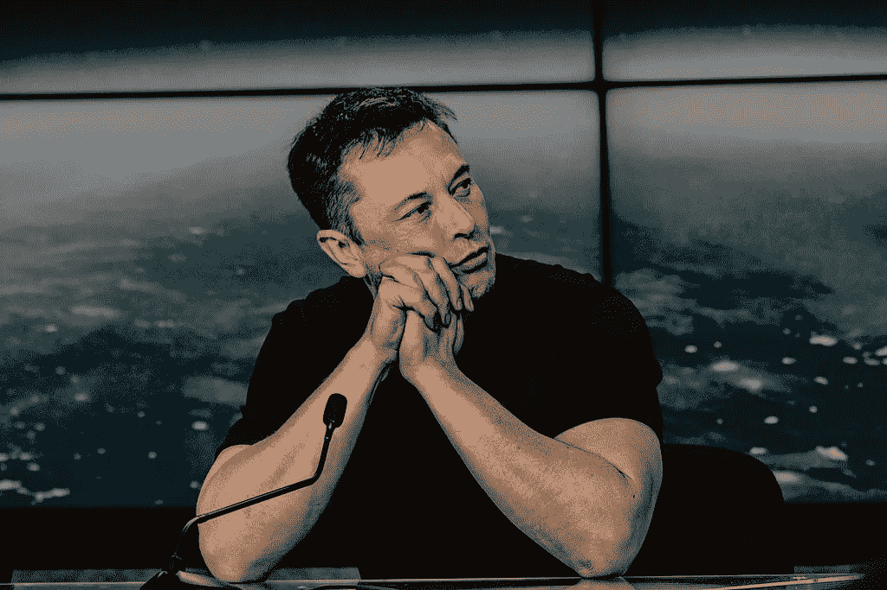

# 埃隆·马斯克的编程生活史

> 原文：<https://javascript.plainenglish.io/elon-musks-programming-life-history-b74dedab65a4?source=collection_archive---------1----------------------->

## 让我们来看看他编程有多好

This file is licensed under the [Creative Commons](https://en.wikipedia.org/wiki/en:Creative_Commons) [Attribution-Share Alike 4.0 International](https://creativecommons.org/licenses/by-sa/4.0/deed.en) license.

埃隆·马斯克最为人所知的是他成功的商业和独特的思考能力。他从一个自学成才的少年程序员和太空科学爱好者成长为世界上最富有的人。

他革命性的想法将会改变未来。Zip2、X.com、特斯拉、SpaceX、Nuralink、Hyperloop——这些在他开始做之前都不算什么。他是一个天才，也是一个训练有素的问题解决者。在达到这样的高度后，我们可能不会记得他是一名程序员，而这正是他开始其旅程的原因。让我们来看看他的编程之旅。

# 埃隆·马斯克是如何开始编程的？

Elon 是一名自学成才的程序员，他 10 岁就开始编程。因此，他在逛一家电子产品商店时，被一台 5KB 内存的 VIC-20 Commodore 计算机迷住了，并要求他的父亲给他买一台。

尽管如此年轻，在连续工作了三天，两个晚上没有合眼之后，他从他用电脑得到的练习册中学会了基本的编程语言。一门本该花六个月时间学习的课程。12 岁时，他制作了一个游戏 Blastar，后来以 500 美元的价格卖给了一家计算机杂志公司，该公司出版了代码的印刷本。

# 埃隆的职业是编程吗？

埃隆·马斯克从来没有对企业职位有过坚定的立场。他一直是一个企业家思想家。然而，他早期在硅谷的一家火箭科技公司工作，但没有继续自己的潜在事业。

# 埃隆擅长编程吗？

他是一名自学成才的程序员，虽然他的编程技能可能不如顶级程序员熟练，但他知道 Java、Python、C、Pearl、Shell、ML 栈，并编写了 OpenAI 库。

埃隆和他的兄弟在 1995 年创建了 Zip2，这是一个目录服务，他为其编写了大部分代码，但他的代码还不够完善，不能称之为最好的。因此，由于马斯克使用的方法，雇佣的程序员不得不重写代码。

然后，他创建了 X.com，并为他们的服务软件开发做出了贡献。

# 最喜欢的编程语言？

Elon 知道很多编程语言，尽管他的职业不是程序员，他的学位是数学和物理。

Python，Java，C，C++是他用的最多的一些编程语言。即使在他的公司，在特斯拉、SpaceX、Nuralink，大部分代码都是用 python 和 C++编写的。例如，特斯拉将 python 用于车辆的自动驾驶功能，后来为了更好的时间周期，python 被转换为 C++。

# 埃隆至今还在为他的公司编码吗？

不完全是。现在，埃隆更多地投身于商业。他在最初的公司里做得很好，用他的编程专业知识留下了自己的印记。现在，他有更重要的事情要关注。

他是一个喜欢尝试技术的批判性思想家。他的员工现在用那些电脑做繁重的工作，他致力于扩展他的想法，进入他喜欢的新项目。

许多成功的科技公司的首席执行官不知道如何编码，如果他们有很好的想法，这不应该成为人们的担忧，埃隆就是这方面的一面镜子。世界上最成功的商人，独一无二的。

*更多内容请看*[***plain English . io***](http://plainenglish.io/)*。报名参加我们的* [***免费周报***](http://newsletter.plainenglish.io/) *。在我们的* [***社区***](https://discord.gg/GtDtUAvyhW) *获得独家获得写作机会和建议。*